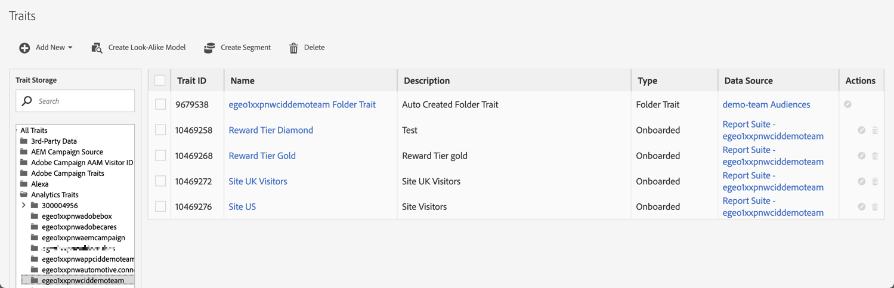

# Segmenten publiceren naar Experience Cloud {#publish-segments}

>[!CONTEXTUALHELP]
>id="components_segments_publishing"
>title="Experience Cloud-publicaties"
>abstract="U kunt het publiek publiceren dat uit dit segment wordt afgeleid aan de Bibliotheek van het Publiek waar het voor marketing activiteiten in Doel en andere oplossingen van Experience Cloud kan worden gebruikt."

>[!CONTEXTUALHELP]
>id="components_segments_audiencelibrary"
>title="Auditiebibliotheek"
>abstract="Segmenten die zijn gemaakt in de Audience Library zijn direct beschikbaar en zijn niet afhankelijk van analytische updates."

Als u een Adobe Analytics-segment naar Experience Cloud publiceert, kunt u het segment gebruiken voor marketingactiviteiten in [!DNL Audience Manager] en in andere activeringskanalen, zoals Adobe [!DNL Advertising Cloud] , [!DNL Target] en [!DNL Campaign] .

U kunt de segmenten Analytics binnen 8 uur publiceren naar Experience Cloud. Gebruik deze segmenten om het publiek in Audience Manager naar alle downstreambestemmingen te activeren.

>[!BEGINSHADEBOX]

Zie  [ segmenten ](https://video.tv.adobe.com/v/32842?quality=12&learn=on){target="_blank"} voor een demo video publiceren.

>[!ENDSHADEBOX]

>[!NOTE]
>
>Adobe Campaign (Classic en Standard) gedraagt zich anders in die zin dat er een extra latentie van 24 uur bovenop de 8-uurs latentie ontstaat.

## Vereisten

* Zorg ervoor dat de rapportreeks die u dit segment aan opslaat [ voor Experience Cloud ](https://experienceleague.adobe.com/docs/core-services/interface/audiences/t-publish-audience-segment.html?lang=nl-NL) wordt toegelaten. Anders kunt u het bestand niet publiceren naar Experience Cloud.
* Zorg ervoor dat uw organisatie Experience Cloud-id&#39;s gebruikt.
* Alvorens u segmenten kunt publiceren, moet uw Admin de [!UICONTROL Segment Publishing] toestemming aan een productprofiel in [ Admin Console ](https://experienceleague.adobe.com/docs/core-services/interface/manage-users-and-products/admin-getting-started.html?lang=nl-NL) toewijzen, en u toevoegen aan het productprofiel.

## Overwegingen

* **de grenzen van de Reeks van het Rapport**: U kunt tot 75 segmenten per rapportreeks publiceren. Deze limiet geldt. Als u al 75 gepubliceerde segmenten hebt, kunt u geen extra segmenten publiceren tot u unpublish genoeg segmenten om onder de 75-segmentdrempel te krijgen.
* **de grenzen van het Lidmaatschap**: Het publiek dat aan [!DNL Experience Cloud] van Adobe Analytics wordt gedeeld kan 20 miljoen unieke leden niet overschrijden.
* **Privacy van Gegevens**: Het publiek wordt niet gefiltreerd gebaseerd op de authentificatiestatus van een bezoeker. Als een bezoeker in een niet-geverifieerde en geverifieerde status door uw site kan bladeren, kan een bezoeker door handelingen die plaatsvinden wanneer een bezoeker niet-geverifieerd is, toch worden opgenomen in een publiek. Het overzicht [ privacy van Adobe Experience Cloud ](https://www.adobe.com/privacy/experience-cloud.html) om de volledige privacyimplicaties van publiek te begrijpen delend.
* Voor een bespreking over de **verschillen tussen segmenten in [!DNL Adobe Analytics] en[!DNL Audience Manager]**, zie [ segmenten in Analytics en Audience Manager ](https://experienceleague.adobe.com/docs/analytics/integration/audience-analytics/audience-analytics-workflow/aam-analytics-segments.html?lang=nl-NL) begrijpen.

## Tijdlijn voor segmentpublicatie

| Beschikbaar | Wanneer deze beschikbaar is | Waar beschikbaar |
|---|---|---|
| Metagegevens (segmenttitel en -definitie) | Onmiddellijk na publicatie | [!DNL Audience Manager], [!UICONTROL Experience Cloud Audience Library], [!DNL Target] |
| Nuttig segment met lidmaatschap | ~ 8 uur na publicatie | Bezoekerprofielviewer in [!DNL Audience Manager] |
| Treinen en lidmaatschapsbevolking | Binnen 24-48 uur | [!DNL Audience Manager] |

>[!NOTE]
>Eenmaal per week worden alle gegevens volledig gesynchroniseerd om rekening te houden met eventuele delta&#39;s of discrepanties die in de voorgaande week niet zijn vastgelegd.

## Segmenten publiceren in [!UICONTROL Segment Builder]

1. Ga in Adobe Analytics naar **[!UICONTROL Components]** > **[!UICONTROL Segments]**
1. Selecteer **[!UICONTROL Add]** om een nieuw segment te maken.
   
1. Geef een titel en een beschrijving voor het segment op. Deze velden zijn vereist voordat u het bestand opslaat.
1. In de **[!UICONTROL Experience Cloud publishing]** sectie, selecteer de optie, **[!UICONTROL Publish this segment to the Experience Cloud (for *rapportreeks *)]**.

   >[!IMPORTANT]
   >
   >Controleer **[!UICONTROL Visitors with Experience Cloud ID]** in de **[!UICONTROL Data Preview]** in plaats van **[!UICONTROL Unique Visitors]** wanneer u Adobe Analytics-getallen vergelijkt met Audience Manager-getallen.
   >

| Element | Beschrijving |
|---|---|
| **[!UICONTROL Publish this segment to the Experience Cloud (for *rapportreeks *)]** | Wanneer deze optie wordt toegelaten, worden de segmenttitel en de definitie (d.w.z. het shell publiek zoals vaak gebruikt in advertentieplatforms) onmiddellijk gedeeld met Experience Cloud, terwijl het segmentlidmaatschap wordt geëvalueerd en om de 4 uur gedeeld.   Wanneer dat publiek is gekoppeld aan een activiteit in [!DNL Target] , begint [!DNL Analytics] bijvoorbeeld met het verzenden van id&#39;s voor bezoekers die in aanmerking komen voor de desbetreffende Experience Cloud en het desbetreffende [!DNL Target] -publiek. Op dat punt worden de publieksnaam en de bijbehorende gegevens weergegeven op de pagina [!DNL Audience Library] in Experience Cloud.   |
| **[!UICONTROL Audience Creation Window]** | Het tijdkader dat u selecteert, wordt gebruikt om het publiek te maken op basis van een rolkalender. Bijvoorbeeld, &quot;Laatste 30 dagen&quot;(gebrek) omvat bezoekers die voor het publiek in de laatste 30 dagen van de datum van vandaag (NIET van de originele datum hebben gekwalificeerd toen het segment werd gecreeerd.) |
| **[!UICONTROL Create in Audience Library]** | De segmenten die u maakt en publiceert, kunnen zonder vertraging beschikbaar worden gemaakt op de pagina [!DNL Audience Library] in Experience Cloud. Ze zijn niet afhankelijk van analytische updates. Deze segmenten tellen niet tegen uw grens van 75 gepubliceerde segmenten. |
| **[!UICONTROL x of 75 Published]** | Hier wordt het aantal segmenten weergegeven dat u naar Experience Cloud hebt gepubliceerd. Klik de verbinding om een lijst van gepubliceerde segmenten en hun bijbehorende rapportreeks en eigenaar te zien. |
| **[!UICONTROL Save]** | Hiermee slaat u dit segment op. |

## Segmenten verwijderen of verwijderen

Als u een segment wilt verwijderen dat naar Experience Cloud is gepubliceerd, moet u eerst de publicatie ongedaan maken. Om een segment ongedaan te maken, enkel **&#x200B;**&#x200B;unclick checkbox die u gebruikte om het te publiceren.

>[!NOTE]
>
>U **kunt niet** unpublish een segment dat momenteel in gebruik door om het even welke volgende oplossingen van Adobe is: [!DNL Analytics] (in [!DNL Audience Analytics]), [!DNL Campaign], [!DNL Advertising Cloud] (voor [!DNL Core Service] &amp; [!DNL Audience Manager] klanten) en alle andere externe partners (voor [!DNL Audience Manager] klanten). U **kunt** unpublish een segment dat door [!DNL Target] in gebruik is.

## De publicatiestatus van segmenten weergeven

Het maximumaantal publiceerbare Adobe Analytics-segmenten is 75.

Gepubliceerde segmenten weergeven:

1. Ga in Adobe Analytics naar **[!UICONTROL Components]** > **[!UICONTROL Segments]** .

1. Geef de kolom **[!UICONTROL Published]** weer. **[!UICONTROL Yes]** in deze kolom geeft aan dat het segment is gepubliceerd naar Experience Cloud. **[!UICONTROL No]** geeft aan dat dit niet het geval is.

   

## De UUID [!DNL Audience Manager] ophalen

Er zijn twee manieren om de Adobe Audience Manager UUID vast te leggen die momenteel aan de browser is gekoppeld:

* Adobe Experience Cloud Debugger
* Native ontwikkelaarsprogramma in browsers (bijvoorbeeld Chrome Developer Tools)

In de volgende schermafbeeldingen ziet u hoe u de Adobe Audience Manager UUID ophaalt in uw browser en deze gebruikt in de Audience Manager Visitor Profile Viewer om de status van kenmerk en segment te valideren.

### Methode 1: Adobe Experience Cloud Debugger gebruiken

1. De download en installeert [ Debugger van Adobe Experience Cloud ](/help/implement/validate/debugger.md) in de Opslag van het Web van Chrome.
1. Start de foutopsporing wanneer u een pagina laadt.
1. Ga naar de sectie Audience Manager en zoek de Adobe Audience Manager UUID die op de huidige browserpagina is ingesteld
(`35721780439475290181087231320657663953` in het onderstaande voorbeeld)

   

### Methode 2: Chrome Developer Tools (of andere browsergereedschappen) gebruiken

1. Chrome Developer Tools starten voordat een pagina wordt geladen
1. Laad de pagina en controleer Toepassingen > Cookies. De Adobe Audience Manager UUID moet worden ingesteld in de externe
Het koekje van de index ([ adobe.demdex.net ](https://experienceleague.adobe.com/docs/audience-manager/user-guide/reference/demdex-calls.html?lang=nl-NL) in het hieronder voorbeeld). De velddemdex is de Adobe Audience Manager UUID-set
in de browser (`35721780439475290181087231320657663953` in het onderstaande voorbeeld).

   

## Audience Manager gebruiken [!UICONTROL Visitor Profile Viewer]

De Adobe Audience Manager-UUID in de browser wordt standaard gebruikt wanneer [!UICONTROL Visitor Profile Viewer] wordt geladen. Als u de resultaten van andere gebruikers met betrekking tot de eigenschap verifieert, voert u een UUID in het veld UUID in en klikt u op [!UICONTROL Refresh] . Verwijs naar [ de Kijker van het Profiel van de Bezoeker ](https://experienceleague.adobe.com/docs/audience-manager/user-guide/features/visitor-profile-viewer.html?lang=nl-NL) voor meer informatie.

## De segmentkenmerken weergeven in [!DNL Audience Manager]

In Adobe Audience Manager wordt de lijst met bezoekers met ECID&#39;s voor een bepaald segment op streamingwijze geëvalueerd, aangezien Analytics segmenten deelt met Experience Cloud.

1. Ga in [!DNL Audience Manager] naar **[!UICONTROL Audience Data]** > **[!UICONTROL Traits]** > **[!UICONTROL Analytics Traits]** . Er wordt een map weergegeven voor elke serie Analytics-rapporten die is toegewezen aan uw Experience Cloud-organisatie. Deze mappen (voor Traits, Segmenten en Gegevensbronnen) worden gemaakt wanneer de kernservice Profielen en Soorten publiek/Personen wordt gestart of ingericht.
1. Selecteer de map voor de rapportsuite waarin u eerder het segment hebt gemaakt waarmee u het segment wilt delen [!DNL Audience Manager] . U zult het segment/het publiek zien u creeerde. Wanneer u een segment deelt, gebeuren er twee dingen in [!DNL Audience Manager]:
   * Er wordt een doel gemaakt, eerst zonder gegevens erin. Ongeveer. 8 uur nadat het segment is gepubliceerd in [!DNL Analytics] , wordt de lijst met ECID&#39;s genegeerd en gedeeld met [!DNL Audience Manager] en andere Experience Cloud-oplossingen.

     

   * Er wordt een segment met één doel gemaakt. Het gebruikt de gegevensbron die met de rapportreeks wordt geassocieerd waar u het segment publiceerde.
   * De vervaldatum van de reis is nu ingesteld op 16 dagen (voorheen 2 dagen).

## Het segment weergeven in [!DNL Adobe Target]

Met het selectievakje **[!UICONTROL Publish this segment to the Experience Cloud]** tijdens het maken van segmenten in Adobe Analytics kan het segment beschikbaar zijn in de aangepaste publieksbibliotheek van Adobe Target. Een segment dat in Analytics of Audience Manager wordt gecreeerd kan voor activiteiten in Doel worden gebruikt. U kunt bijvoorbeeld campagneactiviteiten maken op basis van de omzettingscijfers van Analytics en publiekssegmenten die zijn gemaakt in Analytics.

In Adobe Target:

1. Selecteer **[!UICONTROL Audiences]** .
1. Zoek op de pagina **[!UICONTROL Audiences]** het publiek op dat afkomstig is van [!DNL Experience Cloud] . Deze soorten publiek zijn beschikbaar voor gebruik in [!DNL Target] -activiteiten.

   
