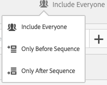
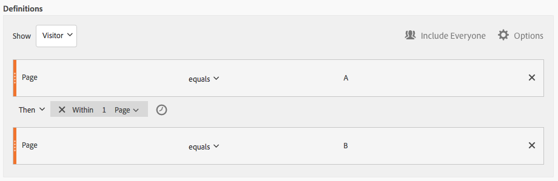
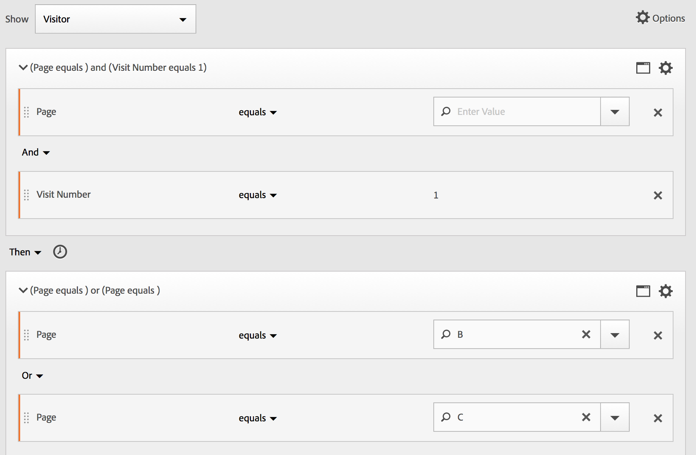
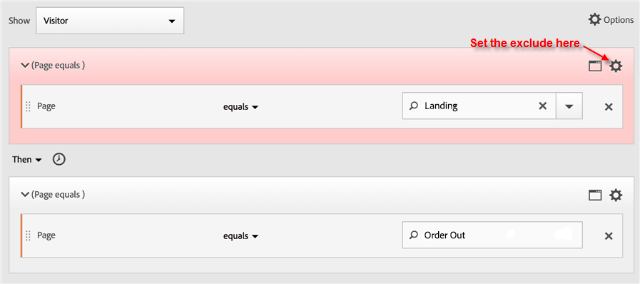
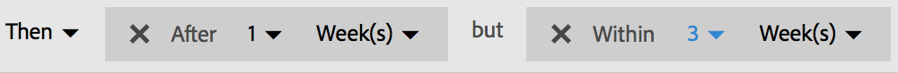
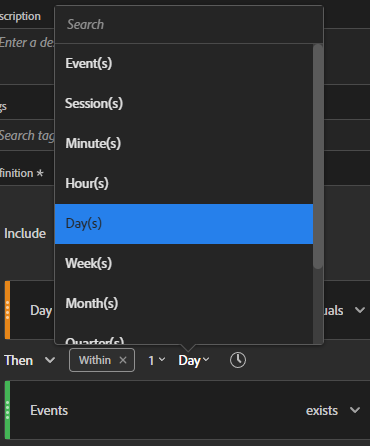
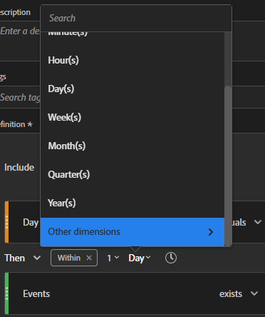
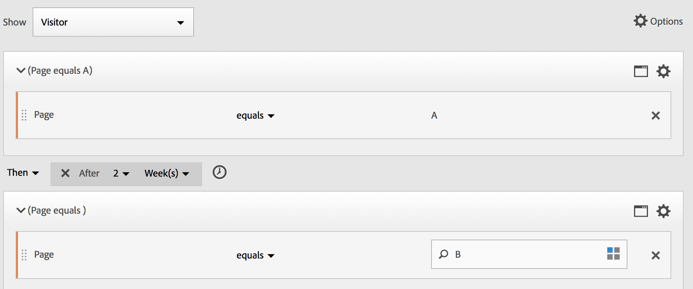
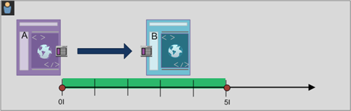

# Opeenvolgende segmenten maken

Opeenvolgende segmenten worden gemaakt met behulp van de operator THEN in plaats van AND of OR. VERVOLGENS impliceert dat één segmentcriteria voorkomt, gevolgd door een andere. Door gebrek, identificeert een opeenvolgend segment alle passende gegevens, die de filter &quot;omvatten iedereen&quot;tonen. Opeenvolgende segmenten kunnen verder worden gefilterd naar een subset van overeenkomende resultaten met de opties &quot;Alleen voor reeks&quot; en &quot;Alleen na reeks&quot;.

Bovendien, kunt u opeenvolgende segmenten tot een specifieke duur van tijd beperken, granularity, en tellingen tussen controlepunten gebruikend [ na en binnen exploitanten ](/help/components/segmentation/segmentation-workflow/seg-sequential-build.md).

Hier is een video over sequentiële segmentatie:

>[!VIDEO](https://video.tv.adobe.com/v/25405/?quality=12)

## Inclusief iedereen {#section_75ADDD5D41F04800A09E592BB2940B35}

Wanneer u een segment maakt waarin Inclusief iedereen is ingesteld, identificeert het segment paden die overeenkomen met het opgegeven patroon als geheel. Dit is een voorbeeld van een standaardsequentiesegment dat op zoek is naar een hit (pagina A) gevolgd door een andere hit (pagina B) die dezelfde bezoeker heeft bezocht. Het segment is ingesteld op Inclusief iedereen.

| Indien resultaat... | Reeks |
|--- |--- |
| Overeenkomsten | A dan B   A toen (in een verschillend bezoek) B   A toen D dan B |
| Komt niet overeen | B en A |

## Alleen voor reeks en Alleen na reeks {#section_736E255C8CFF43C2A2CAAA6D312ED574}

Met de opties **[!UICONTROL Only Before Sequence]** en **[!UICONTROL Only After Sequence]** filtert u het segment naar een subset van gegevens voor of na de opgegeven reeks.

* **slechts vóór Opeenvolging**: Omvat alle treffers vóór een opeenvolging + de eerste slag van de opeenvolging zelf (zie voorbeeld 1, 3). Als een reeks meerdere keren in een pad wordt weergegeven, bevat &quot;Alleen voor reeks&quot; de eerste treffer van de laatste instantie van de reeks en alle vorige treffers (zie voorbeeld 2).
* **slechts na Opeenvolging**: Omvat alle treffers na een opeenvolging + de laatste slag van de opeenvolging zelf (zie voorbeeld 1, 3). Als een reeks meerdere keren in een pad wordt weergegeven, bevat &quot;Alleen na&quot; de laatste hit van de eerste instantie van de reeks en alle volgende treffers (zie voorbeeld 2).

Neem bijvoorbeeld de volgorde B -> D. De drie filters zouden klappen als volgt identificeren:

**Voorbeeld 1: B dan verschijnt D eens**

| Voorbeeld | A | B | C | D | E | F |
|---|---|---|---|---|---|---|
| Inclusief iedereen | A | B | C | D | E | F |
| Alleen voor reeks | A | B |  |  |  |  |
| Alleen na reeks |  |  |  | D | E | F |

**Voorbeeld 2: B dan verschijnt D veelvoudige tijden**

| Voorbeeld | A | B | C | D | B | C | D | E |
|---|---|---|---|---|---|---|---|---|
| Inclusief iedereen | A | B | C | D | B | C | D | E |
| Alleen voor reeks | A | B | C | D | B |  |  |  |
| Alleen na reeks |  |  |  | D | B | C | D | E |

Laten we dit concept ook omringen met de dimensie van de Diepte van het Actief.

**Voorbeeld 3: Hit Diepte 3 toen 5**

## Beperkingen Dimension {#section_EAFD755F8E674F32BCE9B642F7F909DB}

In een &quot;binnen&quot;clausule, binnen tussen VEREN verklaringen, kunt u, bijvoorbeeld, &quot;binnen 1 onderzoek sleutelwoordinstantie&quot;toevoegen, &quot;binnen 1 eVar 47 instantie&quot;. Dit beperkt het segment tot binnen één instantie van een dimensie.

Door een component &#39;Binnen Dimension&#39; tussen regels in te stellen, kan een segment gegevens beperken tot reeksen waarvoor aan die component wordt voldaan. Zie het onderstaande voorbeeld, waarin de beperking is ingesteld op &quot;Binnen 1 pagina&quot;:

| Indien resultaat... | Reeks |
|--- |--- |
| Overeenkomsten | A then B |
| Komt niet overeen | A toen C toen B (omdat B niet binnen 1 pagina van A)  **Nota was:** als de afmetingsbeperking uit wordt genomen, &quot;A toen B&quot;en &quot;A toen C dan B&quot;allebei zou aanpassen. |

## Eenvoudige paginaweergavevolgorde

Geef bezoekers op die een pagina hebben weergegeven en bekijk vervolgens een andere pagina. De gegevens op hit-level gegevens zullen deze opeenvolging ongeacht vorige, afgelopen, of tussentijdse bezoeken zittingen of de tijd of het aantal paginameningen filtreren die tussen voorkomen.

**Voorbeeld**: Bezoeker bekeken pagina A, toen bekeken pagina B in het zelfde of een ander bezoek.

**Gevallen van het Gebruik**

Hieronder ziet u voorbeelden van hoe het segment kan worden gebruikt.

1. Bezoekers van een sportsite bekijken de landingspagina van het voetbal en bekijken de landingspagina van de basketbal dan in volgorde, maar niet noodzakelijkerwijs tijdens hetzelfde bezoek. Dit leidt tot een campagne om basketbalinhoud aan voetbalkijkers tijdens het voetbalseizoen te promoten.
1. De autoverkoper identificeert een verhouding tussen degenen die op de pagina van de klantenloyaliteit landen en dan naar de videopagina op elk ogenblik tijdens het bezoek of een ander bezoek gaan.

**creeer dit segment**

U negeert twee paginalijnen binnen een container op hoofdniveau [!UICONTROL Visitor] en geeft de paginareeksen een reeks met behulp van de operator [!UICONTROL THEN] .

## Bezoekersreeks bij bezoeken

Identificeer de bezoekers die uit een campagne vielen maar dan aan de opeenvolging van paginameningen in een andere zitting terugkwamen.

**Voorbeeld**: Bezoeker bekeken pagina A in één bezoek, toen bekeken pagina B in een ander bezoek.

**Gevallen van het Gebruik**

Hieronder volgen voorbeelden van de manier waarop dit type segment kan worden gebruikt:

* Bezoekers op de pagina Sport van een nieuwssite bekijken de pagina Sport in een andere sessie opnieuw.
* Een kledinghandelaar ziet een relatie tussen bezoekers die op een landingspagina in één zitting landen, en dan direct naar de checkout pagina in een andere zitting gaan.

**creeer dit Segment**

In dit voorbeeld worden twee **[!UICONTROL Visit]** -containers genest in de **[!UICONTROL Visitor]** -container op hoofdniveau en wordt het segment gesorteerd met de [!UICONTROL THEN] -operator.

## Volgorde op gemengde niveaus

Identificeer bezoekers die twee pagina&#39;s over een onbepaald aantal bezoeken bekijken, maar dan een derde pagina in een afzonderlijk bezoek bekijken.

**Voorbeeld**: Bezoekers bezoeken pagina A en dan pagina B in één of meerdere bezoeken, die door een bezoek aan pagina C in een afzonderlijk bezoek worden gevolgd.

**Gevallen van het Gebruik**

Hieronder volgen voorbeelden van de manier waarop dit type segment kan worden gebruikt:

* Bezoekers bezoeken eerst een nieuwssite en bekijken de sportpagina tijdens hetzelfde bezoek. Bij een ander bezoek bezoekt de bezoeker de weerpagina.
* De detailhandelaar bepaalt bezoekers die de Belangrijkste pagina ingaan en dan naar de Mijn pagina van de Rekening gaan. In een ander bezoek gaan ze naar de pagina Winkelwagentje bekijken.

**creeer dit segment**

1. Laat twee pagina-afmetingen vallen vanuit het linkervenster binnen een container op hoofdniveau [!UICONTROL Visitor] .
1. Voeg de operator THEN ertussen toe.
1. Klik op **[!UICONTROL Options]** > **[!UICONTROL Add container]** en voeg een container [!UICONTROL Visit] toe onder het [!UICONTROL Visitor] -niveau en met de [!UICONTROL THEN] -operator in volgorde.

## Samengevoegde containers

Door meerdere [!UICONTROL Hit] -containers in een [!UICONTROL Visitor] -container toe te voegen, kunt u de juiste operatoren gebruiken tussen hetzelfde type containers en kunt u regels en afmetingen gebruiken, zoals Pagina en Bezoek nummer, om de paginaweergave te definiëren en een reeksdimensie binnen de [!UICONTROL Hit] -container te verschaffen. Door logica toe te passen op het niveau Actief kunt u overeenkomsten op hetzelfde niveau van hits binnen de container van [!UICONTROL Visitor] beperken en combineren om een verscheidenheid aan segmenttypen te maken.

**Voorbeeld**: Bezoekers bezochten pagina A na de eerste slag in de opeenvolging van paginameningen (pagina D in het voorbeeld), dan bezocht of pagina B of pagina C ongeacht het aantal bezoeken.

**Gevallen van het Gebruik**

Hieronder volgen voorbeelden van de manier waarop dit type segment kan worden gebruikt:

* Geef bezoekers die naar de Main-landingspagina gaan tijdens een bezoek op, bekijk de pagina voor kleding voor heren tijdens een ander bezoek en bekijk vervolgens de landingspagina van Vrouw of Kinderen tijdens een ander bezoek.
* Een e-zine legt de bezoekers vast die in één bezoek naar de startpagina gaan, de pagina Sport in een ander bezoek en de pagina Advies in een ander bezoek.

**creeer dit segment**

1. Selecteer de [!UICONTROL Visitor] -container als container op hoofdniveau.
1. Voeg twee containers op [!UICONTROL Hit] niveau toe, een dimensie met een geschikte numerieke dimensie die op hetzelfde [!UICONTROL Hit] niveau zijn verbonden door de operator [!UICONTROL AND] en [!UICONTROL OR] .
1. Voeg binnen de [!UICONTROL Visit] -container nog een [!UICONTROL Hit] -container toe en nestel twee extra [!UICONTROL Hit] -containers samen met een [!UICONTROL OR] - of [!UICONTROL AND] -operator.

   Reeks deze geneste [!UICONTROL Hit] containers met de [!UICONTROL THEN] operator.

## &quot;Nesten&quot; in opeenvolgende segmenten

Door controlepunten op zowel het [!UICONTROL Visit] als [!UICONTROL Hit] niveau te plaatsen, kunt u het segment beperken om aan vereisten binnen een specifiek bezoek evenals een specifieke slag te voldoen.

**Voorbeeld**: Bezoeker bezocht pagina A toen bezocht pagina B in het zelfde bezoek. Tijdens een nieuw bezoek ging de bezoeker naar pagina C.

**creeer dit segment**

1. Sleep onder een container op hoofdniveau [!UICONTROL Visit] in twee pagina-afmetingen.
1. Selecteer beide regels meerdere keren, klik op **[!UICONTROL Options]** > **[!UICONTROL Add container from selection]** en wijzig deze in een [!UICONTROL Visit] -container.
1. Verbind hen met een [!UICONTROL THEN] exploitant.
1. Maak een container Actief als een peer voor de [!UICONTROL Visit] -container en sleep in een paginadimensie.
1. Sluit de geneste reeks in de container [!UICONTROL Visit] aan met de [!UICONTROL Hit] container met een andere [!UICONTROL THEN] -operator.

## hits uitsluiten

Segmentregels bevatten alle gegevens, tenzij u specifiek [!UICONTROL Visitor] -, [!UICONTROL Visit] - of [!UICONTROL Hit] -gegevens uitsluit met de [!UICONTROL Exclude] -regel. Hiermee kunt u algemene gegevens negeren en segmenten met meer focus maken. U kunt ook segmenten maken, met uitzondering van gevonden groepen, om de resterende gegevensset te identificeren, zoals het maken van een regel die succesvolle bezoekers die bestellingen hebben geplaatst bevat en vervolgens het uitsluiten van deze groepen om &quot;niet-kopers&quot; te identificeren. In de meeste gevallen is het echter beter om regels te maken die brede waarden uitsluiten in plaats van de [!UICONTROL Exclude] -regel te gebruiken om specifieke include-waarden als doel in te stellen.

Bijvoorbeeld:

* **sluit pagina&#39;s** uit. Gebruik een segmentregel om een specifieke pagina (zoals *`Home Page`* ) uit een rapport te verwijderen, maak een Actief-regel waar de pagina gelijk is aan &quot;Startpagina&quot; en sluit deze vervolgens uit. Deze regel bevat automatisch alle waarden behalve de startpagina.
* **sluit verwijzende domeinen** uit. Gebruik een regel die alleen verwijzende domeinen van Google.com omvat en alle andere uitsluit.
* **identificeer niet-kopers**. Identificeer wanneer orden groter dan nul zijn en sluit dan [!UICONTROL Visitor] uit.

De operator [!UICONTROL Exclude] kan worden gebruikt om een reeks op te geven waarin specifieke bezoeken of treffers niet door de bezoeker worden uitgevoerd. [!UICONTROL Exclude Checkpoints] kan ook binnen de Groep van de a [ Logica ](/help/components/segmentation/segmentation-workflow/seg-sequential-build.md) worden omvat.

### Uitsluiten tussen controlepunten

Regelgeving afdwingen om bezoekers te segmenteren op plaatsen waar een controlepunt niet expliciet voorkomt tussen twee andere controlepunten.

**Voorbeeld**: Bezoekers die pagina A bezochten en dan pagina C-maar geen pagina B bezochten.

**Gevallen van het Gebruik**

Hieronder volgen voorbeelden van de manier waarop dit type segment kan worden gebruikt:

* Bezoekers naar een pagina Lifestyle en vervolgens naar de sectie Theater zonder naar de pagina Arts te gaan.
* Een auto-detailhandelaar ziet een relatie tussen hen die de belangrijkste landingspagina bezoeken en dan direct naar de campagne van de Geen Rente gaan zonder naar de pagina van het Voertuig te gaan.

**creeer dit segment**

Maak een segment zoals u dat zou doen voor een eenvoudig, gemengd of genest opeenvolgend segment en stel vervolgens de operator [!UICONTROL EXCLUDE] in voor het containerelement. Het onderstaande voorbeeld is een geaggregeerd segment waarbij de drie [!UICONTROL Hit] -containers naar het canvas worden gesleept. De [!UICONTROL THEN] -operator is toegewezen aan samenvoeging met de containerlogica en sluit vervolgens de weergavecontainer voor de middelste pagina uit, zodat alleen bezoekers die van pagina A naar pagina C zijn gegaan in de reeks worden opgenomen.

### Uitsluiten aan begin van reeks

Als het uitsluit controlepunt aan het begin van een opeenvolgend segment is, dan zorgt het ervoor dat een uitgesloten paginamening niet vóór de eerste niet-uitgesloten slag voorkwam.

Een restaurant wil bijvoorbeeld gebruikers zien die de hoofdbestemmingspagina vaak niet hoeven te gebruiken en rechtstreeks naar de pagina Bestellen uit gaan. U kunt deze gegevens weergeven door hits naar de bestemmingspagina uit te sluiten en door resultaten naar de pagina Bestellen uit op te nemen in een opeenvolgend segment.

**creeer dit segment**

Maak twee aparte Hit-containers in een bezoekercontainer op hoofdniveau. Stel vervolgens de operator [!UICONTROL EXCLUDE] in voor de eerste container.

### Uitsluiten aan einde van reeks

Als het uitsluit controlepunt aan het eind van een opeenvolging is, dan zorgt het ervoor dat het controlepunt niet tussen het laatste niet-uitgesloten controlepunt en het eind van de bezoekersopeenvolging gebeurde.

Een kledingwinkel wil bijvoorbeeld alle bezoekers zien die een productpagina hebben bekeken, maar daarna nooit hun winkelwagentje hebben bezocht. Dit voorbeeld kan worden vereenvoudigd voor een bezoeker die naar pagina A gaat en dan nooit naar pagina B gaat bij huidige of volgende bezoeken.

**creeer dit segment**

U kunt een eenvoudig sequentiesegment maken door twee [!UICONTROL Hit] -containers naar het canvas te slepen en deze aan te sluiten met de operator [!UICONTROL THEN] . Wijs vervolgens de operator [!UICONTROL EXCLUDE] toe aan de tweede container in de reeks.[!UICONTROL Hit]

## Containers voor logische groepen

Logische Groepcontainers worden vereist om voorwaarden in één enkel opeenvolgend segmentcontrolepunt te groeperen. De container voor de speciale logische groep is alleen in sequentiële segmentatie beschikbaar, om ervoor te zorgen dat aan de voorwaarden wordt voldaan na elk voorafgaand controlepunt en vóór elk volgend controlepunt. Aan de voorwaarden binnen het controlepunt van de Logische Groep zelf kan in om het even welke orde worden voldaan. Niet-opeenvolgende containers (hit, visit, bezoeker) vereisen daarentegen niet dat aan de voorwaarden ervan wordt voldaan binnen de gehele reeks, wat leidt tot intuïtieve resultaten bij gebruik met een THEN-operator.
De [!UICONTROL Logic Group] container werd ontworpen om *verscheidene controlepunten als groep* te behandelen, *zonder het opdracht geven tot* onder de gegroepeerde controlepunten. Met andere woorden, we geven niet om de volgorde van de controlepunten binnen die groep. U kunt bijvoorbeeld geen [!UICONTROL Visitor] -container nesten in een [!UICONTROL Visitor] -container. Maar in plaats daarvan kunt u een [!UICONTROL Logic Group] -container nesten in een [!UICONTROL Visitor] -container met specifieke controlepunten op [!UICONTROL Visit] -niveau en op [!UICONTROL Hit] -niveau.

>[!NOTE]
>
>Een [!UICONTROL Logic Group] kan alleen worden gedefinieerd in een opeenvolgend segment, wat betekent dat de operator [!UICONTROL THEN] wordt gebruikt binnen de expressie.

| Containerhiërarchie | Illustratie | Definitie |
|---|---|---|
| Standaard containerhiërarchie |  | In de container van [!UICONTROL Visitor] worden de containers [!UICONTROL Visit] en [!UICONTROL Hit] op volgorde genest om segmenten te extraheren op basis van hits, het aantal bezoeken en de bezoeker. |
| Logische containerhiërarchie |  | De standaardcontainerhiërarchie is ook vereist buiten de [!UICONTROL Logic Group] -container. Maar binnen de container van [!UICONTROL Logic Group], vereisen de controlepunten geen gevestigde orde of hiërarchie-deze controlepunten eenvoudig door de bezoeker in om het even welke orde moeten worden vervuld. |

Logische groepen lijken ontmoedigend. Hier volgen enkele aanbevolen procedures voor het gebruik ervan:

**Logische Groep of Hit/Bezoek container?**
Als u opeenvolgende controlepunten wilt groeperen, dan is uw &quot;container&quot;Logische Groep. Als deze opeenvolgende controlepunten echter moeten plaatsvinden binnen één druk- of bezoekbereik, is een &quot;hit&quot;- of &quot;visit&quot;-container vereist. (Natuurlijk heeft &#39;hit&#39; geen zin voor een groep opeenvolgende controlepunten, wanneer één hit niet meer dan één controlepunt mag crediteren).

**vereenvoudigen de Logische Groepen het bouwen opeenvolgende segmenten?**
Ja, dat kunnen ze. Veronderstel u probeert om dit segment van bezoekers te identificeren: **Bezoekers die pagina A bekeken, dan elk van de pagina&#39;s van B, C, en D** bekeken

U kunt dit segment bouwen zonder een container van de Logische Groep, maar het is complex en moeizaam. U moet elke reeks pagina&#39;s opgeven die de bezoeker kan weergeven:
* `Visitor Container [Page A THEN Page B THEN Page C THEN Page D] or`
* `Visitor Container [Page A THEN Page B THEN Page D THEN Page C] or`
* `Visitor Container [Page A THEN Page C THEN Page B THEN Page D] or`
* `Visitor Container [Page A THEN Page C THEN Page D THEN Page B] or`
* `Visitor Container [Page A THEN Page D THEN Page B THEN Page C] or`
* `Visitor Container [Page A THEN Page D THEN Page C THEN Page B]`

Een container van de Groep van de Logica vereenvoudigt de bouw van dit segment, zoals hier getoond:

### Een segment voor de logische groep maken {#section_A5DDC96E72194668AA91BBD89E575D2E}

Net als andere containers kunnen [!UICONTROL Logic Group] -containers op meerdere manieren worden gebouwd binnen de [!UICONTROL Segment Builder] . U kunt [!UICONTROL Logic Group] containers het beste nesten:

1. Sleep afmetingen, gebeurtenissen of segmenten vanuit de linkerdeelvensters.
1. Wijzig de bovenste container in een [!UICONTROL Visitor] -container.
1. Wijzig de operator [!UICONTROL AND] of [!UICONTROL OR] die standaard wordt ingevoegd in de operator THEN.
1. Selecteer de [!UICONTROL Hit] -containers (het Dimension, de gebeurtenis of het item) en klik op **[!UICONTROL Options]** > **[!UICONTROL Add container from selection]** .
1. Klik op het containerpictogram en selecteer **[!UICONTROL Logic Group]** . 
1. U kunt nu de container [!UICONTROL Hit] in de container [!UICONTROL Logic Group] instellen zonder rekening te houden met de hiërarchie.

### Controlepunten voor logische groepen in willekeurige volgorde

Met [!UICONTROL Logic Group] kunt u voldoen aan voorwaarden binnen die groep die zich buiten de reeks bevinden. Hierdoor kunt u segmenten maken waarin een [!UICONTROL Visit] - of [!UICONTROL Hit] -container onafhankelijk van de normale hiërarchie plaatsvindt.

**Voorbeeld**: Bezoekers die pagina A bezochten, dan bezocht pagina B en pagina C in om het even welke orde.

**creeer dit segment**

Pagina B en C zijn genest in een [!UICONTROL Logic Group] -container in de buitenste [!UICONTROL Visitor] -container. De [!UICONTROL Hit] -container voor A wordt vervolgens gevolgd door de [!UICONTROL Logic Group] -container met B en C die met de [!UICONTROL AND] -operator zijn geïdentificeerd. Omdat deze zich in de [!UICONTROL Logic Group] bevindt, wordt de reeks niet gedefinieerd en als u pagina B en C aanslaat, wordt het argument waar.

**Een ander voorbeeld**: Bezoekers die pagina B of pagina C, toen bezochte pagina A bezochten:

Het segment moet op lease-basis overeenkomen met een van de controlepunten van de logische groep (B of C). Bovendien kan aan de voorwaarden van de logische groep worden voldaan in hetzelfde resultaat of in meerdere hits.

### Logische groep eerst overeenkomst

Met [!UICONTROL Logic Group] kunt u voldoen aan voorwaarden binnen die groep die zich buiten de reeks bevinden. In dit ongeordende eerste overeenkomende segment worden de [!UICONTROL Logic Group] -regels eerst geïdentificeerd als een paginaweergave van pagina B of pagina C en vervolgens als de vereiste weergave van pagina A.

**Voorbeeld**: Bezoekers die of pagina B of pagina C bezochten, dan bezocht pagina A.

**creeer dit segment**

De afmetingen van pagina B en pagina C worden gegroepeerd binnen een [!UICONTROL Logic Group] container met de [!UICONTROL OR] geselecteerde exploitant, dan de [!UICONTROL Hit] container die een paginamening van pagina A als waarde identificeert.

### Logische groep uitsluiten EN

Maak segmenten met behulp van [!UICONTROL Logic Group] waar weergaven van meerdere pagina&#39;s worden samengevoegd om te definiëren welke pagina&#39;s moesten worden gevonden terwijl andere pagina&#39;s specifiek werden overgeslagen. ****

**Voorbeeld**: Bezoeker bezocht Pagina A, toen uitdrukkelijk bezocht pagina B of C, maar sloeg pagina D.

**creeer dit segment**

Bouw dit segment door Dimensionen, Gebeurtenissen, en pre-gebouwde Segmenten van de linkerruiten te slepen. Zie [ Bouwend een Segment van de Groep van de Logica ](/help/components/segmentation/segmentation-workflow/seg-sequential-build.md).

Na het nesten van de waarden binnen [!UICONTROL Logic Group], klik de **[!UICONTROL Exclude]** knoop binnen de [!UICONTROL Logic Group] container.

### Logic Group exclude OR

Maak segmenten met behulp van [!UICONTROL Logic Group] waar weergaven van meerdere pagina&#39;s worden samengevoegd om te definiëren welke pagina&#39;s moesten worden gevonden terwijl andere pagina&#39;s specifiek werden overgeslagen.

**Voorbeeld**: Bezoekers die pagina A bezochten, maar of Pagina B of Pagina C niet vóór Pagina A bezochten.

**creeer dit segment**

De eerste B- en C-pagina&#39;s worden geïdentificeerd in een [!UICONTROL Logic Group] -container die wordt uitgesloten en worden vervolgens gevolgd door een treffer van de bezoeker naar pagina A.

Bouw dit segment door Dimensionen, Gebeurtenissen, en pre-gebouwde Segmenten van de linkerruiten te slepen.

Na het nesten van de waarden binnen [!UICONTROL Logic Group], klik de **[!UICONTROL Exclude]** knoop binnen de [!UICONTROL Logic Group] container.

## Binnen-tijd en tijd-na segmenten bouwen

Gebruik de operatoren [!UICONTROL Within] en [!UICONTROL After] die zijn ingebouwd in de koptekst van elke container om de tijd, gebeurtenissen en telling te definiëren.

U kunt de overeenkomst beperken tot een opgegeven tijdsduur door de containers [!UICONTROL Within] en [!UICONTROL After] te gebruiken en een granulariteit en aantal op te geven. De operator [!UICONTROL Within] wordt gebruikt om een maximale limiet op te geven voor de hoeveelheid tijd tussen twee controlepunten. De operator [!UICONTROL After] wordt gebruikt om een minimumlimiet op te geven voor de tijd tussen twee controlepunten.

>[!NOTE]
>
>Er zijn verschillen in evaluatie tussen gelijkaardig genoemde elementen zoals **Dag(en)** of **Dag**. Voor op tijd gebaseerde definities van Binnen en na, gebruik de opties die eerst in popup venster worden vermeld:
>
>
>
>Voor op dimensie-gebaseerde definities van binnen en na, gebruik de opties onder sub-menu *Andere Dimensionen*:
>
>

### Operatoren voor na en binnen {#section_CCAF5E44719447CFA7DF8DA4192DA6F8}

De duur wordt opgegeven met één hoofdletter die de granulariteit vertegenwoordigt, gevolgd door een getal dat het herhalingstemmer van de granulariteit vertegenwoordigt.

**[!UICONTROL Within]** bevat het eindpunt (kleiner dan of gelijk aan).

**[!UICONTROL After]** bevat niet het eindpunt (groter dan).

| Operatoren | Beschrijving |
|--- |--- |
| NA | De After operator wordt gebruikt om een minimumlimiet op te geven voor de tijd tussen twee controlepunten. Wanneer het plaatsen van na waarden, zal de tijdslimiet beginnen wanneer het segment wordt toegepast. Bijvoorbeeld, als de Na exploitant op een container wordt geplaatst om bezoekers te identificeren die pagina A maar niet terugkeren om pagina B tot na één dag te bezoeken, dan zal die dag beginnen wanneer de bezoeker pagina A verlaat.  De bezoeker kan alleen in het segment worden opgenomen als er minimaal 1440 minuten (één dag) overheen zijn gegaan nadat hij pagina A heeft verlaten om pagina B weer te geven. |
| BINNEN | De operator Binnen wordt gebruikt om een maximumlimiet op te geven voor de tijd tussen twee controlepunten. Als de operator Binnen bijvoorbeeld op een container is ingesteld om bezoekers te identificeren die pagina A bezoeken en vervolgens binnen één dag zijn teruggekeerd om pagina B te bezoeken, begint die dag wanneer de bezoeker pagina A verlaat. Om in het segment te worden opgenomen, heeft de bezoeker maximaal één dag voordat hij pagina B opent.   De bezoeker kan pas in het segment worden opgenomen nadat hij pagina A heeft verlaten om pagina B weer te geven binnen 1440 minuten (één dag). |
| NA/BINNEN | Wanneer u zowel de operatoren Na als Binnen gebruikt, is het belangrijk te begrijpen dat beide operatoren parallel beginnen en eindigen, niet opeenvolgend.   Bijvoorbeeld, als u een segment met de container bouwt die aan wordt geplaatst: `After = 1 Week(s) and Within = 2 Week(s)`  dan worden de voorwaarden om bezoekers in het segment te identificeren voldaan slechts tussen 1 en 2 weken. Beide voorwaarden worden afgedwongen vanaf het moment van de eerste paginaklok. |

### De operator Na gebruiken

* De tijd na laat u door jaar, maand, dag, uur, en minuut volgen om bezoeken aan te passen.
* Tijd na kan alleen op een [!UICONTROL Hit] -container worden toegepast omdat dit het enige niveau is waarvoor een dergelijke fijne korreligheid is gedefinieerd.

**Voorbeeld**: Bezoekers die pagina A toen bezochten pagina B slechts na 2 weken.****

**creeer het Segment**: Dit segment wordt gecreeerd door a [!UICONTROL Visitor] container met twee [!UICONTROL Hit] containers toe te voegen. Vervolgens kunt u de operator [!UICONTROL THEN] instellen, de operator [!UICONTROL AFTER] vervolgkeuzelijst openen en het aantal weken instellen.

**Gelijken**

Als op 1 juni 2019, om 00:01, een hit naar pagina A wordt weergegeven als &quot;Na 2 weken&quot;, komt een bericht op bladzijde B overeen als dit vóór 15 juni 2019 00:01 komt (14 dagen later).

| Druk op A | Hit B | Overeenkomend |
|--- |--- |--- |
| **A** hit: 1 Juni, 2019 00:01 | **B** hit: 15 jun, 2019 00:01 | **Gelijken:** Deze tijdbeperking past aan omdat het na 1 Juni, 2019 (twee weken) is. |
| **A** hit: 1 Juni, 2019 00:01 | **B** hit: 8 Juni, 2019 00:01 B hit: 15 Juni, 2019 00:01 | **past niet aan:** de eerste slag op pagina B past niet aan omdat het met de beperking die het na twee weken vereist. |

### De operator Within gebruiken

* Met [!UICONTROL Within] kunt u opvolgen op jaar, maand, dag, uur en minuut om bezoeken af te stemmen.
* [!UICONTROL Within] kan alleen worden toegepast op een [!UICONTROL Hit] -container, omdat dit het enige niveau is waarvoor een dergelijke fijne korreligheid is gedefinieerd.

>[!TIP]
>
>In een &quot;binnen&quot;clausule, binnen tussen VEREN verklaringen, kunt u, bijvoorbeeld, &quot;binnen 1 onderzoek sleutelwoordinstantie&quot;toevoegen, &quot;binnen 1 eVar 47 instantie&quot;. Dit beperkt het segment tot binnen één instantie van een dimensie.

**Voorbeeld**: Bezoekers die pagina A dan bezochten pagina B binnen 5 minuten.

**creeer het segment**: Dit segment wordt gecreeerd door a [!UICONTROL Visitor] container toe te voegen, dan het slepen met twee [!UICONTROL Hit] containers. Vervolgens kunt u de operator [!UICONTROL THEN] instellen, de operator [!UICONTROL AFTER] openen en het interval instellen: hits, paginaweergaven, bezoeken, minuten, uren, dagen, weken, maanden, kwarten of jaren.

**Gelijken**

De overeenkomsten moeten binnen de tijdslimiet voorkomen. Als een bezoeker pagina A raakt voor de expressie, wordt de volgende hit op pagina B weergegeven als deze plaatsvindt op of vóór 00:06 (vijf minuten later, inclusief dezelfde minuut). De uren binnen dezelfde minuut zullen ook aanpassen.

### De operatoren Within en After

Gebruik [!UICONTROL Within] en [!UICONTROL After] om een maximum- en minimumeindpunt aan beide uiteinden van een segment te bieden.

**Voorbeeld**: Bezoekers die pagina A dan bezochten pagina B na 2 weken maar binnen 1 maand.

**creeer het Segment**: Creeer het segment door twee [!UICONTROL Hit] containers binnen een [!UICONTROL Visitor] container te rangschikken. Stel vervolgens de operatoren [!UICONTROL After] en [!UICONTROL Within] in.

**Gelijken**

Alle bezoekers die pagina A op 1 juni 2019 aanslaan, keren terug na 15 juni 2019 00:01, maar *vóór* 1 juli 2019 zijn opgenomen in het segment. Ben met [ Tijd tussen Uitsluitingen ](/help/components/segmentation/segmentation-workflow/seg-sequential-build.md) vergelijkbaar.

De operatoren [!UICONTROL After] en [!UICONTROL Within] kunnen samen worden gebruikt om een opeenvolgend segment te definiëren.

Dit voorbeeld toont een tweede bezoek aan pagina B na twee weken maar binnen een maand.
