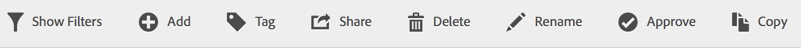

# Segmenten een label geven

In Segmentbeheer kunt u tags toewijzen aan segmenten en deze ordenen.

Alle gebruikers kunnen labels voor segmenten maken en een of meer tags toepassen op een segment. U kunt echter alleen labels zien voor de segmenten die u bezit of die met u zijn gedeeld. Welke soorten markeringen moet u creëren? Hier volgen enkele suggesties voor handige tags:

* Tags die zijn gebaseerd op **teamnamen**, zoals Sociale marketing, Mobiele marketing.
* **** Projecttags (analysetags), zoals analyse op de pagina.
* **** Categorielabels: Mannen; geografie.
* **Workflowtags** : goed te keuren; Gecurreerd voor (een specifieke bedrijfseenheid)

1. Markeer in Segmentbeheer het selectievakje naast het segment dat u wilt labelen. De werkbalk voor segmentbeheer wordt weergegeven:

   

1. Klik **[!UICONTROL Tag]** en of

   * uit bestaande tags selecteren, of
   * Voeg een nieuwe tag toe en druk op **[!UICONTROL Enter]**.

      

1. Klik nogmaals **[!UICONTROL Tag]** om het segment te labelen.

Het label moet nu in de kolom Codes staan. (Klik op het tandwielpictogram rechtsboven om de kolommen te beheren.)

U kunt ook filteren op tags door naar **[!UICONTROL Filters]** > **[!UICONTROL Tags]** te gaan.
