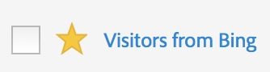

# Segmenten markeren als favorieten

U kunt segmenten ook als favorieten markeren om ze zo eenvoudig mogelijk te organiseren.

1. Controleer in Segmentbeheer de ster naast een segment dat u als favoriet wilt markeren. Het zou nu als gele ster moeten verschijnen:

   

1. U kunt ook filteren op favorieten onder **[!UICONTROL Filters]** > **[!UICONTROL Other Filters]** > **[!UICONTROL Favorites]**.
