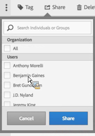

# Segmenten delen

Afhankelijk van uw toestemmingen, kunt u segmenten met uw volledige organisatie, groepen, of individuele gebruikers delen.

| Beheerder | Kan segmenten delen met Alles, met groepen en met gebruikers. Groepen worden ingesteld als machtigingsgroepen in de beheerconsole. |
|---|---|
| Niet-beheerder | Segmenten kunnen alleen met individuele gebruikers worden gedeeld. |

Wanneer zou u segmenten met het volledige bedrijf tegenover enkel een groep gebruikers of individuen moeten delen? Hier volgen enkele aanbevolen procedures:

* Als beheerder deelt u een segment met **[!UICONTROL All]** als het van nut is voor het hele bedrijf en iedereen het comfortabel gebruikt. In dit geval moet u ook overwegen om het een [goedgekeurd](/help/components/segmentation/segmentation-workflow/seg-approve.md) segment.

* Als beheerder deelt u een segment met een specifieke **[!UICONTROL Group]** als het segment goede bedrijfswaarde voor dat team verstrekt. Dit type segment niet officieel goedkeuren.
* Als Admin of een individuele gebruiker, deel een segment met andere individuen om een segment te behandelen en te bevestigen. Als het niet nuttig blijkt, kan het worden verworpen. Dit type segment niet officieel goedkeuren.

1. Markeer in Segmentbeheer het selectievakje naast het segment dat u wilt delen. De werkbalk voor segmentbeheer wordt weergegeven:

   

1. Klik op **[!UICONTROL Share]**.

   

   Als u een beheerder bent, kunt u **[!UICONTROL All]** of kies uit **[!UICONTROL Groups]** en **[!UICONTROL Users]** in uw organisatie. Als niet-beheerder kunt u alleen individuele gebruikers zien. Gebruik de **[!UICONTROL Search]** naar groepen of gebruikers te zoeken. 1. Klikken **[!UICONTROL Share]**.

   Het pictogram Gedeeld wordt weergegeven naast het segment:  

1. U kunt filteren op segmenten die met u worden gedeeld door naar **[!UICONTROL Filters]** > **[!UICONTROL Other Filters]** > **[!UICONTROL Shared with Me]**.
