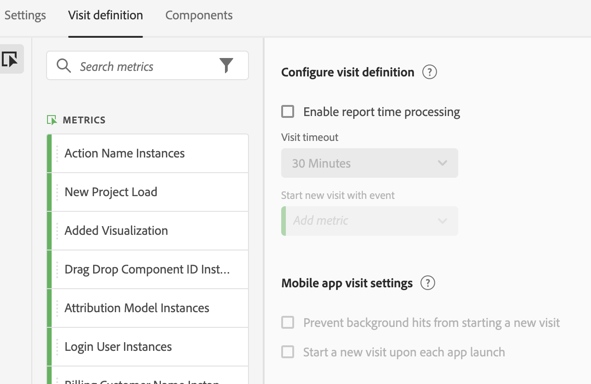

# Virtuele rapportsuites maken

Voordat u virtuele rapportsuites gaat maken, moet u rekening houden met een aantal zaken.

* Gebruikers die geen beheerder zijn, kunnen de Virtual Report Suite Manager niet zien.
* Virtuele rapportsuites kunnen niet worden gedeeld. &quot;Delen&quot; wordt uitgevoerd via groepen/machtigingen.
* In de Virtuele Manager van de Reeks van het Rapport, kunt u slechts uw eigen virtuele rapportreeksen zien. U moet op Alles tonen klikken om iedereen te zien.

1. Ga naar **[!UICONTROL Components]** > **[!UICONTROL Virtual Report Suites]**.
1. Klik op **[!UICONTROL Add +]**.

   

## Instellingen definiëren

Definieer deze instellingen op het tabblad [!UICONTROL Settings] en klik op **[!UICONTROL Continue]**.

| Element | Beschrijving |
| --- |--- |
| Naam | De naam van de virtuele rapportreeks wordt niet geërft van de ouderrapportreeks en zou verschillend moeten zijn. |
| Beschrijving | Voeg een goede beschrijving toe ten behoeve van uw zakelijke gebruikers. |
| Tags | U kunt codes toevoegen om uw rapportsuites te organiseren. |
| Bron | De rapportsuite waarvan deze virtuele rapportsuite de volgende instellingen overneemt. De meeste de dienstniveaus en eigenschappen (bijvoorbeeld, eVar montages, de Regels van de Verwerking, Classificaties, etc.) worden geërft. Als u wijzigingen wilt aanbrengen in deze overgeërfde instellingen op een VRS, moet u de bovenliggende rapportsuite bewerken ( Admin > Rapportsets). |
| Tijdzone | Het kiezen van een tijdzone is optioneel. Als u een tijdzone kiest, wordt deze samen met de VRS opgeslagen. Als u niet kiest, wordt de tijdzone van de ouderrapportreeks gebruikt.  Als u een VRS bewerkt, wordt de tijdzone die met de VRS is opgeslagen, weergegeven in de vervolgkeuzelijst. Als VRS werd gecreeerd alvorens de steun van de tijdzone werd toegevoegd, wordt de de tijdzone van de ouderrapportreeks getoond in de drop-down selecteur. |
| Segmenten | U kunt slechts één segment toevoegen of segmenten stapelen.   Opmerking:  Wanneer het stapelen van twee segmenten, worden zij aangesloten bij door EN verklaring. Dit kan niet in een OF verklaring worden veranderd. Wanneer u probeert om een segment te schrappen of te wijzigen dat momenteel in een virtuele rapportreeks wordt gebruikt, toont een waarschuwing. |

## Definitie van bezoek definiëren

Definieer deze instellingen op het tabblad [!UICONTROL Visit Definition] en klik op **[!UICONTROL Continue]**.

Hier is een video over hoe te om een bezoekdefinitie in een virtuele rapportreeks aan te passen:

>[!VIDEO](https://video.tv.adobe.com/v/23545/?quality=12)

| Element | Beschrijving |
| --- |--- |
| **Visitedefinitie configureren** |  |
| Tijdverwerking rapport inschakelen | De verwerking van de rapporttijd van het gebruik om de standaardonderbrekingslengte van het bezoek te veranderen. Deze instellingen zijn niet-destructief en zijn alleen van toepassing in Analysis Workspace. [Meer informatie](/help/components/vrs/vrs-report-time-processing.md) |
| Time-out bij bezoek | Hiermee bepaalt u de mate van inactiviteit die een unieke bezoeker moet hebben voordat een nieuw bezoek automatisch wordt gestart. Dit zal metrische bezoeken, de container van het bezoekensegment, en eVars beïnvloeden die op bezoek verlopen. |
| Nieuw bezoek starten met gebeurtenis | Hiermee wordt een nieuwe sessie gestart wanneer een van de opgegeven gebeurtenissen wordt gestart, ongeacht of er een time-out voor een sessie is opgetreden. |
| **Bezoekinstellingen voor mobiele apps** | Wijzig de manier waarop bezoeken worden gedefinieerd voor hits in mobiele apps die worden verzameld door de mobiele SDK&#39;s van Adobe. Deze instellingen zijn niet-destructief en zijn alleen van toepassing in Analysis Workspace. |
| Voorkomen dat achtergrondhits een nieuw bezoek beginnen | Hiermee voorkomt u dat achtergrondopdrachten beginnen en dat bezoekers en unieke bezoekersstatistieken opblazen. |
| Een nieuw bezoek starten bij elke keer dat de app wordt gestart | Hiermee wordt een nieuwe sessie gestart wanneer een app wordt gestart. [Meer informatie](/help/components/vrs/vrs-mobile-visit-processing.md) |

## Componenten opnemen en hernoemen

1. Schakel op het tabblad [!UICONTROL Components] het selectievakje in om de curatie toe te passen en componenten voor deze virtuele rapportsuite in Analysis Workspace op te nemen, uit te sluiten en een andere naam te geven.
Zie [Virtual Report Suite Component Curation](https://experienceleague.adobe.com/docs/analytics/components/virtual-report-suites/vrs-components.html?lang=en#virtual-report-suites) voor meer informatie over VRS-curatie.

1. Sleep componenten (afmetingen, metriek, segmenten, of datumwaaiers) die u in VRS in [!UICONTROL Included Components] sectie wilt omvatten.

1. Wanneer u wordt gedaan, klik **[!UICONTROL Save]**.

## Gegevens voorvertonen

Aan de rechterkant van elk tabblad kunt u een voorvertoning weergeven van de totale resultaten, het totale aantal bezoeken en het totale aantal bezoekers in deze Virtual Report Suite, in vergelijking met de oorspronkelijke rapportsuite.

## Productcompatibiliteit weergeven

Sommige functies van Virtual Report Suites worden niet door alle Adobe Analytics-producten ondersteund. In de lijst met productcompatibiliteit kunt u zien welke producten in Adobe Analytics worden ondersteund op basis van uw huidige Virtual Report Suite-instellingen.
