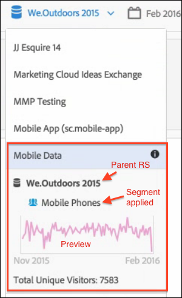

# Gegevens van virtuele rapportsuite weergeven

Klik op het pictogram i (Info) naast de naam van de rapportsuite voor meer informatie.

## In de rapportsuite Selector {#section_74E43B60C1CA4180B5ACA57574C1FA0F}

Klik op het pictogram Info naast de virtuele rapportsuite in de kiezer van de rapportsuite om deze informatie weer te geven:

* De naam van de bovenliggende rapportsuite.
* De naam van de segmenten die erop zijn toegepast.
* Een eenvoudige voorvertoning van de rapportsuite met het toegepaste segment.
* Totaal aantal unieke bezoekers.

