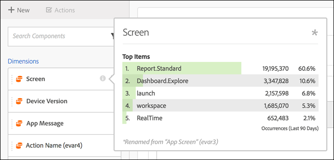

# Samengestelde cursus virtuele rapportsuite

Virtuele rapportsuites kunnen worden gebogen om components.in Analysis Workspace op te nemen en uit te sluiten.

>[!BEGINSHADEBOX]

Zie  [ de kromming van de Component ](https://video.tv.adobe.com/v/23544?quality=12&learn=on){target="_blank"} voor een demo video.

>[!ENDSHADEBOX]

>[!NOTE]
>
>Er zijn wijzigingen aangebracht in welke componentbeheerders en niet-beheerders kunnen zien in beheerde Workspace-projecten en virtuele rapportensuites. Eerder kon iedereen niet-gekromde componenten zien door op **[!UICONTROL Show all Components]** te klikken. De [ bijgewerkte curvaring ](/help/analyze/analysis-workspace/curate-share/curate.md) staat voor meer fijnkorrelige controle toe waarover de componenten zichtbaar zijn.

U kunt als volgt componentcuratie inschakelen:

1. Ga naar **[!UICONTROL Analytics]** > **[!UICONTROL Components]** > **[!UICONTROL Virtual report suites]** > **[!UICONTROL Create new virtual report suite]** .
1. Klik op de tab **[!UICONTROL Components]** nadat u **[!UICONTROL Settings]** hebt gedefinieerd.

1. Schakel het selectievakje **[!UICONTROL Enable Customization of Virtual report suite components]** in:

   

   >[!NOTE]
   >
   >Als de componentenaanpassing wordt toegelaten, is de virtuele rapportreeks toegankelijk **slechts in Analysis Workspace** en is niet toegankelijk in het volgende:
   >
   >* [!UICONTROL Data Warehouse]
   >* [!UICONTROL Report Builder]
   >* [!UICONTROL Activity Map]
   >* API voor analyserapportage

   Zodra gecontroleerd, kunt u de componenten toevoegen u in de virtuele rapportreeks zou willen worden omvat door de toepasselijke componenten van de &quot;uitgesloten componenten&quot;kolom aan de &quot;inbegrepen componenten&quot;kolom te slepen. De onderdelen die kunnen worden opgenomen en uitgesloten zijn:

   * Dimensies
   * Metrics
   * Segmenten
   * Datumbereik

   >[!NOTE]
   >
   >Er is geen behoefte *gekromde componenten van 0} te delen (segmenten, berekende metriek, datumwaaiers).* Ze zijn altijd zichtbaar in Analysis Workspace als ze worden beheerd voor de virtuele rapportsuite, zelfs als ze niet worden gedeeld.

1. Bovendien kunt u de componenten filteren of doorzoeken en de volledige gefilterde selectie aan de inbegrepen kolom toevoegen door op **[!UICONTROL Add All]** te klikken.

   

## Naam van componenten wijzigen {#section_0F7CD9F684FE4765BC00A2AFED56550E}

U kunt de vertoningsnamen van inbegrepen componenten veranderen specifiek voor de virtuele rapportreeks. Als u bijvoorbeeld de paginanaam in de virtuele rapportsuite wilt opnemen maar de naam wilt wijzigen in een meer mobiele context, kunt u deze wijzigen in App Screens. De nieuwe naam wordt weergegeven in Analysis Workspace wanneer deze virtuele rapportsuite wordt gebruikt.

Klik in Analysis Workspace op het informatiepictogram voor een opgenomen component om de oorspronkelijke naam van de hernoemde component weer te geven:

## Componentgroepen {#section_483BEC76F49E46ADAAA03F0A12E48426}

Gebruik componentengroepen om bulkcomponenttoevoegingen aan uw virtuele rapportreeks te maken. Als u bijvoorbeeld een standaardset componenten wilt importeren die specifiek zijn voor de analyse van mobiele apps, selecteert u de mobiele toepassingsgroep. Een overeenkomstige reeks afmetingen en metriek (reeds anders genoemd) wordt automatisch toegevoegd aan de virtuele inbegrepen lijst van de rapportreeks.

## Workspace-gedrag {#section_6C32F8B642804C0097FCB14E21028D4A}

Voor meer informatie over curatie in Analysis Workspace, zie [ Kromme en deel een Project ](https://experienceleague.adobe.com/docs/analytics/analyze/analysis-workspace/curate-share/curate.html).
