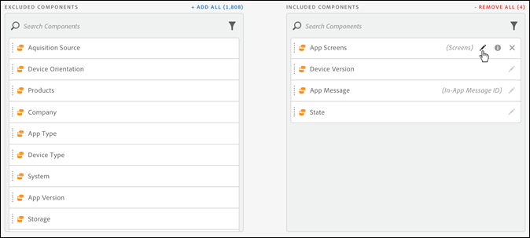

# Samengestelde cursus virtuele rapportsuite

Virtuele rapportsuites kunnen worden gebogen om components.in Analysis Workspace op te nemen en uit te sluiten.

Hier volgt een video over componentcuratie:

>[!VIDEO](https://video.tv.adobe.com/v/23544/?quality=12)

>[!NOTE]
>
>Er zijn wijzigingen aangebracht in welke componenten door beheerders en niet-beheerders kunnen worden bekeken in gecureerde Workspace-projecten en gecureerde virtuele rapportsuites. Eerder kon iedereen de niet-gebogen componenten zien door te klikken **[!UICONTROL Show all Components]**. De [bijgewerkte cursus](/help/analyze/analysis-workspace/curate-share/curate.md) biedt meer fijnkorrelige controle over welke componenten zichtbaar zijn.

U kunt als volgt componentcuratie inschakelen:

1. Ga naar **[!UICONTROL Analytics]** > **[!UICONTROL Components]** > **[!UICONTROL Virtual report suites]** > **[!UICONTROL Create new virtual report suite]**.
1. Na het bepalen van **[!UICONTROL Settings]** klikt u op de knop **[!UICONTROL Components]** tab.

1. Selecteren met het selectievakje **[!UICONTROL Enable Customization of Virtual report suite components]**:

   

   >[!NOTE]
   >
   >Als de componentenaanpassing wordt toegelaten, is de virtuele rapportreeks toegankelijk **alleen in Analysis Workspace** en niet toegankelijk is in de volgende gevallen:
   >
   >* [!UICONTROL Reports & Analytics]
   >* [!UICONTROL Data Warehouse]
   >* [!UICONTROL Report Builder]
   >* [!UICONTROL Activity Map]
   >* Analytics Rapportage-API

   Zodra gecontroleerd, kunt u de componenten toevoegen u in de virtuele rapportreeks zou willen worden omvat door de toepasselijke componenten van de &quot;uitgesloten componenten&quot;kolom aan de &quot;inbegrepen componenten&quot;kolom te slepen. De onderdelen die kunnen worden opgenomen en uitgesloten zijn:

   * Dimensies
   * Metrics
   * Segmenten
   * Datumbereik

   >[!NOTE]
   >
   >Het is niet nodig *delen* gekrulde componenten (segmenten, berekende meetwaarden, datumbereiken). Ze zijn altijd zichtbaar in Analysis Workspace als ze worden beheerd voor de virtuele rapportsuite, zelfs als ze niet worden gedeeld.

1. Bovendien kunt u de componenten filteren of doorzoeken en de volledige gefilterde selectie aan de inbegrepen kolom toevoegen door te klikken **[!UICONTROL Add All]**.

   

## Naam van componenten wijzigen {#section_0F7CD9F684FE4765BC00A2AFED56550E}

U kunt de vertoningsnamen van inbegrepen componenten veranderen specifiek voor de virtuele rapportreeks. Als u bijvoorbeeld de paginanaam in de virtuele rapportsuite wilt opnemen, maar de naam wilt wijzigen in een meer mobiele context, kunt u deze wijzigen in App Screens. De nieuwe naam wordt weergegeven in Analysis Workspace wanneer deze virtuele rapportsuite wordt gebruikt.

Klik in Analysis Workspace op het informatiepictogram voor een opgenomen component om de oorspronkelijke naam van de hernoemde component weer te geven:

## Componentgroepen {#section_483BEC76F49E46ADAAA03F0A12E48426}

Gebruik componentengroepen om bulkcomponenttoevoegingen aan uw virtuele rapportreeks te maken. Als u bijvoorbeeld een standaardset componenten wilt importeren die specifiek zijn voor de analyse van mobiele apps, selecteert u de mobiele toepassingsgroep. Een overeenkomstige reeks afmetingen en metriek (reeds anders genoemd) wordt automatisch toegevoegd aan de virtuele inbegrepen lijst van de rapportreeks.

## Werking werkruimte {#section_6C32F8B642804C0097FCB14E21028D4A}

Zie voor meer informatie over cursus in Analysis Workspace [Een project krullen en delen](https://experienceleague.adobe.com/docs/analytics/analyze/analysis-workspace/curate-share/curate.html).
