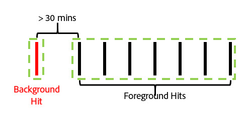
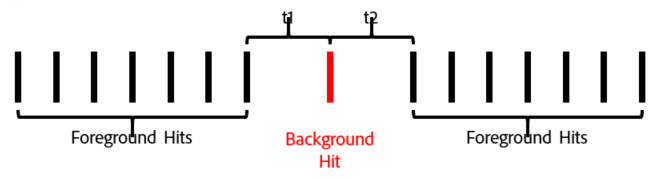
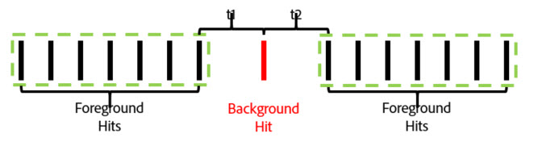

# Contextbewuste sessies

Contextbewuste sessies in virtuele rapportsuites veranderen hoe Adobe Analytics bezoeken van elk apparaat berekent. In dit artikel worden ook de verwerkingsimplicaties beschreven van achtergrondopdrachten en startgebeurtenissen van apps (beide ingesteld door de mobiele SDK) voor de definitie van mobiele bezoeken.

U kunt een bezoek op elke gewenste manier definiëren zonder de onderliggende gegevens te wijzigen, zodat deze overeenkomen met de manier waarop bezoekers met uw digitale ervaringen werken.

>[!BEGINSHADEBOX]

Zie  [&#x200B; context-bewuste zittingen &#x200B;](https://video.tv.adobe.com/v/23545?quality=12&learn=on){target="_blank"} voor een demo video.

>[!ENDSHADEBOX]

## URL-parameter voor klantperspectief

Het proces van de gegevensinzameling van Adobe Analytics staat u toe om een parameter van het vraagkoord te plaatsen die het klantenperspectief (als &quot;cp&quot;parameter van het vraagkoord wordt aangeduid) specificeren. In dit veld wordt de status van de digitale toepassing van de eindgebruiker aangegeven. Op deze manier kunt u zien of een hit is gegenereerd terwijl een mobiele app zich in de achtergrondstatus bevond.

## Achtergrondbewerking

Een hit op de achtergrond is een type hit dat vanuit Adobe Mobile SDK versie 4.13.6 en hoger naar Analytics wordt verzonden wanneer de toepassing een aanvraag voor bijhouden indient terwijl de toepassing zich in de achtergrondstatus bevindt. Voorbeelden hiervan zijn:

* Gegevens verzonden tijdens een kruising met een geo-hek
* Een pushmeldingsinteractie

De volgende voorbeelden schetsen de logica die wordt gebruikt in het bepalen wanneer een bezoek voor om het even welke bezoeker begint en beëindigt wanneer de &quot;Voorkomen van AchtergrondHits van het Begin van een nieuw Bezoek&quot;het plaatsen voor een virtuele rapportreeks is of niet wordt toegelaten.

**als &quot;de Hits van de Achtergrond van de Voorkomen van het beginnen van een nieuw Bezoek&quot;niet wordt toegelaten:**

Als deze functie niet is ingeschakeld voor een virtuele rapportsuite, worden achtergrondopdrachten op dezelfde manier behandeld als elke andere hit, wat betekent dat ze nieuwe bezoeken beginnen en op dezelfde manier werken als voorgrondhits. Als een achtergrondhit bijvoorbeeld minder dan 30 minuten optreedt (de standaardsessietime-out voor een rapportsuite) voordat een set voorgrondhits wordt weergegeven, maakt de achtergrondhit deel uit van de sessie.

Als de achtergrondhit meer dan 30 minuten vóór eventuele voorgrondhits optreedt, maakt de achtergrondhit een eigen bezoek voor een totaal aantal bezoeken van 2.

**als &quot;de Hits van de Achtergrond verhinderen van het beginnen van een nieuw Bezoek&quot;wordt toegelaten:**

In de volgende voorbeelden wordt het gedrag van achtergrondopdrachten getoond wanneer deze functie is ingeschakeld.

Voorbeeld 1: Een achtergrondhit treedt op in een bepaalde tijdsperiode (t) vóór een reeks voorgrondtreffelijke resultaten.

In dit voorbeeld, als *t* groter is dan de gevormde het bezoekonderbreking van de virtuele rapportreeks, dan wordt de achtergrondhit uitgesloten van het bezoek dat door de voorgrondhits wordt gevormd. Bijvoorbeeld, als de virtuele onderbrekingen van het de bezoekersbezoek van de rapportreeks aan 15 minuten werd geplaatst, en *t* 20 minuten was, zou het bezoek dat door deze reeks klappen (die door het groene overzicht wordt getoond) wordt gevormd de achtergrondklap uitsluiten. Dit betekent dat om het even welke eVars die met een &quot;bezoek&quot;verlopen op de achtergrond **&#x200B;**&#x200B;worden geplaatst niet in het volgende bezoek zou voortbestaan, en een container van het bezoekensegment zou slechts de voorgrondhits binnen het groene overzicht omvatten.

Omgekeerd, als *t* minder dan de virtuele het bezoekonderbreking van de rapportreeks is gevormd, is de achtergrondklap inbegrepen als deel van het bezoek alsof het een voorgrondslag (die door het groene overzicht wordt getoond) was:

Dit betekent dat:

* Elke eVars die zijn ingesteld met de vervaldatum van het bezoek op de achtergrond blijven hun waarden behouden op de andere hits in dit bezoek.
* Om het even welke waarden die in het achtergrondoppervlak worden geplaatst zijn inbegrepen in de beoordeling van de de containercontainer van het vlekkensegment.

In beide gevallen zou het totale aantal bezoeken 1 bedragen.

Voorbeeld 2: Als een achtergrondhit optreedt na een reeks voorgrondhits, is het gedrag vergelijkbaar:

Als de achtergrondhit optreedt na de geconfigureerde time-out van de virtuele rapportsuite, maakt de achtergrondhit geen deel uit van een sessie (weergegeven in groen):

Eveneens, als de tijdspanne *t* minder dan de virtuele timeout van de rapportreeks was vormde, is de achtergrondklap inbegrepen in het bezoek dat door de vorige foreground wordt gevormd:

Dit betekent dat:

* Elke eVars die op de vorige voorgrondhits zijn ingesteld met de vervaldatum van het &quot;bezoek&quot;, behouden hun waarden op de achtergrond die tijdens dit bezoek werd gevonden.
* Om het even welke waarden die in het achtergrondoppervlak worden geplaatst zijn inbegrepen in de beoordeling van de de containercontainer van het vlekkensegment.

Zoals eerder zou het totale aantal bezoeken in beide gevallen 1 zijn.

Voorbeeld 3: In sommige gevallen kan een achtergrondhit ertoe leiden dat twee afzonderlijke bezoeken worden gecombineerd tot één bezoek. In het volgende scenario wordt een achtergrondhit voorafgegaan en gevolgd door een reeks voorgrondtreffelijke resultaten:

Als, in dit voorbeeld, *t1* en *t2* allebei minder zijn dan de virtuele tijd van de rapportreeks gevormd bezoek, zouden al deze klappen in één enkel bezoek worden gecombineerd, zelfs als *t1* en *t2* samen groter zijn dan de bezoekonderbreking:

Als, echter, *t1* en *t2* groter zijn dan de virtuele gevormde onderbreking van de rapportreeks, zouden deze hits in twee verschillende bezoeken worden gescheiden:

Eveneens (zoals in onze vorige voorbeelden), als *t1* minder dan de onderbreking is en *t2* groter is dan de onderbreking, zou de achtergrondklap in het eerste bezoek worden omvat:

Als *t1* groter is dan de onderbreking en *t2* minder dan de onderbreking is, dan zou de achtergrondklap in het tweede bezoek worden omvat:

Voorbeeld 4: In scenario&#39;s waar een reeks achtergrondklappen binnen de virtuele onderbrekingsperiode van het de tijdonderbreking van het rapportpakket voorkomen, vormen de klusjes een onzichtbaar &quot;achtergrondopdracht&quot;die niet bij de bezoektelling telt en niet toegankelijk gebruikend een container van de bezoeksegmentatie is.

Hoewel dit niet als een bezoek wordt beschouwd, blijven alle eVars-sets die verlopen tijdens een bezoek hun waarden aan de andere kant behouden als de achtergrondresultaten in dit &quot;achtergrondbezoek&quot;.

Voorbeeld 5: voor scenario&#39;s waarbij meerdere achtergrondgeluiden achtereenvolgens optreden na een reeks voorgrondhits, is het mogelijk (afhankelijk van de time-out-instelling) dat de achtergrond een bezoek langer levend houdt dan de time-outperiode van het bezoek. Bijvoorbeeld, als *t1* en *t2* samen groter waren dan de virtuele onderbreking van het de reeksbezoek maar individueel minder dan de onderbreking, zou het bezoek nog uitbreiden om beide achtergrondklappen te omvatten:

Op dezelfde manier geldt dat als een reeks achtergrondresultaten plaatsvindt voordat een reeks voorgrondgebeurtenissen plaatsvindt, dit ook gebeurt:

Achtergrondhits gedragen zich op deze manier om eventuele attributie-effecten van Vars of andere variabelen die tijdens achtergrondtreffers zijn ingesteld, te behouden. Hierdoor kunnen downstream-voorgrondconversiegebeurtenissen worden toegewezen aan handelingen die zijn uitgevoerd terwijl een app zich in de achtergrondstatus bevond. Het staat ook een container van het bezoekensegment toe om achtergrondklappen te omvatten die in een stroomafwaartse voorgrondzitting resulteerden die nuttig is om de doeltreffendheid van het duwbericht te meten.

## Metrisch gedrag bezoeken

Het aantal bezoeken is uitsluitend gebaseerd op het aantal bezoeken dat ten minste één foreground hit omvat. Dit betekent dat zwevende achtergrondopdrachten of &quot;achtergrondbezoeken&quot; niet meetellen voor de meting Visit.

## Tijd besteed per bezoek metrisch gedrag

De tijd die wordt doorgebracht wordt nog berekend op een analoge manier aan hoe het zonder achtergrondklappen gebruikend de tijd tussen klappen is. Hoewel bij een bezoek achtergrondopdrachten worden opgenomen (omdat deze direct genoeg optraden voor voorgrondhits), worden deze hits opgenomen in de berekening van de tijd die u per bezoek hebt doorgebracht, alsof het een voorgrondhit betreft.

## Instellingen voor verwerking achtergrondkleur

Omdat achtergrondhit-verwerking alleen beschikbaar is voor virtuele rapportsuites die gebruikmaken van Report Time Processing, biedt Adobe Analytics ondersteuning voor twee manieren om achtergrondresultaten te verwerken, zodat de bezoektellingen behouden blijven in de basisrapportsuite die geen gebruikmaken van Report Time Processing. Als u deze instelling wilt openen, navigeert u naar Adobe Analytics Admin Tools, gaat u naar de instellingen van de toepasselijke basisrapportsuite en navigeert u naar het menu Mobiel beheer en vervolgens naar het submenu &#39;Rapportering mobiele toepassing&#39;.

1. &quot;Oudere verwerking aan&quot;: dit is de standaardinstelling voor alle rapportsuites. Het verlaten van erfenisverwerking op processen achtergronden als normale klappen in onze verwerkingspijplijn voor wat de niet-het rapportreeks van het het basisrapport van de Attributie van de Tijd van de Attributie van het Rapport betreft. Dit betekent dat om het even welke achtergrondklappen die in de reeks van het basisrapport verhogingbezoeken als normale slag verschijnen. Als u geen achtergrondopdrachten wilt verschijnen in uw reeks van het basisrapport, verander deze het plaatsen in &quot;Off&quot;.
1. &quot;Verouderde verwerking weg&quot;: met erfenisverwerking voor achtergrondopdrachten uit, worden om het even welke achtergrondklappen die naar de reeks van het basisrapport worden verzonden genegeerd door de Reeks van het basisrapport en zijn slechts toegankelijk wanneer een virtuele rapportreeks die op deze reeks van het basisrapport wordt gecreeerd wordt gevormd om de Verwerking van de Tijd van het Rapport te gebruiken. Dit betekent dat om het even welke gegevens die door achtergrondklappen worden gevangen die naar deze reeks van het basisrapport worden verzonden slechts in een toegelaten virtuele rapportreeks van de Tijd van het Rapport van de Verwerking verschijnen.

   Deze instelling is bedoeld voor klanten die willen profiteren van de nieuwe achtergrondhit-verwerking zonder de bezoektellingen van hun basislapport te wijzigen.

In beide gevallen worden achtergrondopdrachten tegen dezelfde kosten in rekening gebracht als andere resultaten die naar Analytics worden verzonden.

## Nieuwe bezoeken starten bij elke keer dat de app wordt gestart

Naast de hitteverwerking op de achtergrond kunnen virtuele rapportsuites een nieuw bezoek afdwingen om te beginnen wanneer de mobiele SDK een app-startgebeurtenis verzendt. Als deze instelling is ingeschakeld, wordt telkens wanneer een gebeurtenis App Launch vanuit de SDK wordt verzonden, een nieuw bezoek afgedwongen, ongeacht of een open bezoek de time-out heeft bereikt. De hit met de startgebeurtenis van de app wordt opgenomen als de eerste hit tijdens het volgende bezoek en verhoogt het aantal bezoeken en maakt een aparte container voor segmentatie.
