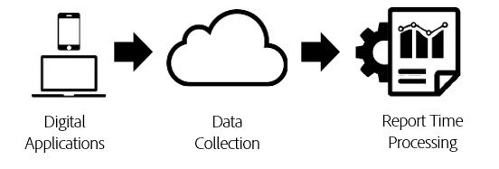

# Tijdverwerking rapporteren

[!UICONTROL Report time processing] is een instelling voor een virtuele rapportsuite waarmee gegevens in Analysis Workspace op niet-destructieve, retroactieve wijze kunnen worden verwerkt.

[!UICONTROL Report Time Processing] heeft alleen invloed op de gegevens in de virtuele-rapportsuite en heeft geen invloed op gegevens of gegevensverzameling in de set met basisrapporten. Het verschil tussen [!UICONTROL Report Time Processing] en de traditionele verwerking van Analytics wordt het best begrepen gebruikend het volgende diagram:

Tijdens de gegevensverwerking van Analytics, stromen de gegevens door de pijpleiding van de gegevensinzameling en in een preprocessing stap, die gegevens voor rapportering voorbereidt. Bij deze voorbewerkingsstap worden de logica voor het verlopen van het bezoek en de persistentielogica voor eVar (onder andere) toegepast op de gegevens terwijl deze worden verzameld. Het primaire nadeel van dit voorbewerkingsmodel is dat elke configuratie vooraf moet worden uitgevoerd voordat gegevens worden verzameld. Dit betekent dat wijzigingen in de instellingen voor voorbewerking alleen van toepassing zijn op nieuwe gegevens vanaf dat moment. Dit is problematisch als de gegevens uit orde aankomen of als de montages verkeerd werden gevormd.

[!UICONTROL Report Time Processing] is een fundamenteel andere manier om analysegegevens voor rapportage te verwerken. In plaats van de verwerkingslogica vooraf te bepalen alvorens de gegevens worden verzameld, negeert de Analytics de gegevensreeks tijdens de preprocessing stap en past deze logica toe telkens als een rapport wordt in werking gesteld:

Deze verwerkingsarchitectuur maakt veel flexibelere rapportageopties mogelijk. Bijvoorbeeld, kunt u de periode van de bezoekonderbreking in om het even welke tijdsduur veranderen u op een niet destructieve manier wilt en die veranderingen worden weerspiegeld in uw persistentie van eVar en segmentcontainers voor de volledige rapporteringsperiode. Bovendien, kunt u om het even welk aantal virtuele rapportreeksen tot stand brengen, elk met de verschillende opties van de Verwerking van de Tijd van het Rapport die op de zelfde reeks van het basisrapport worden gebaseerd, zonder om het even welke gegevens in de reeks van het basisrapport te veranderen.

[!UICONTROL Report Time Processing] staat ook Analytics toe om achtergrondklappen van aanvang nieuwe bezoeken te verhinderen en staat [ Adobe Experience Platform Mobile SDK ](https://experienceleague.adobe.com/docs/mobile.html?lang=nl-NL) toe om een nieuw bezoek te beginnen wanneer een gebeurtenis van de Lancering van de Toepassing wordt teweeggebracht.

## Configuratieopties

De volgende configuratieopties zijn momenteel beschikbaar aan virtuele rapportreeksen met toegelaten de Verwerking van de Tijd van het Rapport:

* **[!UICONTROL Visit Timeout]:** De time-outinstelling voor een bezoek bepaalt de hoeveelheid inactiviteit die een unieke bezoeker moet hebben voordat een nieuw bezoek automatisch wordt gestart. De standaardwaarde is 30 minuten. Als u de time-out van het bezoek bijvoorbeeld instelt op 15 minuten, wordt een nieuwe bezoekgroep gemaakt voor elke reeks verzamelde hits, gescheiden door 15 minuten inactiviteit. Deze instelling is niet alleen van invloed op uw aantal bezoeken, maar ook op de manier waarop de containers van het bezoekensegment worden geëvalueerd en op de logica voor het verlopen van bezoeken voor alle eVars die tijdens het bezoek verlopen. Als u de time-out van het bezoek verlaagt, neemt het totale aantal bezoeken in uw rapportage waarschijnlijk toe, terwijl een langere time-out van het bezoek het totale aantal bezoeken in uw rapportage waarschijnlijk zal verminderen.
* **[!UICONTROL Mobile App Visit Settings]:** voor rapportreeksen die gegevens bevatten die door mobiele apps door [ worden geproduceerd Mobiele SDKs van de Adobe ](https://experienceleague.adobe.com/docs/mobile.html?lang=nl-NL), zijn de extra bezoekmontages beschikbaar. Deze instellingen zijn niet-destructief en hebben alleen invloed op treffers die zijn verzameld via de mobiele SDK&#39;s. Deze instellingen zijn niet van invloed op gegevens die buiten de Mobile SDK worden verzameld.
* **[!UICONTROL Prevent Background Hits from starting a new Visit]:** Achtergrondhits worden verzameld door de mobiele SDK&#39;s wanneer de toepassing zich in de achtergrondstatus bevindt.
* **[!UICONTROL Start a New Visit upon each App Launch]:** Naast de time-out van het bezoek kunt u een bezoek afdwingen om te beginnen wanneer een gebeurtenis van de Lancering van de Toepassing van SDKs ongeacht het inactiviteitsvenster is geregistreerd. Dit het plaatsen beïnvloedt metrisch bezoek en de container van het bezoekensegment, evenals de logica van de bezoekafloop op eVars.
* **[!UICONTROL Start New Visit with Event]:** een nieuwe zitting begint wanneer een gebeurtenis, ongeacht of een zitting uit heeft getimed. De nieuwe sessie bevat de gebeurtenis die deze heeft gestart. Bovendien kunt u meerdere gebeurtenissen gebruiken om een sessie te starten en een nieuwe sessie wordt geactiveerd als een van deze gebeurtenissen in de gegevens wordt waargenomen. Dit het plaatsen zal uw bezoektelling, de container van de de segmentatie van het bezoek, en de logica van de bezoekafloop op eVars beïnvloeden.

>[!BEGINSHADEBOX]

Zie  [ Beginnend een nieuw bezoek met gebeurtenis ](https://video.tv.adobe.com/v/23129?quality=12&learn=on){target="_blank"} voor een demo video.

>[!ENDSHADEBOX]

## Beperkingen van tijdverwerking rapporteren

De Verwerking van de Tijd van het rapport steunt niet alle metriek en dimensies beschikbaar in traditionele Analytics rapportering. Virtuele rapportsuites die de Verwerking van de Tijd van het Rapport gebruiken zijn slechts toegankelijk in Analysis Workspace en is niet toegankelijk in Data Warehouse, Report Builder, Gegevensvoer, of rapporteringsAPI.

Bovendien verwerkt de Tijd van het Rapport slechts gegevens die uit binnen de rapporteringsdatumwaaier (die als &quot;datumvenster&quot;hieronder wordt bedoeld) komen. Dit betekent dat de waarden van eVar die voor een bezoeker vóór de rapporteringsdatumwaaier worden geplaatst &quot;nooit verlopen&quot;niet in de rapporteringsvensters blijven en niet in rapporten verschijnen. Dit betekent ook dat de metingen van de klantenloyaliteit uitsluitend gebaseerd zijn op de gegevens in de rapporteringsdatumwaaier en niet op de volledige geschiedenis voorafgaand aan de rapporteringsdatumwaaier.

De volgende afmetingen en metriek worden niet gesteund met de Verwerking van de Tijd van het Rapport:

* **Analytics voor Doel**
* **Analytics voor de afmetingen/metriek van Advertising Cloud**
* **Teller eVars**
* [**Dagen voor eerste aankoop**](/help/components/dimensions/days-before-first-purchase.md)
* [**Dagen sinds laatste aankoop**](/help/components/dimensions/days-since-last-purchase.md)
* [**Dagen sinds laatste bezoek**](/help/components/dimensions/days-since-last-visit.md)
* **Origineel van de Pagina van de Ingang van de Ingang**
* **Lineaire toewijzingsvariabelen**
* **Lijst Vars**
* [**Afmetingen marketingkanalen**](/help/components/dimensions/marketing-channel.md)
* [**Oorspronkelijk referentiedomein**](/help/components/dimensions/original-referring-domain.md)
* [**Retourfrequentie**](/help/components/dimensions/return-frequency.md)
* [**Eenvoudige toegang*](/help/components/metrics/single-access.md)
* **Gegevensbronnen van identiteitskaart van de Transactie**
* [**Bezoek nummer**](/help/components/dimensions/visit-number.md)

## Betrokken afmetingen en metriek

Hieronder volgt een lijst van afmetingen en metriek die afhankelijk van de geselecteerde montages van de Verwerking van de Tijd van het Rapport worden beïnvloed:

* Als &quot;Voorkomen dat de Hits van de Achtergrond van een Nieuw Bezoek&quot;wordt toegelaten, komen de volgende veranderingen voor. Zie [ context-bewuste zitting ](vrs-mobile-visit-processing.md) voor meer informatie.
   * [**Stuiters**](/help/components/metrics/bounces.md) / [**Stuitsnelheid:**](/help/components/metrics/bounce-rate.md) De Achtergrond klappen die niet door een voorgrondslag worden gevolgd worden niet beschouwd als stuiteren en dragen niet tot het stuitpercentage bij.
   * [**Tijd bestede Seconden per Bezoek:**](/help/components/metrics/time-spent-per-visit.md) slechts de bezoeken die voorgrondhits omvatten dragen aan dit metrisch bij.
   * **Tijd die per Bezoek wordt uitgegeven:** slechts de bezoeken die op voorgrond vallen omvatten dragen aan dit metrisch bij.
   * [**metrische Ingang**](/help/components/metrics/entries.md) / [**metrische uitgang:**](/help/components/metrics/exits.md) slechts ingangen en uitgang van bezoeken met voorgrondtreffelijke treffers verschijnen in deze afmeting.
   * [**dimensie van de Ingang**](/help/components/dimensions/entry-dimensions.md) / [**de dimensies van de Uitgang:**](/help/components/dimensions/exit-dimensions.md) slechts ingangen en de uitgang van bezoeken met voorgrondhits verschijnen in deze afmeting.
   * [**Unieke Metrische Bezoekers:**](/help/components/metrics/unique-visitors.md) De unieke Bezoekers omvatten geen bezoekers die slechts achtergrondklappen in de rapporteringsdatumwaaier hadden.
* [**bezoeken:**](/help/components/metrics/visits.md) Bebezoeken wijst op welke montages de virtuele rapportreeks heeft gevormd, die van de reeks van het basisrapport kan verschillend zijn.
* **Geserialiseerde Gebeurtenissen met Gebeurtenis IDs:** Gebeurtenissen die de Rangschikking van de Gebeurtenis met een gebeurtenisidentiteitskaart gebruiken worden slechts gededupliceerd voor gebeurtenissen die binnen de rapporteringsdatumwaaier voor een bezoeker voorkomen. Deze gebeurtenissen worden niet over alle datums of bezoekers globaal als gevolg van het venster Datum van de Verwerking van de Tijd van het Rapport gededupliceerd.
* **Aankopen** / [**Opbrengsten**](/help/components/metrics/revenue.md) / [**Orders**](/help/components/metrics/orders.md) / [**Eenheden:**](/help/components/metrics/units.md) wanneer aankoopidentiteitskaart wordt gebruikt, worden deze metriek slechts gededupliceerd voor dubbele aankoop IDs die binnen de rapporteringsdatumwaaier voor een bezoeker eerder dan over alle datum of bezoekers globaal toe te schrijven aan het venster van de Verwerking van de Tijd van het Rapport.
* [**niet-handelend eVars**](/help/components/dimensions/evar.md) / **gereserveerde eVars:** waarden die in een eVar worden geplaatst blijven slechts voortbestaan als de waarde binnen de rapporteringsdatumwaaier toe te schrijven aan het venster van de Datum van de Verwerking van de Tijd van het Rapport. Bovendien kunnen op tijd gebaseerde vervaldatums een uur vroeg of een uur laat verlopen als de persistentie een zomertijdwijziging omvat.
* [**Merchandising eVars**](/help/components/dimensions/evar-merchandising.md) / **gereserveerde eVars:** zie hierboven. Daarnaast wordt voor de conversiesyntaxis, waarbij de binding is ingesteld op &quot;een gebeurtenis&quot;, in plaats daarvan &quot;een hit&quot; gebruikt.
* [**Type van Actief:**](/help/components/dimensions/hit-type.md) Deze afmeting specificeert of een klap voorgrond of achtergrond is.
* **Dimensionen met (Laag-verkeer) of &quot;Uniques Overschreden&quot;:** het (Laag-verkeer) lijnpunt wordt bepaald lichtjes verschillend wanneer het gebruiken van de Verwerking van de Tijd van het Rapport, en is niet gegarandeerd om te passen wat wanneer het melden op de Reeks van het basisrapport wordt waargenomen. De lijnpunten van het Dimension die geen deel van Laag-verkeer uitmaken worden gegarandeerd niet 100% van de gegevens voor dat lijnpunt vertegenwoordigen. Deze verschillen kunnen groter worden naarmate het aantal unieke waarden in een dimensie groter wordt.
