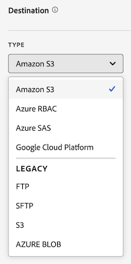

# Een gegevensfeed maken

Wanneer u een gegevensfeed maakt, biedt u Adobe het volgende:

* De informatie over de bestemming waarnaar u Raw-gegevensbestanden wilt verzenden
* De gegevens die u in elk bestand wilt opnemen

Alvorens u een gegevensvoer creeert, is het belangrijk om een basisbegrip van gegevensvoer te hebben en ervoor te zorgen dat u aan alle voorwaarden voldoet. Voor meer informatie, zie [&#x200B; Overzicht van de voer van Gegevens &#x200B;](data-feed-overview.md).

## Een gegevensfeed maken en configureren {#create-and-configure-data-feed}

<!-- markdownlint-disable MD034 -->

>[!CONTEXTUALHELP]
>id="aa_datafeed_os_strings"
>title="Tekenreeksen van het besturingssysteem vervangen"
>abstract="Deze optie ontruimt omhoog de gegevensoutput door de volgende koordopeenvolgingen te ontdekken ingebed in klantengegevens en hen te vervangen met een ruimte:   Vensters: CRLF, CR, of TAB   Mac en Linux: \ n, \ r, of \ t"

<!-- markdownlint-enable MD034 -->

<!-- markdownlint-disable MD034 -->

>[!CONTEXTUALHELP]
>id="aa_datafeed_export_file"
>title="Manifest"
>abstract="Kies of u een manifestbestand wilt opnemen bij elke gegevensdoorvoerlevering. Manifest-bestanden bevatten informatie voor elk ingesloten bestand in de gegevensfeed. Bij het verzenden van gegevens uit de gegevensfeed in één pakket kunt u er ook voor kiezen een eindbestand op te nemen, maar manifestbestanden worden aanbevolen. "

<!-- markdownlint-enable MD034 -->

<!-- markdownlint-disable MD034 -->

>[!CONTEXTUALHELP]
>id="aa_datafeed_notify"
>title="Melding verzenden wanneer voltooid"
>abstract="Geef een of meer e-mailadressen op waar een melding moet worden verzonden nadat de gegevensinvoer is verzonden. Meerdere e-mailadressen moeten met een komma worden gescheiden."

<!-- markdownlint-enable MD034 -->

1. Meld u met uw Adobe ID aan bij [experiencecloud.adobe.com](https://experiencecloud.adobe.com).
1. Selecteer het 9-vierkante pictogram in hoger-recht, dan uitgezochte [!UICONTROL **Analytics**].
1. In de hoogste navigatiebar, ga [!UICONTROL **Admin**] > [!UICONTROL **het voer van Gegevens**].
1. Selecteer [!UICONTROL **toevoegen**].

    toe

   Een paginavertoningen met drie belangrijkste categorieën: [!UICONTROL **de informatie van het voer**], [!UICONTROL **Bestemming**], en [!UICONTROL **de kolomdefinities van Gegevens**].
1. In de [!UICONTROL **sectie van de Informatie van de Diervoeders**], voltooi de volgende gebieden:

   | Veld | Functie |
   |---------|----------|
   | [!UICONTROL **Naam**] | De naam van de gegevensinvoer. Moet uniek zijn binnen de geselecteerde rapportreeks, en kan tot 255 karakters in lengte zijn. [Meer informatie](/help/export/analytics-data-feed/df-faq.md#must-feed-names-be-unique) |
   | [!UICONTROL **Reeks van het Rapport**] | De rapportsuite waarop de gegevensinvoer is gebaseerd. Als de veelvoudige gegevensvoer voor de zelfde rapportreeks wordt gecreeerd, moeten zij verschillende kolomdefinities hebben. Alleen bronrapportsuites ondersteunen gegevensfeeds; virtuele rapportsuites worden niet ondersteund. |
   | [!UICONTROL **E-mail wanneer volledig**] | Het e-mailadres dat moet worden gemeld wanneer een feed de verwerking heeft voltooid. Het e-mailadres moet correct zijn opgemaakt. |
   | [!UICONTROL **het interval van het voer**] | Selecteer **Dagelijkse** voor backfill of historische gegevens. De dagelijkse voer bevat een volledige waarde van de dag van gegevens, van middernacht aan middernacht in de tijdzone van de rapportreeks. Selecteer **Uur** voor verdere gegevens (Daily is ook beschikbaar voor verdere voer als u verkiest). Uurfeeds bevatten gegevens van één uur. |
   | [!UICONTROL **de verwerking van de Vertraging**] | Wacht een bepaalde hoeveelheid tijd alvorens een dossier van de gegevensvoer te verwerken. Een vertraging kan handig zijn om mobiele implementaties de mogelijkheid te geven om offlineapparaten online te komen en gegevens te verzenden. Het kan ook worden gebruikt om de server-zijprocessen van uw organisatie in het beheren van eerder verwerkte dossiers aan te passen. In de meeste gevallen is geen uitstel nodig. Een diervoeder kan maximaal 120 minuten worden uitgesteld. |
   | [!UICONTROL **Begin &amp; einddata**] | De begindatum geeft de datum aan waarop de gegevensinvoer moet beginnen. Als u onmiddellijk wilt beginnen met het verwerken van gegevensfeeds voor historische gegevens, stelt u deze datum in op een datum in het verleden waarop gegevens worden verzameld. De begin en einddata zijn gebaseerd op de tijdzone van de rapportreeks. |
   | [!UICONTROL **Ononderbroken voer**] | Met dit selectievakje wordt de einddatum verwijderd, zodat een feed voor onbepaalde tijd kan worden uitgevoerd. Als een feed de verwerking van historische gegevens heeft voltooid, wacht een feed tot de gegevens een bepaald uur of een bepaalde dag zijn verzameld. Zodra het huidige uur of de dag eindigt, begint de verwerking na de gespecificeerde vertraging. |

1. In de [!UICONTROL **sectie van de Bestemming**], in het [!UICONTROL **Type**] drop-down menu, selecteer de bestemming waar u de gegevens wilt worden verzonden.

   >[!NOTE]
   >
   >Overweeg het volgende wanneer het vormen van een rapportbestemming:
   >
   >* We raden u aan een cloudaccount te gebruiken voor uw rapportbestemming. [&#x200B; Verouderde FTP en de rekeningen van SFTP &#x200B;](#legacy-destinations) zijn beschikbaar, maar niet geadviseerd.
   >* Alle cloudaccounts die u eerder hebt geconfigureerd, kunnen worden gebruikt voor gegevensfeeds. U kunt cloudaccounts op de volgende manieren configureren:
   >
   >   * Wanneer het vormen van wolkenrekeningen voor [&#x200B; Data Warehouse &#x200B;](/help/export/data-warehouse/create-request/dw-request-report-destinations.md)
   >   
   >   * Wanneer [&#x200B; het invoeren van de classificatiegegevens van Adobe Analytics &#x200B;](/help/components/locations/locations-manager.md) (Om het even welke plaatsen die voor het invoeren van classificatiegegevens worden gevormd kunnen niet worden gebruikt.)
   >   
   >   * Van de manager van Plaatsen, in [&#x200B; Componenten > Plaatsen &#x200B;](/help/components/locations/configure-import-accounts.md)
   >
   >* Cloud-accounts zijn gekoppeld aan uw Adobe Analytics-gebruikersaccount. Andere gebruikers kunnen geen cloudaccounts gebruiken of weergeven die u configureert.
   >
   >* U kunt om het even welke plaatsen uitgeven die u van de manager van Plaatsen in [&#x200B; Componenten > Plaatsen &#x200B;](/help/components/locations/configure-import-accounts.md) creeert

   

   Gebruik een van de volgende doeltypen wanneer u een gegevensfeed maakt. Vouw voor configuratieinstructies het doeltype uit. (De extra [&#x200B; erfenisbestemmingen &#x200B;](#legacy-destinations) zijn ook beschikbaar, maar niet geadviseerd.)

   +++Amazon S3

   U kunt feeds rechtstreeks naar Amazon S3-emmers verzenden. Voor dit doeltype is alleen uw Amazon S3-account en de locatie (bucket) vereist.

   Adobe Analytics gebruikt verificatie via meerdere accounts om bestanden van Adobe Analytics te uploaden naar de opgegeven locatie in uw Amazon S3-exemplaar.

   Wanneer u Amazon S3 gebruikt met gegevensfeeds, wordt alleen SSE-S3-codering ondersteund.

   Een Amazon S3 emmertje als bestemming voor een gegevensvoer vormen:

   1. Beginnen creërend een gegevensvoer zoals die in [&#x200B; wordt beschreven creeer en vorm een gegevensvoer &#x200B;](#create-and-configure-a-data-feed).

   1. In de [!UICONTROL **sectie van de Bestemming**], in het [!UICONTROL **Type**] drop-down menu, uitgezochte [!UICONTROL **Amazon S3**].

      

   1. Selecteer [!UICONTROL **Uitgezochte plaats**].

      De pagina Amazon S3 Exportlocaties wordt weergegeven.

   1. (Voorwaardelijk) Als er al een Amazon S3-account (en een locatie op die account) is geconfigureerd in Adobe Analytics, kunt u deze gebruiken als de bestemming van de gegevensfeed:

      >[!NOTE]
      >
      >De rekeningen zijn beschikbaar aan u slechts als u hen vormde of als zij met een organisatie werden gedeeld u een deel van bent.

      1. Selecteer de rekening van [!UICONTROL **Uitgezochte rekening**] drop-down menu.

         Alle cloudaccounts die zijn geconfigureerd in een van de volgende Adobe Analytics-domeinen kunnen worden gebruikt:

         * Wanneer het invoeren van de classificatiegegevens van Adobe Analytics, zoals die in [&#x200B; Schema &#x200B;](/help/components/classifications/sets/manage/schema.md) worden beschreven.

           Nochtans, kunnen om het even welke plaatsen die voor het invoeren van classificatiegegevens worden gevormd niet worden gebruikt. Voeg in plaats daarvan een nieuwe bestemming toe, zoals hieronder wordt beschreven.

         * Wanneer het vormen van rekeningen en plaatsen in het gebied van Plaatsen, zoals die in [&#x200B; worden beschreven vorm wolk invoer en de uitvoerrekeningen &#x200B;](/help/components/locations/configure-import-accounts.md) en [&#x200B; vorm wolk invoer en de uitvoerplaatsen &#x200B;](/help/components/locations/configure-import-locations.md).

      1. Selecteer de plaats van [!UICONTROL **Uitgezochte plaats**] drop-down menu.

      1. Selecteer [!UICONTROL **sparen**] > [!UICONTROL **sparen**].

      De bestemming wordt nu gevormd om gegevens naar de Amazon S3 plaats te verzenden die u specificeerde.

   1. (Voorwaardelijk) Als u nog geen Amazon S3-account hebt toegevoegd:

      1. Selecteer [!UICONTROL **toevoegen rekening**], dan specificeer de volgende informatie:

         | Veld | Functie |
         |---------|----------|
         | [!UICONTROL **de naam van de Rekening**] | Een naam voor de account. Dit kan elke gewenste naam zijn. |
         | [!UICONTROL **beschrijving van de Rekening**] | Een beschrijving voor de account. |
         | [!UICONTROL **ARN van de Rol**] | U moet een Role ARN (de Naam van het Middel van Amazon) verstrekken die Adobe kan gebruiken om tot de rekening van Amazon S3 toegang te krijgen. Om dit te doen, creeert u een IAM toestemmingsbeleid voor de bronrekening, maakt het beleid aan een gebruiker vast, en creeert dan een rol voor de bestemmingsrekening. Voor specifieke informatie, zie [&#x200B; deze documentatie van AWS &#x200B;](https://aws.amazon.com/premiumsupport/knowledge-center/cross-account-access-iam/). |
         | [!UICONTROL **ARN VAN DE Gebruiker**] | De User ARN (Amazon Resource Name) wordt opgegeven door Adobe. U moet deze gebruiker aan het beleid vastmaken u creeerde. |

         {style="table-layout:auto"}

      1. Selecteer [!UICONTROL **plaats**] toevoegen, dan specificeer de volgende informatie:

         | Veld | Functie |
         |---------|----------|
         | [!UICONTROL **Naam**] | Een naam voor de account. |
         | [!UICONTROL **Beschrijving**] | Een beschrijving voor de account. |
         | [!UICONTROL **Emmertje**] | Het emmertje in uw Amazon S3-account waarin u Adobe Analytics-gegevens wilt verzenden. 
Zorg ervoor dat de door Adobe verschafte Gebruiker-ARN over de `S3:PutObject` -machtiging beschikt om bestanden te uploaden naar dit emmertje. Met deze machtiging kan de ARN-gebruiker initiële bestanden uploaden en bestanden overschrijven voor volgende uploads.

Emmernamen moeten voldoen aan specifieke naamgevingsregels. Ze moeten bijvoorbeeld tussen 3 en 63 tekens lang zijn, ze mogen alleen bestaan uit kleine letters, cijfers, puntjes (.) en afbreekstreepjes (-) en ze moeten beginnen en eindigen met een letter of getal. [&#x200B; A volledige lijst van het noemen van regels is beschikbaar in de documentatie van AWS &#x200B;](https://docs.aws.amazon.com/AmazonS3/latest/userguide/bucketnamingrules.html). 
 |
         | [!UICONTROL **Prefix**] | De map in het emmertje waar u de gegevens wilt plaatsen. Geef een mapnaam op en voeg vervolgens een backslash achter de naam toe om de map te maken. Bijvoorbeeld: `folder_name/` |

         {style="table-layout:auto"}

      1. Selecteer [!UICONTROL **creeer**] > [!UICONTROL **sparen**].

         De bestemming wordt nu gevormd om gegevens naar de Amazon S3 plaats te verzenden die u specificeerde.

      1. (Voorwaardelijk) als u de bestemming (rekening en plaats) moet beheren die u enkel creeerde, is het beschikbaar in de [&#x200B; manager van Plaatsen &#x200B;](/help/components/locations/locations-manager.md).

   +++

   +++Azure RBAC

   Met RBAC-verificatie kunt u feeds rechtstreeks naar een Azure-container verzenden. Dit bestemmingstype vereist een identiteitskaart van de Toepassing, identiteitskaart van de Aannemer, en Geheim.

   Een Azure RBAC-account configureren als de bestemming voor een gegevensfeed:

   1. Als u nog geen Azure-toepassing hebt, maakt u een Azure-toepassing die Adobe Analytics voor verificatie kan gebruiken en verleent u vervolgens toegangsmachtigingen in toegangsbeheer (IAM).

      Voor informatie, verwijs naar de [&#x200B; Microsoft Azure documentatie over hoe te om een Azure Actieve toepassing van de Folder &#x200B;](https://learn.microsoft.com/en-us/azure/active-directory/develop/howto-create-service-principal-portal) tot stand te brengen.

   1. In de Adobe Analytics admin console, in de [!UICONTROL **sectie van de Bestemming**], in het [!UICONTROL **Type**] drop-down menu, uitgezochte [!UICONTROL **Azure RBAC**].

      

   1. Selecteer [!UICONTROL **Uitgezochte plaats**].

      De pagina Azure RBAC Export Locations wordt weergegeven.

   1. (Voorwaardelijk) Als er al een Azure RBAC-account (en een locatie op die account) is geconfigureerd in Adobe Analytics, kunt u deze gebruiken als bestemming voor de gegevensinvoer:

      >[!NOTE]
      >
      >De rekeningen zijn beschikbaar aan u slechts als u hen vormde of als zij met een organisatie werden gedeeld u een deel van bent.

      1. Selecteer de rekening van [!UICONTROL **Uitgezochte rekening**] drop-down menu.

      Alle cloudaccounts die u hebt geconfigureerd in een van de volgende Adobe Analytics-domeinen kunnen worden gebruikt:

      * Wanneer het invoeren van de classificatiegegevens van Adobe Analytics, zoals die in [&#x200B; Schema &#x200B;](/help/components/classifications/sets/manage/schema.md) worden beschreven.

        Nochtans, kunnen om het even welke plaatsen die voor het invoeren van classificatiegegevens worden gevormd niet worden gebruikt. Voeg in plaats daarvan een nieuwe bestemming toe, zoals hieronder wordt beschreven.

      * Wanneer het vormen van rekeningen en plaatsen in het gebied van Plaatsen, zoals die in [&#x200B; worden beschreven vorm wolk invoer en de uitvoerrekeningen &#x200B;](/help/components/locations/configure-import-accounts.md) en [&#x200B; vorm wolk invoer en de uitvoerplaatsen &#x200B;](/help/components/locations/configure-import-locations.md).

      1. Selecteer de plaats van [!UICONTROL **Uitgezochte plaats**] drop-down menu.

      1. Selecteer [!UICONTROL **sparen**] > [!UICONTROL **sparen**].

         De bestemming wordt nu gevormd om gegevens naar de Azure plaats te verzenden RBAC die u specificeerde.

   1. (Voorwaardelijk) Als u nog geen Azure RBAC-account hebt toegevoegd:

      1. Selecteer [!UICONTROL **toevoegen rekening**], dan specificeer de volgende informatie:

         | Veld | Functie |
         |---------|----------|
         | [!UICONTROL **de naam van de Rekening**] | Een naam voor de Azure RBAC-account. Deze naam toont in [!UICONTROL **Uitgezochte rekening**] drop-down gebied en kan om het even welke naam zijn u kiest. |
         | [!UICONTROL **beschrijving van de Rekening**] | Een beschrijving voor de Azure RBAC-account. Deze beschrijvingsvertoningen in [!UICONTROL **Uitgezochte rekening**] drop-down gebied en kunnen om het even welke naam zijn u kiest. |
         | [!UICONTROL **identiteitskaart van de Toepassing**] | Kopieer deze id uit de Azure-toepassing die u hebt gemaakt. In Microsoft Azure, wordt deze informatie gevestigd op het **Overzicht** lusje binnen uw toepassing. Voor meer informatie, zie [&#x200B; Microsoft Azure documentatie over hoe te om een toepassing met het de identiteitsplatform van Microsoft &#x200B;](https://learn.microsoft.com/en-us/azure/active-directory/develop/quickstart-register-app) te registreren. |
         | [!UICONTROL **identiteitskaart van de HTENT**] | Kopieer deze id uit de Azure-toepassing die u hebt gemaakt. In Microsoft Azure, wordt deze informatie gevestigd op het **Overzicht** lusje binnen uw toepassing. Voor meer informatie, zie [&#x200B; Microsoft Azure documentatie over hoe te om een toepassing met het de identiteitsplatform van Microsoft &#x200B;](https://learn.microsoft.com/en-us/azure/active-directory/develop/quickstart-register-app) te registreren. |
         | [!UICONTROL **Geheim**] | Kopieer het geheim van de Azure-toepassing die u hebt gemaakt. In Microsoft Azure, wordt deze informatie gevestigd op het **Certificaten &amp; geheimen** lusje binnen uw toepassing. Voor meer informatie, zie [&#x200B; Microsoft Azure documentatie over hoe te om een toepassing met het de identiteitsplatform van Microsoft &#x200B;](https://learn.microsoft.com/en-us/azure/active-directory/develop/quickstart-register-app) te registreren. |

         {style="table-layout:auto"}

      1. Selecteer [!UICONTROL **plaats**] toevoegen, dan specificeer de volgende informatie:

         | Veld | Functie |
         |---------|----------|
         | [!UICONTROL **Naam**] | Een naam voor de locatie. Deze naam toont in [!UICONTROL **Uitgezochte plaats**] drop-down gebied en kan om het even welke naam zijn u kiest. |
         | [!UICONTROL **Beschrijving**] | Een beschrijving voor de locatie. Deze beschrijving toont in [!UICONTROL **Uitgezochte plaats**] drop-down gebied en kan om het even welke naam zijn u kiest. |
         | [!UICONTROL **Rekening**] | De Azure-opslagaccount. |
         | [!UICONTROL **Container**] | De container in de account die u hebt opgegeven, waarnaar u Adobe Analytics-gegevens wilt verzenden. Zorg ervoor dat u machtigingen verleent om bestanden te uploaden naar de Azure-toepassing die u eerder hebt gemaakt. |
         | [!UICONTROL **Prefix**] | De map in de container waarin u de gegevens wilt plaatsen. Geef een mapnaam op en voeg vervolgens een backslash achter de naam toe om de map te maken. Bijvoorbeeld: `folder_name/`
Controleer of de toepassings-id die u hebt opgegeven bij het configureren van de Azure RBAC-account, de rol `Storage Blob Data Contributor` heeft gekregen voor toegang tot de container (map).
 
Voor meer informatie, zie [&#x200B; Azure ingebouwde rollen &#x200B;](https://learn.microsoft.com/en-us/azure/role-based-access-control/built-in-roles).
 |

         {style="table-layout:auto"}

      1. Selecteer [!UICONTROL **creeer**] > [!UICONTROL **sparen**].

         De bestemming wordt nu gevormd om gegevens naar de Azure plaats te verzenden RBAC die u specificeerde.

      1. (Voorwaardelijk) als u de bestemming (rekening en plaats) moet beheren die u enkel creeerde, is het beschikbaar in de [&#x200B; manager van Plaatsen &#x200B;](/help/components/locations/locations-manager.md).

   +++

   +++Azure SAS

   Met SAS-verificatie kunt u feeds rechtstreeks naar een Azure-container verzenden. Voor dit doeltype is een toepassings-id, een id voor de huurder, de sleutelvault-URI, de geheime naam van de sleutelkluis en een geheim vereist.

   Om Azure SAS als bestemming voor een gegevensvoer te vormen:

   1. Als u dat nog niet hebt gedaan, maakt u een Azure-toepassing die Adobe Analytics voor verificatie kan gebruiken.

      Voor informatie, verwijs naar de [&#x200B; Microsoft Azure documentatie over hoe te om een Azure Actieve toepassing van de Folder &#x200B;](https://learn.microsoft.com/en-us/azure/active-directory/develop/howto-create-service-principal-portal) tot stand te brengen.

   1. In de Adobe Analytics admin console, in de [!UICONTROL **sectie van de Bestemming**], uitgezochte [!UICONTROL **Azure SAS**].

      

   1. Selecteer [!UICONTROL **Uitgezochte plaats**].

      De Azure SAS Export Locations-pagina wordt weergegeven.

   1. (Voorwaardelijk) Als er al een Azure SAS-account (en een locatie op die account) is geconfigureerd in Adobe Analytics, kunt u dit gebruiken als de bestemming van de gegevensfeed:

      >[!NOTE]
      >
      >De rekeningen zijn beschikbaar aan u slechts als u hen vormde of als zij met een organisatie werden gedeeld u een deel van bent.

      1. Selecteer de rekening van [!UICONTROL **Uitgezochte rekening**] drop-down menu.

         Alle cloudaccounts die u hebt geconfigureerd in een van de volgende Adobe Analytics-domeinen kunnen worden gebruikt:

         * Wanneer het invoeren van de classificatiegegevens van Adobe Analytics, zoals die in [&#x200B; Schema &#x200B;](/help/components/classifications/sets/manage/schema.md) worden beschreven.

           Nochtans, kunnen om het even welke plaatsen die voor het invoeren van classificatiegegevens worden gevormd niet worden gebruikt. Voeg in plaats daarvan een nieuwe bestemming toe, zoals hieronder wordt beschreven.

         * Wanneer het vormen van rekeningen en plaatsen in het gebied van Plaatsen, zoals die in [&#x200B; worden beschreven vorm wolk invoer en de uitvoerrekeningen &#x200B;](/help/components/locations/configure-import-accounts.md) en [&#x200B; vorm wolk invoer en de uitvoerplaatsen &#x200B;](/help/components/locations/configure-import-locations.md).

      1. Selecteer de plaats van [!UICONTROL **Uitgezochte plaats**] drop-down menu.

      1. Selecteer [!UICONTROL **sparen**] > [!UICONTROL **sparen**].

         De bestemming is nu geconfigureerd voor het verzenden van gegevens naar de door u opgegeven Azure SAS-locatie.

   1. (Voorwaardelijk) Als u nog geen Azure SAS-account hebt toegevoegd:

      1. Selecteer [!UICONTROL **toevoegen rekening**], dan specificeer de volgende informatie:

         | Veld | Functie |
         |---------|----------|
         | [!UICONTROL **de naam van de Rekening**] | Een naam voor de Azure SAS-account. Deze naam toont in [!UICONTROL **Uitgezochte rekening**] drop-down gebied en kan om het even welke naam zijn u kiest. |
         | [!UICONTROL **beschrijving van de Rekening**] | Een beschrijving voor de Azure SAS-account. Deze beschrijvingsvertoningen in [!UICONTROL **Uitgezochte rekening**] drop-down gebied en kunnen om het even welke naam zijn u kiest. |
         | [!UICONTROL **identiteitskaart van de Toepassing**] | Kopieer deze id uit de Azure-toepassing die u hebt gemaakt. In Microsoft Azure, wordt deze informatie gevestigd op het **Overzicht** lusje binnen uw toepassing. Voor meer informatie, zie [&#x200B; Microsoft Azure documentatie over hoe te om een toepassing met het de identiteitsplatform van Microsoft &#x200B;](https://learn.microsoft.com/en-us/azure/active-directory/develop/quickstart-register-app) te registreren. |
         | [!UICONTROL **identiteitskaart van de HTENT**] | Kopieer deze id uit de Azure-toepassing die u hebt gemaakt. In Microsoft Azure, wordt deze informatie gevestigd op het **Overzicht** lusje binnen uw toepassing. Voor meer informatie, zie [&#x200B; Microsoft Azure documentatie over hoe te om een toepassing met het de identiteitsplatform van Microsoft &#x200B;](https://learn.microsoft.com/en-us/azure/active-directory/develop/quickstart-register-app) te registreren. |
         | [!UICONTROL **Zeer belangrijke vault URI**] | 
Het pad naar de SAS URI in Azure Key Vault. Om Azure SAS te configureren, moet u een SAS-URI opslaan als een geheim met Azure Key Vault. Voor informatie, zie de [&#x200B; Microsoft Azure documentatie over hoe te om een geheim van Azure Key Vault &#x200B;](https://learn.microsoft.com/en-us/azure/key-vault/secrets/quick-create-portal?source=recommendations) te plaatsen en terug te winnen.

Nadat de sleutelvault-URI is gemaakt:<ul><li>Voeg een toegangsbeleid op de Zeer belangrijke vault toe om toestemming aan de Azure toepassing te verlenen die u creeerde.
Voor informatie, zie [&#x200B; Microsoft Azure documentatie over hoe te om een Zeer belangrijk de toegangsbeleid van de Vault toe te wijzen &#x200B;](https://learn.microsoft.com/en-us/azure/key-vault/general/assign-access-policy?tabs=azure-portal).

of

Als u een toegangsrol direct wilt verlenen zonder een toegangsbeleid te creëren, zie [&#x200B; Microsoft Azure documentatie over hoe te om Azure rollen toe te wijzen gebruikend Azure portaal &#x200B;](https://learn.microsoft.com/en-us/azure/role-based-access-control/role-assignments-portal). Hiermee voegt u de roltoewijzing voor de toepassings-id toe aan toegang tot de sleutelvault-URI. 
</li><li>Zorg ervoor dat de toepassings-id de `Key Vault Certificate User` ingebouwde rol heeft gekregen om toegang te krijgen tot de sleutelvault URI. 
Voor meer informatie, zie [&#x200B; Azure ingebouwde rollen &#x200B;](https://learn.microsoft.com/en-us/azure/role-based-access-control/built-in-roles).
</li></ul> |
         | [!UICONTROL **Zeer belangrijke geheime naam van de kluis**] | De geheime naam die u hebt gemaakt toen u het geheim toevoegde aan Azure Key Vault. In Microsoft Azure, wordt deze informatie gevestigd in de Belangrijkste Vault u, op de **Zeer belangrijke de montagespagina&#39;s van de Uitvault** creeerde. Voor informatie, zie de [&#x200B; Microsoft Azure documentatie over hoe te om een geheim van Azure Key Vault &#x200B;](https://learn.microsoft.com/en-us/azure/key-vault/secrets/quick-create-portal?source=recommendations) te plaatsen en terug te winnen. |
         | [!UICONTROL **Geheim**] | Kopieer het geheim van de Azure-toepassing die u hebt gemaakt. In Microsoft Azure, wordt deze informatie gevestigd op het **Certificaten &amp; geheimen** lusje binnen uw toepassing. Voor meer informatie, zie [&#x200B; Microsoft Azure documentatie over hoe te om een toepassing met het de identiteitsplatform van Microsoft &#x200B;](https://learn.microsoft.com/en-us/azure/active-directory/develop/quickstart-register-app) te registreren. |

         {style="table-layout:auto"}

      1. Selecteer [!UICONTROL **plaats**] toevoegen, dan specificeer de volgende informatie:

         | Veld | Functie |
         |---------|----------|
         | [!UICONTROL **Naam**] | Een naam voor de locatie. Deze naam toont in [!UICONTROL **Uitgezochte plaats**] drop-down gebied en kan om het even welke naam zijn u kiest. |
         | [!UICONTROL **Beschrijving**] | Een beschrijving voor de locatie. Deze beschrijving toont in [!UICONTROL **Uitgezochte plaats**] drop-down gebied en kan om het even welke naam zijn u kiest. |
         | [!UICONTROL **Container**] | De container in de account die u hebt opgegeven, waarnaar u Adobe Analytics-gegevens wilt verzenden. |
         | [!UICONTROL **Prefix**] | De map in de container waarin u de gegevens wilt plaatsen. Geef een mapnaam op en voeg vervolgens een backslash achter de naam toe om de map te maken. Bijvoorbeeld: `folder_name/`
Zorg ervoor dat de opslag van SAS URI die u in het geheime naamveld Key Vault hebt opgegeven bij de configuratie van de Azure SAS-account, de `Write` -machtiging heeft. Hierdoor kan de SAS URI bestanden in uw Azure-container maken. 
Als u wilt dat de SAS-URI ook bestanden overschrijft, controleert u of de SAS-URI-opslag de machtiging `Delete` heeft.

Voor meer informatie, zie [&#x200B; de opslagmiddelen van de Blob &#x200B;](https://learn.microsoft.com/en-us/azure/storage/blobs/storage-blobs-introduction#blob-storage-resources) in de Azure documentatie van de Opslag van Blob.
 |

         {style="table-layout:auto"}

      1. Selecteer [!UICONTROL **creeer**] > [!UICONTROL **sparen**].

         De bestemming is nu geconfigureerd voor het verzenden van gegevens naar de door u opgegeven Azure SAS-locatie.

      1. (Voorwaardelijk) als u de bestemming (rekening en plaats) moet beheren die u enkel creeerde, is het beschikbaar in de [&#x200B; manager van Plaatsen &#x200B;](/help/components/locations/locations-manager.md).

   +++

   +++Google Cloud Platform

   U kunt feeds rechtstreeks naar de emmers van het Google Cloud Platform (GCP) verzenden. Voor dit doeltype zijn alleen de naam van uw GCP-account en de naam van de locatie (emmertje) vereist.

   Adobe Analytics gebruikt verificatie voor meerdere accounts om bestanden van Adobe Analytics naar de opgegeven locatie in uw GCP-exemplaar te uploaden.

   Om een emmertje GCP als bestemming voor een gegevensvoer te vormen:

   1. In de Adobe Analytics admin console, in de [!UICONTROL **sectie van de Bestemming**], selecteer [!UICONTROL **het Platform van de Wolk van Google**].

      

   1. Selecteer [!UICONTROL **Uitgezochte plaats**].

      De pagina GCP-exportlocaties wordt weergegeven.

   1. (Voorwaardelijk) Als er al een Google Cloud Platform-account (en een locatie op dat account) is geconfigureerd in Adobe Analytics, kunt u dit gebruiken als de bestemming van de gegevensfeed:

      >[!NOTE]
      >
      >De rekeningen zijn beschikbaar aan u slechts als u hen vormde of als zij met een organisatie werden gedeeld u een deel van bent.

      1. Selecteer de rekening van [!UICONTROL **Uitgezochte rekening**] drop-down menu.

         Alle cloudaccounts die u hebt geconfigureerd in een van de volgende Adobe Analytics-domeinen kunnen worden gebruikt:

         * Wanneer het invoeren van de classificatiegegevens van Adobe Analytics, zoals die in [&#x200B; Schema &#x200B;](/help/components/classifications/sets/manage/schema.md) worden beschreven.

           Nochtans, kunnen om het even welke plaatsen die voor het invoeren van classificatiegegevens worden gevormd niet worden gebruikt. Voeg in plaats daarvan een nieuwe bestemming toe, zoals hieronder wordt beschreven.

         * Wanneer het vormen van rekeningen en plaatsen in het gebied van Plaatsen, zoals die in [&#x200B; worden beschreven vorm wolk invoer en de uitvoerrekeningen &#x200B;](/help/components/locations/configure-import-accounts.md) en [&#x200B; vorm wolk invoer en de uitvoerplaatsen &#x200B;](/help/components/locations/configure-import-locations.md).

      1. Selecteer de plaats van [!UICONTROL **Uitgezochte plaats**] drop-down menu.

      1. Selecteer [!UICONTROL **sparen**] > [!UICONTROL **sparen**].

         De bestemming is nu geconfigureerd voor het verzenden van gegevens naar de locatie van het Google Cloud Platform die u hebt opgegeven.

   1. (Voorwaardelijk) Als u nog geen GCP-account hebt toegevoegd:

      1. Selecteer [!UICONTROL **toevoegen rekening**], dan specificeer de volgende informatie:

         | Veld | Functie |
         |---------|----------|
         | [!UICONTROL **de naam van de Rekening**] | Een naam voor de account. Dit kan elke gewenste naam zijn. |
         | [!UICONTROL **beschrijving van de Rekening**] | Een beschrijving voor de account. |
         | [!UICONTROL **identiteitskaart van het Project**] | Uw Google Cloud-project-id. Zie de [&#x200B; documentatie van de Wolk van Google over het krijgen van een project identiteitskaart &#x200B;](https://cloud.google.com/resource-manager/docs/creating-managing-projects#identifying_projects). |

         {style="table-layout:auto"}

      1. Selecteer [!UICONTROL **plaats**] toevoegen, dan specificeer de volgende informatie:

         | Veld | Functie |
         |---------|----------|
         | [!UICONTROL **Belangrijk**] | De Opdrachtgever wordt geleverd door Adobe. U moet toestemming verlenen om voer naar dit hoofd te ontvangen. |
         | [!UICONTROL **Naam**] | Een naam voor de account. |
         | [!UICONTROL **Beschrijving**] | Een beschrijving voor de account. |
         | [!UICONTROL **Emmertje**] | Het emmertje binnen uw GCP rekening waar u de gegevens van Adobe Analytics wilt worden verzonden. 
Zorg ervoor dat u één van beiden van de volgende toestemmingen aan Principal hebt verleend die door Adobe wordt verstrekt: (Voor informatie over het verlenen van toestemmingen, zie [&#x200B; een hoofd aan een emmertje-vlakke beleid &#x200B;](https://cloud.google.com/storage/docs/access-control/using-iam-permissions#bucket-add) in de documentatie van de Wolk van Google toevoegen.)<ul><li>`roles/storage.objectCreator`: Gebruik deze machtiging als u Opdrachtgever wilt beperken tot het maken van alleen bestanden in uw GCP-account.  **Belangrijk:** als u deze toestemming met geplande rapportering gebruikt, moet u een uniek dossier - naam voor elke nieuwe geplande uitvoer gebruiken. Anders, zal de rapportgeneratie ontbreken omdat Principal geen toegang heeft om bestaande dossiers te overschrijven.</li><li>(Aanbevolen) `roles/storage.objectUser`: gebruik deze machtiging als u wilt dat de Opdrachtgever toegang heeft tot de bestanden in uw GCP-account, deze bestanden kan weergeven, bijwerken en verwijderen.  Deze toestemming staat Principal toe om bestaande dossiers voor verdere uploads, zonder de behoefte te beschrijven om unieke dossiernamen voor elke nieuwe geplande uitvoer automatisch te produceren.</li></ul>
Als uw organisatie [&#x200B; het beleidsbeperkingen van de Organisatie &#x200B;](https://cloud.google.com/storage/docs/org-policy-constraints) gebruikt om slechts de rekening van het Platform van de Wolk van Google in uw lijst van gewenste personen toe te staan, hebt u de volgende Adobe bezeten de organisatieidentiteitskaart van het Platform van Google Cloud nodig: <ul><li>`DISPLAY_NAME`: `adobe.com`</li><li>`ID`: `178012854243`</li><li>`DIRECTORY_CUSTOMER_ID`: `C02jo8puj`</li></ul> 
 |
         | [!UICONTROL **Prefix**] | De map in het emmertje waar u de gegevens wilt plaatsen. Geef een mapnaam op en voeg vervolgens een backslash achter de naam toe om de map te maken. Bijvoorbeeld: `folder_name/` |

         {style="table-layout:auto"}

      1. Selecteer [!UICONTROL **creeer**] > [!UICONTROL **sparen**].

         De bestemming wordt nu gevormd om gegevens naar de plaats te verzenden GCP die u specificeerde.

      1. (Voorwaardelijk) als u de bestemming (rekening en plaats) moet beheren die u enkel creeerde, is het beschikbaar in de [&#x200B; manager van Plaatsen &#x200B;](/help/components/locations/locations-manager.md).

   +++

1. In de [!UICONTROL **sectie van de Definities van de Kolom van 0&rbrace; Gegevens &lbrace;, selecteer het recentste**] Alle Kolommen van Adobe [!UICONTROL **malplaatje in het drop-down menu, dan voltooi de volgende gebieden:**]

   | Veld | Functie |
   |---------|----------|
   | [!UICONTROL **verwijdert ontsnapte karakters**] | Bij het verzamelen van gegevens kunnen sommige tekens (zoals nieuwe regels) problemen veroorzaken. Schakel dit selectievakje in als u deze tekens uit feed-bestanden wilt verwijderen. |
   | [!UICONTROL **formaat van de Compressie**] | Het type compressie dat wordt gebruikt. **Gzip** outputs dossiers in `.tar.gz` formaat. **Zip** outputs dossiers in `.zip` formaat. |
   | [!UICONTROL **Verpakkingstype**] | Selecteer [!UICONTROL **Veelvoudige dossiers**] voor de meeste gegevensvoer. Met deze optie worden uw gegevens gepagineerd in ongecomprimeerde 2GB-blokken. (Als de [!UICONTROL **Veelvoudige dossiers**] optie wordt geselecteerd en uncompressed gegevens voor het rapporteringsvenster minder dan 2GB is, wordt één dossier verzonden.) Het selecteren van **Enig dossier** output het `hit_data.tsv` dossier in één enkel, potentieel massief dossier. |
   | [!UICONTROL **Manifest**] | Bepaalt of Adobe a [&#x200B; duidelijk dossier &#x200B;](c-df-contents/datafeeds-contents.md#feed-manifest) aan de bestemming zou moeten leveren wanneer geen gegevens voor een voederinterval worden verzameld. Als u **Manifest Dossier** selecteert, ontvangt u een duidelijk dossier gelijkend op het volgende wanneer geen gegevens worden verzameld:
`text`

`Datafeed-Manifest-Version: 1.0`

`Lookup-Files: 0`

`Data-Files: 0`

 `Total-Records: 0`
 |
   | [!UICONTROL **malplaatjes van de Kolom**] | Als u veel gegevensfeeds maakt, wordt u aangeraden een kolomsjabloon te maken. Als u een kolomsjabloon selecteert, worden automatisch de opgegeven kolommen in de sjabloon opgenomen. Adobe biedt standaard ook diverse sjablonen. |
   | [!UICONTROL **Beschikbare kolommen**] | Alle beschikbare gegevenskolommen in Adobe Analytics. Klik op [!UICONTROL Add all] om alle kolommen in een gegevensfeed op te nemen. |
   | [!UICONTROL **Included kolommen**] | De kolommen die in een gegevensfeed moeten worden opgenomen. Klik op [!UICONTROL Remove all] om alle kolommen uit een gegevensfeed te verwijderen. |
   | [!UICONTROL **download CSV**] | Hiermee wordt een CSV-bestand gedownload dat alle kolommen bevat. |

1. Selecteer [!UICONTROL **sparen**] in het hoogste recht.

   Historische gegevensverwerking begint onmiddellijk. Wanneer de gegevens verwerking voor een dag beëindigen, wordt het dossier verzonden naar de bestemming die u vormde.

   Voor informatie over hoe te om tot de gegevensvoer toegang te hebben en een beter inzicht in zijn inhoud te krijgen, zie [&#x200B; de voederinhoud van Gegevens - overzicht &#x200B;](/help/export/analytics-data-feed/c-df-contents/datafeeds-contents.md).

## Oudere bestemmingen

>[!IMPORTANT]
>
>De doelen die in deze sectie worden beschreven, zijn verouderd en worden niet aanbevolen. Gebruik in plaats daarvan een van de volgende doelen bij het maken van een gegevensfeed: Amazon S3, Google Cloud Platform, Azure RBAC of Azure SAS. Zie [&#x200B; creeer en vorm een gegevensvoer &#x200B;](#create-and-configure-a-data-feed) voor gedetailleerde informatie over elk van deze geadviseerde bestemmingen.

De volgende informatie verstrekt configuratieinformatie voor elk van de erfenisbestemmingen:

### FTP

Gegevens over gegevenstoevoer kunnen worden geleverd aan een door de Adobe of de klant gehoste FTP-locatie. Vereist een FTP-host, gebruikersnaam en wachtwoord. Gebruik het padveld om feed-bestanden in een map te plaatsen. Mappen moeten al bestaan; feeds genereren een fout als het opgegeven pad niet bestaat.

Gebruik de volgende informatie wanneer u de beschikbare velden invult:

* [!UICONTROL **Gastheer**]: Ga de gewenste bestemming URL van FTP in. Bijvoorbeeld `ftp://ftp.omniture.com` .
* [!UICONTROL **Weg**]: Kan leeg worden verlaten
* [!UICONTROL **Gebruikersnaam**]: Ga de gebruikersbenaming in aan login aan de plaats van FTP.
* [!UICONTROL **Wachtwoord en bevestig wachtwoord**]: Ga het wachtwoord in om aan login aan de plaats van FTP.

### SFTP

SFTP-ondersteuning voor gegevensfeeds is beschikbaar. Vereist een gastheer SFTP, gebruikersbenaming, en de bestemmingsplaats om een geldige RSA of DSA openbare sleutel te bevatten. U kunt de juiste openbare sleutel downloaden wanneer u de feed maakt.

### S3

U kunt feeds rechtstreeks naar Amazon S3-emmers verzenden. Dit bestemmingstype vereist een naam van het Emmertje, een Zeer belangrijke identiteitskaart van de Toegang, en een Geheime Sleutel. Zie [&#x200B; Amazon S3 emmer noemende vereisten &#x200B;](https://docs.aws.amazon.com/awscloudtrail/latest/userguide/cloudtrail-s3-bucket-naming-requirements.html) binnen Amazon S3 docs voor meer informatie.

De gebruiker u voor het uploaden van gegevensvoer verstrekt moet de volgende [&#x200B; toestemmingen &#x200B;](https://docs.aws.amazon.com/AmazonS3/latest/API/API_Operations_Amazon_Simple_Storage_Service.html) hebben:

* s3 :GetObject
* s3 :PutObject
* s3 :PutObjectAcl

  >[!NOTE]
  >
  >Voor elke upload aan een Amazon S3 emmertje, [!DNL Analytics] voegt de emmereigenaar aan BucketOwnerFullControl ACL toe, ongeacht of het emmertje een beleid heeft dat het vereist. Voor meer informatie, zie &quot;[&#x200B; wat EmketOwnerFullControl het plaatsen voor Amazon S3 gegevensvoer is?](df-faq.md#BucketOwnerFullControl)&quot;

De volgende 16 standaard AWS-gebieden worden ondersteund (waarbij zo nodig het juiste handtekeningalgoritme wordt gebruikt):

* us-East-2
* us-oost-1
* us-west-1
* us-west-2
* ap-zuid-1
* ap-northeast-2
* ap-zuidoost-1
* ap-zuidoost-2
* ap-northeast-1
* ca-centraal-1
* EU-centraal-1
* EU-west-1
* EU-west-2
* eu-west-3
* eu-noord-1
* sa-Oost-1

>[!NOTE]
>
>De regio cn-North-1 wordt niet ondersteund.

### Azure Blob

Data feeds ondersteunen Azure Blob-bestemmingen. Hiervoor is een container, account en sleutel vereist. Amazon versleutelt de gegevens automatisch in rust. Wanneer u de gegevens downloadt, worden deze automatisch gedecodeerd. Zie [&#x200B; een opslagrekening &#x200B;](https://docs.microsoft.com/en-us/azure/storage/common/storage-quickstart-create-account?tabs=azure-portal#view-and-copy-storage-access-keys) binnen Microsoft Azure documenten voor meer informatie creëren.

>[!NOTE]
>
>U moet uw eigen proces uitvoeren om schijfruimte op de voederbestemming te beheren. Adobe verwijdert geen gegevens van de server.
