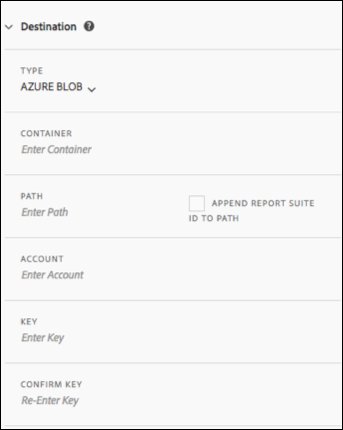

# Een gegevensfeed maken of bewerken

Door een gegevensfeed te maken, kan Adobe weten waar Raw-gegevensbestanden moeten worden verzonden en wat u in elk bestand wilt opnemen. Deze pagina bevat een overzicht van de afzonderlijke instellingen die u kunt aanpassen bij het maken van een gegevensfeed.

Voordat u deze pagina leest, wordt u geadviseerd over basiskennis van gegevensfeeds. Zie [Overzicht van gegevensfeeds](data-feed-overview.md) om ervoor te zorgen dat u aan de vereisten voldoet om een gegevensvoer tot stand te brengen.

## Diervoederinformatievelden

* **Naam**: De naam van de gegevensinvoer. Moet uniek zijn binnen de geselecteerde rapportreeks, en kan tot 255 karakters in lengte zijn.
* **Rapportsuite:** De rapportsuite waarop de gegevensinvoer is gebaseerd. Als de veelvoudige gegevensvoer voor de zelfde rapportreeks wordt gecreeerd, moeten zij verschillende kolomdefinities hebben. Alleen bronrapporten ondersteunen gegevensfeeds; virtuele rapportsuites worden niet ondersteund.
* **E-mail indien voltooid**: Het e-mailadres dat moet worden gemeld wanneer een feed de verwerking heeft voltooid. Het e-mailadres moet correct zijn opgemaakt.
* **Feed-interval**: Uurfeeds bevatten gegevens van één uur. Dagelijkse diervoeders bevatten gegevens over een hele dag; zij omvatten gegevens van middernacht tot middernacht in de tijdzone van de rapportreeks.
* **Vertraging bij verwerking**: Wacht een bepaalde hoeveelheid tijd alvorens een dossier van de gegevensvoer te verwerken. Een vertraging kan handig zijn om mobiele implementaties de mogelijkheid te geven om offlineapparaten online te komen en gegevens te verzenden. Het kan ook worden gebruikt om de server-zijprocessen van uw organisatie in het beheren van eerder verwerkte dossiers aan te passen. In de meeste gevallen is geen uitstel nodig. Een diervoeder kan maximaal 120 minuten worden uitgesteld.
* **Begin- en einddatum**: De begindatum geeft de eerste datum aan waarop u gegevens wilt invoeren. Stel deze datum in het verleden in om onmiddellijk te beginnen met het verwerken van gegevensfeeds voor historische gegevens. De feeds worden verder verwerkt tot de einddatum. De begin en einddata zijn gebaseerd op de tijdzone van de rapportreeks.
* **Doorlopende diervoeders**: Dit selectievakje verwijdert de einddatum, zodat een feed voor onbepaalde tijd kan worden uitgevoerd. Als een feed de verwerking van historische gegevens heeft voltooid, wacht een feed tot de gegevens een bepaald uur of een bepaalde dag zijn verzameld. Zodra het huidige uur of de dag eindigt, begint de verwerking na de gespecificeerde vertraging.

## Doelvelden

De velden die beschikbaar zijn onder doelvelden, zijn afhankelijk van het doeltype.

### FTP

Gegevens over gegevenstoevoer kunnen naar een door Adobe of klant gehoste FTP-locatie worden verzonden. Vereist een FTP-host, gebruikersnaam en wachtwoord. Gebruik het padveld om feed-bestanden in een map te plaatsen. Mappen moeten al bestaan; feeds genereren een fout als het opgegeven pad niet bestaat.


### SFTP

SFTP-ondersteuning voor gegevensfeeds is beschikbaar. Vereist een gastheer SFTP, gebruikersbenaming, en de bestemmingsplaats om een geldige RSA of DSA openbare sleutel te bevatten. U kunt de juiste openbare sleutel downloaden wanneer u de feed maakt.


### S3

U kunt feeds rechtstreeks naar Amazon S3-emmers verzenden. Dit bestemmingstype vereist een naam van het Emmertje, een Zeer belangrijke identiteitskaart van de Toegang, en een Geheime Sleutel. Zie [Amazon S3-vereisten voor emmernaamgeving](https://docs.aws.amazon.com/awscloudtrail/latest/userguide/cloudtrail-s3-bucket-naming-requirements.html) in de Amazon S3-documenten voor meer informatie.


De gebruiker die u opgeeft voor het uploaden van gegevensfeeds, moet het volgende hebben [machtigingen](https://docs.aws.amazon.com/AmazonS3/latest/API/API_Operations_Amazon_Simple_Storage_Service.html):

* s3:GetObject
* s3:PutObject
* s3:PutObjectAcl

   >[!NOTE]
   >
   >Voor elke upload naar een Amazon S3 emmertje, [!DNL Analytics] voegt de emmereigenaar aan BucketOwnerFullControl ACL toe, al dan niet het emmertje een beleid heeft dat het vereist. Zie voor meer informatie &quot;[Wat is de instelling BucketOwnerFullControl voor Amazon S3-gegevensfeeds?](df-faq.md#BucketOwnerFullControl)&quot;

De volgende 16 standaard AWS-gebieden worden ondersteund (waarbij zo nodig het juiste handtekeningalgoritme wordt gebruikt):

* us-East-2
* us-East-1
* us-west-1
* us-west-2
* ap-zuid-1
* ap-northeast-2
* ap-zuidoost-1
* ap-zuidoost-2
* ap-northeast-1
* ca-centraal-1
* EU-centraal-1
* EU-west-1
* EU-west-2
* eu-west-3
* eu-noord-1
* sa-Oost-1

>[!NOTE]
>
>De regio cn-North-1 wordt niet ondersteund.

### Azure Blob

Data feeds ondersteunen Azure Blob-bestemmingen. Hiervoor is een container, account en sleutel vereist. Amazon versleutelt de gegevens automatisch in rust. Wanneer u de gegevens downloadt, worden deze automatisch gedecodeerd. Zie [Een opslagaccount maken](https://docs.microsoft.com/en-us/azure/storage/common/storage-quickstart-create-account?tabs=azure-portal#view-and-copy-storage-access-keys) in de Microsoft Azure-documenten voor meer informatie.



>[!NOTE]
>
>U moet uw eigen proces uitvoeren om schijfruimte op de voederbestemming te beheren. Adobe verwijdert geen gegevens van de server.

## Definities gegevenskolom

Alle kolommen zijn beschikbaar, ongeacht of ze gegevens bevatten. Een gegevensfeed moet ten minste één kolom bevatten.

* **Te verwijderen tekens verwijderen**: Bij het verzamelen van gegevens kunnen sommige tekens (zoals nieuwe regels) problemen veroorzaken. Schakel dit selectievakje in als u deze tekens uit feed-bestanden wilt verwijderen.
* **Compressie-indeling**: Het type compressie dat wordt gebruikt. Gzip-uitvoerbestanden in `.tar.gz` gebruiken. Bestanden overslaan in `.zip` gebruiken.
* **Verpakkingstype**: Eén bestand levert de uitvoer van `hit_data.tsv` bestand in één, mogelijk enorm bestand. Met meerdere bestanden worden uw gegevens gepagineerd in 2 GB blokken (ongecomprimeerd). Als er meerdere bestanden zijn geselecteerd en de niet-gecomprimeerde gegevens voor het rapportagevenster kleiner zijn dan 2 GB, wordt er één bestand verzonden. Adobe raadt u aan voor de meeste gegevensfeeds meerdere bestanden te gebruiken.
* **Manifest**: Of Adobe een [manifestbestand](c-df-contents/datafeeds-contents.md#feed-manifest) naar de bestemming wanneer geen gegevens voor een voederinterval worden verzameld. Als u Manifest File selecteert, ontvangt u een manifestbestand dat lijkt op het volgende wanneer geen gegevens worden verzameld:

```text
   Datafeed-Manifest-Version: 1.0
    Lookup-Files: 0
    Data-Files: 0
    Total-Records: 0
```

* **Kolomsjablonen**: Adobe raadt u aan een kolomsjabloon te maken wanneer u veel gegevensfeeds maakt. Als u een kolomsjabloon selecteert, worden automatisch de opgegeven kolommen in de sjabloon opgenomen. Adobe biedt standaard ook diverse sjablonen.
* **Beschikbare kolommen**: Alle beschikbare gegevenskolommen in Adobe Analytics. Klikken [!UICONTROL Add all] om alle kolommen in een gegevenstoevoer op te nemen.
* **Opgenomen kolommen**: De kolommen die in een gegevensfeed moeten worden opgenomen. Klikken [!UICONTROL Remove all] om alle kolommen uit een gegevensvoer te verwijderen.
* **CSV downloaden**: Hiermee wordt een CSV-bestand gedownload dat alle kolommen bevat.
