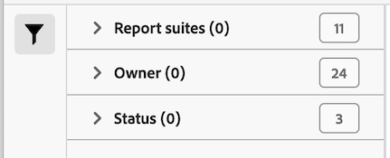

# Gegevensfeeds beheren

Met de gegevensvoedermanager kunt u gegevensfeeds voor uw organisatie maken, bewerken en verwijderen. Als u toestemmingen hebt om tot de manager van de gegevensvoer toegang te hebben, kunt u gegevensvoer voor alle rapportreeksen beheren zichtbaar aan u.

>[!BEGINSHADEBOX]

Zie  [&#x200B; het voederbeheer van Gegevens &#x200B;](https://video.tv.adobe.com/v/3428566?captions=dut&quality=12&learn=on){target="_blank"} voor een demo video.

>[!ENDSHADEBOX]

## Gegevensfeeds weergeven

1. Meld u met uw Adobe ID aan bij [experiencecloud.adobe.com](https://experiencecloud.adobe.com).
1. Selecteer het 9-vierkante pictogram in hoger-recht, dan uitgezochte [!UICONTROL **Analytics**].
1. In de hoogste navigatiebar, ga [!UICONTROL **Admin**] > [!UICONTROL **het voer van Gegevens**].

   De voer van gegevens voor alle rapportreeksen die u hebt toegang tot wordt getoond. Of als er geen feeds zijn geconfigureerd, wordt op de pagina een knop [!UICONTROL Create New Data Feed] weergegeven.

   

## Een gegevensfeed maken

Met de knop **[!UICONTROL Create data feed]** kunt u een nieuwe feed maken. Zie [&#x200B; een gegevensvoer &#x200B;](create-feed.md) voor meer informatie creëren.

## Een gegevensfeed bewerken

1. In Adobe Analytics, uitgezochte [!UICONTROL **Admin**] > [!UICONTROL **het voer van Gegevens**].

1. Zoek de gegevensfeed die u wilt bewerken. Om van een gegevensvoer de plaats te bepalen, kunt u [&#x200B; filter en de lijst van gegevensvoer &#x200B;](#filter-and-search-the-list-of-data-feeds) zoeken.

1. Selecteer de gegevensvoer in de [!UICONTROL **naam van het Gegeven**] kolom.

1. Breng de gewenste wijzigingen aan in de gegevensinvoer.

   Voor informatie over de opties van de gegevensvoer, zie [&#x200B; een gegevensvoer &#x200B;](/help/export/analytics-data-feed/create-feed.md#create-and-configure-a-data-feed) in [&#x200B; creëren en vormen een gegevensvoer &#x200B;](/help/export/analytics-data-feed/create-feed.md).

   Wanneer het bijwerken van de [!UICONTROL **sectie van de Bestemming**] voor een gegevensvoer die u uitgeeft, kunt u een verschillende rekening en een plaats kiezen voor de nieuwe gegevensvoer in de [!UICONTROL **Rekening**] en [!UICONTROL **plaats**] drop-down gebieden te gebruiken.

   De rekeningen en de plaatsen kunnen worden uitgegeven zoals die in [&#x200B; wordt beschreven vormen de invoer en de uitvoerrekeningen van de wolk &#x200B;](/help/components/locations/configure-import-accounts.md) en [&#x200B; vormen wolkeninvoer en de uitvoerplaatsen &#x200B;](/help/components/locations/configure-import-locations.md). Het bewerken van een account of locatie beïnvloedt alle items die aan dat account of die locatie zijn gekoppeld.

   Met eerdere versies van de gegevensfeeds Manager kon u FTP-, SFTP-, S3- en Azure-blokdoelen maken. Doelen die in deze eerdere versies van het gegevensfeeds-beheer zijn gemaakt, kunnen niet worden bewerkt of gekopieerd.

1. Selecteer [!UICONTROL **sparen**].

## De lijst met gegevensfeeds filteren en doorzoeken

1. In Adobe Analytics, uitgezochte [!UICONTROL **Admin**] > [!UICONTROL **het voer van Gegevens**].

1. Gebruik zoekopdrachten of filters om een specifieke feed te zoeken.

   * Typ in het zoekveld de naam van een feed. Alleen de overeenkomende feeds worden weergegeven in de lijst met beschikbare feeds.

   * Selecteer helemaal links het filterpictogram om filteropties weer te geven of te verbergen. Filters worden ingedeeld op categorie, inclusief **[!UICONTROL Report suites]** , **[!UICONTROL Owner]** , **[!UICONTROL Status]** en **[!UICONTROL Tags]** . U kunt filtercategorieën samenvouwen of uitbreiden. Schakel het selectievakje in naast het filter dat u wilt toepassen.

     

## Taak voor gegevensinvoer weergeven

1. In Adobe Analytics, uitgezochte [!UICONTROL **Admin**] > [!UICONTROL **het voer van Gegevens**].

1. Selecteer het [!UICONTROL **lusje van Banen**] om individuele banen te bekijken die elk van uw voer creeert.

   of

   Om de baangeschiedenis voor specifieke gegevensvoer te bekijken, selecteer checkbox naast een gegevensvoer, dan de uitgezochte [!UICONTROL **geschiedenis van de Baan**].

   Voor meer informatie, zie [&#x200B; leiden de banen van de gegevensvoer &#x200B;](df-manage-jobs.md).

## Een gegevensfeed kopiëren

1. In Adobe Analytics, uitgezochte [!UICONTROL **Admin**] > [!UICONTROL **het voer van Gegevens**].

1. Selecteer checkbox naast de gegevensvoer die u wilt kopiëren, dan selecteren [!UICONTROL **Exemplaar**].

   Dit neemt u om [&#x200B; een nieuwe voer &#x200B;](create-feed.md) met alle montages van de huidige voer tot stand te brengen. Deze optie is niet zichtbaar als er meer dan één gegevensfeed is geselecteerd.

   Wanneer het bijwerken van de [!UICONTROL **sectie van de Bestemming**] voor een gegevensvoer die u kopieert, kunt u een verschillende rekening en een plaats kiezen voor de nieuwe gegevensvoer in de [!UICONTROL **Rekening**] en [!UICONTROL **drop-down gebieden van de Plaats**] te gebruiken.

   De rekeningen en de plaatsen kunnen worden uitgegeven zoals die in [&#x200B; wordt beschreven vormen de invoer en de uitvoerrekeningen van de wolk &#x200B;](/help/components/locations/configure-import-accounts.md) en [&#x200B; vormen wolkeninvoer en de uitvoerplaatsen &#x200B;](/help/components/locations/configure-import-locations.md). Het bewerken van een account of locatie beïnvloedt alle items die aan dat account of die locatie zijn gekoppeld.

   Met eerdere versies van de gegevensfeeds Manager kon u FTP-, SFTP-, S3- en Azure-blokdoelen maken. Doelen die in deze eerdere versies van het gegevensfeeds-beheer zijn gemaakt, kunnen niet worden bewerkt of gekopieerd.

## Een gegevensfeed pauzeren

Wanneer u een gegevensfeed pauzeert, wordt de verwerking van de feed gestopt en wordt de status ingesteld op [!UICONTROL Inactive] .

Wanneer u de feed opnieuw activeert nadat u deze hebt gepauzeerd, worden de gegevens tijdens het pauzeren verwerkt voor terugvulfeeds, maar niet voor live feeds. Voor meer informatie, zie [&#x200B; een gegevensvoer &#x200B;](#activate-a-data-feed) activeren.

Een gegevensfeed pauzeren:

1. In Adobe Analytics, uitgezochte [!UICONTROL **Admin**] > [!UICONTROL **het voer van Gegevens**].

1. Selecteer checkbox naast de gegevensvoer die u wilt pauzeren, dan selecteren [!UICONTROL **Pauzeren**].

## Een gegevensfeed activeren

U kunt inactieve feeds activeren.

Wanneer een diervoeder opnieuw wordt geactiveerd, worden de gegevens mogelijk niet automatisch verwerkt voor de tijd dat de feed inactief was. Of de gegevens worden verwerkt, hangt af van het feit of het een terugvullingfeed of een live feed is:

* **terugvult voer** (voer dat slechts historische gegevens verwerkt) hervat verwerkingsgegevens van waar zij tegengehouden, teruggevend om het even welke data indien nodig.

* **Levende voer** hervat verwerkingsgegevens van de tijd zij worden geactiveerd. Dit betekent dat de gegevens niet worden verwerkt tijdens het pauzeren van het diervoeder tot het moment dat het werd geactiveerd. Als u de gegevens tijdens deze periode nodig hebt, moet u een backfill instellen.

Een gegevensfeed activeren:

1. In Adobe Analytics, uitgezochte [!UICONTROL **Admin**] > [!UICONTROL **het voer van Gegevens**].

1. Selecteer checkbox naast de inactieve gegevensvoer die u wilt activeren, dan selecteren [!UICONTROL **activeert**].

## Een gegevensfeed verwijderen

Wanneer u een gegevensfeed verwijdert, wordt de status ingesteld op [!UICONTROL Deleted] . Gegevensfeeds moeten de status Actief hebben voordat ze kunnen worden verwijderd.

Een gegevensfeed verwijderen:

1. In Adobe Analytics, uitgezochte [!UICONTROL **Admin**] > [!UICONTROL **het voer van Gegevens**].

1. Selecteer checkbox naast de gegevensvoer die u wilt schrappen, dan selecteren [!UICONTROL **Schrapping**].

## Kolommen configureren in de gegevensvoedermanager

Elk gecreeerd voer toont verscheidene kolommen die informatie over het verstrekken. Selecteer een kolomkop om deze in oplopende volgorde te sorteren. Selecteer nogmaals een kolomkop om deze in aflopende volgorde te sorteren. Als een bepaalde kolom niet zichtbaar is, klikt u op het kolompictogram rechtsboven.

De volgende kolommen zijn beschikbaar:

* **naam van het voer**: Vereiste kolom. Geeft de naam van de feed weer.
* **identiteitskaart van het Gevoer**: Vertoningen identiteitskaart van het Gevoer, een uniek herkenningsteken.
* **Reeks van het Rapport**: De rapportsuite de gegevens van voederverwijzingen van.
* **Reeks identiteitskaart van het Rapport**: Het unieke herkenningsteken van de rapportreeks.
* **Kolommen van Gegevens**: Welke gegevenskolommen actief zijn voor het voer. In de meeste gevallen zijn er te veel kolommen om in deze indeling weer te geven.
* **Interval**: Indicator of het voer uur of dag is.
* **Type van Bestemming**: Het bestemmingstype voor het voer. Amazon S3, GCP of Azure.
* **Gastheer van de Bestemming**: De plaats het dossier wordt geplaatst.
* **Eigenaar**: De gebruikersrekening die tot het voer leidde.
* **Status**: De status van het voer.
   * Actief: Het voer is operationeel.
   * Goedkeuring in behandeling: in sommige gevallen moet een diervoeder worden goedgekeurd door Adobe voordat het nieuwe arbeidsplaatsen kan scheppen.
   * Verwijderd: de feed wordt verwijderd.
   * Voltooid: De verwerking van de feed is voltooid. Een volledig ingevuld diervoeder kan worden bewerkt, in de wachtstand worden gezet of worden geannuleerd.
   * In behandeling: de feed is gemaakt, maar nog niet actief. Feeds blijven in deze toestand voor een korte overgangsperiode.
   * Inactief: gelijk aan de status &#39;gepauzeerd&#39; of &#39;in wachtstand&#39;. Voor informatie over wat met backfill voer en levende voer gebeurt wanneer een inactief voer wordt opnieuw geactiveerd, zie [&#x200B; een gegevensvoer &#x200B;](#activate-a-data-feed) activeren.
* **Laatste Gewijzigd**: De datum het voer werd het laatst gewijzigd. Datum en tijd worden getoond in de de tijdzone van de rapportreeks met GMT compensatie.
* **Datum van het Begin**: De datum van de eerste baan voor dit voer. Datum en tijd worden getoond in de de tijdzone van de rapportreeks met GMT compensatie.
* **Datum van het Eind**: De datum van de laatste baan voor dit voer. Doorlopende gegevensfeeds hebben geen einddatum.

