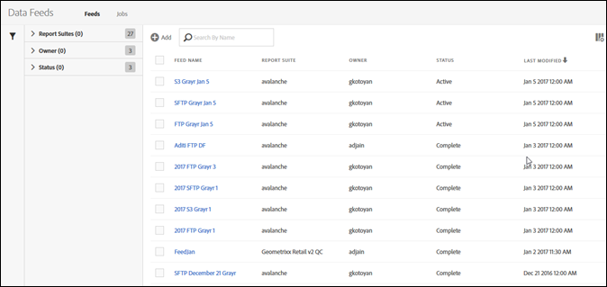

# Gegevensfeeds beheren

Met de gegevensvoedermanager kunt u gegevensfeeds voor uw organisatie maken, bewerken en verwijderen. Als u toestemmingen hebt om tot de manager van de gegevensvoer toegang te hebben, kunt u gegevensvoer voor alle rapportreeksen beheren zichtbaar aan u.

Hier volgt een video over de interface van Data Feeds Management:

>[!VIDEO](https://video.tv.adobe.com/v/25452/?quality=12)

Voer de volgende stappen uit om toegang te krijgen tot gegevensbeheer:

1. Meld u met uw Adobe ID aan bij [experiencecloud.adobe.com](https://experiencecloud.adobe.com).
1. Selecteer het pictogram van 9 vierkante pixels rechtsboven en selecteer vervolgens [!UICONTROL **Analyse**].
1. Ga in de bovenste navigatiebalk naar [!UICONTROL **Beheerder**] > [!UICONTROL **Gegevensfeeds**].

## Navigeren door de interface

Wanneer het aankomen aan de pagina van de gegevensvoedermanager, kijkt de interface gelijkaardig aan het volgende:

Als er geen feeds zijn ingesteld, wordt op de pagina een [!UICONTROL Create New Data Feed] knop.

### Filters en zoeken

Gebruik zoekopdrachten of filters om een specifieke feed te zoeken.

* Typ in het zoekveld de naam van een feed. Alleen de overeenkomende feeds worden weergegeven in de lijst met beschikbare feeds.

* Klik helemaal links op het filterpictogram om filteropties weer te geven of te verbergen. Filters zijn ingedeeld in categorieën. U kunt filtercategorieën samenvouwen of uitbreiden. Schakel het selectievakje naast een filter dat u wilt toepassen in.

  

### Feeds en taken

Selecteer de [!UICONTROL **Taken**] om afzonderlijke taken weer te geven die door elk van uw feeds worden gemaakt. Zie [Taken voor gegevensinvoer beheren](df-manage-jobs.md).

### Toevoegen

De [!UICONTROL Add] kunt u een nieuwe feed maken. Zie [Een gegevensfeed maken](create-feed.md) voor meer informatie .

### Kolommen

Elk gecreeerd voer toont verscheidene kolommen die informatie over het verstrekken. Selecteer een kolomkop om deze in oplopende volgorde te sorteren. Selecteer nogmaals een kolomkop om deze in aflopende volgorde te sorteren. Als een bepaalde kolom niet zichtbaar is, klikt u op het kolompictogram rechtsboven.

* **Naam van feed**: Vereiste kolom. Geeft de naam van de feed weer.
* **Feed-id**: Hiermee geeft u de feed-id weer, een unieke id.
* **Rapportsuite**: De rapportsuite bevat de referentiegegevens van de feed.
* **ID van rapportsuite**: De unieke id van de rapportsuite.
* **Gegevenskolommen**: Welke gegevenskolommen actief zijn voor de feed. In de meeste gevallen zijn er te veel kolommen om in deze indeling weer te geven.
* **Interval**: Vermeld of het diervoeder per uur of per dag is.
* **Doeltype**: Het doeltype voor de feed. Amazon S3, GCP of Azure.
* **Host bestemming**: De locatie waar het bestand is geplaatst.
* **Eigenaar**: De gebruikersaccount waarmee de feed is gemaakt.
* **Status**: De status van het diervoeder.
   * Actief: Het voer is operationeel.
   * Goedkeuring in behandeling: in sommige gevallen moet een diervoeder worden goedgekeurd door de Adobe voordat het kan beginnen met het genereren van banen.
   * Verwijderd: de feed wordt verwijderd.
   * Voltooid: De verwerking van de feed is voltooid. Een volledig ingevuld diervoeder kan worden bewerkt, in de wachtstand worden gezet of worden geannuleerd.
   * In behandeling: de feed is gemaakt, maar nog niet actief. Feeds blijven in deze toestand voor een korte overgangsperiode.
   * Inactief: gelijk aan de status &#39;gepauzeerd&#39; of &#39;in wachtstand&#39;. Als een backfill-feed (een feed die alleen historische gegevens verwerkt) opnieuw wordt geactiveerd, worden opnieuw taken uitgevoerd wanneer deze worden gestopt. Als een live feed opnieuw wordt geactiveerd, zal het weer banen opleveren vanaf het moment dat het wordt gestopt.
* **Laatst gewijzigd**: De datum waarop het diervoeder voor het laatst is gewijzigd. Datum en tijd worden getoond in de de tijdzone van de rapportreeks met GMT compensatie.
* **Begindatum**: De datum van de eerste taak voor deze feed. Datum en tijd worden getoond in de de tijdzone van de rapportreeks met GMT compensatie.
* **Einddatum**: De datum van de laatste taak voor deze feed. Doorlopende gegevensfeeds hebben geen einddatum.

## Handelingen voor gegevensinvoer

Klik op het selectievakje naast een gegevensfeed om beschikbare acties weer te geven.

* **Taakgeschiedenis**: Alle taken weergeven die aan deze gegevensfeeds zijn gekoppeld. Hiermee gaat u automatisch naar de [interface voor beheer van taken](df-manage-jobs.md).
* **Verwijderen**: Hiermee verwijdert u de gegevensfeed en stelt u de status in op [!UICONTROL Deleted].
* **Kopiëren**: Hiermee gaat u naar [een nieuwe feed maken](create-feed.md) met alle instellingen van de huidige feed. U kunt een gegevensfeed niet kopiëren als er meerdere zijn geselecteerd.
* **Pauzeren**: Hiermee wordt de verwerking van de feed gestopt en wordt de status ingesteld op [!UICONTROL Inactive].
* **Activeren**: Alleen beschikbaar voor inactieve feeds. Als u een back-up maakt van feeds (feeds die alleen historische gegevens verwerken), worden de verwerkingsgegevens hervat vanaf het punt waarop ze zijn gestopt. Zo nodig worden de datums opnieuw ingevuld. Met Live feeds worden de verwerkingsgegevens van de huidige tijd hervat.
