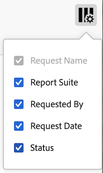

# Verzoeken in Data Warehouse beheren

{{release-limited-testing}}

>[!NOTE]
>
>Als uw organisatie nog niet de nieuwe ervaring van de Data Warehouse heeft, die spoedig voor alle klanten beschikbaar zal zijn, gebruik de informatie in [Aanvragen voor Data Warehouse beheren (oude ervaring)](#manage-data-warehouse-requests-old-experience) onder aan deze pagina.

U kunt de verzoeken van de Data Warehouse bekijken en beheren die u hebt gemaakt. Alleen beheerders kunnen aanvragen van andere gebruikers in hun organisatie weergeven en beheren.

De volgende secties beschrijven activiteiten u kunt uitvoeren wanneer het beheren van verzoeken.

## Verzoeken weergeven

1. Selecteer in Adobe Analytics [!UICONTROL **Gereedschappen**] > [!UICONTROL **Data Warehouse**].

   Op de pagina Data Warehouse worden alle verzoeken weergegeven die u hebt gedaan. <!-- just those you have made? -->Gegevens worden in elke kolom weergegeven. U kunt [configureren welke kolommen](#configure-columns) zijn zichtbaar.

   <!-- add screenshot of main page -->

<!-- describe columns? -->

1. (Optioneel) Klik op de naam van het verzoek om een dialoogvenster weer te geven met de volgende informatie: <!-- Check this -->

   * Wanneer een verzoek is begonnen met de verwerking

   * Beperkt tarief: Uw organisatie heeft teveel Data Warehouse verzoeken lopend. Het verzoek wordt gepauzeerd tot andere gegevensverzoeken volledig zijn.

## Verzoeken bewerken

Houd rekening met het volgende wanneer u verzoeken bewerkt:

* Slechts kunnen de verzoeken die worden gevormd om op een programma in werking te stellen worden uitgegeven.

* Niet alle velden die aan de aanvraag zijn gekoppeld, kunnen worden bewerkt. Velden die niet kunnen worden bewerkt, worden grijs weergegeven.

* Beheerders die de aanvraag van een andere gebruiker bewerken, moeten een nieuw account en een nieuwe locatie kiezen waartoe ze toegang hebben.

Een geplande aanvraag bewerken:

1. Selecteer in Adobe Analytics [!UICONTROL **Gereedschappen**] > [!UICONTROL **Data Warehouse**].

1. Selecteer op de pagina Data Warehouse de aanvraag die u wilt bewerken.

   

1. Selecteren [!UICONTROL **Bewerken**].

1. Bewerk de aanvraag naar wens. De opties voor grijze configuratie kunnen niet worden bewerkt.

   Voor informatie over elke configuratieoptie, zie [Een Data Warehouse-aanvraag maken](/help/export/data-warehouse/create-request/t-dw-create-request.md).

1. Selecteren [!UICONTROL **Wijzigingen opslaan**].

## De geschiedenis van een verzoek weergeven

U kunt de geschiedenis van om het even welke verzoeken van de Data Warehouse bekijken u hebt gemaakt.

1. Selecteer in Adobe Analytics [!UICONTROL **Gereedschappen**] > [!UICONTROL **Data Warehouse**].

1. Selecteer op de pagina Data Warehouse de aanvraag waarvan u de geschiedenis wilt weergeven.

   

1. Selecteren [!UICONTROL **Historie weergeven**].

   De [!UICONTROL **Aanvraag Data Warehouse weergeven**] De pagina toont een lijst van individuele rapportleveringen die met het verzoek worden geassocieerd.

   Selecteer de **Kolom configureren** pictogram  om kolommen te verbergen of kolommen te tonen die niet door gebrek worden getoond.

   

   De volgende kolommen zijn beschikbaar:

   | Kolom | Beschrijving |
   |---------|----------|
   | [!UICONTROL **Gemaakt op**] | De datum en tijd waarop het rapport is gemaakt.
Dit wordt getoond in de tijdzone van de gebruiker die het verzoek in werking stelde.
 |
   | [!UICONTROL **Begindatum**] | De datum en het tijdstip waarop het rapport is gestart.
Dit wordt getoond in de tijdzone van de gebruiker die het verzoek in werking stelde.
 |
   | [!UICONTROL **Datum voltooid**] | De datum en het tijdstip waarop het rapport is voltooid.
Dit wordt getoond in de tijdzone van de gebruiker die het verzoek in werking stelde.
 |
   | [!UICONTROL **Datum bijgewerkt**] | De datum en tijd waarop het rapport voor het laatst is bijgewerkt.
Dit wordt getoond in de tijdzone van de gebruiker die het verzoek in werking stelde.
 |
   | [!UICONTROL **Status**] | De status van de rapportlevering. Mogelijke statussen zijn:<ul><li>[!UICONTROL **Gemaakt**]: Het verslag is opgesteld, maar is nog niet verwerkt.</li><li>[!UICONTROL **In behandeling**]: Het verslag wacht op behandeling.</li><li>[!UICONTROL **Verwerking**]: Het verslag wordt momenteel behandeld.</li><li>[!UICONTROL **Voltooid**]: Het verslag is voltooid en is nu beschikbaar.</li><li>[!UICONTROL **Gepland**]: Het rapport is gepland, maar is nog niet begonnen.</li><li>[!UICONTROL **Geannuleerd**]: Het rapport is geannuleerd door de gebruiker.</li><li>[!UICONTROL **Fout - verwerking**:] Het rapport heeft een fout aangetroffen en kan niet worden verwerkt.</li><li>[!UICONTROL **Fout - Verzenden mislukt**]: Het rapport is gegenereerd, maar kon niet worden afgeleverd. Controleer de [configuratie van uw bestemming](/help/export/data-warehouse/create-request/dw-request-report-destinations.md)en vervolgens het verslag opnieuw indienen.</li></ul>. |
   | [!UICONTROL **Van**] | De begindatum van het algemene tijdkader inbegrepen in het rapport.
Dit wordt getoond in de tijdzone van de rapportreeks.
 |
   | [!UICONTROL **Naar**] | De einddatum van het algemene tijdkader inbegrepen in het rapport. 
Dit wordt getoond in de tijdzone van de rapportreeks.
 |
   | [!UICONTROL **Verouderde aanvraag-id**] | Identiteitskaart die wordt gebruikt om een rapport in de interface van de erfenisData Warehouse te identificeren. Deze id kan nodig zijn wanneer u contact opneemt met de klantenservice van de Adobe. |
   | [!UICONTROL **Rapport-id**] | Identiteitskaart die wordt gebruikt om een rapport in de huidige interface van de Data Warehouse te identificeren. Deze id kan nodig zijn wanneer u contact opneemt met de klantenservice van de Adobe. |

1. Selecteer een rapportlevering en selecteer vervolgens een van de volgende opties:

   | Optie | -functie |
   |---------|----------|
   | [!UICONTROL **Doelgegevens**] | Hiermee geeft u de account- en locatiegegevens weer die aan de aanvraag zijn gekoppeld. Dit is de rekening en de plaats die vroeger werden gevormd, zoals die in wordt beschreven [Vorm een rapportbestemming voor een verzoek van de Data Warehouse](/help/export/data-warehouse/create-request/dw-request-report-destinations.md). |
   | [!UICONTROL **Rapport annuleren**] | Hiermee annuleert u het rapport. U kunt rapporten met de status [!UICONTROL **Voltooid**] of [!UICONTROL **Geannuleerd**]. |
   | [!UICONTROL **Verslag-Rerun**] | Voert het rapport opnieuw met de gegevens in werking zoals het was toen het oorspronkelijk werd verzonden. U kunt een rapport met een van de volgende statussen opnieuw uitvoeren: [!UICONTROL **Geannuleerd**], [!UICONTROL **Voltooid**], [!UICONTROL **Fout - verwerking**], of [!UICONTROL **Fout - Verzenden mislukt**]. |
   | [!UICONTROL **Rapport opnieuw verzenden**] | Hiermee stuurt u het eerder gegenereerde rapportbestand opnieuw. U kunt een rapport opnieuw verzenden met een van de volgende statussen: [!UICONTROL **Voltooid**] of [!UICONTROL **Fout - Verzenden mislukt**]. |

## Aanvragen kopiëren

Wanneer u een verzoek kopieert, worden alle configuratieopties gekopieerd van het originele verzoek.

1. Selecteer in Adobe Analytics [!UICONTROL **Gereedschappen**] > [!UICONTROL **Data Warehouse**].

1. Selecteer op de pagina Data Warehouse de aanvraag die u wilt kopiëren.

   

1. Selecteren [!UICONTROL **Kopiëren**].

   De pagina van het de verzoekverzoek van de Data Warehouse van het Exemplaar toont. Alle configuratieopties worden gekopieerd uit het oorspronkelijke verzoek.

1. Werk om het even welke configuratieopties verbonden aan het verzoek bij.

   Voor informatie over elke configuratieoptie, zie [Een Data Warehouse-aanvraag maken](/help/export/data-warehouse/create-request/t-dw-create-request.md).

1. Selecteren [!UICONTROL **Wijzigingen opslaan**].

## Aanvragen annuleren

Slechts kunnen de verzoeken die worden gevormd om op een programma in werking te stellen worden geannuleerd.

Een geplande aanvraag annuleren:

1. Selecteer in Adobe Analytics [!UICONTROL **Gereedschappen**] > [!UICONTROL **Data Warehouse**].

1. Selecteer op de pagina Data Warehouse de aanvraag die u wilt bewerken.

   

1. Selecteren [!UICONTROL **Annuleren**].

   De aanvraag wordt niet meer uitgevoerd op het geplande tijdstip.

## Kolommen configureren

U kunt vormen welke informatie voor elk verzoek wordt getoond door kolommen toe te voegen of te verwijderen.

1. Selecteer de **Kolommen configureren** in de rechterbovenhoek van de pagina Data Warehouse.

   

   De volgende kolommen zijn beschikbaar:

   | Beschikbare kolom | Beschrijving |
   |---------|----------|
   | Naam aanvraag | De naam van de persoon die de aanvraag heeft gemaakt. |
   | Rapportsuite | De rapportsuite die aan de aanvraag is gekoppeld. |
   | Gevraagd door | De gebruiker die de aanvraag heeft gemaakt. |
   | Aanvraagdatum | De datum waarop het verzoek is ingediend. |
   | Status | De volgende statussen zijn beschikbaar:<ul><li>
**Voltooid**: De aanvraag is uitgevoerd.
</li><li>
**Geannuleerd**: De aanvraag is geannuleerd door de gebruiker.
</li><li>
**Gepland**: Het verzoek wordt gevormd om op een programma te lopen.
</li><!-- Are there other statuses? Failed? --> |

   {style="table-layout:auto"}

1. Zorg ervoor dat alle kolommen die u wilt weergeven, zijn geselecteerd. Geselecteerde kolommen worden weergegeven op de pagina Data Warehouse en geven de relevante informatie weer.

## Filteren en sorteren

1. Selecteer de **Filter** in de linkerspoorstaaf van de pagina Data Warehouse.

   

1. Breid uit [!UICONTROL **Rapportageopties**], [!UICONTROL **Eigenaar**], of [!UICONTROL **Status**] en selecteert u vervolgens hoe u de aanvragen wilt filteren.

## Zoeken naar aanvragen

1. Geef in het zoekveld boven aan de pagina Data Warehouse de aanvraagnaam op die u wilt weergeven.

   Verzoeken worden tijdens het typen gefilterd.

## Aanvragen voor Data Warehouse beheren (oude ervaring)

>[!NOTE]
>
>De volgende informatie is alleen van toepassing als uw organisatie nog niet beschikt over de nieuwe Data Warehouse-ervaring, die binnenkort beschikbaar zal zijn voor alle klanten van Analytics.

Met Aanvraagbeheer kunt u aanvragen weergeven, dupliceren en opnieuw de prioriteit geven.

Selecteer in Data Warehouse de optie **[!UICONTROL Request Manager]** tab.

Door te werken op dit tabblad kunt u

* Bekijk recente rapportverzoeken door rapportnaam, toegepast segment, aanvrager, aanvraagdatum en status.
* Dubbele aanvragen. Klikken **[!UICONTROL Duplicate]** naast de aanvraag.

  >[!NOTE]
  >
  >Deze actie dupliceert slechts het verzoek, niet het programma of de leveringsdetails.

* Zoek naar rapporten door rapportnaam of door de login naam van de aanvrager.
* Geef opnieuw prioriteit aan rapporten door hen aan een nieuwe plaats binnen de rij te slepen en te laten vallen.
* Als u wilt zien wanneer een aanvraag wordt verwerkt, klikt u op een geplande aanvraag-id en controleert u de pop-up die wordt geopend.

Klik op een taak om afzonderlijke aanvragen voor die taak weer te geven.

* Beperkt tarief: Uw organisatie heeft teveel Data Warehouse verzoeken lopend. Het verzoek wordt gepauzeerd tot andere gegevensverzoeken volledig zijn.