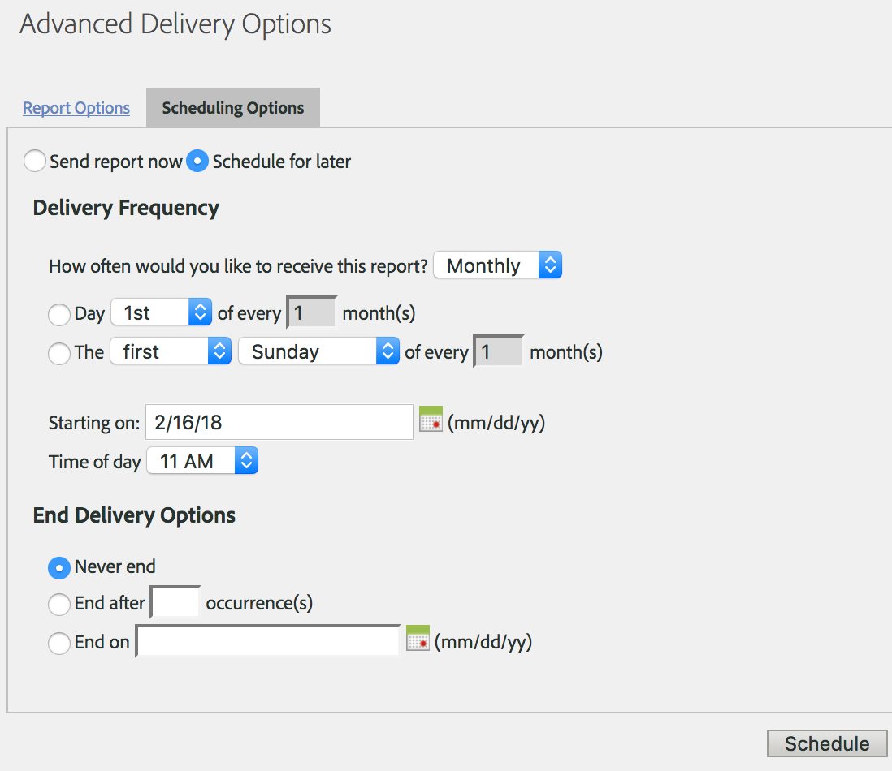

# Een terugkerend verzoek plannen

## Een terugkerend verzoek plannen {#topic_8C3CE0CE8A584F80946D24B377CB51BE}

Om de verzoeken van het Pakhuis van Gegevens voor Dagelijks/Maandelijks/Jaarlijks te plannen, zorg *Vooraf ingesteld *correct wordt geselecteerd

1. Selecteer onder [!UICONTROL Reporting Date] de optie **[!UICONTROL Preset]**.

1. Klik onder [!UICONTROL Schedule Delivery]op **[!UICONTROL Advanced Delivery Options]**.

1. Ga naar het tabblad Planningsopties en selecteer **[!UICONTROL Schedule for later]**.
1. Selecteer de gewenste instellingen voor [!UICONTROL Delivery Frequency] en [!UICONTROL End Delivery Options].

   

1. Klik op **[!UICONTROL Schedule]**.

