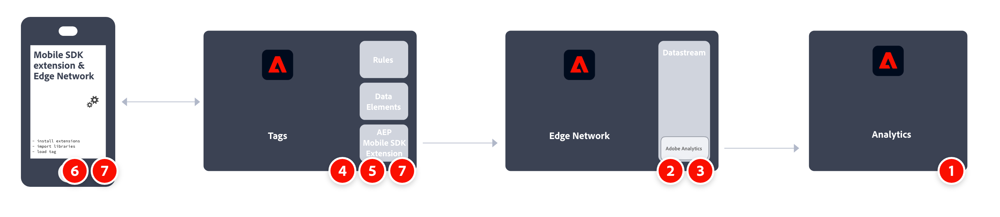

# Adobe Analytics implementeren met de Adobe Experience Platform Mobile SDK

De Adobe Experience Platform Mobile SDK helpt de oplossingen en services van de Adobe voor Experiencen Cloud in uw mobiele apps te ondersteunen. Deze functie is beschikbaar voor Android™, iOS en verschillende ontwikkelframeworks voor verschillende platforms. De configuratie wordt behandeld door de Inzameling van Gegevens van Adobe Experience Platform.

>[!IMPORTANT]
>
>Een Adobe Analytics-extensie is ook beschikbaar in Adobe Experience Platform Data Collection. Als u deze extensie installeert, profiteert u niet van XDM of Edge Network.

## ADOBE EXPERIENCE PLATFORM SDK

Een overzicht op hoog niveau van de uitvoeringstaken:

<table style="width:100%">

<tr>
<th style="width:5%"></th><th style="width:60%"><b>Taak</b></th><th style="width:35%"><b>Meer informatie</b></th>
</tr>

<tr>
<td>1</td>
<td>Zorg ervoor dat u <b>een rapportsuite gedefinieerd</b>.</td>
<td><a href="../../../admin/admin/c-manage-report-suites/report-suites-admin.md">Report Suite Manager</a></td>
</tr>

<tr>
<td>2</td>
<td><b>Installatieschema's.</b>. Om gegevensinzameling voor gebruik over toepassingen te standaardiseren die hefboomwerking Adobe Experience Platform, heeft de Adobe de open en openbaar gedocumenteerde norm, het Model van de Gegevens van de Ervaring (XDM) gecreeerd.</td>
<td><a href="https://experienceleague.adobe.com/docs/experience-platform/xdm/ui/overview.html?lang=en">Overzicht van de interface Schemas</a></td>
</tr>

<tr>
<td>3</td>
<td><b>Een gegevensstroom configureren</b>. Een gegevensstroom vertegenwoordigt de server-zijconfiguratie wanneer het uitvoeren van het Web SDK van Adobe Experience Platform.</td>
<td><a href="https://experienceleague.adobe.com/docs/experience-platform/edge/datastreams/configure.html?lang=en">Een gegevensstroom configureren<a></td> 
</tr>

<td>4</td>
<td><b>Een Adobe Analytics-service toevoegen</b> naar uw gegevensstroom. Deze service bepaalt of en hoe gegevens naar Adobe Analytics worden verzonden.</td>
<td><a href="https://experienceleague.adobe.com/docs/experience-platform/edge/datastreams/configure.html?lang=en#analytics">Adobe Analytics-service toevoegen aan een gegevensstroom</a></td>
</tr>

<tr>
<td>5</td>
<td><b>Een mobiele eigenschap maken</b>. Een eigenschap is een container die u vult met extensies, regels, gegevenselementen en bibliotheken.</td>
<td><a href="https://developer.adobe.com/client-sdks/documentation/getting-started/create-a-mobile-property/">Een mobiele eigenschap instellen</a></tr>

<tr>
<td>6</td>
<td><b>De extensie Adobe Experience Platform Edge Network installeren</b> in de eigenschap mobile tag en configureer de datastream in de extensie.</td>
<td><a href="https://developer.adobe.com/client-sdks/documentation/edge-network/">Adobe Experience Platform Edge Network</a>
</tr>

<tr>
<td>7</td>
<td><b>Code in uw app gebruiken</b> om de benodigde extensies te registreren en de tagconfiguratie te laden.</td>
<td><a href="https://developer.adobe.com/client-sdks/documentation/user-guides/getting-started-with-platform/overview/#set-up-the-configuration">De configuratie instellen</a></td>
</tr>

<tr>
<td>8</td>
<td><b>Functies implementeren en testen</b> met een combinatie van de gegevenselementen, regels, extra extensies en API-aanroepen van de tag in uw app. Inspect, validate, en foutopsporing gegevensverzameling en ervaringen voor uw mobiele toepassing.</td>
<td><a href="https://developer.adobe.com/client-sdks/documentation/user-guides/getting-started-with-platform/overview/#use-the-sample-application">De voorbeeldtoepassing gebruiken</a>
</tr>

<tr>
<td>9</td>
<td><b>De implementatie van uw mobiele app uitbreiden en valideren</b> voordat het naar de productie wordt verplaatst.</td>
<td></td> 
</tr>

</table>

## Adobe Analytics-extensie

Een overzicht op hoog niveau van de uitvoeringstaken:

<table style="width:100%">

<tr>
<th style="width:5%"></th><th style="width:60%"><b>Taak</b></th><th style="width:35%"><b>Meer informatie</b></th>
</tr>

<tr>
<td>1</td>
<td>Zorg ervoor dat u <b>een rapportsuite gedefinieerd</b>.</td>
<td><a href="../../../admin/admin/c-manage-report-suites/report-suites-admin.md">Report Suite Manager</a></td>
</tr>

<tr>
<td>2</td>
<td><b>Installatieschema's</b>. Om gegevensinzameling voor gebruik over toepassingen te standaardiseren die hefboomwerking Adobe Experience Platform, heeft de Adobe de open en openbaar gedocumenteerde norm, het Model van de Gegevens van de Ervaring (XDM) gecreeerd.</td>
<td><a href="https://experienceleague.adobe.com/docs/experience-platform/xdm/ui/overview.html?lang=en">Overzicht van de interface Schemas</a></td>
</tr>

<tr>
<td>3</td>
<td><b>De Adobe Analytics-extensie installeren</b> in de eigenschap mobile tag en configureer de extensie zodanig dat deze naar uw rapportsuite verwijst.</td>
<td><a href="https://developer.adobe.com/client-sdks/documentation/adobe-analytics/">Adobe Analytics-extensie voor mobiele eigenschap</a>
</tr>

<tr>
<td>4</td>
<td><b>Code in uw app gebruiken</b> om de benodigde extensies te registreren en de tagconfiguratie te laden.</td>
<td><a href="https://developer.adobe.com/client-sdks/documentation/user-guides/getting-started-with-platform/overview/#set-up-the-configuration">De configuratie instellen</a></td>
</tr>

<tr>
<td>5</td>
<td><b>Functies implementeren en testen</b> met een combinatie van de gegevenselementen, regels, extra extensies en API-aanroepen van de tag in uw app. Inspect, validate, en foutopsporing gegevensverzameling en ervaringen voor uw mobiele toepassing.</td>
<td><a href="https://developer.adobe.com/client-sdks/documentation/user-guides/getting-started-with-platform/overview/#use-the-sample-application">De voorbeeldtoepassing gebruiken</a>
</tr>

<tr>
<td>6</td>
<td><b>De implementatie van uw mobiele app uitbreiden en valideren</b> voordat het naar de productie wordt verplaatst.</td>
<td></td> 
</tr>

</table>

## Aanvullende bronnen

- [Documentatie over tags](https://experienceleague.adobe.com/docs/experience-platform/tags/home.html#)

- [Mobiele SDK-documentatie](https://developer.adobe.com/client-sdks/documentation/)
