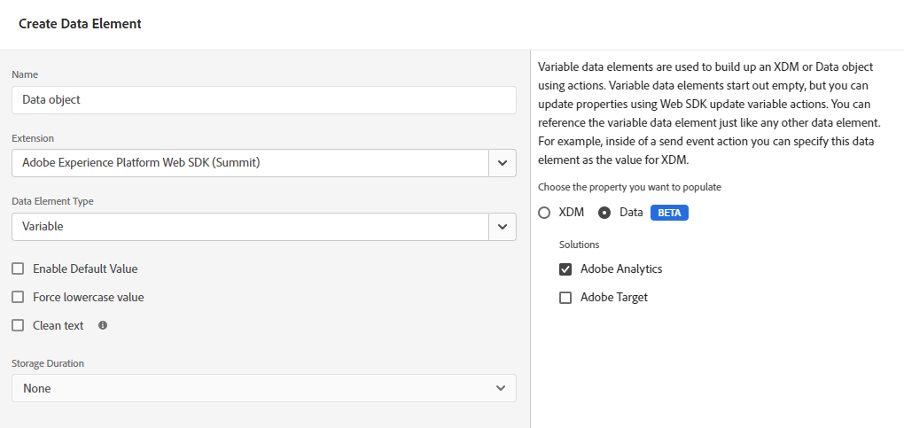

# Migreren van de Adobe Analytics-tagextensie naar de Web SDK-tagextensie

Dit implementatiepad omvat een methodische migratiebenadering om van de Adobe Analytics-tagextensie naar de Web SDK-tagextensie te gaan. Andere implementatiepaden worden op afzonderlijke pagina&#39;s behandeld:

* [AppMeasurement naar Web SDK JavaScript-bibliotheek](appmeasurement-to-web-sdk.md): Een vloeiende en methodische aanpak voor het migreren naar de SDK van het Web, behalve dat er geen tags worden gebruikt. In plaats daarvan verwijdert u handmatig de Adobe Analytics-bibliotheek voor gegevensverzameling (`AppMeasurement.js`) en deze vervangen door de Web SDK JavaScript-bibliotheek (`alloy.js`).
* [Web SDK-tagextensie](web-sdk-tag-extension.md): Een nieuwe Web SDK-installatie waarin u de implementatie beheert met tags in Adobe Experience Platform Data Collection. Hiervoor is de Adobe Analytics ExperienceEvent-veldgroep vereist, die typische analytische variabelen bevat die in uw XDM-schema moeten worden opgenomen.
* [Web SDK JavaScript-bibliotheek](web-sdk-javascript-library.md): Een nieuwe Web SDK-installatie met de Web SDK JavaScript-bibliotheek (`alloy.js`). Beheer de implementatie zelf in plaats van de gebruikersinterface voor tags te gebruiken. Hiervoor is de Adobe Analytics ExperienceEvent-veldgroep vereist, die typische analytische variabelen bevat die in uw XDM-schema moeten worden opgenomen.

## Voordelen en nadelen van dit implementatiepad

Het gebruik van deze migratiebenadering heeft zowel voor- als nadelen. Let zorgvuldig op elke optie om te bepalen welke benadering het beste is voor uw organisatie.

| Voordelen | Nadelen |
| --- | --- |
| <ul><li>**Geen code gewijzigd op uw site**: Aangezien voor uw implementatie al tags zijn geïnstalleerd, kunnen alle migratie-updates worden uitgevoerd in de taginterface.</li><li>**Gebruikt uw bestaande implementatie**: Voor deze aanpak is geen netto nieuwe implementatie nodig. Terwijl het nieuwe regelacties vereist, kunt u uw bestaande gegevenselementen en regelvoorwaarden met minimale veranderingen opnieuw gebruiken.</li><li>**Geen schema vereist**: Voor dit stadium van het migreren aan het Web SDK, hebt u geen schema XDM nodig. In plaats daarvan kunt u de `data` -object, dat gegevens rechtstreeks naar Adobe Analytics verzendt. Zodra de migratie naar SDK van het Web volledig is, dan kunt u een schema voor uw organisatie tot stand brengen en gegevensstroomafbeelding gebruiken om toepasselijke gebieden te bevolken XDM. Als een schema in dit stadium van het migratieproces werd vereist, zou uw organisatie worden gedwongen om een Adobe Analytics XDM schema te gebruiken. Het gebruik van dit schema maakt het voor uw organisatie moeilijker om uw eigen schema in de toekomst te gebruiken.</li></ul> | <ul><li>**Technische schuld implementeren**: Aangezien deze benadering een gewijzigde vorm van uw bestaande implementatie gebruikt, kan het moeilijker zijn om implementatielogica te volgen en veranderingen uit te voeren wanneer nodig. De code van de douane kan bijzonder moeilijk zijn om te zuiveren.</li><li>**Vereist toewijzing om gegevens naar Platform te verzenden**: Wanneer uw organisatie klaar is om Customer Journey Analytics te gebruiken, moet u gegevens naar een gegevensset in Adobe Experience Platform verzenden. Deze handeling vereist dat elk veld in het dialoogvenster `data` -object is een item in het hulpprogramma voor gegevenstoewijzing dat het toewijst aan een XDM-schemaveld. Voor deze workflow hoeft u slechts één keer toewijzingen uit te voeren, en dit betekent niet dat u implementatiewijzigingen aanbrengt. Het is echter een extra stap die niet vereist is bij het verzenden van gegevens in een XDM-object.</li></ul> |

De Adobe beveelt aan dit implementatiepad in de volgende scenario&#39;s te volgen:

* U hebt een bestaande implementatie met de Adobe Analytics-tagextensie. Als u een implementatie met AppMeasurement hebt, volgt u [Migreren van AppMeasurement naar de Web SDK](appmeasurement-to-web-sdk.md) in plaats daarvan.
* U bent van plan om Customer Journey Analytics in de toekomst te gebruiken, maar wilt uw implementatie Analytics niet met een implementatie van SDK van het Web van kras vervangen. Het vervangen van uw implementatie van kras op het Web SDK vereist de meeste inspanning, maar ook biedt de meest levensvatbare implementatiearchitectuur op lange termijn aan. Als uw organisatie bereid is door de inspanning van een schone implementatie van SDK van het Web te gaan, zie [Gegevens invoeren via de Adobe Experience Platform Web SDK](https://experienceleague.adobe.com/nl/docs/analytics-platform/using/cja-data-ingestion/ingest-use-guides/edge-network/aepwebsdk) in de gebruikershandleiding van de Customer Journey Analytics.

## Stappen vereist om naar SDK van het Web te migreren

De volgende stappen bevatten concrete doelstellingen die moeten worden nagestreefd. Klik op elke stap voor gedetailleerde instructies over hoe u deze kunt uitvoeren.

+++**1. Een gegevensstroom maken en configureren**

Maak een gegevensstroom in de gegevensverzameling van Adobe Experience Platform. Wanneer u gegevens naar deze gegevensstroom verzendt, stuurt het gegevens door naar Adobe Analytics. In de toekomst stuurt dezelfde gegevensstroom gegevens door naar de Customer Journey Analytics.

1. Navigeren naar [experience.adobe.com](https://experience.adobe.com) en meld u aan met uw referenties.
1. Gebruik de homepage of productkiezer in de rechterbovenhoek om naar **[!UICONTROL Data Collection]**.
1. Selecteer in de linkernavigatie de optie **[!UICONTROL Datastreams]**.
1. Selecteren **[!UICONTROL New Datastream]**.
1. Voer de gewenste naam in en selecteer **[!UICONTROL Save]**.
1. Wanneer de gegevensstroom is gemaakt, selecteert u **[!UICONTROL Add Service]**.
1. Selecteer in het vervolgkeuzemenu Service de optie **[!UICONTROL Adobe Analytics]**.
1. Voer dezelfde rapportsuite-id in als de site waarnaar u momenteel analysegegevens verzendt. Klik op **[!UICONTROL Save]**.

 {style="border:1px solid lightslategray"}

Uw gegevensstroom is nu klaar om gegevens te ontvangen en door te geven aan Adobe Analytics.

+++

+++**2. Voeg de uitbreiding van SDK van het Web aan uw markeringsbezit toe**

Deze sectie bereidt uw markering voor het grootste deel van de migratieinspanning die in de volgende stap plaatsvindt.

1. Klik op het hamburgerpictogram linksboven in de Adobe Experience Platform-interface en selecteer vervolgens **[!UICONTROL Tags]**.
1. Selecteer de gewenste eigenschap tag.
1. Selecteer in de linkernavigatie van de eigenschap tag de optie **[!UICONTROL Extensions]**.
1. Selecteren **[!UICONTROL Catalog]** boven aan het scherm ziet u een lijst met alle beschikbare extensies.
1. Zoeken naar en selecteren de **[!UICONTROL Adobe Experience Platform Web SDK]** extensie, en klik vervolgens op **[!UICONTROL Install]** rechts.

    {style="border:1px solid lightslategray"}

1. De instellingen voor de extensieconfiguratie worden weergegeven. Zoek de sectie Gegevensstromen en selecteer de gegevensstroom die u in de vorige stap hebt gemaakt.

    {style="border:1px solid lightslategray"}

1. Selecteren **[!UICONTROL Save]**.

Uw markeringsbezit heeft nu het Web SDK geïnstalleerd.

+++

+++**3. Een gegevenselement voor een gegevensobject maken**

Het gegevenselement van gegevensobjecten verstrekt een intuïtief kader om een nuttige lading te vormen die SDK van het Web gebruikt om naar een gegevensstroom te verzenden. De meeste regels die u in de volgende stap bijwerkt, beïnvloeden dit gegevenselement.

1. Selecteer in de linkernavigatie van de taginterface de optie **[!UICONTROL Data Elements]**.
1. Selecteren **[!UICONTROL Add Data Element]**
1. Geef het gegevenselement de volgende instellingen:
   * [!UICONTROL Name]: Alles wat u wilt, zoals &quot;Gegevenslaag&quot; of &quot;Gegevensobject&quot;
   * [!UICONTROL Extension]: [!UICONTROL Adobe Experience Platform Web SDK]
   * [!UICONTROL Data Element Type]: [!UICONTROL Variable]
   * Selectievakjes kunnen ongewijzigd blijven
1. Selecteer rechts de volgende instellingen:
   * Keuzerondje eigenschap: [!UICONTROL Data]
   * Oplossing: [!UICONTROL Adobe Analytics]
1. Selecteren **[!UICONTROL Save]**.

 {style="border:1px solid lightslategray"}

Uw markeringsbezit heeft nu alles nodig om elke regel bij te werken.

+++

+++**4. De regels van de update om de uitbreiding van SDK van het Web in plaats van de uitbreiding van Analytics te gebruiken**

Deze stap bevat het grootste deel van de inspanning die wordt vereist om aan het Web SDK te migreren, en vereist kennis van hoe uw implementatiewerk. Hieronder ziet u een voorbeeld van het bewerken van een standaardlabelregel. Werk alle markeringsregels in uw implementatie bij om alle verwijzingen naar de uitbreiding van Adobe Analytics met de uitbreiding van SDK van het Web te vervangen.

1. Selecteer in de linkernavigatie van de taginterface de optie **[!UICONTROL Rules]**.
1. Selecteer een regel die u wilt bewerken.
1. Selecteer de handeling **[!UICONTROL Adobe Analytics - Set Variables]**
1. Noteer alle variabelen van Analytics die binnen deze regel worden ingesteld. Neem zowel variabelen op die zijn ingesteld in de vervolgkeuzemenu&#39;s als variabelen die zijn ingesteld in de aangepaste code.
1. Wijzig de [!UICONTROL Action Configuration] naar de volgende instellingen:
   * [!UICONTROL Extension]: [!UICONTROL Adobe Experience Platform Web SDK]
   * [!UICONTROL Action type]: variabele bijwerken
1. Zorg ervoor dat het gegevensobject is geselecteerd in de vervolgkeuzelijst aan de rechterkant.
1. Stel de variabelen voor Analytics in op dezelfde waarden als deze zijn geconfigureerd in de extensie Analytics.
   * Variabelen die zijn ingesteld binnen de taginterface, kunnen rechtstreeks naar dezelfde waarden worden vertaald.
   * Tekenreeksvariabelen die zijn ingesteld in aangepaste code vereisen minimale aanpassingen. In plaats van de `s` object, gebruiken `data.__adobe.analytics` in plaats daarvan. Bijvoorbeeld: `s.eVar1` zou vertalen naar `data.__adobe.analytics.eVar1`.
   * De de configuratievariabelen van Analytics en methodevraag in douanecode kunnen gewijzigde implementatielogica vereisen. Zie elk [variabel](/help/implement/vars/overview.md) om te bepalen hoe te om zijn equivalent te bereiken gebruikend het Web SDK.
1. Zodra alle regellogica gebruikend de uitbreiding van SDK van het Web wordt herhaald, uitgezocht **[!UICONTROL Keep Changes]**.
1. Herhaal deze stappen voor elke actieconfiguratie die de extensie Adobe Analytics gebruikt om waarden in te stellen. Deze stap bevat zowel variabelen die zijn ingesteld met de taginterface als variabelen die zijn ingesteld met aangepaste code. Aangepaste codeblokken kunnen niet verwijzen naar `s` object op een willekeurige locatie.

De bovenstaande stappen zijn alleen van toepassing op regels die waarden instellen. De volgende stappen vervangen alle acties die [!UICONTROL Action Configuration] [!UICONTROL Send Beacon].

1. Selecteer een regel die een baken verzendt.
1. Selecteer de handeling **[!UICONTROL Adobe Analytics - Send Beacon]**.
1. Noteer de huidige waarde van het dialoogvenster [!UICONTROL Tracking] keuzerondje rechts ([`s.t()`](../../vars/functions/t-method.md) of [`s.tl()`](../../vars/functions/tl-method.md)).
1. Wijzig de [!UICONTROL Action Configuration] naar de volgende instellingen:
   * [!UICONTROL Extension]: [!UICONTROL Adobe Experience Platform Web SDK]
   * [!UICONTROL Action type]: [!UICONTROL Send event]
1. Wijzig rechts de handelingsinstellingen in het volgende:
   * [!UICONTROL Type]: For `s.t()`, gebruik **[!UICONTROL Web Webpagedetails Page Views]**. Voor `s.tl()`, gebruik **[!UICONTROL Web Webinteraction Link Clicks]**. Als u [`s.tl()`](../../vars/functions/tl-method.md), moet u ook de volgende velden in het gegevensobject opnemen. Deze velden worden weergegeven onder [!UICONTROL Additional properties] bij het uitvoeren van de [!UICONTROL Update variable] actieconfiguratie:
      * [Koppelingsnaam](../../vars/functions/tl-method.md)
      * [Type koppeling](../../vars/functions/tl-method.md)
      * [URL van koppeling](../../vars/config-vars/linkurl.md)
1. Selecteren **[!UICONTROL Keep Changes]**.
1. Herhaal deze stappen voor elke actieconfiguratie die Adobe Analytics gebruikt om een baken te verzenden.

+++

+++**5. Bijgewerkte regels publiceren**

Het publiceren van bijgewerkte regels volgt de zelfde werkschema zoals om het even welke andere verandering in uw markeringsconfiguratie.

1. Selecteer in de linkernavigatie van de taginterface de optie **[!UICONTROL Publishing Flow]**.
1. Selecteren **[!UICONTROL Add Library]**.
1. Geef deze tag een naam, zoals &quot;Upgrade to Web SDK&quot;.
1. Selecteren **[!UICONTROL Add All Changed Resources]**.
1. Selecteren **[!UICONTROL Save]**.
1. In de publicatieworkflow wordt een oranje stip weergegeven die aangeeft dat deze aan het bouwen is. Als de punt groen wordt, zijn de wijzigingen beschikbaar in uw ontwikkelomgeving.
1. Test uw veranderingen in uw ontwikkelomgeving om ervoor te zorgen dat alle regels behoorlijk vuren, en dat het gegevensvoorwerp met verwachte waarden bevolkt is.
1. Als u klaar bent, dient u de bibliotheek ter goedkeuring in, bouwt u de bibliotheek naar de testfase, keurt u de bibliotheek goed en publiceert u de bibliotheek naar de productie.

 {style="border:1px solid lightslategray"}

+++

+++**6. De extensie Analytics uitschakelen**

Zodra uw markeringsimplementatie volledig op het Web SDK is, kunt u de uitbreiding van Adobe Analytics onbruikbaar maken.

1. Selecteer in de linkernavigatie van de taginterface de optie **[!UICONTROL Extensions]**.
1. Zoek en selecteer de [!UICONTROL Adobe Analytics] extensie. Selecteer rechts **[!UICONTROL Disable]**.
1. Volg dezelfde publicatieworkflow hierboven om het verwijderen van de [!UICONTROL Adobe Analytics] extensie.
1. Als de extensie eenmaal is uitgeschakeld in de productie, kunt u deze volledig verwijderen. Selecteer de extensie, selecteer het menu met drie punten rechts en selecteer vervolgens **[!UICONTROL Uninstall]**.
1. Volg dezelfde publicatieworkflow hierboven om deze wijzigingen in de productie te publiceren.

+++

Op dit punt, is uw implementatie van Analytics volledig op het Web SDK en is voldoende bereid om aan Customer Journey Analytics in de toekomst te bewegen.
