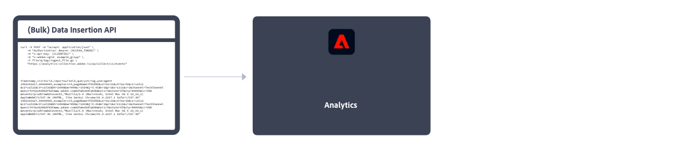

# Adobe Analytics implementeren

Voor Adobe Analytics is code binnen uw website, mobiele app of andere applicatie vereist om data naar servers voor dataverzameling te verzenden. Er zijn verschillende methoden om deze code te implementeren, afhankelijk van het platform en de behoeften van uw organisatie.

## Implementatiemethoden voor websites

Voor uw **website** zijn de volgende uitvoeringsmethoden beschikbaar:

### Client-kant

* **Web SDK-extensie**: De gestandaardiseerde en aanbevolen methode voor het implementeren van Adobe Analytics voor nieuwe klanten. Voeg de **Adobe Experience Platform Web SDK-extensie** in Adobe Experience Platform Data Collection **Tags** plaatst u vervolgens een ladertag op elke pagina. De tag verzendt gegevens naar de Adobe Experience Platform **Edge Network**, die deze gegevens doorgeeft aan Adobe Analytics.
  
Zie [Hoe te om Adobe Analytics uit te voeren gebruikend de uitbreiding van SDK van het Web van Adobe Experience Platform.](./aep-edge/overview.md) voor meer informatie .

* **Web SDK**: U kunt de bibliotheken van SDK van het Web op uw plaats manueel laden als u geen de Inzameling van Gegevens van Adobe Experience Platform wilt gebruiken. Verwijs naar de bibliotheek van SDK van het Web (`alloy.js`) op elke pagina en de gewenste trackingaanroepen naar de Adobe Experience Platform verzenden **Edge Network** in een voor uw organisatie geschikte indeling. De Edge Network stuurt die gegevens door naar Adobe Analytics.
  
Zie [Adobe Analytics implementeren met de Adobe Experience Platform Web SDK](./aep-edge/overview.md) voor meer informatie .

* **Extensie Analytics**: Voeg de **Adobe Analytics-extensie** in Adobe Experience Platform Data Collection **Tags**&#x200B;plaatst u vervolgens een ladertag op elke pagina. De tag verzendt de gegevens rechtstreeks naar Adobe Analytics. Gebruik deze implementatiemethode als u het gemak van tags wilt gebruiken, maar de Edge Network-infrastructuur niet wilt gebruiken.
  
Zie [Adobe Analytics implementeren met de extensie Analytics](launch/overview.md) voor meer informatie .

* **Verouderde JavaScript:** De oude handmatige methode voor de implementatie van Adobe Analytics. Verwijs naar de bibliotheek van het AppMeasurement (`AppMeasurement.js`) op elke pagina, stelt vervolgens variabelen en instellingen in JavaScript in.
  
Deze implementatiemethode kan handig zijn voor implementaties met behulp van aangepaste code en is ideaal voor implementatietypen die niet elders worden aangeboden, zoals voor [AMP-pagina&#39;s](other/amp.md).

De volgende beslissingsstroom kan u helpen een client-side implementatiemethode selecteren:

>[!TIP]
>
>Neem contact op met het accountteam van de Adobe voor advies en aanbevolen procedures voor de keuze van de implementatie op basis van uw huidige situatie.

### Server-kant

Voor het implementeren van de Adobe Analytics-server hebt u de volgende opties:

* **Edge Server-API**: U implementeert code op de server die de Adobe Experience Platform Edge Server-API gebruikt om te communiceren met Adobe Analytics via een gegevensstroom.
  
Zie [Adobe Analytics implementeren met de Adobe Experience Platform Edge Network Server-API](/help/implement/aep-edge/server-api/overview.md) voor meer informatie .

* **(Bulk) API voor gegevensinvoer**: Met de API&#39;s voor gegevensinvoeging in Adobe Analytics (Bulk) kunt u gegevensservers rechtstreeks in Adobe Analytics verzamelen.
  
Zie [API voor gegevensinvoer](../import/c-data-insertion-api/c-data-insertion-api.md) voor meer informatie .

## Implementatiemethoden voor mobiele apps

Voor uw **mobiele app** zijn de volgende uitvoeringsmethoden beschikbaar:

* **Mobile SDK-extensie**: De gestandaardiseerde en aanbevolen methode voor het implementeren van Adobe Analytics in uw mobiele app. Gebruik speciale bibliotheken om gegevens gemakkelijk vanuit uw mobiele app naar de Adobe te verzenden. Voeg de **Adobe Experience Platform Mobile SDK-extensie** in Adobe Experience Platform Data Collection **Tags**, implementeert u vervolgens de bibliotheek van de mobiele SDK in uw app. Met de SDK kunt u bibliotheken importeren, extensies registreren en de tagconfiguratie laden. Gegevens verzenden naar de Adobe Experience Platform **Edge Network**&#x200B;Edge stuurt die gegevens vervolgens door naar Adobe Analytics.
  

  Zie [Adobe Analytics implementeren met de Adobe Experience Platform Mobile SDK](../implement/aep-edge/mobile-sdk/overview.md) voor meer informatie .

* **Extensie Analytics**: Voeg de **Adobe Analytics-extensie** in Adobe Experience Platform Data Collection **Tags**&#x200B;en implementeer de bibliotheek van de Mobile SDK in uw app. Met de SDK kunt u bibliotheken importeren, extensies registreren en de tagconfiguratie laden. Deze implementatiemethode verzendt gegevens rechtstreeks naar Adobe Analytics. Het wordt geadviseerd als u het gemak van de Gegevensinzameling van Adobe Experience Platform wilt, maar niet de het netwerkinfrastructuur van Edge van de Experience Platform van de Adobe wilt gebruiken.
  

  Zie [Adobe Analytics implementeren met de extensie Analytics](../implement/aep-edge/mobile-sdk/overview.md) voor meer informatie .

>[!CAUTION]
>
>Zie voor ondersteuning voor oudere versies van de mobiele SDK&#39;s van Adobe de [Aankondigingen aan het einde van de ondersteuning van SDK](https://developer.adobe.com/client-sdks/resources/sdks-end-of-support/).

## Belangrijke artikelen voor de implementatie van Analytics

* [Een bestaande Adobe Analytics-implementatie op zich nemen](/help/implement/prepare/existing-implementation.md)
* [Adobe Debugger](validate/debugger.md)
* [Een tag-eigenschap maken in het Experience Platform](launch/create-analytics-property.md)
* [AppMeasurement-updates](appmeasurement-updates.md)
* [Zelfstudie Adobe Analytics instellen met Platform Web SDK](https://experienceleague.adobe.com/docs/platform-learn/implement-web-sdk/applications-setup/setup-analytics.html)
* [Zelfstudie Adobe Experience Cloud implementeren in mobiele apps](https://experienceleague.adobe.com/docs/platform-learn/implement-mobile-sdk/overview.html)

## Belangrijke bronnen voor Analytics

* [Contact opnemen met de klantenservice](https://experienceleague.adobe.com/?support-solution=Analytics&amp;lang=nl#support)
* [Adobe Analytics Community on Experience League](https://experienceleaguecommunities.adobe.com/t5/adobe-analytics/ct-p/adobe-analytics-community)
* [Bronnen voor Adobe Analytics](https://experienceleaguecommunities.adobe.com/t5/adobe-analytics-discussions/adobe-analytics-resources/m-p/276666)
* [Opmerkingen bij de laatste release](../release-notes/latest.md)
