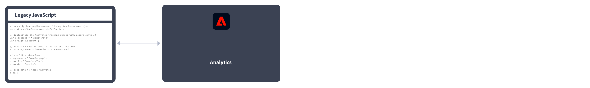

# Adobe Analytics implementeren

Voor Adobe is code op uw site of applicatie vereist om data naar de servers voor dataverzameling van Adobe te verzenden. De volgende stappen geven aan hoe een normale implementatie werkt.

1. Wanneer een bezoeker naar uw site komt, wordt een aanvraag ingediend bij uw webserver.
2. De webserver van uw site verzendt de paginacodegegevens en de pagina wordt weergegeven in de browser.
3. De pagina wordt geladen en de Analytics JavaScript-code wordt uitgevoerd.
De JavaScript-code verzendt een verzoek om een afbeelding naar Adobe-gegevensverzamelingsservers. De paginadata die u in uw implementatie hebt gedefinieerd, worden verzonden als onderdeel van een querytekenreeks in deze afbeeldingsaanvraag.

4. Adobe retourneert een transparante pixelafbeelding.
5. Adobe-servers slaan verzamelde gegevens op in een of meer *rapportsuites*.
6. De data van de rapportsuite worden ingevuld in rapporten die u in een webbrowser kunt openen.

Het uitvoeren van de JavaScript-code gebeurt snel en heeft geen merkbare invloed op de laadtijden van de pagina. Op deze manier kunt u de pagina&#39;s tellen die worden weergegeven wanneer een bezoeker op **[!UICONTROL Reload]** of **[!UICONTROL Back]** klikt om naar een pagina te gaan, omdat de JavaScript-code ook wordt uitgevoerd wanneer de pagina uit de cache wordt opgehaald.

Voor Adobe Analytics is code binnen uw website, mobiele app of andere applicatie vereist om data naar servers voor dataverzameling te verzenden. Er zijn verschillende methoden om deze code te implementeren, afhankelijk van het platform en de behoeften van uw organisatie.

## Implementatiemethoden voor websites

Voor uw **website** zijn de volgende uitvoeringsmethoden beschikbaar:

* **Web SDK-extensie**: De gestandaardiseerde en aanbevolen methode voor het implementeren van Adobe Analytics voor nieuwe klanten. Installeer de **AEP Web SDK-extensie** in Adobe Experience Platform Data Collection **Tags**, gebruikt u een loader-tag op elke pagina en verzendt gegevens naar Adobe Experience Platform **Edge Network** in een voor uw organisatie geschikte indeling. Het Edge Network stuurt inkomende gegevens door naar Adobe Analytics in de juiste indeling.
   
Zie [Adobe Analytics implementeren met de Adobe Experience Platform Web SDK-extensie](./aep-edge/overview.md) voor meer informatie .

* **Web SDK**: U kunt de bibliotheken van SDK van het Web op uw plaats manueel laden als u geen de Inzameling van Gegevens van Adobe Experience Platform wilt gebruiken. Verwijs naar de bibliotheek van SDK van het Web (`alloy.js`) op elke pagina en de gewenste trackingaanroepen naar de Adobe Experience Platform **Edge Network** in een voor uw organisatie geschikte indeling. Het Edge Network stuurt inkomende gegevens door naar Adobe Analytics in de juiste indeling.
   
Zie [Adobe Analytics implementeren met de Adobe Experience Platform Web SDK](./aep-edge/overview.md) voor meer informatie .

* **Extensie Analytics**: Installeer de **Adobe Analytics-extensie** in Adobe Experience Platform Data Collection **Tags**. Plaats een ladertag op elke pagina en gebruik de Adobe Analytics-extensie om te bepalen hoe elke variabele wordt gedefinieerd. Gebruik deze implementatiemethode als u wel het gemak van tags wilt gebruiken, maar de Edge Network-infrastructuur niet wilt gebruiken.
   
Zie [Adobe Analytics implementeren met de extensie Analytics](launch/overview.md) voor meer informatie .

* **Verouderde JavaScript:** De oude handmatige methode voor de implementatie van Adobe Analytics. Verwijs naar de bibliotheek AppMeasurement (`AppMeasurement.js`) op elke pagina en geeft vervolgens een overzicht van variabelen en instellingen die in een implementatie worden gebruikt.
   
Deze implementatiemethode kan nuttig zijn voor implementaties die aangepaste code gebruiken en wordt nog steeds aanbevolen wanneer u (wilt) het volgende gebruikt:

   * [activiteitskaartgegevens](../analyze/activity-map/activity-map.md),

      >[!INFO]
      >
      >Met de nieuwste SDK van Web wordt Activity Map ondersteund. Zie [Activity Map inschakelen](/help/analyze/activity-map/activitymap-getting-started/activitymap-getting-started-admins/activitymap-enable.md) voor meer informatie .

   * [streaming media-meting](https://experienceleague.adobe.com/docs/media-analytics/using/media-overview.html?lang=en),

   * [livestream-API of livestreamtriggers](https://github.com/AdobeDocs/analytics-1.4-apis/blob/master/docs/live-stream-api/getting_started.md),

   * [Pagina&#39;s bijhouden AMP](./other/amp.md)
   Zie [Adobe Analytics implementeren met AppMeasurement voor JavaScript](js/overview.md) voor meer informatie .

De volgende beslissingsstroom kan u helpen een implementatiemethode te selecteren:

>[!TIP]
>
>Neem contact op met Adobe voor advies en aanbevolen procedures voor de keuze van de implementatie op basis van uw huidige situatie.

## Implementatiemethoden voor mobiele apps

Voor uw **mobiele app** zijn de volgende uitvoeringsmethoden beschikbaar:

* **Mobile SDK-extensie**: De gestandaardiseerde en aanbevolen methode voor het implementeren van Adobe Analytics in uw mobiele app. Gebruik speciale bibliotheken om gegevens vanuit uw mobiele app gemakkelijk naar Adobe te verzenden. Installeer de **Adobe Experience Platform Mobile SDK-extensie** in Adobe Experience Platform Data Collection **Tags** en implementeer de juiste code in uw app om bibliotheken te importeren, extensies te registreren en de tagconfiguratie te laden. Hiermee worden gegevens naar Adobe Experience Platform verzonden **Edge Network** in een voor uw organisatie geschikte indeling. Experience Edge stuurt binnenkomende gegevens door naar Adobe Analytics in de juiste indeling.
   

   Zie [Adobe Analytics implementeren met de Adobe Experience Platform Mobile SDK](../implement/aep-edge/mobile-sdk/overview.md) voor meer informatie .

* **Extensie Analytics**: Installeer de **Adobe Analytics-extensie** in Adobe Experience Platform Data Collection **Tags**en implementeer de juiste code in uw toepassing om bibliotheken te importeren, extensies te registreren en de tagconfiguratie te laden. Gebruik de extensie Analytics om te bepalen hoe elke variabele wordt gedefinieerd. Gebruik deze implementatiemethode als u wel het gemak van de Gegevensverzameling van Adobe Experience Platform wilt gebruiken, maar niet de netwerkinfrastructuur van de Rand van het Adobe wilt gebruiken.
   

   Zie [Adobe Analytics implementeren met de extensie Analytics](../implement/aep-edge/mobile-sdk/overview.md) voor meer informatie .

>[!CAUTION]
>
>Ondersteuning voor versie 4 Mobile SDK&#39;s is beëindigd op 31 augustus 2021. Zie [Veelgestelde vragen over beëindiging van de ondersteuning van Mobiele SDK’s versie 4](https://developer.adobe.com/client-sdks/documentation/v4-end-of-life-faq/) voor meer informatie.

## Belangrijke artikelen voor de implementatie van Analytics

* [Een bestaande Adobe Analytics-implementatie op zich nemen](/help/implement/prepare/existing-implementation.md)
* [Adobe-foutopsporing](validate/debugger.md)
* [Een tag-eigenschap maken in Experience Platform](launch/create-analytics-property.md)
* [AppMeasurement-updates](appmeasurement-updates.md)

## Meer Analytics-gebruikershandleidingen

[Analytics-gebruikershandleidingen](https://experienceleague.adobe.com/docs/analytics.html)

## Belangrijke bronnen voor Analytics

* [Contact opnemen met de klantenservice](https://experienceleague.adobe.com/?support-solution=Analytics&amp;lang=nl#support)
* [Analytics-forum](https://experienceleaguecommunities.adobe.com/t5/adobe-analytics/ct-p/adobe-analytics-community)
* [Bronnen voor Adobe Analytics](https://experienceleaguecommunities.adobe.com/t5/adobe-analytics-discussions/adobe-analytics-resources/m-p/276666)
