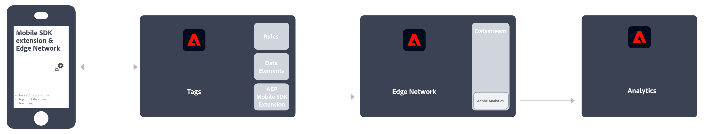

# Adobe Analytics implementeren

Voor Adobe is code op uw site of applicatie vereist om data naar de servers voor dataverzameling van Adobe te verzenden. De volgende stappen geven aan hoe een normale implementatie werkt.

1. Wanneer een bezoeker naar uw site komt, wordt een aanvraag ingediend bij uw webserver.
2. De webserver van uw site verzendt de paginacodegegevens en de pagina wordt weergegeven in de browser.
3. De pagina wordt geladen en de Analytics JavaScript-code wordt uitgevoerd.
De code JavaScript verzendt een beeldverzoek naar de servers van de Adobe van de gegevensinzameling. De paginadata die u in uw implementatie hebt gedefinieerd, worden verzonden als onderdeel van een querytekenreeks in deze afbeeldingsaanvraag.

4. Adobe retourneert een transparante pixelafbeelding.
5. Adobe servers slaan verzamelde gegevens op in een of meer *rapportsuites*.
6. De data van de rapportsuite worden ingevuld in rapporten die u in een webbrowser kunt openen.

Het uitvoeren van de JavaScript-code gebeurt snel en heeft geen merkbare invloed op de laadtijden van de pagina. Op deze manier kunt u de pagina&#39;s tellen die worden weergegeven wanneer een bezoeker op **[!UICONTROL Reload]** of **[!UICONTROL Back]** klikt om naar een pagina te gaan, omdat de JavaScript-code ook wordt uitgevoerd wanneer de pagina uit de cache wordt opgehaald.

Voor Adobe Analytics is code binnen uw website, mobiele app of andere applicatie vereist om data naar servers voor dataverzameling te verzenden. Er zijn verschillende methoden om deze code te implementeren, afhankelijk van het platform en de behoeften van uw organisatie.

## Implementatiemethoden voor websites

Voor uw **website** zijn de volgende uitvoeringsmethoden beschikbaar:

* **Web SDK-extensie**: De gestandaardiseerde en aanbevolen methode voor het implementeren van Adobe Analytics voor nieuwe klanten. Voeg de **Adobe Experience Platform Web SDK-extensie** in Adobe Experience Platform Data Collection **Tags** plaatst u vervolgens een ladertag op elke pagina. De tag verzendt gegevens naar de Adobe Experience Platform **Edge Network**, die deze gegevens doorgeeft aan Adobe Analytics.
  
Zie [Hoe te om Adobe Analytics uit te voeren gebruikend de uitbreiding van SDK van het Web van Adobe Experience Platform.](./aep-edge/overview.md) voor meer informatie .

* **Web SDK**: U kunt de bibliotheken van SDK van het Web op uw plaats manueel laden als u geen de Inzameling van Gegevens van Adobe Experience Platform wilt gebruiken. Verwijs naar de bibliotheek van SDK van het Web (`alloy.js`) op elke pagina en de gewenste trackingaanroepen naar de Adobe Experience Platform verzenden **Edge Network** in een voor uw organisatie geschikte indeling. Het Edge Network stuurt die gegevens door naar Adobe Analytics.
  
Zie [Adobe Analytics implementeren met de Adobe Experience Platform Web SDK](./aep-edge/overview.md) voor meer informatie .

* **Extensie Analytics**: Voeg de **Adobe Analytics-extensie** in Adobe Experience Platform Data Collection **Tags**plaatst u vervolgens een ladertag op elke pagina. De tag verzendt de gegevens rechtstreeks naar Adobe Analytics. Gebruik deze implementatiemethode als u het gemak van tags wilt gebruiken, maar de Edge Network-infrastructuur niet wilt gebruiken.
  
Zie [Adobe Analytics implementeren met de extensie Analytics](launch/overview.md) voor meer informatie .

* **Verouderde JavaScript:** De oude handmatige methode voor de implementatie van Adobe Analytics. Verwijs naar de bibliotheek van het AppMeasurement (`AppMeasurement.js`) op elke pagina, stelt vervolgens variabelen en instellingen in JavaScript in.
  
Deze implementatiemethode kan handig zijn voor implementaties met behulp van aangepaste code en is ideaal voor implementatietypen die niet elders worden aangeboden, zoals voor [AMP-pagina&#39;s](other/amp.md).

De volgende beslissingsstroom kan u helpen een implementatiemethode te selecteren:

>[!TIP]
>
>Neem contact op met het accountteam van de Adobe voor advies en aanbevolen procedures voor de keuze van de implementatie op basis van uw huidige situatie.

## Implementatiemethoden voor mobiele apps

Voor uw **mobiele app** zijn de volgende uitvoeringsmethoden beschikbaar:

* **Mobile SDK-extensie**: De gestandaardiseerde en aanbevolen methode voor het implementeren van Adobe Analytics in uw mobiele app. Gebruik speciale bibliotheken om gegevens gemakkelijk vanuit uw mobiele app naar de Adobe te verzenden. Voeg de **Adobe Experience Platform Mobile SDK-extensie** in Adobe Experience Platform Data Collection **Tags**, implementeert u vervolgens de bibliotheek van de mobiele SDK in uw app. Met de SDK kunt u bibliotheken importeren, extensies registreren en de tagconfiguratie laden. Gegevens verzenden naar de Adobe Experience Platform **Edge Network**; Edge stuurt die gegevens vervolgens door naar Adobe Analytics.
  

  Zie [Adobe Analytics implementeren met de Adobe Experience Platform Mobile SDK](../implement/aep-edge/mobile-sdk/overview.md) voor meer informatie .

* **Extensie Analytics**: Voeg de **Adobe Analytics-extensie** in Adobe Experience Platform Data Collection **Tags**en implementeer de bibliotheek van de Mobile SDK in uw app. Met de SDK kunt u bibliotheken importeren, extensies registreren en de tagconfiguratie laden. Deze implementatiemethode verzendt gegevens rechtstreeks naar Adobe Analytics. Het wordt aanbevolen dat u het gemak van de gegevensverzameling van Adobe Experience Platform wilt gebruiken, maar dat u de Edge-netwerkinfrastructuur van de Experience Platform van de Adobe niet wilt gebruiken.
  

  Zie [Adobe Analytics implementeren met de extensie Analytics](../implement/aep-edge/mobile-sdk/overview.md) voor meer informatie .

>[!CAUTION]
>
>Ondersteuning voor versie 4 Mobile SDK&#39;s is beëindigd op 31 augustus 2021. Zie [Veelgestelde vragen over beëindiging van de ondersteuning van Mobiele SDK’s versie 4](https://developer.adobe.com/client-sdks/resources/upgrade-platform-sdks/v4-faq/) voor meer informatie.

## Belangrijke artikelen voor de implementatie van Analytics

* [Een bestaande Adobe Analytics-implementatie op zich nemen](/help/implement/prepare/existing-implementation.md)
* [Adobe-foutopsporing](validate/debugger.md)
* [Een tag-eigenschap maken in het Experience Platform](launch/create-analytics-property.md)
* [AppMeasurement-updates](appmeasurement-updates.md)

## Meer Analytics-gebruikershandleidingen

[Analytics-gebruikershandleidingen](https://experienceleague.adobe.com/docs/analytics.html)

## Belangrijke bronnen voor Analytics

* [Contact opnemen met de klantenservice](https://experienceleague.adobe.com/?support-solution=Analytics&amp;lang=nl#support)
* [Analytics-forum](https://experienceleaguecommunities.adobe.com/t5/adobe-analytics/ct-p/adobe-analytics-community)
* [Bronnen voor Adobe Analytics](https://experienceleaguecommunities.adobe.com/t5/adobe-analytics-discussions/adobe-analytics-resources/m-p/276666)
