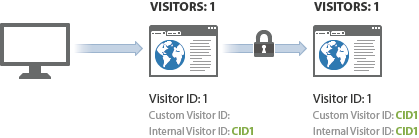

# Voorbeeld van de identificatie van bezoekers tussen apparaten

>[!IMPORTANT] Deze methode voor het identificeren van bezoekers op verschillende apparaten wordt niet langer aanbevolen. Zie [Apparaatanalyse](/help/components/cda/cda-home.md) in de gebruikershandleiding voor componenten.

In het volgende voorbeeld wordt getoond hoe bezoekersidentificatie op verschillende apparaten werkt met behulp van een voorbeeld van serveraanroepen die in een algemene klantinteractie worden verzonden.

| Serveroproep | Handeling | Cookie bezoeker-id | Variabele voor bezoekersidentiteitskaart | Effectieve bezoeker-id | Paginanummer bezoeken | Bezoek nummer |
|--- |--- |--- |--- |--- |--- |--- |
| 1 | Een bezoeker klikt op een koppeling in een marketingbericht en bezoekt uw site vanaf de thuiscomputer. Deze bezoeker heeft uw site in het verleden nog zeven keer bezocht. | 1 | - | 1 | 1 | 8 |
| 2-8 | Bezoek 7 extra pagina&#39;s op uw site. | 1 | - | 1 | 2-8 | 8 |
| 9 | Verifieert op huiscomputer. | 1 | CID1 | CID1 | 9  (Dit is de eerste hit van CID1 ooit, dus neemt deze het profiel van de bezoeker over en gaat dit verder vanaf Bezoeker ID 1.) | 8 |
| 10 | Bezoek 1 extra pagina. | 1 | CID1 | CID1 | 10 | 8 |
| 11 | Opent site vanaf laptop op kantoor. Deze bezoeker heeft uw site niet bezocht voordat hij dit apparaat gebruikte. | 2 | - | 2 | 1 | 1 |
| 12 | Verifieert op laptop. | 2 | CID1 | CID1 | 1 | 9 |
| 13 | Weergaven 1 extra pagina. | 2 | CID1 | CID1 | 2 | 9 |

## Aftellen bezoeken

Analytics telt een bezoek telkens wanneer een hit wordt weergegeven met een bezoekpaginanummer gelijk aan 1.

Aan de hand van de bovenstaande tabel werd een nieuw bezoek vier keer geteld: bij treffers 1, 9, 11 en 12.

## Aantal bezoekers

Analytics telt elke unieke effectieve bezoeker-id als een unieke bezoeker.

Aan de hand van de bovenstaande tabel is een nieuwe bezoeker drie keer meegeteld: bij treffers 1, 9 en 10.

Wanneer u bezoekersidentificatie voor meerdere apparaten gebruikt, kan het aantal unieke bezoekers dat u ziet toenemen. De bezoeker kan tweemaal op hetzelfde bezoek worden geteld: voor het eerste bezoek en opnieuw nadat de gebruiker is geverifieerd.

Na de eerste koppeling wordt het bezoek teruggezet naar de normale waarde, omdat de bezoeker door zijn browsercookie is gekoppeld. Als de bezoeker uw site later weergeeft en vervolgens verifieert, wordt het aantal bezoekers niet opgepompt omdat de effectieve bezoeker-id na verificatie niet verandert.

Zorg ervoor dat u zo consistent mogelijk bent bij het identificeren van unieke bezoekers. Gebruik bijvoorbeeld altijd de `visitorID` variabele wanneer de gebruiker is geverifieerd.
