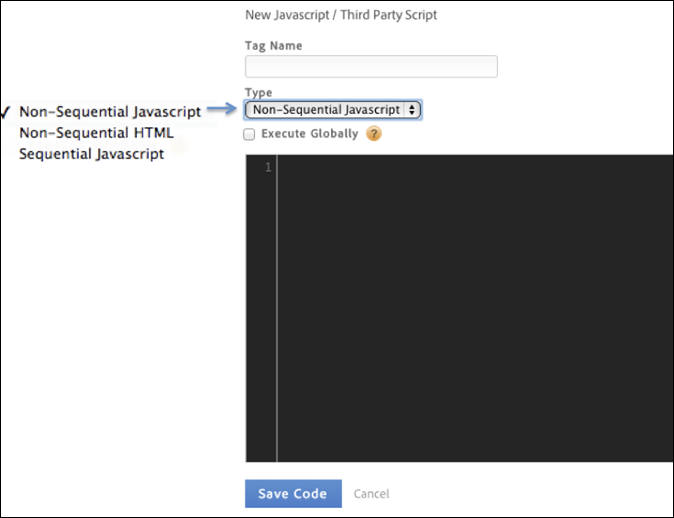

# Handelingen instellen voor activeren van voorwaarde

Stel handelingen in die de voorwaarde moet activeren.

Nadat u de voorwaarde hebt ingesteld, moet u de handelingen instellen die door de voorwaarde moeten worden geactiveerd. Deze handelingen kunnen gebeurtenissen, tags van derden en aangepaste scripts bevatten. [!DNL Analytics] In dit voorbeeld wordt beschreven hoe u scripts of tags van derden instelt.

Naast geïntegreerde hulpmiddelen zoals [!DNL Adobe Analytics] en Google Analytics, kan het Dynamische Beheer van de Markering om het even welk type van JavaScript teweegbrengen of HTML in uw plaats, in uitgezochte pagina&#39;s of in specifieke scenario&#39;s injecteren.

Elke regel kan zoveel scripts of HTML-injecties activeren als u wilt.

>[!NOTE] Omdat DTM u toestaat om douanecode in uw pagina te injecteren, gelieve te letten op niet om cross-site scripting (XSS) kwetsbaarheid (zie de gids [van](https://www.owasp.org/index.php/Cross-site_Scripting_(XSS)) OWASP voor meer informatie) tot stand te brengen. Het gebruik van gegevenselementen in een script vereist bijzondere aandacht. Ga er altijd van uit dat gegevenselementwaarden afkomstig kunnen zijn van een niet-vertrouwde bron.

**Handelingen instellen voor activeren van voorwaarde**

1. Klik **[!UICONTROL JavaScript / Third Party Tags]** om een nieuw manuscript aan uw regel toe te voegen.

   

1. Klik op **[!UICONTROL Add New Script]**.

   

1. Geef het script een naam.
1. Geef op hoe het script moet worden geactiveerd en plak de gewenste inhoud in het tekstgebied. 

1. Klik **[!UICONTROL Save Code]**, en het manuscript zal aan de rij voor de regel worden toegevoegd. 

