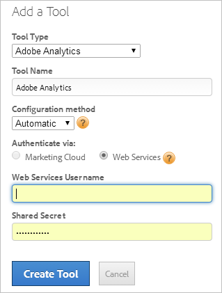

# Adobe Analytics handmatig implementeren (verouderd)

Maak een hulpprogramma voor Adobe Analytics voor implementatie met [!UICONTROL Dynamic Tag Management]. Deze procedure beschrijft een handmatige (verouderde) implementatie.

Zie [Adobe Analytics Tool](/help/implement/other/dtm/c-aa-tool/analytics-dtm.md)toevoegen voor informatie over automatisch implementatiebeheer.

Als u een handconfiguratie in automatisch wilt veranderen, geef een hulpmiddel uit en klik **[!UICONTROL Enable Automatic Configuration]**.

1. Analytische meetcode downloaden:
   1. Klik in Analytics op **[!UICONTROL Admin]** > **[!UICONTROL Code Manager]**.
   1. Klik **[!UICONTROL JavaScript (new)]** om de code plaatselijk te downloaden.
1. Maak [!UICONTROL Dynamic Tag Management]in [een webeigenschap](/help/implement/other/dtm/t-create-web-property.md).

   

   Nadat u de webeigenschap hebt gemaakt, kunt u deze bewerken op het [!UICONTROL Web Properties] tabblad [!UICONTROL Dashboard]. U hoeft de webeigenschap niet te activeren.

1. Voeg een gereedschap Analyse toe aan de eigenschap:
   1. Klik op het **[!UICONTROL Web Properties]** tabblad op de eigenschap.
   1. On the **[!UICONTROL Overview]** tab, click **[!UICONTROL Add a Tool]**.
   1. Selecteer in het **[!UICONTROL Tool Type]** menu de optie **[!UICONTROL Adobe Analytics]**.

      

   1. Configureer de volgende velden:

      | Element | Beschrijving |
      |---|---|
      | Gereedschapstype | De Experience Cloud-oplossing, zoals Analytics, Target, Social enzovoort. |
      | Naam gereedschap | De naam voor dit gereedschap. Deze naam wordt weergegeven op het [!UICONTROL Overview] tabblad onder [!UICONTROL Installed Tools]. |
      | Productieaccount-id | Een nummer voor uw productieaccount voor gegevensverzameling. Met Dynamic Tag Management wordt automatisch het juiste account geïnstalleerd in de productie- en staging omgeving. |
      | Account-id afspelen | Een nummer dat wordt gebruikt in uw ontwikkelings- of testomgeving. Een staging account houdt uw testdata gescheiden van de productie. |

1. Klik op **[!UICONTROL Create Tool]**.

   Het geïnstalleerde gereedschap wordt weergegeven op het [!UICONTROL Overview] tabblad.

1. Klik **[!UICONTROL Settings]** om de code te configureren.

   Klik minimaal op de trackingserver en de SSL-trackingserver **[!UICONTROL Cookies]** en configureer deze.

1. Klik **[!UICONTROL General]** en [neem de kernCode](/help/implement/other/dtm/c-aa-tool/t-appmeasurement-code.md)AppMeasurement op.
1. Definieer een [regel](/help/implement/other/dtm/c-rules/t-rules-create.md) voor het laden van pagina&#39;s om [!DNL Analytics]gegevens te verzamelen.

   U bent nu klaar om regels te definiëren voor het verzamelen van analysegegevens. U wilt mogelijk eerst enkele gegevenselementen definiëren. De elementen van gegevens laten u gegevens uit de pagina halen die u kunt gebruiken om uw regel te vormen. Om te beginnen kunt u een regel voor het laden van een pagina definiëren die geen voorwaarden bevat voor het verzamelen van [!DNL Analytics] gegevens op elke pagina.
1. [Voeg de kop- en voettekstcode](/help/implement/other/dtm/c-headers-footers/t-header-footer-code.md) toe op het tabblad Insluiten.

   Voor het opslaan kunt u de standaardoptie voor het hosten van Amazon behouden. U kunt deze desgewenst wijzigen voordat u de productie gaat uitvoeren.
1. (Optioneel) Klik op **[!UICONTROL Settings]**  het tabblad Opties en configureer de Adobe Analytics-code.

   >[!NOTE]
   >
   >De instellingen op de [!UICONTROL Adobe Analytics] pagina (Algemeen, Cookies, enzovoort) overschrijven de instellingen in uw `s_code`. Als deze montages in uw bestaan `s_code`, is er geen behoefte om hen hier te herhalen.

