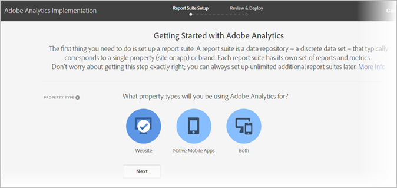

# Implementatiemodel

<!-- https://activation.adobedtm.com/index.php?redirected=1 -->

Het modale venster Welkom bij Adobe Analytics biedt een vereenvoudigde workflow voor het maken van een rapportsuite. Adobe raadt u aan deze workflow te gebruiken als uw organisatie meer rapportsuite nodig heeft.

## Vereisten

Uw Adobe-id moet toegang hebben tot zowel Adobe Analytics als Adobe Experience Platform Launch. Als u geen toegang tot Lancering hebt, kunt u in een authentificatielijn worden geplaatst waar het vraagt om uw geloofsbrieven voor onbepaalde tijd te verifiëren. Bespreek met systeemadmin in uw organisatie om toegang tot Lancering te verkrijgen.

## Toegang tot het modaal

Open het modaal om een rapportreeks tot stand te brengen gebruikend de volgende stappen.

1. Meld u met uw Adobe-id aan bij [ExperienceCloud.adobe.com](https://experiencecloud.adobe.com) .
2. Klik op het pictogram met het 9-raster bovenaan en klik op [!UICONTROL Adobe Analytics].
3. Als u nog geen rapportsuite hebt gemaakt, wordt de modaal automatisch weergegeven. Als er een rapportsuite voor dit aanmeldingsbedrijf bestaat, klikt u rechtsboven op het pictogram Help en klikt u op [!UICONTROL Welcome to Adobe Analytics].

> [!NOTE] De [!UICONTROL Welcome to Adobe Analytics] optie wordt alleen weergegeven als u zich aanmeldt via de Adobe Experience Cloud. Als u zich aanmeldt via verouderde domeinen, is het modaal niet beschikbaar.

## Een rapportsuite maken

Klik op de [!UICONTROL Start Setup] knop om de workflow voor het maken van de rapportsuite te starten.

### Type eigenschap

Met behulp van het type eigenschap kan Adobe bepaalde instellingen voor de achtergrond bepalen op basis van de locatie waar u Analytics wilt implementeren.

* **Website**: Als u Adobe Analytics alleen voor een website wilt implementeren.
* **Systeemeigen mobiele toepassing**: Als u Adobe Analytics alleen voor een mobiele app wilt implementeren.
* **Beide**: Als deze rapportsuite gegevens bevat voor zowel een website als een mobiele app.

### Industrie

Geef uw primaire bedrijfsmodel op. Met deze instelling kan Adobe bepaalde variabelenamen en -instellingen vooraf configureren op basis van uw primaire bedrijfsmodel.

### Gegevenslaag

Een [gegevenslaag](data-layer.md) is een JavaScript-object dat alle variabelen die in de implementatie worden gebruikt, op één nuttige locatie ordent. Zie [Gegevenslagen](data-layer.md) voor meer informatie.

### Gegevensopslagplaats

Geef uw rapportsuite een vriendelijke naam. Uw identiteitskaart van de rapportreeks (RSID) produceert automatisch gebaseerd op de vriendschappelijke naam en login bedrijf.

### Tijdzone

Controleer of Adobe de juiste tijdzone voor de rapportsuite heeft gedetecteerd.

### Geschatte paginaweergaven per dag

Schatting hoeveel verkeer uw website of app per dag krijgt. Met deze informatie kan Adobe de juiste hoeveelheid verwerkingsbronnen toewijzen aan uw rapportsuite.

### Basisvaluta

Bepaal in welke valuta de rapportsuite monetaire waarden opslaat.

> [!IMPORTANT] Zorg ervoor dat u de juiste valuta opgeeft, vooral als u rapportagevereisten hebt met betrekking tot inkomsten. Het is moeilijk om de basisvaluta te wijzigen nadat de gegevensverzameling is gestart.

## Implementatiebronnen

Nadat de rapportsuite is gemaakt, kunt u verdergaan met de implementatie:

* **Ga naar Adobe Experience Platform Launch**: Koppelingen naar [launch.adobe.com](https://launch.adobe.com) om uw implementatie te configureren en implementatiecode te downloaden. Zie [Implementeren met starten](../launch/overview.md). Adobe raadt u in de meeste gevallen aan Launch te gebruiken.
* **Implementatiecode** downloaden: Bevat een directe koppeling waarmee u JavaScript-bestanden kunt downloaden voor een handmatige JavaScript-implementatie. Zie [AppMeasurement voor JavaScript](../js/overview.md).
