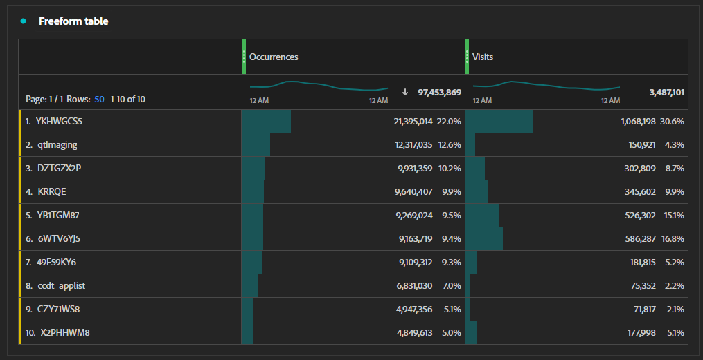

# Workflow voor bijhouden van campagnes

Als uw organisatie de prestaties en klikthrough tarief van marketing inspanningen wil volgen, kunt u het volgende proces gebruiken. Elk van deze stappen bevat speciale secties hieronder die meer details bevatten.

1. [Een proces voor het genereren van code bijhouden definiëren](#establish-a-tracking-code-generation-process)
1. [Voeg de gewenste volgcode toe aan de e-mail](#add-the-desired-tracking-code-to-the-email)
1. [Uw Adobe Analytics-implementatie instellen of aanpassen om gegevens over trackingcode op te nemen](#include-campaign-variables-in-your-implementation)
1. [Rapporten weergeven in Analysis Workspace](#view-the-reports-in-analysis-workspace)

[Adobe Campaign](https://business.adobe.com/nl/products/campaign/adobe-campaign.html) kan u helpen elk van deze stappen te vereenvoudigen om de meeste waarde uit uw marketing inspanningen te drijven. Neem voor meer informatie contact op met je Adobe verkoper.

## Een proces voor het genereren van code bijhouden definiëren

Elke organisatie heeft verschillende behoeften voor het volgen van codes. Sommige organisaties kunnen minimale behoeften hebben waar handmatig gemaakte trackingcodes meer dan toereikend zijn. Andere organisaties willen mogelijk meer controle over bijhouden en beschikken over meerdere systemen voor het maken van de gewenste volgcodes. Als uw organisatie naast Adobe Analytics ook Googles Analytics gebruikt, beschikt uw organisatie mogelijk al over een `utm` er is een model voor trackingcode opgesteld.

Ongeacht hoe u verkiest om het volgen codes tot stand te brengen of te produceren, staat het hebben van een verenigbaar systeem op zijn plaats uw organisatie een veel gemakkelijkere tijd toe wanneer u het volgen codes voor rapportering wilt groeperen. Met consistent gestructureerde volgcodes kunt u [Classificatieregels](/help/components/classifications/crb/classification-rule-builder.md) zodat u inzicht krijgt in categoriale prestaties.

## Voeg de gewenste volgcode toe aan een URL

Als u de gewenste waarde voor de trackingcode hebt, kunt u deze toevoegen aan koppelingen die u online plaatst, zoals advertenties, sociale media of e-mail. Het toevoegen van deze volgcodes vindt doorgaans plaats in de queryreeks van een koppeling. Welke parameter van het vraagkoord u gebruikt hangt van de het volgen vereisten van uw organisatie af; een gemeenschappelijke parameter van het vraagkoord is `cid` (kort voor campagne-id). Sommige organisaties die ook Googles Analytics gebruiken, hebben mogelijk al meerdere parameters voor queryqueryqueryqueryqueryqueryqueryreeksen, zoals `utm_source`, `utm_medium`en andere.

Het toevoegen van querytekenreeksen aan een koppeling in een e-mailbericht ziet er ongeveer als volgt uit:

```text
https://example.com?cid=EM989027
```

## Campagnevariabelen opnemen in uw implementatie

Adobe Analytics heeft een speciale [Code bijhouden](/help/components/dimensions/tracking-code.md) dimensie die u kunt gebruiken om diverse marketing inspanningen over uw organisatie te meten. Verschillende organisaties kunnen echter verschillende traceervereisten hebben. Het is belangrijk dat u verwijst naar de [Document voor het ontwerp van oplossingen](../prepare/solution-design.md) om de juiste waarden in de juiste variabelen bij te houden.

Als uw organisatie nog geen campagne bijhouden heeft ingesteld, kunt u uw implementatie aanpassen om de [`campaign`](/help/implement/vars/page-vars/campaign.md) variabele. Zie de [`getQueryParam`](/help/implement/vars/plugins/getqueryparam.md) methode om te leren hoe u parameterwaarden van het vraagkoord kunt verzamelen specifiek voor de implementatie van uw organisatie.

Als uw organisatie verzamelt `utm` querytekenreeksen, kunt u kiezen voor:

* Alles verzenden `utm` U kunt tekenreeksen opvragen in de afmeting Code bijhouden als samengevoegde waarden. U kunt vervolgens [Classificatieregels](/help/components/classifications/crb/classification-rule-builder.md) om extra afmetingen tot stand te brengen die zich op elk richten `utm` parameter. Deze methode heeft een complexere leercurve, maar gebruikt geen extra eVars.
* Elke verzending `utm` queryreeks in een aparte [eVar](/help/components/dimensions/evar.md). Deze methode is eenvoudiger te implementeren in het algemeen, maar vereist het gebruik van extra variabelen.

## Rapporten weergeven in Analysis Workspace

Nadat u de implementatie op de juiste wijze hebt ingesteld voor het verzamelen van gegevens over trackingcode, kunt u rapporten weergeven in Analysis Workspace.

1. Aanmelden bij de [Adobe Experience Cloud](https://experience.adobe.com) en selecteert u [!UICONTROL Adobe Analytics].
1. Een [Werkruimteproject](/help/analyze/analysis-workspace/build-workspace-project/freeform-overview.md).
1. Sleep in de lijst met componenten aan de linkerkant de knop [Code bijhouden](/help/components/dimensions/tracking-code.md) afmeting aan het werkruimtekanvas.
1. Sleep de gewenste metrisch, zoals [Bezoeken](/help/components/metrics/visits.md) of [Orders](/help/components/metrics/orders.md) rechts van het canvas in de werkruimte.


