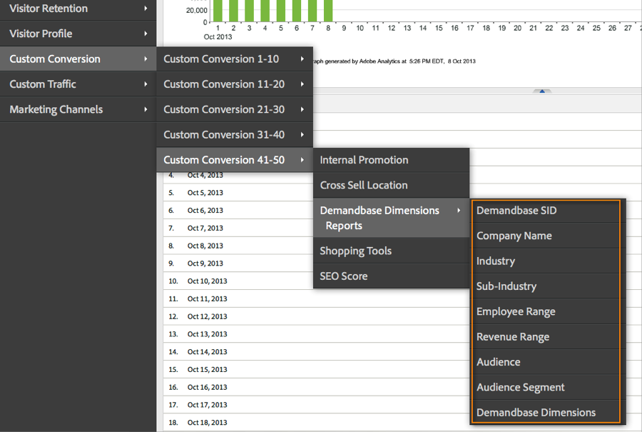

# De integratie implementeren{#deploying-the-integration}

Het implementeren van deze integratie is een eenvoudig proces waarvoor de volgende acties nodig zijn.

## De wizard Adobe Integration voltooien{#completing-the-adobe-integration-wizard}

Om de integratie te activeren, moet u de configuratietovenaar binnen de interface van Verbindingen van Gegevens voltooien.

1. Navigeer naar het gebied Gegevensverbindingen (voorheen Genesis) in de Adobe Experience Cloud.
1. Start de wizard Demandbase 2.0 voor integratie.
1. Kies de gewenste rapportsuite en geef een naam op voor de integratie.
1. Configureer de volgende items:

<table id="table_8D60DC7C48C144DC9934749E7F9F65FF"> 
 <thead> 
  <tr> 
   <th colname="col1" class="entry"> Item </th> 
   <th colname="col2" class="entry"> Beschrijving </th> 
  </tr>
 </thead>
 <tbody> 
  <tr> 
   <td colname="col1"> E-mailadres </td> 
   <td colname="col2"> Het e-mailadres van de primaire contactpersoon. </td> 
  </tr> 
  <tr> 
   <td colname="col1"> Beschrijving </td> 
   <td colname="col2"> (Optioneel) Beschrijving voor deze integratie-instelling. </td> 
  </tr> 
  <tr> 
   <td colname="col1"> API-sleutel voor demandbasis </td> 
   <td colname="col2"> U kunt dit aanvragen bij uw demandasale vertegenwoordiger. </td> 
  </tr> 
  <tr> 
   <td colname="col1"> Aangepaste veeleisende dimensie #N </td> 
   <td colname="col2"> Dit zijn de id's voor de 8 optionele afmetingen. Voor meer informatie, zie de Dimensies van de Douane van de Band. </td> 
  </tr> 
  <tr> 
   <td colname="col1"> Verzenden naar Adobe-doel </td> 
   <td colname="col2">Indien "true", worden de demandaseafmetingen ook via een verborgen box naar Adobe Target verzonden. <p>Opmerking:  Er moeten afmetingen worden verzameld die zijn geconfigureerd in het bestand mbox.js op de webpagina. </p> </td> 
  </tr> 
 </tbody> 
</table>

1. Vorm de volgende Veranderlijke punten van Toewijzingen:

   | Item | Beschrijving |
   |---|---|
   | Demandoneafmetingen | Kies een beschikbare eVar variabele van uw rapportreeks. |
   | Aangepaste afmetingen voor demandbasis (optioneel) | Kies een beschikbare eVar variabele van uw rapportreeks. |

1. Configureer de namen voor de aangepaste dimensie (indien van toepassing).

   1. Als u ervoor hebt gekozen Aangepaste afmetingen op te nemen in stap 4 en de optionele eVar in kaart hebt gebracht in stap 5, moet u vriendelijke namen voor die afmetingen opgeven. Als u bijvoorbeeld &quot;stock_ticker&quot; wilt invoeren als Aangepaste afmeting 1, wijzigt u het vak met &quot;Dimension 1&quot; in &quot;Stock Ticker&quot;.
   1. Wijzig **NIET** de namen van standaard 8 afmetingen (d.w.z. demandbase SID, de Naam van het Bedrijf, de Industrie, enz.).

1. Schakel het selectievakje in om het dashboard voor demandbase-integratie automatisch voor u te maken (aanbevolen).
1. Controleer alle configuratiepunten en klik **[!UICONTROL Activate Now]**.

## De integratiecode implementeren{#deploying-the-integration-code}

Nadat u de integratietovenaar hebt voltooid, moet u de integratiecode aan uw de plaatsingscode van de Analyse van Adobe (s_code) opstellen.

>[!NOTE] Als u Adobe TagManager of Dynamic Tag Management hebt gebruikt om Adobe Analytics te implementeren, kunt u de integratiecode eenvoudig toevoegen met een van deze gereedschappen.

1. Ga naar het **[!UICONTROL Support]** lusje en download en sla het `integration code v2_0_1` middel van het gebied van Middelen van de integratie op.

1. Indien van toepassing, breng de nodige wijzigingen in de code aan. Voor meer informatie, zie het Wijzigen van de Code van de Integratie (op deze pagina).
1. Neem de integrate-module op als deze nog niet aanwezig is in de implementatiecode van Adobe Analytics.
1. Implementeer de code met een van de volgende methoden:

   * Voeg de code toe met Adobe TagManager of Dynamisch tagbeheer.
   * U kunt de code ook leveren aan de organisatiebron die verantwoordelijk is voor het bijwerken van de implementatiecode voor Adobe Analytics.

>[!IMPORTANT]
>
>Zorg ervoor u plaatsing voor deze integratie in een ontwikkelings/het opvoeren milieu test alvorens het aan een productiemilieu op te stellen.

## De integratiecode wijzigen{#modifying-the-integration-code}

In de meeste gevallen, zult u geen wijzigingen in de integratiecode moeten aanbrengen die door de tovenaar van de Verbinding van Gegevens wordt veroorzaakt.

Als u echter aanpassingen moet aanbrengen, worden enkele code-instellingen hieronder beschreven.

<table id="table_5405A73CEFD44466B3C39559F4A037C9"> 
 <thead> 
  <tr> 
   <th colname="col1" class="entry"> Codeinstelling </th> 
   <th colname="col2" class="entry"> Beschrijving </th> 
  </tr>
 </thead>
 <tbody> 
  <tr> 
   <td colname="col1"> s.maxDelay </td> 
   <td colname="col2">Het maximumaantal milliseconden dat de Adobe Analytics-afbeeldingsaanvraag wacht op de Demandbase-gegevens voordat deze worden afgebroken op de Analytics-verzamelingsserver. <p>Opmerking:  Deze instelling is van toepassing op alle integraties die mogelijk worden uitgevoerd via de module Integrate. </p> </td> 
  </tr> 
  <tr> 
   <td colname="col1"> _db._key </td> 
   <td colname="col2"> Uw demandbasis-API-sleutel. </td> 
  </tr> 
  <tr> 
   <td colname="col1"> _db._apiURL </td> 
   <td colname="col2"> De URL-sjabloon voor de Demandbase-API. </td> 
  </tr> 
  <tr> 
   <td colname="col1"> _db._delim </td> 
   <td colname="col2"> Het scheidingsteken dat wordt gebruikt om de waarden van de dimensie Demandbase van elkaar te scheiden wanneer deze naar Adobe Analytics worden verzonden. Als u deze instelling wijzigt, werken de standaard classificatieregels mogelijk niet correct. </td> 
  </tr> 
  <tr> 
   <td colname="col1"> _db._setTnt </td> 
   <td colname="col2">Indien waar (true), wordt met de integratiecode geprobeerd een verborgen box te gebruiken om de Demandbase-afmetingen als profielparameters naar Adobe Target te verzenden. <p>Opmerking:  Dit vereist dat de code mbox.js op de pagina bestaat. </p> </td> 
  </tr> 
  <tr> 
   <td colname="col1"> _db._tntVarPrefix </td> 
   <td colname="col2"> Deze tekenreeks wordt toegevoegd aan elke naam van de Demandbase-dimensie voordat deze naar Adobe Target wordt verzonden. Als deze instelling bijvoorbeeld de waarde "db_" heeft, wordt de dimensie "industrie" naar Adobe Target verzonden als "db_industrie". </td> 
  </tr> 
  <tr> 
   <td colname="col1"> _db._afmetingenArray </td> 
   <td colname="col2"> De standaardafmetingen voor demandbasis die naar Adobe Analytics worden verzonden. U wordt aangeraden deze instelling niet te wijzigen. De eigenschap "max_size" is het aantal toegestane tekens voor de dimensie voordat afkapping plaatsvindt. </td> 
  </tr> 
  <tr> 
   <td colname="col1"> _db._afmetingenArrayCustom </td> 
   <td colname="col2"> De aangepaste Demandbase-afmetingen die naar Adobe Analytics worden verzonden. De eigenschap "max_size" is het aantal toegestane tekens voor de dimensie voordat afkapping plaatsvindt. </td> 
  </tr> 
  <tr> 
   <td colname="col1"> _db._cName </td> 
   <td colname="col2"> De naam van het sessiecookie die wordt gebruikt om de status voor de demandbasis-API-communicatie te behouden. </td> 
  </tr> 
  <tr> 
   <td colname="col1"> _db._contextName </td> 
   <td colname="col2"> De naam van de contextData-variabele die wordt gebruikt om de standaardafmetingen naar Adobe Analytics te verzenden. U wordt aangeraden deze instelling niet te wijzigen. </td> 
  </tr> 
  <tr> 
   <td colname="col1"> _db._contextNameCustom </td> 
   <td colname="col2"> De naam van de contextData-variabele die wordt gebruikt om de aangepaste afmetingen naar Adobe Analytics te verzenden. U wordt aangeraden deze instelling niet te wijzigen. </td> 
  </tr> 
 </tbody> 
</table>

## Inclusief de integratiemodule{#including-the-integrate-module}

De integratiecode vereist dat de integrate Module binnen uw plaatsing van de Analyse van Adobe bestaat.

Als u nog niet over de geïntegreerde module beschikt als onderdeel van uw implementatie, voert u de volgende stappen uit, afhankelijk van het type implementatie dat u hebt.

### Voor AppMeasurement v1.0+ {#section-f28d090bf2404cabaae34cd9c66fc575}

1. Pak het ZIP-bestand van AppMeasurement uit dat u hebt gedownload van **[!UICONTROL Analytics]** > **[!UICONTROL Admin]** > **[!UICONTROL CodeManager]**.

1. Open het bestand met de naam [!DNL AppMeasurement_Module_Integrate.js].
1. Kopieer en plak de inhoud van dit bestand in uw primaire [!DNL AppMeasurement.js] bestand.

   >[!NOTE]
   >
   >Plak het vlak voor de opmerking ONDER DEZE REGEL in het bestand.

### Voor oude code (H-code) {#section-bba8ad8c715e4f97883e7de3269f681a}

1. Download de integrate Module van het gebied van &quot;Middelen&quot;binnen de UI van de Verbindingen van Gegevens (onder het lusje van de Steun).

   

1. Kopieer en plak de inhoud van dat bestand in uw [!DNL s_code] bestand.

   >[!NOTE]
   >
   >Plak het vlak voor de opmerking ONDER DEZE REGEL in het bestand.

## Integratie controleren{#verifying-the-integration}

Controleer live tracering en rapportage om te controleren of de integratie gegevens heeft vastgelegd.

### Actief bijhouden {#section-9c20e8ff6b404ae09387ee07d675c9e2}

Gebruik het foutopsporingsprogramma DigitalPulse om te controleren of gegevens over de dimensie Demandbase naar Adobe Analytics worden verzonden. Nadat u de cookies hebt verwijderd, laadt u opnieuw een pagina op uw website waarop de integratiecode is geïmplementeerd. Ervan uitgaande dat uw huidige IP kaarten aan een organisatie die door Demandbase wordt erkend, zou u resultaten gelijkend op het volgende moeten zien.

**Rapporten en Analytics (voorheen SiteCatalyst) bevat de twee variabelen voor de Demandbase-context:**


**Het doel Mbox omvat de parameters van het Profiel van de Demandase:**
Dit wordt alleen weergegeven als u Target op de pagina hebt geïmplementeerd EN u deze integratie hebt geconfigureerd voor Adobe Target - zie Stap 4 in de Adobe-integratiewizard.


### Rapportage {#section-1792fe75dc3249d0ad063dfd87a89162}

Reviseer uw Demandbase-rapporten in Adobe Analytics met behulp van het dashboard dat automatisch voor u is gemaakt met de wizard Adobe Integration (Stap 7).

U kunt ook naar de Demandbase-rapportage navigeren in de menustructuur van Adobe Analytics - zie onderstaande screenshots.

>[!NOTE] Deze gegevens moeten binnen 24-48 uur na een geslaagde implementatie worden weergegeven.




### Veelgestelde vraag {#section-d926b160a2ef4f07b43ea1bc67ac2a0a}

**Wat betekent &quot;[n.v.t]&quot;?**

De verbinding van Gegevens van de Demandbase wijst erop wanneer een attribuut &quot;niet Beschikbaar&quot;is door deze standaardwaarde te plaatsen. Er zijn twee algemene scenario&#39;s waarin de standaardwaarde wordt ingesteld:

* De basis van de vraag ontdekt dat de bezoeker van een IP adres komt dat niet tot een bedrijf behoort.
* Er wordt een accountcontrolekenmerk gebruikt (te beginnen met &quot;watch_list&quot;), maar het bedrijf staat niet in uw accountcontrolelijst.

**Waarom wordt &quot;`[n/a]`&quot; vaker weergegeven voor bepaalde kenmerken?**

De basis van de vraag classificeert alle IP adressen en verstrekt het publiek en publiek_segment attributen zelfs wanneer de bezoeker niet uit een bedrijfIP komt. Wanneer het publiek waarden zoals &quot;Ingezetenschap&quot;terugkeert, &quot;Draadloos&quot;, en &quot;Ziekenhuis&quot;, zijn de rest attributen waarschijnlijk niet beschikbaar.

Soms is het publiek van een bezoeker &#39;SMB&#39;, maar andere kenmerken geven &#39;`[n/a]`&#39; aan. Dit betekent Demandbase de bezoeker als kleine onderneming kan classificeren, maar het volledige bedrijfsprofiel is niet beschikbaar. Dit gebeurt typisch voor de kleinste bedrijven, wanneer meer dan één kleine onderneming de zelfde dienstverlener of het blok van IP adressen gebruikt.

### Overwegingen voor ontwikkelaars {#section-d33fff55bc4b4db99f82dee418ef1bc2}

Als u de standaardwaarde in uw implementatie moet aanpassen, werk de lijn bij:

```
_db._nonOrgMatchLabel = "[n/a]";
```
