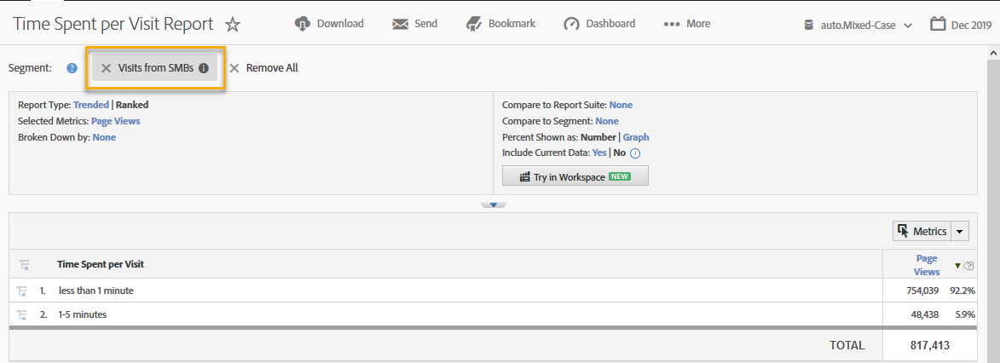

# De integratie gebruiken{#using-the-integration}

Zodra de integratie wordt opgesteld, kunt u beginnen gebruikend de extra mogelijkheden die het verstrekt.

>[!NOTE]
>
>Het kan 24-48 uur duren voordat u een aantal van de Demandbase-gegevens in Adobe Analytics-rapportering ziet.

Hier volgen enkele acties die u kunt uitvoeren om meerwaarde te krijgen van deze integratie vanuit Adobe Analytics:

## Verkeer- en conversiemetriek bekijken op basis van afmeting aan de vraagzijde{#viewing-traffic-and-conversion-metrics-by-demandbase-dimension}

Deze integratie biedt nieuwe dimensies die beschikbaar komen als Adobe Analytics rapporteert.

Het onderstaande rapport is een voorbeeld van het analyseren van zowel bezoeken als een omzettingsmetrische (Webinar Registrations) die zijn uitgesplitst naar zowel het type van Publiek als dan door Industrie.

## Segmenteren op basis van demandafmetingen{#segmenting-by-demandbase-dimensions}

Een van de belangrijkste functies van deze integratie is de mogelijkheid om Adobe Analytics-segmenten te maken op basis van de veeleisende dimensies.

Bijvoorbeeld, kunt u een segment bouwen dat slechts Visits van de organisaties van SMB zal omvatten. U zou deze Visits van SMBs kunnen roepen. De definitie zou als volgt luiden:

Publiek is gelijk aan SMB.

Raadpleeg de [Analytics Segmentation Guide](https://docs.adobe.com/content/help/en/analytics/components/segmentation/seg-home.html)voor meer informatie over het maken van segmenten.

Dit segment kan vervolgens worden toegepast op vrijwel elk rapport, zoals bijvoorbeeld het Time Spent per Visit Report dat hier wordt getoond: 
