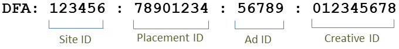

# Integratiefuncties{#integration-features}

Nadat de DFA-integratie van gegevensconnectors is geactiveerd, kunt u de volgende metingen uitvoeren voor uw Adobe Analytics-rapporten:

* Beeld-door
* DFA-klikken
* Impressies
* (optioneel) DFA-kostengegevens
* (optioneel) DFA-query-fouten, time-outs

> [!NOTE] Deze integratie biedt geen ondersteuning voor het klikken op trackers (klik eerder op opdrachten). Klik trackers worden gebruikt om het aantal kliks op tekstverbindingen, verbindingen in e-mailberichten, of op andere elementen te registreren die hard-gecodeerd op een Website zijn.

De integratie van DFA van de Verbindingen van Gegevens construeert automatisch DFA het volgen codes van de gegevens die door DFA zijn teruggekeerd. Deze volgcodes zijn zo samengesteld dat ze een advertentie identificeren, samen met de bijbehorende Plaatsing en Creatief. In het volgende voorbeeld wordt de structuur van de trackingcode beschreven, afhankelijk van de versie van de integratie. Versie 1.5 ziet er als volgt uit:

Versie 2.0 ziet er als volgt uit:

Deze id&#39;s fungeren als een gedeelde sleutel tussen Genesis en DFA om de juiste classificaties en metriek te koppelen.

| Site-id | De site van derden waarop de advertentie is gehost. De classificatie van de Naam van de Plaats verstrekt een beschrijvende naam van deze identiteitskaart van de Plaats. |
|---|---|
| ID advertentie | Een id voor het commerciële bericht dat aan een gebruiker wordt geleverd. De classificatie Advertentienaam bevat de naam van de advertentie zoals die door uw organisatie in het DFA systeem wordt bepaald. Bijvoorbeeld: `Hybrid Coup Textlink - Build`. |
| Plaatsing-id | Een vertegenwoordiging in uw rekening DFA van een Website, een gedeelte van een Website, of een groep Websites waar u ad ruimte hebt gekocht. |
| Creative-id | De afbeelding, Flash SWF of andere bron die bestemd is om aan de bezoeker te worden getoond. De Creative Name-classificatie bevat de naam die u aan deze creatieve functie hebt opgegeven in de DFA-interface. |

De andere twee classificaties, het Hulpmiddel van de Levering (Dubbelklik voor Adverteerders) en Kanaal (Banner Ad) hebben de zelfde waarden voor om het even welke DFA campagne en helpen om DFA ingevoerde gegevens te onderscheiden.

## DoorzoekenMidden-deduplicatie {#section-f809b3bb5e5142aa8ff89bcd5f0d0e49}

De DFA-integratie is nu bekend met Adobe SearchCenter. Door SearchCenter-deduplicatie via de wizard Gegevensverbindingen in te schakelen, zorgen bezoekers met zoekfunctie er niet voor dat gegevens worden opgehaald van de DFA Floodlight Server en *`s.campaign`* worden deze niet ingevuld door DFA, zodat SearchCenter deze kan vullen. Bovendien vullen DFA en SearchCenter nu deduplicatiewaarden in de variabelen voor elk product.

In de onderstaande lijst wordt de logica beschreven die wordt ingeschakeld wanneer de optie SearchCenter-deduplicatie is ingeschakeld:

Als **[!UICONTROL DFA]** **[!UICONTROL SearchCenter deduplication]** > in de wizard is geselecteerd:

* In het geval van een DFA klik-door, zal de integratie het koord &quot;DFA Clickthrough&quot;aan gevormde SCM eVar bevolken.
* In het geval van een DFA mening-door, zal de integratie het koord &quot;DFA Bekijken&quot;aan SCM eVar bevolken.

Als **[!UICONTROL SearchCenter]** **[!UICONTROL DFA deduplication]** > in de wizard is geselecteerd:

* In het geval van een DFA mening-door, zal de integratie het koord &quot;DFA Bekijken&quot;aan SCM eVar bevolken.

> [!NOTE] Als SearchCenter > DFA de-duplicatie wordt toegelaten en de parameter van het de vraagkoord SearchCenter wordt geplaatst, zal het bezoek niet voor verwerking DFA in overweging worden genomen. Dit betekent dat de parameter van het de vraagkoord SearchCenter van de DFA klik-door parameter zou moeten verschillend zijn, en geen advertenties van de Vertoning zouden de parameter van het vraagkoord moeten plaatsen SearchCenter.

