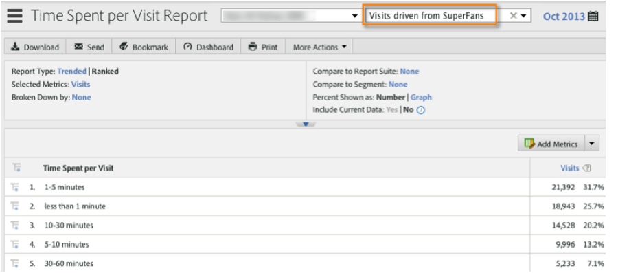

# De integratie gebruiken{#using-the-integration}

Zodra opgesteld, kunt u beginnen gebruikend de extra mogelijkheden die deze integratie verstrekt.

**Opmerking**: Het kan 24 tot 48 uur duren voordat u een aantal van de dynamische signaalgegevens in uw Adobe Analytics-rapport ziet.

De volgende acties leveren een meerwaarde op door deze integratie in Adobe Analytics.

## Verkeer- en conversiemetriek weergeven op dynamische signaalafmetingen{#viewing-traffic-and-conversion-metrics-by-dynamic-signal-dimensions}

Voorbeeld van een rapport in Adobe Analytics.

Deze integratie biedt nieuwe dimensies die beschikbaar komen als Adobe Analytics rapporteert. Onderstaand verslag is een voorbeeld van een analyse van zowel de bezoeken als de omrekeningsmethode (registraties), uitgesplitst naar titel van artikel.

## Segmenteren op dynamische signaalafmetingen{#segmenting-by-dynamic-signal-dimensions}

Voorbeelden van segmenten op basis van dynamische signaalafmetingen.

Een belangrijk onderdeel van deze integratie is de mogelijkheid om Adobe Analytics-segmenten te maken op basis van de geïntegreerde rapportagedimensies. Bijvoorbeeld, kunt u een segment bouwen dat slechts Bezoeken van een specifieke Gemeenschap omvat VoiceStorm. U zou dit &quot;Bezoeken kunnen noemen die van SuperFans worden gedreven&quot;. Deze segmentdefinitie zou als het volgende kunnen kijken.

## Geïntegreerde rapportageafmetingen{#integrated-reporting-dimensions}

Hiermee geeft u de rapportageafmetingen voor dynamisch signaal weer die bij deze integratie zijn inbegrepen.

| Dimensie | Beschrijving |
|---|---|
| Kanaaltype | Het sociale netwerk (of blogplatform) waar de gebruiker een communitybericht deelde. Gebruikers kunnen een bericht op meerdere kanalen delen. Klikken en andere activiteiten worden per kanaal gesegmenteerd. In dit veld worden Facebook, Twitter enzovoort weergegeven. zodat u kunt zien welk kanaaltype de drijvende activiteit is. |
| Artikel-ID | De artikel-id identificeert elk stuk inhoud in de Dynamic Signal-gemeenschap op unieke wijze. |
| Brontype | In dit veld wordt aangegeven of de post is gemaakt door een &quot;lid&quot; of het &quot;merk&quot;. In beide gevallen kan inhoud handmatig in de toepassing worden gemaakt of uit een externe feed worden geïmporteerd. |
| Gebruikersnaam | De gebruiker die een bericht heeft gedeeld op zijn of haar sociale netwerk(s), en doorklikbewerkingen naar uw site heeft gegenereerd. |
| Bron-id | De bron-id identificeert op unieke wijze de maker (of auteur) van de gedeelde post. Dit is meestal een bepaald lid of een extern diervoeder. |
| Gebruikersnaam | De gebruikersnaam is een unieke identificatie van een gebruiker (d.w.z. een lid) in de gemeenschap voor dynamisch signaal. In dit geval is de gebruiker de aandeelhouder die de post op zijn of haar sociale netwerk(en) heeft gedeeld. |
| Bronnaam | De bron is de maker (of auteur) van de gedeelde post. In de meeste gevallen is dit een lid van de gemeenschap of een extern diervoeder. |
| Artikel Titel | De titel van de gedeelde post die produceerde klikt terug naar uw plaats. |
| Communautaire naam | De naam van uw Dynamic Signal-gemeenschap. |

