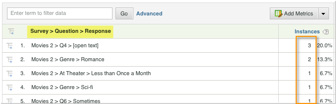

# De integratie implementeren{#deploying-the-integration}

Het implementeren van deze integratie is een eenvoudig proces waarvoor de volgende acties nodig zijn.

## Voltooiend de Tovenaar van de Integratie van Adobe{#completing-the-adobe-integration-wizard}

Als u de integratie wilt activeren, moet u de wizard voor Qualtrict-integratie voltooien in de interface Data Connectors

1. Navigeer naar gegevensconnectors en start de wizard voor Qualtrics-integratie.
1. Selecteer de rapportsuite die u voor deze integratie wilt gebruiken en geef een naam op.

   Voltooi de integratiewizard en geef de informatie op die in de volgende stappen wordt beschreven. 1. **Wizard Stap 1**

   | E-mailadres | Het primaire e-mailadres van de contactpersoon. |
   |---|---|
   | Beschrijving | (Optioneel) Beschrijving voor deze integratie-instelling. |
   | ID van Qualtriciteitsorganisatie | [Qualtriciteitsorganisatie-id zoeken](../qualtrics-overview/qualtrics-org-id.md) |
   | Adobe SiteCatalyst Token | [Uw Qualtrics Adobe Analytics-token genereren](../qualtrics-overview/qualtrics-token.md) |

1. **Tovenaar Stap 2 - Veranderlijke Toewijzingen**

   | Antwoordlijst voor kwaltrics | Selecteer een beschikbare lijstvariabele van uw rapportreeks. (Mogelijk moet u een nieuwe listVar inschakelen in Report Suite Manager.) |
   |---|---|
   | Qualtrics Response ID | Selecteer een beschikbare eVar of hulpmiddel van uw rapportreeks. (Mogelijk moet u een nieuwe listVar inschakelen in Report Suite Manager.) |
   | Trackingserver | Geef de instelling voor de trackingserver (domein) op die u gebruikt om Adobe Analytics-gegevens bij te houden. Gebruik de `trackingServerSecure`-trackingserver als deze afwijkt van de standaardinstelling voor trackingservers. |
   | Indieningen kwaliteitscontroles | Selecteer een beschikbare gebeurtenis in uw rapportsuite (het kan zijn dat u een nieuwe gebeurtenis moet inschakelen in de rapportsuite Manager). |

1. **Wizard Stap 3**: Niets vereist, alleen informatie.

   Stap Resultaat 1. **Wizard Stap 4 - Exportinstellingen**

   | eVar | Selecteer maximaal vijf van uw eVars om beschikbaar te maken voor exporteren naar Qualtrics |
   |---|---|
   | Gebeurtenissen | Selecteer maximaal vijf van uw aangepaste gebeurtenissen die beschikbaar moeten worden gemaakt voor exporteren naar Qualtrics |
   | Props | Selecteer maximaal vijf van uw voorstellen die u beschikbaar wilt maken voor exporteren naar Qualtrics |
   | Toegangsverzoeken | Controleer de doos voor om het even welke standaardmetriek en afmetingen die u aan Kwaliteit wilt uitvoeren. De `visitor_id` is vereist om het exporteren toe te staan behoorlijk te functioneren. |

1. **Wizard Stap 5**: Controleer de configuratie en klik op  **[!UICONTROL Activate Now]**.

## Integratie in Qualtrics Research Suite inschakelen{#enabling-the-integration-in-qualtrics-research-suite}

Nadat u de integratietovenaar hebt voltooid, moet u de integratie activeren voor elke Qualtrics-enquête die u wilt verbinden.

1. Meld u aan bij de Qualtrics Research Suite.
1. Klik op het tabblad **[!UICONTROL My Surveys]** op de knop **[!UICONTROL Edit]** voor de enquête die u wilt integreren.
1. Klik op het menu **[!UICONTROL Advanced Options]** en selecteer **[!UICONTROL Adobe Analytics]**. (Als deze optie niet wordt weergegeven, vraagt u de beheerder of u de vereiste machtigingen wilt verkrijgen.)

   

1. Selecteer de Configuratie van Adobe Analytics, dan klik **[!UICONTROL Save]**. Als geen configuraties beschikbaar zijn dan hebt u waarschijnlijk nog niet de Tovenaar van de Integratie van de Adobe voltooid.
   1. Het selectievakje **[!UICONTROL Include Partial Responses]** kan worden gebruikt om aan te geven dat u gegevens in Adobe Analytics wilt vastleggen nadat elk gedeeltelijk enquêtiescherm is voltooid. Indien niet gecontroleerd, worden de gegevens alleen voor volledig voltooide enquêtes overgedragen.
   1. checkbox **[!UICONTROL Send Timestamp With Beacon]** zou slechts moeten worden gebruikt wanneer het integreren met een Reeks van het Rapport die wordt gevormd om tijd-gestempelde gegevens (niet gemeenschappelijk) te ontvangen.

   

## Integratie controleren{#verifying-the-integration}

Nadat alle implementatiestappen zijn voltooid, kunt u controleren of de integratie gegevens overdraagt.

1. **Integratieactiviteitenlogboek**: In de UI van Verbindingen van Gegevens, bekijk het  **[!UICONTROL Support]** lusje op de integratie van Qualtrics. Onder de kop **[!UICONTROL Integration Activity Log]** ziet u vermeldingen die aangeven dat de geïmporteerde classificatiegegevens zijn gelukt.

   >[!NOTE]
   >
   >Deze ingangen zouden binnen 1 uur na succesvolle plaatsing moeten verschijnen.

   

1. **Gegevens** rapporteren: Bekijk uw Qualtrics- onderzoeksrapporten met marketing reports and analytics UI door de het enquêterapportering van Qualtrics (onder  **[!UICONTROL List Variables]**) te navigeren.

   >[!NOTE]
   >
   >Deze gegevens moeten binnen 24-48 uur na een geslaagde implementatie worden weergegeven, ervan uitgaande dat het geïntegreerde onderzoek actief reacties ontvangt.

    
