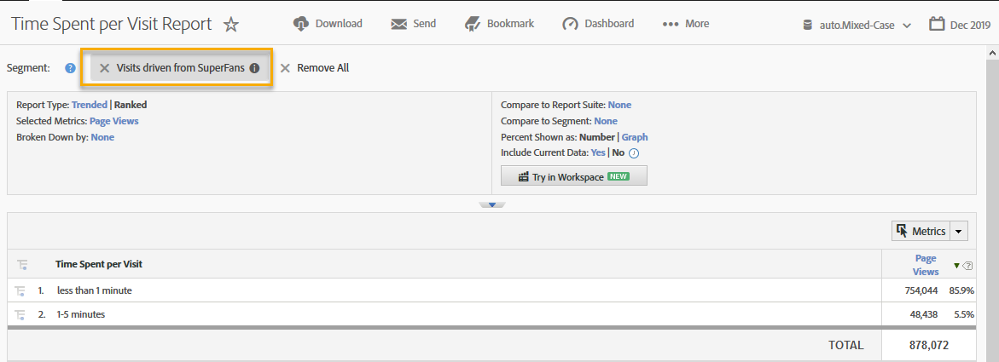

# De integratie gebruiken{#using-the-integration}

Nadat de implementatie is voltooid, kunt u beginnen met het gebruik van de extra mogelijkheden die deze integratie biedt.

> [!NOTE] Het kan 24 tot 48 uur duren voordat de responsgegevens van Qualtrics in uw Adobe Analytics-rapport worden weergegeven.

Hieronder vindt u een aantal acties die u kunt ondernemen om meerwaarde te krijgen van deze integratie vanuit Adobe Analytics.

1. Creeer een Segment gebruikend de gegevens van de enquêtereactie (zie [Creeer een segment](https://docs.adobe.com/content/help/en/analytics/components/segmentation/seg-home.html)).
1. Pas het segment toe op belangrijke rapporten.

## Voorbeeld {#section-07051d0d60a44408a4e108034586c42f}

In het volgende voorbeeld ziet u hoe een analist een Adobe Analytics-segment kan definiëren aan de hand van enquêtegegevens. In deze zaak wordt uitgegaan van een enquêtevraag als &quot;Hoe tevreden was u met uw bezoek vandaag?&quot; Met behulp van deze vraag kunnen we een segment maken om &quot;Ontevreden&quot; bezoekers te identificeren. Een dergelijk segment kan worden gebruikt om in Adobe Analytics-rapporten (zoals de Purchase Conversion Funnel) te gaan werken. Dit wordt hieronder weergegeven.

 

