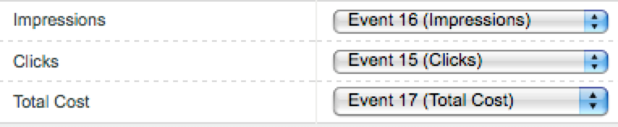

# Importeren [!UICONTROL Paid Search] cijfers met [!UICONTROL Data Sources]

Voor veel marketingorganisaties is betaalde zoekopdrachten een van de meest waardevolle en betrouwbare manieren &#x200B; nieuwe klanten te bereiken en bestaande klanten te behouden. De [!UICONTROL Data Sources] in Adobe Analytics is het gemakkelijk om geavanceerde betaalde zoekgegevens te importeren van digitale advertentieplatforms zoals Google AdWords. U kunt het met de rest van uw marketing gegevens, naast het gedrag en de gegevens van de klantenattributen ter plaatse integreren, om u betere inzichten in de betaalde onderzoeksinspanningen van uw organisatie toe te staan.

Deze stappen tonen u hoe te om een integratie met AdWords te vormen om sleutelwoordgegevens evenals metriek zoals impressies, kliks, kosten per klik, en meer in te voeren.

In de stappen wordt uitgelegd hoe u een eenmalige import van Pay-Per-Click-gegevens instelt. Maar [!UICONTROL Data Sources] Hiermee kunt u gegevens blijven importeren in de bestandsindeling die hier wordt beschreven. Afhankelijk van uw betaalde zoekplatform kunt u mogelijk periodieke exportbewerkingen (dagelijks, maandelijks, enz.) plannen, geautomatiseerde processen instellen om deze exportbewerkingen om te zetten in de bestandsindeling die Adobe Analytics nodig heeft, en deze bestanden uploaden naar Adobe Analytics voor de rapportage van betaalde zoekintegratie.

## Vereisten

* U hebt betaalde zoekdetectie geïmplementeerd.
* U vangt het volgen codegegevens.
* U hebt unieke volgcodes voor elke advertentiegroep.

## Configureren [!UICONTROL Success Events]

Onze eerste stap is om Adobe Analytics voor te bereiden op het ontvangen van de cijfers. Hiervoor moet u een aantal succesgebeurtenissen instellen.

[!UICONTROL Success events] zijn handelingen die kunnen worden bijgehouden. U bepaalt wat een [!UICONTROL success event] is. Voor het bijhouden van gegevens [!UICONTROL paid search] metriek, willen wij opstelling [!UICONTROL success events] rond [!UICONTROL clicks], [!UICONTROL impressions], [!UICONTROL total cost] en[!UICONTROL tracking codes].

1. Ga naar **[!UICONTROL Adobe Analytics > Admin > Report Suites]**.
1. Een rapportsuite selecteren.
1. Klik op **[!UICONTROL Edit Settings > Conversion > Success Events]**.

   

1. Onder Gebeurtenissen van het Succes van de Douane, gebruik **[!UICONTROL Add New]** om 3 aangepaste succesgebeurtenissen te maken: [!UICONTROL Clicks] (Teller), [!UICONTROL Impressions] (Teller) en [!UICONTROL Total Cost] (Valuta).

   

1. Klik op Opslaan.
Je ontvangt een bericht dat je bespaart is goedgekeurd.
1. Ga naar **[!UICONTROL Admin > Report Suites > Edit Settings > Conversion > Conversion Variables]**.
1. Trackingcodes inschakelen door het selectievakje naast **[!UICONTROL Tracking Code]** krachtens **[!UICONTROL Campaign > Campaign Variable]**.

   

## Gegevensbronnen instellen

[!UICONTROL Data Sources] kunt u niet-klikstreamgegevens delen met Adobe Analytics. In dit geval gebruiken we Adobe Analytics om betaalde zoekgegevens bij te houden. We gebruiken de trackingcode als onze sleutel om de twee stukken gegevens - betaalde zoekgegevens en Adobe Analytics-meetgegevens - samen te voegen.

1. Ga naar **[!UICONTROL Adobe Analytics > Admin > All admin > Data sources]**.
1. Selecteer **[!UICONTROL Create]** gebruiken om nieuwe gegevensbronnen te activeren.
1. Selecteer onder **[!UICONTROL Select Category]** de optie **[!UICONTROL Ad Campaign]**.

   

1. Selecteer onder **[!UICONTROL Select Type]** de optie **[!UICONTROL Generic Pay-Per-Click Service]**.
1. Klik op **[!UICONTROL Activate]**.
De [!UICONTROL Data Source Activation Wizard] weergaven:

   

1. Klikken **[!UICONTROL Next]** en geef uw gegevensbron een naam. Deze naam wordt weergegeven in Gegevensbronbeheer.
1. Accepteer de serviceovereenkomst en klik op **[!UICONTROL Next]**.
1. Selecteer de drie standaardmetriek: [!UICONTROL Impressions], [!UICONTROL Clicks] en [!UICONTROL Total Cost] en klik op **[!UICONTROL Next]**.
1. Nu &quot;kaart&quot;deze nieuwe gegevensbron aan de douanegebeurtenissen die wij binnen creeerden [Succesgebeurtenissen configureren](/help/admin/admin/c-success-events/t-success-events.md).

   

1. Kies gegevensafmetingen Het selectievakje naast Bijgehouden codes en klik op **[!UICONTROL Next]**.
1. Dimension van kaartgegevens.
Wijs de geïmporteerde gegevensdimensie (kenmerk) toe aan het Adobe Analytics-kenmerk waarin u het wilt opslaan. Dit kan een standaardafmeting of een eVar zijn. Nadat u op **[!UICONTROL Next]**, worden de resulterende toewijzingen weergegeven in het overzicht:

   

1. Klik op **[!UICONTROL Save]**.
1. Klikken **[!UICONTROL Download]** om het sjabloonbestand voor deze gegevensbron te downloaden.
De bestandsnaam komt overeen met het type gegevensbron dat u oorspronkelijk hebt opgegeven, in dit geval &quot;Algemene Pay-per-Click service template.txt&quot;.
1. Open de sjabloon in uw favoriete teksteditor.
Het bestand is al gevuld met de meetwaarden en afmetingen en de bijbehorende toewijzingen.

## PPC-gegevens exporteren en uploaden naar Analytics

Stappen gelijkend op dit werk voor Google Adwords, MSN, Yahoo, en andere rekeningen PPC.

### Gegevens exporteren

1. Meld u aan bij uw PPC-account en maak een nieuw rapport of exporteer het bestand.
Zorg ervoor dat het exporteren de volgende velden bevat: datum, doel-URL (bestemmingspagina), afbeeldingen, klikken en kosten. Het exporteren kan andere velden bevatten, maar u verwijdert deze door de onderstaande stappen te volgen.
1. Sla indien mogelijk het rapport op als een `.csv` of door tabs gescheiden bestand. Hierdoor wordt het gemakkelijker om met de volgende stappen te werken.
1. Open het bestand in Microsoft Excel.

### Het bestand bewerken in Microsoft Excel

1. Verwijder in Microsoft Excel alle andere kolommen dan de hierboven vermelde.
1. Verwijder eventuele extra rijen bovenaan.
1. De volgende codes isoleren van de doel-URL&#39;s: a. Kopieer en plak gegevens uit alle kolommen.
b. Klikken **[!UICONTROL Data > Text to Columns]**.
c. In Stap 1 van de tovenaar, zorg ervoor dat **[!UICONTROL Delimited]** is geselecteerd en klikt u op **[!UICONTROL Next]**.
d. Geef in Stap 2 van de wizard het scheidingsteken op, afhankelijk van de manier waarop u uw URL&#39;s hebt gemaakt (of ? of &amp;) en klik op **[!UICONTROL Next]**.
e. In Stap 3 van de tovenaar, voorproef uw gegevens en zorg ervoor dat één van de kolommen &quot;trackingcodename=trackingcode&quot;is. Herhaal deze stappen (met &amp; als scheidingsteken) als u aanvullende variabelen hebt.
f. Alle kolommen verwijderen, behalve voor trackingcodes, afbeeldingen, klikken en kosten. Voeg een nieuwe kolom met de naam Datum toe en deel de kolommen in de volgende volgorde in: Datum: Trackingcode: Impressies: Klik op: Kosten.
1. Voeg deze gegevens aan het malplaatje toe u in de &quot;van de Instelling Gegevensbronnen&quot;sectie hierboven downloadde.
U kunt het bestand nu uploaden.

### Bestand uploaden naar Adobe Analytics via FTP

Ga terug naar de wizard Gegevensbron voor instructies en upload het bestand via FTP:

## Berekende waarden maken

Het toevoegen van berekende metriek zal nuttig zijn wanneer het maken van loon-per-klikbesluiten.

U kunt deze bijvoorbeeld toevoegen [berekende meetwaarden](https://experienceleague.adobe.com/docs/analytics/components/calculated-metrics/calcmetric-workflow/cm-build-metrics.html?lang=en#calculated-metrics):

| Naam | Formule | Metrisch type | Beschrijving |
| --- | --- | --- | --- |
| Paginaweergaven per bezoek | Paginaweergaven/bezoeken | Numeriek | Bij toepassing op siteniveau: geeft het gemiddelde aantal pagina&#39;s per bezoek weer. Wanneer toegepast in het Populaire Rapport van Pagina&#39;s: geeft het gemiddelde aantal keren weer dat een specifieke pagina per bezoek is bekeken. |
| Gemiddelde bestelwaarde | Ontvangsten/bestellingen | Valuta | Toont gemiddelde opbrengst per orde. |
| Ontvangsten per bezoek | Ontvangsten/bezoeken | Valuta | Toont gemiddelde opbrengst per bezoek. |
| Doorkliksnelheid (CTR) | Klikken/impressies | Numeriek | Meet de verhouding van kliks tot beelden van een online advertentie of e-mailmarketing campagne. |
| Winst | Ontvangsten - kosten | Valuta | Toont de opbrengst van een campagne minus de kosten. |
| Winst per impressie (PPI) | (Inkomsten - Kosten)/Impressie | Valuta | Toont hoeveel opbrengst elke keer werd geproduceerd een advertentie, evenwichtig met kosten. |
| Retourneren op advertentie-uitgaven (ROAS) | Verkoopbedrag/advertentie-uitgaven | Valuta | (ROI) Geeft de verdiende dollars aan die aan de overeenkomstige reclame worden uitgegeven. |

## Rapporten configureren en uitvoeren

De laatste stap is de gegevensbronmetriek en om het even welke berekende metriek aan het Volgen rapport van de Code toe te voegen en neer in een campagne te boren om een directe mening van te krijgen hoe elke Advertentiegroep presteert.

1. In **[!UICONTROL Adobe Analytics > Reports]** selecteert u de rapportsuite waarin u gegevensbronnen hebt geïmporteerd.
1. Ga naar **[!UICONTROL Reports > Campaigns > Tracking Code > Tracking Code]**.
1. Selecteer het datumbereik.
1. Klikken **[!UICONTROL Metrics > Add]** en voeg uw gegevensbronmetriek (klik, Indruk, Totale Kosten) van de lijst van Standaard Metriek toe.
1. Doe hetzelfde voor berekende metriek die u hebt toegevoegd. Het rapport wordt bijgewerkt terwijl u metriek toevoegt.
