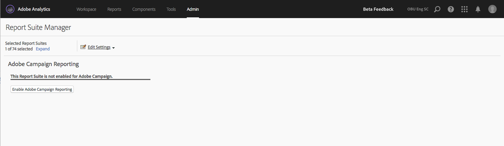

# Adobe Campaign Standard-rapportage

Raadpleeg de [Adobe Campaign-documentatie](https://helpx.adobe.com/nl/campaign/standard/integrating/using/about-campaign-analytics-integration.html) voor meer informatie over het configureren van deze integratie.

>[!IMPORTANT]
>Dit artikel is op Adobe Campaign **Standaard** slechts rapporterend van toepassing. Zie [ hier ](https://experienceleague.adobe.com/docs/analytics/integration/analytics-to-campaign-classic.html) voor het toevoegen van de Klassieke van Adobe Campaign **&#x200B;**&#x200B;rapportering.

Deze integratie tussen Adobe Analytics en Adobe Campaign Standard:

* U kunt uw KPI-data (Key Performance Indicator) van Adobe Campaign Standard delen met Adobe Analytics.
* Trackingformules worden aangevuld met Adobe Analytics-parameters.
* Voegt een nieuw rapport toe onder **[!UICONTROL Analytics]** > **[!UICONTROL Reports]** > **[!UICONTROL Adobe Campaign.]**
* Voegt vijf nieuwe Adobe Campaign-classificaties toe.
* Voegt 9 nieuwe cijfers voor Adobe Campaign toe.
* Voegt zes nieuwe Adobe Campaign-dimensies toe.
* Synchroniseert gegevens om de 15 minuten naar Analytics via een automatisch ingericht Data Source.

## Stap 1. Adobe Campaign Standard-rapportage inschakelen {#section_C685EF10505045708A6536BB13F6CD58}

Als u Campaign Standard-gegevens wilt weergeven in Analytics, moet u eerst Campagne-rapportage inschakelen in Report Suite Manager.

1. Ga naar  **[!UICONTROL Analytics]** > **[!UICONTROL Admin]** > **[!UICONTROL Report Suites]** > **`<select report suite>`** > **[!UICONTROL Edit Settings]** > **[!UICONTROL Adobe Campaign]** > **[!UICONTROL Adobe Campaign Reporting]**.
1. Klik op **[!UICONTROL Enable Campaign Reporting]**.

   

## Stap 2. Adobe Campaign-rapporten weergeven {#section_9C18A29F3CC54BD4AC5EA96417F17B33}

De integratie tussen Adobe Campaign Standard en Adobe Analytics voegt het volgende rapport toe onder **[!UICONTROL Analytics]** > **[!UICONTROL Reports]**

* **[!UICONTROL Adobe Campaign Executed Delivery ID]**: geeft gegevens weer die uit Adobe Campaign zijn geïmporteerd over e-mailberichten die vanuit Adobe Campaign zijn verzonden. |

## Stap 3. Adobe Campaign-classificaties gebruiken {#section_74A28AF3F4CA4091943789DE4D8B2B63}

**[!UICONTROL Analytics]** > **[!UICONTROL Admin]** > **[!UICONTROL Report Suites]** > **`<select report suite>`** > **[!UICONTROL Edit Settings]** > **[!UICONTROL Adobe Campaign]** > **[!UICONTROL Adobe Campaign Classifications]**

Zodra uw rapportsuite is ingeschakeld voor Adobe Campaign, zijn de volgende classificaties beschikbaar:

| Classificatie | Beschrijving |
| --- | --- |
| [!UICONTROL Delivery ID] | De interne Naam van de Levering die u in Campagne ziet |
| [!UICONTROL Delivery Label] | Aflevering in campagne - Aflevering/Herhaling aflevering/Transactie aflevering |
| [!UICONTROL Campaign ID] | De interne Naam van de Campagne die u in Campagne ziet |
| [!UICONTROL Campaign Label] | Campagne in Adobe Campaign |
| [!UICONTROL Executed Delivery Label] | Lijst van afzonderlijke uitgevoerde leveringen |

## Adobe Campaign Standard-afmetingen en -cijfers beschikbaar in Adobe Analytics {#section_F33385C9660644AF84172EC39601469B}

De volgende **cijfers** van Campaign zijn beschikbaar in de rapportsuite van Adobe Analytics:

* Adobe Campaign verzonden
* Adobe Campaign geopend
* Op Adobe Campaign geklikt
* Adobe Campaign geleverd
* Adobe Campaign eenmalig geopend
* Eenmalig op Adobe Campaign geklikt
* Lidmaatschap op Adobe Campaign opgezegd
* Totaal aantal bounces voor Adobe Campaign
* Instanties van uitgevoerde levering-id&#39;s van Adobe Campaign

De volgende **dimensies** van Campaign zijn beschikbaar in de rapportsuites van Adobe Analytics:

| Naam dimensie | Definitie |
| --- | --- |
| Campagne-id | Id van alle campagnes waarvoor tijdens de duur KPI&#39;s zijn verzonden. |
| Campagnelabel | Labels voor campagne-id&#39;s |
| Leverings-id | Id van alle leveringen waarvoor tijdens de duur KPI’s zijn verzonden. Omvat ook id’s van hoofdleveringen van terugkerende leveringen en transactieleveringen. Voorbeeld: Er is een terugkerende levering DM1 gepland en DM2, DM3, DM4 en DM5 zijn onderliggende leveringen van de terugkerende levering.  De levering-id geeft de resultaten weer voor alle leveringen, DM1 tot en met DM5. |
| Leveringslabel | Labels van levering-id&#39;s |
| Uitgevoerde levering-id | Id&#39;s van alleen uitgevoerde leveringen. Geen id van terugkerende/transactionele hoofdlevering. Voorbeeld: Er is een terugkerende levering DM1 gepland en DM2, DM3, DM4 en DM5 zijn onderliggende leveringen van de terugkerende levering. Uitgevoerde levering-id geeft resultaten weer voor alle leveringen vanaf DM2 tot en met DM5 - de leveringen die daadwerkelijk zijn uitgevoerd. |
| Uitgevoerd leveringslabel | Labels van uitgevoerde leverings-id&#39;s |
