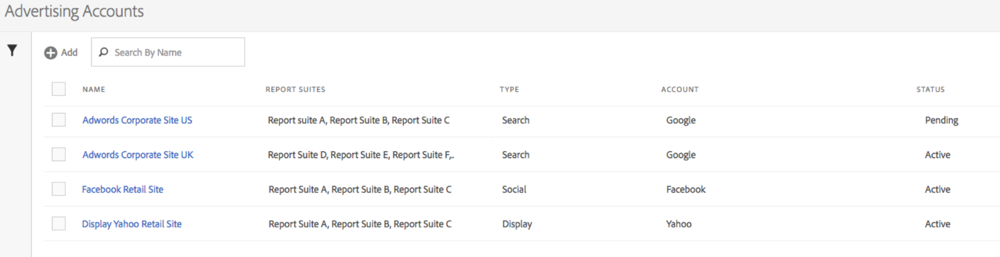

# Een advertentieaccount instellen

Adobe Analytics-beheerders kunnen nieuwe advertentieaccounts maken en meerdere accounts toewijzen aan meerdere rapportsuites (1:1, 1:Veel, Vele:Veel).

Beheerders kunnen ook [toegang verlenen aan niet-beheerders](/help/integrate/c-advertising-analytics/overview.md#section_FCC58EB635954A32990D4E67B52B4369) voor het opstellen van reclamerekeningen.

1. Navigeer in Adobe Analytics naar **[!UICONTROL Admin]** > **[!UICONTROL Advertising Accounts]**.
1. (Alleen voor de eerste keer) Accepteer de voorwaarden van de licentieovereenkomst voor eindgebruikers.
1. Klik op **[!UICONTROL + Add]**.
1. De [!UICONTROL New Search Engine Account] wordt weergegeven:

   

1. Vul de **[!UICONTROL Search Engine Settings]** deze richtsnoeren volgen :

   | Instelling | Beschrijving |
   | --- | --- |
   | Type | U hebt twee opties: Google AdWords en Microsoft Bing Ads.  Opmerking: Yahoo Gemini werd op 31 maart 2019 door Microsoft Bing geabsorbeerd. Als gevolg hiervan is de optie voor een Yahoo Gemini-advertentieaccount niet meer beschikbaar. |
   | Accountnaam | U kunt deze accountnaam instellen op elke gewenste naam. Dit is de vriendschappelijke naam van de rekening die in UI zal verschijnen. |
   | OAuth Token | **Opmerking:**  OAuth is een open norm voor toegangsdelegatie, algemeen gebruikt als manier om websites of toepassingen toegang tot hun informatie op andere websites te verlenen maar zonder hen de wachtwoorden te geven. U zult opmerken dat u aan een derde URL (efrontier.com) zult worden verpletterd. Adobe gebruikt efrontier om het OAuth authentificatieproces voor alle drie onderzoeksmotoren te aandrijven. Als u Internet Explorer 11 (of vroeger) gebruikt, zult u niet het token Oauth voor om het even welke drie onderzoeksmotoren met succes kunnen terugwinnen. Gebruik in plaats hiervan andere webbrowsers.
Klikken **[!UICONTROL Retrieve Token]** start het OAuth2-verificatieproces. U wordt gevraagd u aan te melden bij uw Google/Bing-zoekaccount met uw referenties. Afhankelijk van de zoekengine die u hebt gekozen, is het proces iets anders: <ul><li>Google-trefwoorden: Google-account-id opgeven</li><li>Microsoft Bing: Geef de Bing-account-id en de Bing-klant-id op.</li></ul>Zie [Account-id zoeken](/help/integrate/c-advertising-analytics/c-adanalytics-workflow/aa-locate-account-id.md) voor informatie over deze id&#39;s. Nadat u zich hebt aangemeld, kunt u de **[!UICONTROL OAuth Token]** veldweergaven **[!UICONTROL Retrieved]**. |

1. In de **[!UICONTROL Tracking]** in, geeft u informatie over hoe de gegevens van de zoekmachine worden bijgehouden door uw Adobe Analytics-implementatie. Dit is een vereiste stap om de Adobe Analytics-gegevens correct aan te vullen met de zoekengine-gegevens.
Vul de **[!UICONTROL Tracking Settings]** deze richtsnoeren volgen :

   | Instelling | Beschrijving |
   | --- | --- |
   | Type | <ul><li>**Automatisch:** Laat de Motor van Advertising Cloud beslissen hoe de het volgen parameters aan de het volgen malplaatjes/bestemmings URLs van de Motor van het Onderzoek worden toegevoegd. Dit is de eenvoudigste benadering, maar kan niet in de beste geïntegreerde dataset resulteren. **Belangrijk:** Als u een account voor een zoekmachine wilt configureren in de modus Automatisch, bent u verantwoordelijk voor het uitvoeren van de volgende handelingen: - De parameter &quot;s_kwcid&quot; en de waarde worden toegevoegd aan de sjablonen voor het bijhouden van accounts of aan de URL&#39;s van de landingspagina in de account die wordt toegevoegd. Deze wordt aan het einde van de URL ingevoegd. Als gevolg hiervan kan aanvullende actie van uw kant vereist zijn als uw webserver een bepaald sleutelwaardepaar aan het einde van de URL vereist OF een update ter ondersteuning van een nieuw sleutelwaardepaar in de URL. **Opmerking:** Meer informatie over het toevoegen van deze parameter aan uw [Beveiligingsbeleid voor inhoud](https://experienceleague.adobe.com/docs/id-service/using/reference/csp.html). - Daarnaast kunnen trefwoorden in de bestemmings-URL worden ingevoegd als onderdeel van de waarde &quot;s_kwcid&quot;, dus als deze speciale tekens of symbolen bevatten, moet u bevestigen dat uw webserver deze tekens kan ondersteunen (een voorbeeld van een speciale teken is &quot;+&quot;, dat wordt gebruikt in trefwoorden &quot;Uitgebreide overeenkomst gewijzigd&quot;).</li><li>**Handmatig:** Hiermee kunt u beheren hoe de volgende parameters worden toegevoegd aan de trackingsjablonen/doel-URL&#39;s van de zoekmachine. [Raadpleeg deze handmatige traceervoorbeelden voor elk zoekprogramma](/help/integrate/c-advertising-analytics/c-adanalytics-workflow/aa-manual-vs-automatic-tracking.md).</li></ul> |

1. In de **[!UICONTROL Mapping]** kiest u welke rapportsuite(s) u wilt koppelen aan dit zoekprogrammaaccount. U moet ten minste één rapportsuite opgeven voordat u het advertentieaccount kunt opslaan. U kunt veelvoudige rekeningen aan veelvoudige rapportreeksen (1:1, 1:Velen, Velen:Velen) in kaart brengen. Merk op dat de gegevens die AMO van de onderzoeksmotor trekt eenvoudig aan om het even welke in kaart gebrachte rapportreeks wordt gekopieerd, zodat is er geen splitsing van gegevens.

   >[!IMPORTANT]
   >
   >Alleen rapportsuites die zijn toegewezen aan een Experience Cloud-organisatie, kunnen worden geselecteerd. Als uw rapportsuite niet wordt weergegeven, raadpleegt u [Problemen met Advertising Analytics oplossen](/help/integrate/c-advertising-analytics/c-adanalytics-workflow/aa-troubleshooting.md).

   Voor de **[!UICONTROL Mapping Settings]** deze richtsnoeren volgen :

   | Instelling | Beschrijving |
   | --- | --- |
   | Toewijzing van rapportsuite | De rapportsuite-toewijzing bepaalt de rapportsuite die wordt gekoppeld aan dit zoekprogrammaaccount. Met andere woorden, het bepaalt in welke rapportsuite(s) de gegevens van de zoekmachine worden verzonden. |

1. Klik op **[!UICONTROL Save]**.
1. Nadat u het bestand hebt opgeslagen, wordt een lijst met voorbehouden weergegeven. U wordt gevraagd te bevestigen dat u hebt gelezen en dat u deze overeenkomst begrijpt. Klik op het selectievakje en klik vervolgens op **[!UICONTROL OK]**.

   U wordt nu doorgestuurd naar de advertentieaccounts [Gebruikersinterface voor beheer](/help/integrate/c-advertising-analytics/c-adanalytics-workflow/aa-manage-ad-accounts.md), waar je nieuwe account moet worden vermeld.

>[!NOTE]
>
>U moet ten minste 24 uur wachten voordat de zoekprogrammagegevens de analyserapporten invullen.
