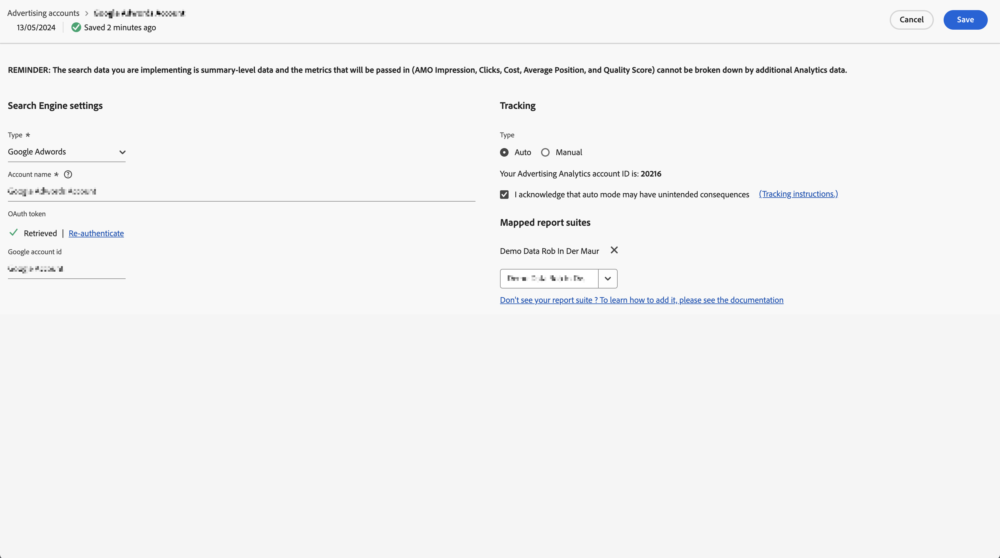

# Een advertentieaccount instellen

De Beheerders van Adobe Analytics kunnen nieuwe reclamerekeningen tot stand brengen en veelvoudige rekeningen in kaart brengen aan veelvoudige rapportreeksen (1:1, 1: Velen, Velen: Velen).

Beheerders kunnen ook [toegang verlenen aan niet-beheerders](/help/integrate/c-advertising-analytics/overview.md#section_FCC58EB635954A32990D4E67B52B4369) voor het opstellen van reclamerekeningen.

<!--

-->

1. Navigeer in Adobe Analytics naar **[!UICONTROL Admin]** > **[!UICONTROL Advertising Accounts]**.
1. (Alleen voor de eerste keer) Accepteer de voorwaarden van de licentieovereenkomst voor eindgebruikers.
1. Selecteren **[!UICONTROL + Add]**.
1. De [!UICONTROL New search engine setting] wordt weergegeven.

   

1. Vul de **[!UICONTROL search engine Settings]** deze richtsnoeren volgen :

   | Instelling | Beschrijving |
   | --- | --- |
   | **[!UICONTROL Type]** | U hebt twee opties: **[!UICONTROL Google Adwords]** en **[!UICONTROL Bing Ads]**.  Opmerking: Yahoo Gemini werd op 31 maart 2019 door Microsoft Bing geabsorbeerd. Als gevolg hiervan is de optie voor een Yahoo Gemini-advertentieaccount niet meer beschikbaar. |
   | Accountnaam | U kunt deze accountnaam instellen op elke gewenste naam.  Accountnaam is de vriendelijke naam van het account dat in de gebruikersinterface wordt weergegeven. |
   | OAuth Token | **Opmerking**: OAuth is een open norm voor toegangsdelegatie, algemeen gebruikt als manier om websites of toepassingen toegang tot informatie op websites te verlenen maar zonder wachtwoorden te verstrekken. U merkt dat u naar een externe URL (efrontier.com) wordt gerouteerd. De Adobe gebruikt Adobe Media Optimizer om het OAuth authentificatieproces voor alle drie onderzoeksmotoren te aandrijven. Als u Internet Explorer 11 (of eerder) gebruikt, kunt u het token Oauth niet ophalen voor een van de drie zoekmachines. Gebruik in plaats hiervan andere webbrowsers.
Selecteren **[!UICONTROL Retrieve Token]** om het OAuth2-verificatieproces te starten. U wordt gevraagd u aan te melden bij uw Google/Bing-zoekaccount met behulp van uw referenties. Afhankelijk van de gekozen procedure is het proces iets anders: <ul><li>Google Adwords: Geef Google-account-id op</li><li>Microsoft Bing: voer de gebruikersnaam van het bankaccount en de gebruikersnaam van de bieder in.</li></ul>Zie [Account-id zoeken](/help/integrate/c-advertising-analytics/c-adanalytics-workflow/aa-locate-account-id.md) voor informatie over deze id&#39;s. Als u zich met succes hebt aangemeld, kunt u **[!UICONTROL OAuth Token]** veldweergaven **[!UICONTROL Retrieved]**. |

1. In de **[!UICONTROL Tracking]** geeft u informatie over hoe u de gegevens kunt bijhouden met uw Adobe Analytics-implementatie. Het volgen is een vereiste stap om de gegevens van Adobe Analytics behoorlijk met de gegevens van het onderzoeksmotor te verhogen.
Vul de **[!UICONTROL Tracking Settings]** deze richtsnoeren volgen :

   | Instelling | Beschrijving |
   | --- | --- |
   | Type | <ul><li>**Automatisch**: Hiermee kan de Advertising Cloud-engine bepalen hoe de volgende parameters worden toegevoegd aan de trackingsjablonen/doel-URL&#39;s van de engine. [!UICONTROL Auto Type Tracking] is de eenvoudigste benadering, maar kan niet in de beste geïntegreerde dataset resulteren. **Belangrijk:** Een account voor een zoekmachine configureren met [!UICONTROL Auto Type Tracking], bent u verantwoordelijk voor het nemen van de volgende acties:<ul><li>De `s_kwcid` parameter en waarde worden toegevoegd aan de sjablonen voor het bijhouden van accounts of de bestemmingspagina-URL&#39;s in de account die wordt toegevoegd. De parameter en de waarde worden ingevoegd aan het einde van de URL. Mogelijk is aanvullende actie vereist als uw webserver een bepaalde `key=value` paar aan het einde van de URL. Of een update ter ondersteuning van nieuwe `key=value` paar in URL wordt vereist. **Opmerking**: Meer informatie over het toevoegen van deze parameter aan uw [Beveiligingsbeleid voor inhoud](https://experienceleague.adobe.com/en/docs/id-service/using/reference/csp).</li><li>Daarnaast kunnen trefwoorden in de bestemmings-URL worden ingevoegd als onderdeel van de `s_kwcid` waarde. Bevestig dat uw webserver deze tekens kan ondersteunen als de trefwoorden speciale tekens of symbolen bevatten. Een voorbeeld van speciale tekens is `+`, die wordt gebruikt in de trefwoorden &#39;Uitgebreide overeenkomst gewijzigd&#39;.</li></ul></li><li>**Handmatig**: Hiermee kunt u beheren hoe de volgende parameters worden toegevoegd aan de trackingsjablonen/doel-URL&#39;s van het zoekprogramma. [Raadpleeg deze handmatige traceervoorbeelden voor elk zoekprogramma](/help/integrate/c-advertising-analytics/c-adanalytics-workflow/aa-manual-vs-automatic-tracking.md).</li></ul> |

1. In de **[!UICONTROL Mapping]** selecteert u een of meer rapportsuites die u aan dit zoekprogrammaaccount wilt koppelen. U moet ten minste één rapportsuite opgeven voordat u het advertentieaccount kunt opslaan. U kunt veelvoudige rekeningen aan veelvoudige rapportsuites (1 in kaart brengen: 1, 1: Velen, Velen: Velen). Merk op dat de gegevens die Adobe Media Optimizer van de onderzoeksmotor trekt eenvoudig aan om het even welke in kaart gebrachte rapportreeks worden gekopieerd, zodat is er geen splitsing van gegevens.

   >[!IMPORTANT]
   >
   >Alleen rapportsuites die zijn toegewezen aan een Experience Cloud-organisatie, kunnen worden geselecteerd. Als uw rapportsuite niet wordt weergegeven, raadpleegt u [Problemen met Advertising Analytics oplossen](/help/integrate/c-advertising-analytics/c-adanalytics-workflow/aa-troubleshooting.md).

   Voor de **[!UICONTROL Mapping Settings]** deze richtsnoeren volgen :

   | Instelling | Beschrijving |
   | --- | --- |
   | Toewijzing van rapportsuite | De rapportsuite-toewijzing bepaalt de rapportsuite die wordt gekoppeld aan dit zoekprogrammaaccount. Met andere woorden, het bepaalt in welke rapportsuite(s) de gegevens van de zoekmachine worden verzonden. |

1. Selecteren **[!UICONTROL Save]**.
1. Een disclaimer geeft een lijst met waarschuwingen weer. Bevestig dat u deze overeenkomst hebt gelezen en begrepen. Schakel het selectievakje in en selecteer vervolgens **[!UICONTROL OK]**.

   U wordt nu doorgestuurd naar de advertentieaccounts [Gebruikersinterface voor beheer](/help/integrate/c-advertising-analytics/c-adanalytics-workflow/aa-manage-ad-accounts.md), waar je nieuwe account moet worden vermeld.

>[!NOTE]
>
>U moet ten minste 24 uur wachten voordat de gegevens van het zoekprogramma de analyserapporten gaan vullen.
