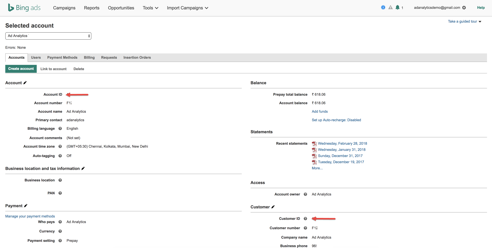

# Uw account-id&#39;s zoeken

Hier volgt een overzicht van hoe u uw account-id&#39;s voor Google en Bing kunt vinden.

## Google AdWords {#section_2A62AD448BD949889DB77C2AF3E04C33}

>[!IMPORTANT]
>
>Google AdWords gebruikt twee typen accounts: a) MCC (My Client Center)-account en b) standaardaccount. Voor deze integratie met Adobe Analytics **u moet een standaardaccountaanmelding gebruiken, niet een MCC-accountaanmelding**. De reden is dat een MCC-account fungeert als een &quot;paraplu&quot;-account dat toegang heeft tot meerdere AdWords-accounts met één aanmelding, terwijl de standaardaccountaanmelding slechts toegang heeft tot één AdWords-account per aanmelding. Hoewel Google het koppelen van één e-mail naar het beheer van 5 accounts ondersteunt, biedt Advertising Analytics nog geen ondersteuning voor deze functie. Eén e-mail kan slechts aan één rekening van Adwords worden gekoppeld.

Klik op het accountpictogram rechtsboven om het accountnummer van AdWords (Customer ID) weer te geven.

## Bing {#section_F1B9C7E997444746936599732CD62665}

>[!NOTE]
>
>Als uw Bing-account gebruikmaakt van de Google-importfunctie, moet u de juiste trackingtekenreeks bijwerken. De volgende tekenreeks wordt niet automatisch bijgewerkt van de Google-versie naar de juiste tekenreeks voor reeksspatiëring en kan resulteren in niet-opgegeven gegevens. Meer informatie over de functie vindt u [hier](https://help.ads.microsoft.com/apex/index/3/en/50851/).

Zowel de account-id als de klant-id zijn vereist. Deze worden weergegeven op het tabblad Accounts.

>[!NOTE]
>
>Het rekeningnummer is niet hetzelfde als de account-id.

