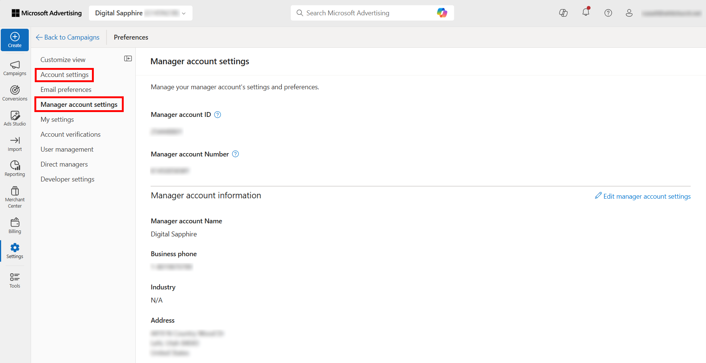

# Account-id&#39;s zoeken

Hier volgt een overzicht van hoe u uw account-id&#39;s voor Google en Bing kunt vinden.

## Google-advertenties (AdWords) {#section_2A62AD448BD949889DB77C2AF3E04C33}

>[!IMPORTANT]
>
>Google AdWords gebruikt twee typen accounts:
>
>- MCC-account (My Client Center) en
>- Standaardaccount.
>
>Voor deze integratie met Adobe Analytics, **moet u een Standaard login van de Rekening** gebruiken, niet MCC login van de Rekening. De reden is dat een MCC-account fungeert als een &quot;paraplu&quot;-account dat toegang heeft tot meerdere AdWords-accounts met één aanmelding, terwijl de standaardaccountaanmelding slechts toegang heeft tot één AdWords-account per aanmelding. Hoewel Google het koppelen van één e-mail naar het beheer van 5 accounts ondersteunt, biedt Advertising Analytics nog geen ondersteuning voor deze functie. Eén e-mail kan slechts aan één rekening van Adwords worden gekoppeld.

Klik op het accountpictogram rechtsboven om het accountnummer van AdWords (Customer ID) weer te geven.

## Microsoft Advertising (Bing) {#section_F1B9C7E997444746936599732CD62665}

>[!NOTE]
>
>Als uw Microsoft Advertising-account (voorheen bekend als Bing) gebruikmaakt van de Google-importfunctie, moet u de juiste tekenreeks voor bijhouden bijwerken. De tekenreeks voor reeksspatiëring wordt niet automatisch bijgewerkt van de Google-versie naar de juiste tekenreeks voor reeksspatiëring en kan resulteren in niet-opgegeven gegevens. Meer details op de eigenschap kunnen [ hier ](https://help.ads.microsoft.com/apex/index/3/en/50851/) worden gevonden.

**[!UICONTROL Account ID]** en **[!UICONTROL Account Number]** zijn beide vereist. Ze worden weergegeven op het tabblad **[!UICONTROL Accounts settings]** in **[!UICONTROL Settings]** .

>[!NOTE]
>
>Het rekeningnummer is niet hetzelfde als de account-id.

