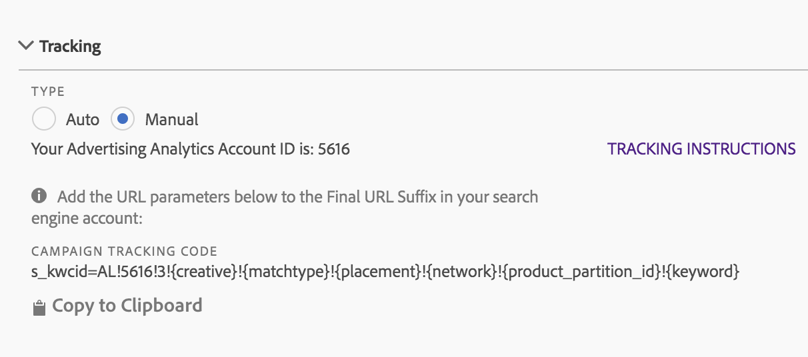

# Tekstspatiëring: Handmatige modus en Automatische modus

Met Volgen bepaalt u hoe de gegevens van de zoekmachine worden bijgehouden door de implementatie van Adobe Analytics. Dit is een vereiste stap om de gegevens van Adobe Analytics met de gegevens van de Motor van het Onderzoek behoorlijk te verhogen.

Twee traceringsmodi worden ondersteund: Automatische modus en Handmatige modus.

## Automatisch bijhouden {#concept_C4C6107838C947CFBB7F4E0CB94264F0}

In de modus Automatisch kunt u bepalen hoe de gegevens van de zoekmachine moeten worden verwerkt door de Cloud-engine voor advertenties. Dit is de eenvoudigere benadering, maar het kan niet in de beste geïntegreerde dataset resulteren.

Als u Automatische modus selecteert, moet u daarom een selectievakje voor een bevestiging inschakelen voordat u de accountinstelling kunt opslaan.


Als u een account voor een zoekmachine wilt configureren in de modus Automatisch, bent u verantwoordelijk voor het uitvoeren van de volgende handelingen:

* De parameter en de waarde &#39;s_kwcid&#39; worden toegevoegd aan de sjablonen voor het bijhouden van accounts of aan URL&#39;s van landingspagina&#39;s in de account die wordt toegevoegd. Deze wordt aan het einde van de URL ingevoegd. Aanvullende actie is mogelijk vereist van uw kant als uw webserver een bepaald sleutelwaardepaar aan het einde van de URL vereist OF een update ter ondersteuning van een nieuw sleutelwaardepaar in de URL. **Het is uw verantwoordelijkheid om ervoor te zorgen dat de toegevoegde URL-parameters correct blijven op de laatste bestemmingspagina.**
* Daarnaast kunnen trefwoorden in de bestemmings-URL worden ingevoegd als onderdeel van de waarde &quot;s_kwcid&quot;. Bevestig dat uw webserver deze tekens kan ondersteunen als deze speciale tekens of symbolen bevatten. Voorbeeld: Een veel voorkomend speciaal teken is &quot;+&quot;. Dit wordt gebruikt in de trefwoorden &quot;Uitgebreide overeenkomst gewijzigd&quot;.

## Handmatige modus bijhouden {#concept_87B28BA9E7F84BA5972F69E6F3482A33}

In de modus Handmatig moet u opgeven hoe de gegevens van de zoekmachine moeten worden verwerkt door het integratieproces van de gegevens van Advertising Analytics.

### Handmatig bijhouden toevoegen aan Google-account {#section_41C1EB1AEB034544A5BC291F53C05C67}

De tekenreeks die aan uw Google-account moet worden toegevoegd, wordt hieronder weergegeven. U moet de tekenreeks toevoegen aan al uw trackingsjablonen die in uw account worden gebruikt.

>[!IMPORTANT]
>
>De `<Advertising Analytics ID>` waarde (in **vet** verderop) is algemeen en **moet worden vervangen door de tekenreeks** voor uw specifieke account-id. U kunt de id-tekenreeks van uw specifieke account ophalen vanuit het scherm voor het instellen van de account onder de sectie &#39;Bijhouden&#39;.

**Tekenreeks voor campagnes:**

```
s_kwcid=AL! 
<b><Advertising Analytics ID></b>!3!{creative}!{matchtype}!{placement}!{network}!{product_partition_id}!{keyword}
```



Voorbeelden van volgcodes in verschillende sjabloonindelingen voor reeksspatiëring:

**`{lpurl}`**

```
{lpurl}?s_kwcid=AL!9999!3!{creative}!{matchtype}!{placement}!network}!{product_partition_id}!{keyword}
```

**`{lpurl}`met extra URL-parameter **

```
{lpurl}?campaign=PPC&s_kwcid=AL!9999!3!{creative}!{matchtype}!{placement}!network}!{product_partition_id}!{keyword}
```

**Andere leverancier (DoubleClick)`{unescapedlpurl}`**

```
https://clickserve.dartsearch.net/link/click?{_dssagcrid}&{_dssftfiid}&ds_e_adid={creative}&ds_e_matchtype={ifsearch:search}{ifcontent:content}&ds_e_device={device}&ds_e_network={network}&{ifpla:ds_e_product_group_id={product_partition_id}&ds_e_product_id={product_id}&ds_e_product_merchant_id={merchant_id}&ds_e_product_country={product_country}&ds_e_product_language={product_language}&ds_e_product_channel={product_channel}&ds_e_product_store_id={product_store_id}}&ds_url_v=2&ds_dest_url={unescapedlpurl}?s_kwcid=AL!9999!3!{creative}!{matchtype}!{placement}!{network}!{product_partition_id}!{keyword}
```

**Andere leverancier (DoubleClick)`{lpurl}`**

Als de URL een omleiding doorloopt en geen &quot;unescape edlpurl&quot;-waarde gebruikt, moet u de tekenreeks voldoende keer coderen zodat deze doorloopt naar de URL van de laatste bestemmingspagina.

```
https://clickserve.dartsearch.net/link/click?{_dssagcrid}&{_dssftfiid}&ds_e_adid={creative}&ds_e_matchtype={ifsearch:search}{ifcontent:content}&ds_e_device={device}&ds_e_network={network}&{ifpla:ds_e_product_group_id={product_partition_id}&ds_e_product_id={product_id}&ds_e_product_merchant_id={merchant_id}&ds_e_product_country={product_country}&ds_e_product_language={product_language}&ds_e_product_channel={product_channel}&ds_e_product_store_id={product_store_id}}&ds_url_v=2&ds_dest_url={lpurl}?s_kwcid%3DAL!9999!3!{creative}!{matchtype}!{placement}!{network}!{product_partition_id}!{keyword}
```

### Handmatig bijhouden toevoegen aan bankrekening {#section_094F8ACA493C4D65B1F54A695558EBF2}

De tekenreeks die aan uw Bing-account moet worden toegevoegd, wordt hieronder weergegeven. U moet de tekenreeks toevoegen aan alle laatste URL-achtervoegsels die in uw account worden gebruikt.

>[!IMPORTANT]
>
>De `<Advertising Analytics ID>` waarde (in **vet** verderop) is algemeen en **moet worden vervangen door de tekenreeks** voor uw specifieke account-id. U kunt de id-tekenreeks van uw specifieke account ophalen vanuit het scherm voor het instellen van de account onder de sectie &#39;Bijhouden&#39;.

**Tekenreeks voor campagnes:**

```
s_kwcid=AL!<Advertising Analytics ID>!10!{AdId}!{OrderItemId} 
```


Voorbeelden van volgcodes in verschillende uiteindelijke indelingen voor URL-achtervoegsels:

**{lpurl}**

```
{lpurl}?s_kwcid=AL!9999!10!{AdId}!{OrderItemId}`
```

**`{lpurl}`met extra URL-parameter **

```
{lpurl}?campaign=PPC&
s_kwcid=AL!9999!10!{AdId}!{OrderItemId}
```

**derden (DoubleClick) `{unescape edlpurl}**

```https://clickserve.dartsearch.net/link/click?{_dssagcrid}&{_dssftfiid}&ds_e_adid={creative}&ds_e_matchtype={ifsearch:search}{ifcontent:content}&ds_e_device={device}&ds_e_network={network}&{ifpla:ds_e_product_group_id={product_partition_id}&ds_e_product_id={product_id}&ds_e_product_merchant_id={merchant_id}&ds_e_product_country={product_country}&ds_e_product_language={product_language}&ds_e_product_channel={product_channel}&ds_e_product_store_id={product_store_id}}&ds_url_v=2&ds_dest_url={unescapedlpurl}?s_kwcid=AL!9999!10!{AdId}!{OrderItemId}

```

**Andere leverancier (DoubleClick)`{lpurl}`**

Als de URL een omleiding doorloopt en geen &quot;unescape edlpurl&quot;-waarde gebruikt, moet u de tekenreeks voldoende keer coderen zodat deze doorloopt naar de URL van de laatste bestemmingspagina.

```
https://clickserve.dartsearch.net/link/click?{_dssagcrid}&{_dssftfiid}&ds_e_adid={creative}&ds_e_matchtype={ifsearch:search}{ifcontent:content}&ds_e_device={device}&ds_e_network={network}&{ifpla:ds_e_product_group_id={product_partition_id}&ds_e_product_id={product_id}&ds_e_product_merchant_id={merchant_id}&ds_e_product_country={product_country}&ds_e_product_language={product_language}&ds_e_product_channel={product_channel}&ds_e_product_store_id={product_store_id}}&ds_url_v=2&ds_dest_url={lpurl}?s_kwcid%3DAL!9999!10!{AdId}!{OrderItemId}
```
