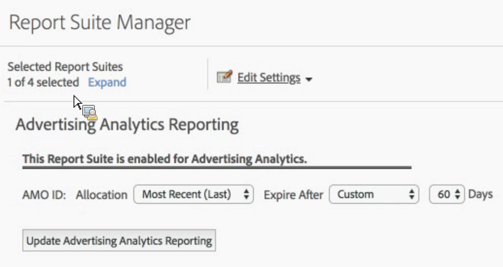

# Rapportsuite voor Advertising Analytics inschakelen

Als u zoekgegevens voor Advertising Analytics wilt bekijken in Analytics, moet u elke Experience Cloud-toegewezen rapportsuite configureren voor rapportage van Advertising Analytics.

1. [Wijs uw rapportsuite toe aan een organisatie](https://docs.adobe.com/content/help/en/core-services/interface/about-core-services/report-suite-mapping.html).
1. Ga naar **[!UICONTROL Admin]** > **[!UICONTROL Report Suites]**.

1. Selecteer de rapportsuite die is toegewezen aan uw Experience Cloud-organisatie.
1. Klik op **[!UICONTROL Edit Settings]** > **[!UICONTROL Advertising Analytics Configuration]**.

   

   > [!IMPORTANT] AMO-id verwijst naar de Adobe Advertising Cloud-variabele waarin de zoekgegevens worden ingevoegd.

1. Stel de variabele voor de toewijzing en vervaldatum van de AMO-id-variabele in. Met conversievariabelen (eVars) kan Adobe Analytics succesgebeurtenissen toewijzen aan specifieke variabelewaarden. Soms krijgen variabelen meer dan één waarde voordat ze een succesgebeurtenis raken. In deze gevallen bepaalt de toewijzing welke variabele krediet voor de gebeurtenis krijgt.

   | Instelling | Definitie |
   |--- |--- |
   | Oorspronkelijke waarde (eerste) | De eerste waargenomen waarde krijgt volledige toewijzingskrediet, ongeacht welke waarden voor die variabele volgen. |
   | Recentste (laatste) | De laatste waargenomen waarde krijgt volledige toewijzingskrediet voor de succesgebeurtenis, ongeacht welke variabelen daarvoor werden geactiveerd. |
   | Verlopen na | Hier kunt u een tijdsperiode of gebeurtenis opgeven waarna de waarde van Var vervalt (zodat er geen creditering voor succesgebeurtenissen meer wordt ontvangen).  Als een succesgebeurtenis optreedt na afloop van de periode Var, ontvangt de waarde None studiepunten voor de gebeurtenis (er was geen eVar actief). |

1. Klik **[!UICONTROL Enable Advertising Analytics Reporting]** (eerste keer) of **[!UICONTROL Update Advertising Analytics Reporting]** (volgende keer). Uw rapportsuite is nu gereed voor het ontvangen van zoekgegevens voor Advertising Analytics. U bent niet klaar om [advertentieaccounts](/help/integrate/c-advertising-analytics/c-adanalytics-workflow/aa-create-ad-account.md)te maken.

