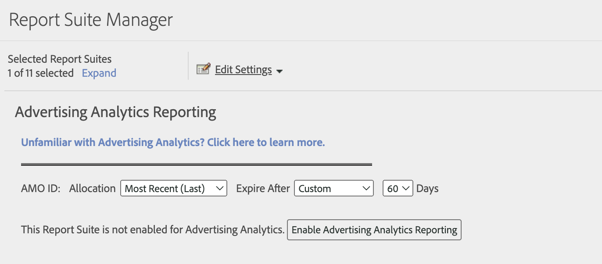

# Rapportsuite voor Advertising Analytics inschakelen

Om Advertising Analytics onderzoeksgegevens in Analytics te zien, moet u elke Experience Cloud-in kaart gebrachte rapportreeks voor Advertising Analytics rapportering vormen.

1. Ga naar **[!UICONTROL Admin]** > **[!UICONTROL Report Suites]**.

1. Selecteer de rapportsuite die aan uw organisatie van het Experience Cloud is toegewezen.
1. Klikken **[!UICONTROL Edit Settings]** > **[!UICONTROL Advertising Analytics Configuration]**.

   

   >[!IMPORTANT]
   >
   >AMO-id verwijst naar de Adobe Advertising Cloud-variabele (ook wel Adobe Media Optimizer genoemd) waarin de zoekgegevens worden ingevoegd.

1. Selecteren **[!UICONTROL Unfamiliar with Advertising Analytics? Click here to learn more]** voor meer informatie over Advertising Analytics.

1. Stel de variabele voor de toewijzing en vervaldatum van de AMO-id-variabele in. Met conversievariabelen (eVars) kan Adobe Analytics succesgebeurtenissen toewijzen aan specifieke variabelewaarden. Soms krijgen variabelen meer dan één waarde voordat ze een succesgebeurtenis raken. In deze gevallen bepaalt de toewijzing welke variabele krediet voor de gebeurtenis krijgt.

   | Instelling | Definitie |
   |--- |--- |
   | **[!UICONTROL Allocation]** | Selecteren tussen:  **[!UICONTROL Original Value (First)]**: De eerste waargenomen waarde krijgt volledige toewijzingskrediet, ongeacht welke waarden voor die variabele volgen.  **[!UICONTROL Most Recent (Last)]**: De laatste waargenomen waarde krijgt volledige toewijzingskrediet voor de succesgebeurtenis, ongeacht de variabelen die daarvoor zijn geactiveerd. |
   | **[!UICONTROL Expire After]** | Hier kunt u een tijdsperiode, of gebeurtenis, opgeven waarna de waarde van eVar vervalt (dat wil zeggen dat er geen krediet meer wordt ontvangen voor succesgebeurtenissen).  Als een succesgebeurtenis optreedt na het verlopen van de eVar, ontvangt de waarde None een creditering voor de gebeurtenis (er was geen eVar actief). |

1. Klikken **[!UICONTROL Enable Advertising Analytics Reporting]** (eerste keer), of **[!UICONTROL Update Advertising Analytics Reporting]** (volgende tijden). Uw rapportsuite is nu gereed om zoekgegevens van Advertising Analytics te ontvangen. U kunt nu [Advertentierekeningen maken](/help/integrate/c-advertising-analytics/c-adanalytics-workflow/aa-create-ad-account.md).
