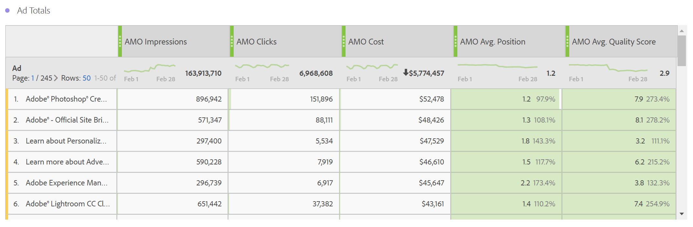

# Verslag over reclamegegevens

Dit artikel bevat nadere informatie over het Analysis Workspace-rapport en de rapportage in Report Builder.

>[!NOTE]
>
>U moet ten minste 24 uur wachten voordat de gegevens van het zoekprogramma worden ingevuld in de analyserapporten. Bij analyserapportage worden geen gegevens voor korreligheid per uur geretourneerd, omdat de gegevens in de Advertising Cloud geen ondersteuning bieden voor korreligheid per uur.

## Betaald zoekrapport {#section_8173F42B2C784F41B9FD82CBB66F9ADF}

Met dit rapport kan iedereen die de integratie met zoekprogramma&#39;s implementeert, toegang krijgen tot gegevens van zoekprogramma&#39;s in Analytics. U hebt toegang tot dit bestand via **[!UICONTROL Workspace]** > **[!UICONTROL Reports]** > **[!UICONTROL Acquisition]** > **[!UICONTROL Advertising Analytics: paid search]**

>[!NOTE]
>
>Alle klanten kunnen het rapport met betaalde zoekopdrachten zien, zelfs als u geen Advertising-accounts hebt geïmplementeerd. Als u probeert om het Betaalde onderzoeksrapport voor een bedrijf te openen dat niet provisioned is, zal een foutenmelding verklaren dat u geen rekening van de onderzoeksmotor hebt gevormd. Selecteer **[!UICONTROL Configure Now]**, die u aan het [&#x200B; scherm van de Opstelling van de Rekening van Advertising &#x200B;](/help/integrate/c-advertising-analytics/c-adanalytics-workflow/aa-create-ad-account.md) neemt.

       

| Tabel/Visualisatie | Beschrijving |
|--- |--- |
| Advertising Trends | Dagelijks trended-overzicht voor AMO-indrukkingen, AMO-klikken en AMO-kosten. |
| Ad-platforms | Donut-kaart voor de kosten van top 2 platforms (Google Ads, Microsoft Advertising). |
| Platformtotalen toevoegen | De tabel met vrije vormen van de topplatforms, uitgesplitst naar AMO-indrukkingen, AMO-klikken, AMO-kosten, AMO Avg. Positie, AMO Avg. kwaliteitsscore. |
| Accounts | Gestapeld kostengebied. |
| Accountotalen | De lijst van de Freeform van de hoogste rekeningen die door de bijbehorende metriek worden uitgesplitst. |
| Campagnes | Staafdiagram met campagnekosten. |
| Totalen campagne | De lijst van Freeform van de hoogste campagnes die door de bijbehorende metriek worden verdeeld. |
| Groepen | Boomoverzicht van kosten. |
| Totalen groeperen | Vrije-vormentabel van de belangrijkste reclamegroepen, uitgesplitst naar de bijbehorende cijfers. |
| Adds | Horizontale staafgrafiek van beelden, klikken, en kosten. |
| Totaal toevoegen | De tabel met vrije vorm van de bovenste advertenties, uitgesplitst naar de bijbehorende metriek. |
| Trefwoorden | Spreidingsgrafiek van beelden, klikken, en kosten voor alle sleutelwoord/gelijketypecombinaties. |
| Trefwoordtotalen | De lijst van Freeform van de hoogste sleutelwoord/gelijke typecombinaties die door de bijbehorende metriek worden verdeeld. |

## Report Builder {#section_8E0371CF81144C33990D909685D1726E}

Zodra u een Advertising Analytics-account hebt ingesteld, wordt het Advertising Analytics-rapport beschikbaar gesteld.
