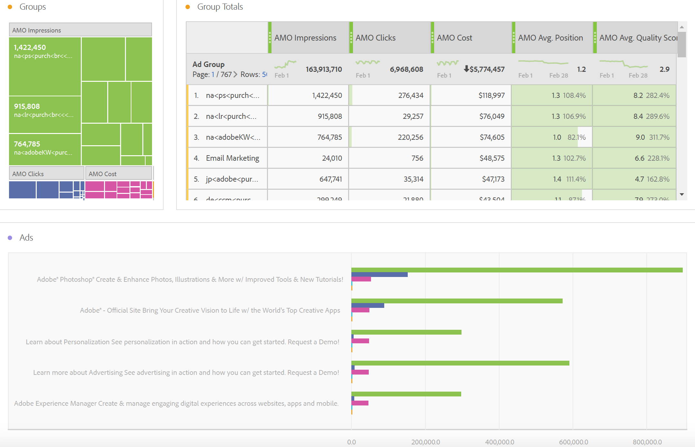
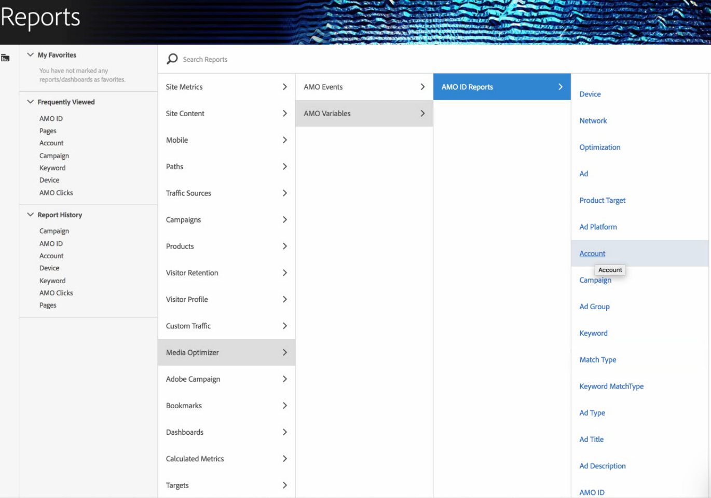

# Rapport over advertentiegegevens in Adobe Analytics

Details over het malplaatje van de Werkruimte van de Analyse, en het melden in Rapporten &amp; Analytics en de Bouwer van het Rapport.

> [!NOTE] U moet ten minste 24 uur wachten voordat de zoekprogrammagegevens worden ingevuld in de analyserapporten. Bij Analytics-rapportage worden geen gegevens voor korreligheid per uur geretourneerd, omdat de AMO-gegevens geen ondersteuning bieden voor korreligheid per uur.

## Analyse van werkruimte: Zoekmachines {#section_8173F42B2C784F41B9FD82CBB66F9ADF}

Met deze sjabloon kan iedereen die deze integratie met de zoekmachine implementeert, toegang krijgen tot copieuze zoekprogrammagegevens in Analytics. U kunt het openen via **[!UICONTROL Workspace]** > **[!UICONTROL Templates]** > **[!UICONTROL Advertising]** > **[!UICONTROL Search Engines.]**

>[!NOTE]
>
>De categorie Advertising Template is zichtbaar voor alle klanten, zelfs als u nog geen Advertising Accounts hebt geïmplementeerd. Nochtans, als u probeert om het malplaatje van de Motoren van het Onderzoek voor een bedrijf te openen dat niet provisioned is, zal een foutenmelding verklaren dat u nog geen Rekeningen van de Motor van het Onderzoek hebt gevormd. Klik in dit geval op **[!UICONTROL Configure Now]** deze knop om naar het scherm [Advertising Account Setup](/help/integrate/c-advertising-analytics/c-adanalytics-workflow/aa-create-ad-account.md) te gaan.

       

| Tabel/Visualisatie | Beschrijving |
|--- |--- |
| Reclametrends | Dagelijks trended-overzicht voor AMO-indrukkingen, AMO-klikken en AMO-kosten. |
| Ad-platforms | Donut-kaart voor kosten van top 2 platforms (Google, Bing). |
| Platformtotalen toevoegen | De tabel met vrije vormen van de topplatforms, uitgesplitst naar AMO-indrukkingen, AMO-klikken, AMO-kosten, AMO Avg. Positie, AMO Avg. Kwaliteitsscore. |
| Accounts | Gestapeld kostengebied. |
| Totaal account | De lijst van de Freeform van de hoogste rekeningen die door de bijbehorende metriek worden uitgesplitst. |
| Campagnes | Staafdiagram met campagnekosten. |
| Totalen campagne | De lijst van Freeform van de hoogste campagnes die door de bijbehorende metriek worden verdeeld. |
| Groepen | Overzicht van kosten. |
| Totalen groeperen | Vrije-vormentabel van de belangrijkste reclamegroepen, uitgesplitst naar de bijbehorende cijfers. |
| Adds | Horizontale staafgrafiek van beelden, klikken, en kosten. |
| Totaal toevoegen | De tabel met vrije vorm van de bovenste advertenties, uitgesplitst naar de bijbehorende metriek. |
| Trefwoorden | Spreidingsgrafiek van beelden, klikken, en kosten voor alle sleutelwoord/gelijketypecombinaties. |
| Trefwoordtotalen | De lijst van Freeform van de hoogste sleutelwoord/gelijke typecombinaties die door de bijbehorende metriek worden verdeeld. |

## Rapporten en analyses {#section_BB2E75DF909C49EA8D4E92D14D6DFD85}

Zodra u een account voor Advertising Analytics hebt ingesteld, wordt het verslag Advertising Analytics beschikbaar gesteld.

## Report Builder {#section_8E0371CF81144C33990D909685D1726E}

Zodra u een account voor Advertising Analytics hebt ingesteld, wordt het verslag Advertising Analytics beschikbaar gesteld.
