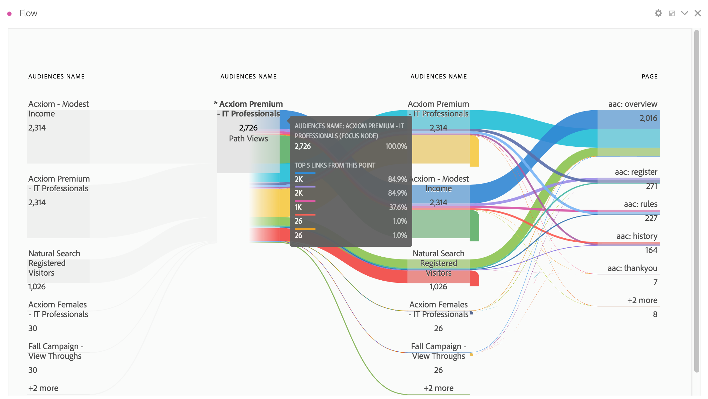
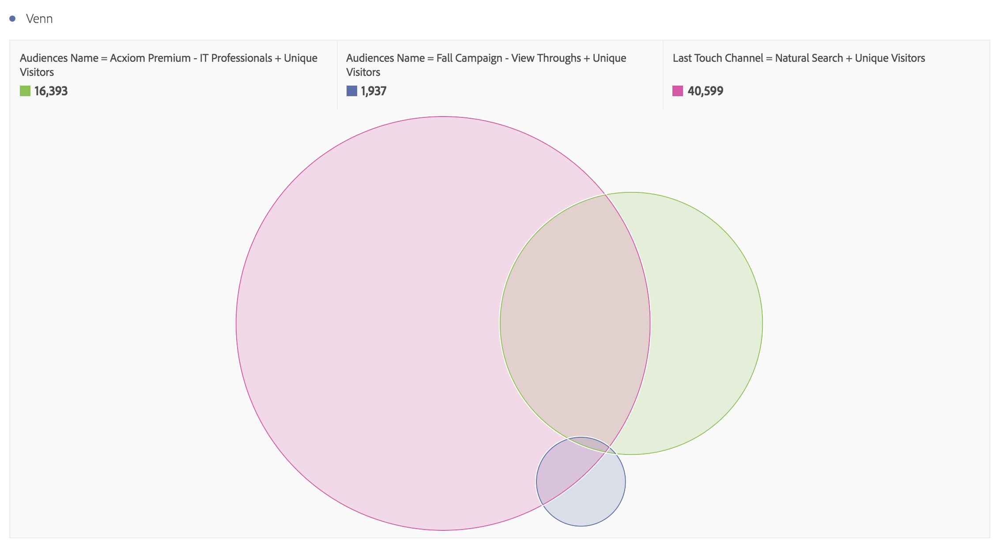
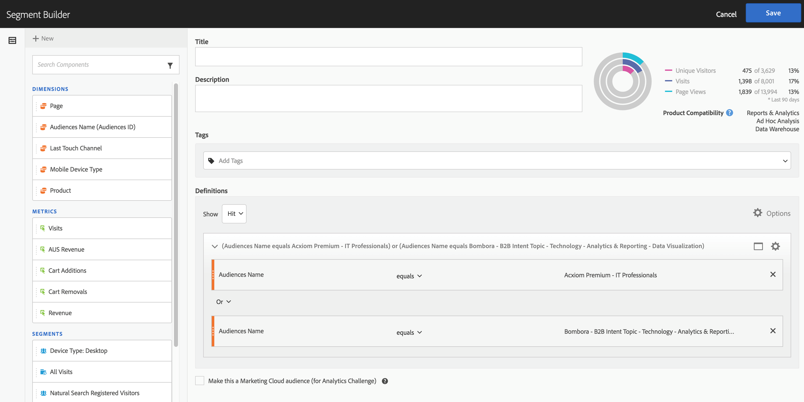

# De publieksgegevens in Analytics gebruiken

U kunt de afmetingen van het publiek van Adobe Audience Manager door Analytics gebruiken. De geïntegreerde segmenten zijn nieuwe dimensies van Analytics genoemd identiteitskaart van het publiek en de Naam van het publiek, en kunnen enkel als een andere dimensie worden gebruikt die Analytics verzamelt. In Gegevensfeeds worden de publiek-id&#39;s opgeslagen in de kolom &quot;mc_audiences&quot;. Deze afmetingen zijn momenteel niet beschikbaar in Data Workbench of LiveStream. Enkele voorbeelden van de manier waarop de dimensies van het publiek kunnen worden benut zijn:

## Analysis Workspace {#workspace}

In Analysis Workspace worden de Adobe Audience Manager-segmenten weergegeven als twee dimensies.

1. Ga naar **[!UICONTROL Workspace]** .
1. Selecteer in de lijst met **[!UICONTROL Dimensions]** de afmetingen **[!UICONTROL Audience ID]** of **[!UICONTROL Audience Name]** . Naam is een vriendelijke indeling van de id.

   

## Segmentvergelijking {#compare}

[ Vergelijking van het Segment ](/help/analyze/analysis-workspace/c-panels/c-segment-comparison/segment-comparison.md) ontdekt de statistisch meest significante verschillen tussen twee segmenten. De gegevens van het publiek kunnen in de Vergelijking van het Segment op twee manieren worden gebruikt: 1) als 2 segmenten die worden vergeleken, en 2) als punten in de &quot;Top Dimension Punten&quot;lijst.

1. Ga naar **[!UICONTROL Workspace]** en selecteer het deelvenster **[!UICONTROL Segment Comparison]** in de linkerrails.

1. Zoek naar [!UICONTROL Audiences Name] in het **[!UICONTROL Component]** menu.

1. Open [!UICONTROL Audiences Name] zodat de verwante afmetingspunten verschijnen.
1. Sleep het publiek u in de bouwer van de Vergelijking van het Segment wilt vergelijken.
1. (Optioneel): u kunt ook andere dimensie-items of -segmenten invoegen. U kunt maximaal twee items met elkaar vergelijken.
1. Klik op **[!UICONTROL Build]**.

   De dimensies Soorten publiek-id en Naam worden automatisch weergegeven in de tabel &quot;Top Dimension Items&quot;, omdat dit aanvullende profielgegevens zijn voor de twee segmenten die worden vergeleken.

   

## Klantenreis (Flow) in Analysis Workspace {#flow}

Adobe Audience Manager-segmentgegevens worden via hit-by-hit doorgegeven aan Analytics en geven het lidmaatschap van het publiek weer voor een bezoeker op dat moment. Dit betekent dat een bezoeker in één segment kan vallen (bijvoorbeeld &quot;Bewustmaking&quot;) en later in aanmerking kan komen voor een meer gekwalificeerd segment (bijvoorbeeld &quot;Bewustmaking&quot;). U kunt [ Stroom ](/help/analyze/analysis-workspace/visualizations/fallout/fallout-flow.md) in Analysis Workspace gebruiken om de reis visualiseren een bezoeker tussen publiek neemt.

1. Ga naar **[!UICONTROL Workspace]** en selecteer de **[!UICONTROL Flow]** visualisatie in de linkertrack.

1. Sleep de [!UICONTROL Audience Name] -dimensie naar de Flow Builder.
1. Klik op **[!UICONTROL Build]**.
1. (Facultatief): Sleep een andere afmeting in de visualisatie van de Stroom om een [ inter-dimensionale Stroom ](/help/analyze/analysis-workspace/visualizations/c-flow/multi-dimensional-flow.md) tot stand te brengen.

Het publiek kan ook in [ Vormt van de Vallout visualisaties ](/help/analyze/analysis-workspace/visualizations/fallout/fallout-flow.md) worden gebruikt.

## Venn Visualization in Analysis Workspace {#venn}

[ de visualisaties van de Venn ](/help/analyze/analysis-workspace/visualizations/venn.md) tonen de overlapping tussen maximaal 3 segmenten.

1. Ga naar **[!UICONTROL Workspace]** en selecteer de **[!UICONTROL Venn]** visualisatie in de linkertrack.

1. Zoek naar [!UICONTROL Audience Name] in het componentenmenu.
1. Open [!UICONTROL Audience Name] zodat de verwante dimensie-items worden weergegeven.
1. Sleep het publiek dat u wilt vergelijken naar de Venn builder.
1. (Optioneel): u kunt ook andere dimensie-items of -segmenten invoegen; maximaal 3 kunnen worden vergeleken.
1. Klik op **[!UICONTROL Build]**.

## Segment Builder {#builder}

U kunt de dimensies van het publiek in de Bouwer van het Segment van Analytics , samen met de gedragsinformatie opnemen die Analytics verzamelt.

1. Ga naar **[!UICONTROL Components]** > **[!UICONTROL Segments]** .
1. Klik op **[!UICONTROL Add]** om een nieuw segment te maken.
1. Nadat u het segment een naam hebt gegeven, sleept u de [!UICONTROL Audience Name] -dimensie naar het deelvenster Definities.
1. (Optioneel): voeg andere criteria toe aan het segment.
1. Sla het segment op.

   

