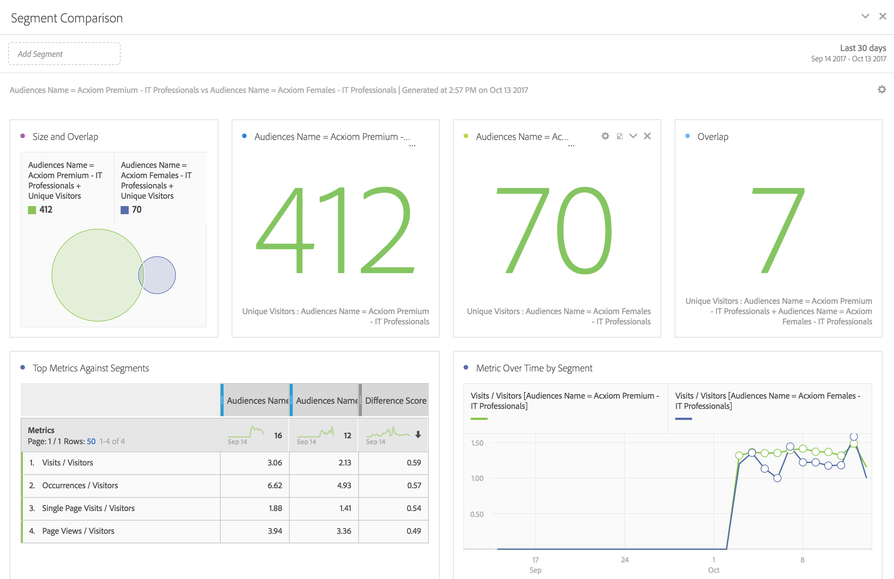

# De doelgroepdata in Analytics gebruiken

U kunt de afmetingen van het publiek van Adobe Audience Manager door Analytics gebruiken. De geïntegreerde segmenten zijn nieuwe dimensies van Analytics genoemd identiteitskaart van het publiek en de Naam van het publiek, en kunnen enkel als een andere dimensie worden gebruikt die Analytics verzamelt. In Gegevensfeeds worden de publiek-id&#39;s opgeslagen in de kolom &quot;mc_audiences&quot;. Deze afmetingen zijn momenteel niet beschikbaar in Data Workbench of LiveStream. Enkele voorbeelden van de manier waarop de dimensies van het publiek kunnen worden benut zijn:

## Analysis Workspace {#section_C70837499BEA4DED885B3486C9E02C68}

In Analysis Workspace worden de Adobe Audience Manager-segmenten weergegeven als twee dimensies.

1. Ga naar **[!UICONTROL Workspace]**.
1. Uit de lijst met **[!UICONTROL Dimensions]** selecteert u de afmetingen **[!UICONTROL Audience ID]** of **[!UICONTROL Audience Name]**. Naam is een vriendelijke indeling van de id.

   

## Segmentvergelijking {#section_E72B80B6470C42D4B9B19BE90E6070A2}

[Segmentvergelijking](https://experienceleague.adobe.com/docs/analytics/analyze/analysis-workspace/panels/segment-comparison/segment-comparison.html) ontdekt de statistisch meest significante verschillen tussen twee segmenten. De gegevens van het publiek kunnen in de Vergelijking van het Segment op twee manieren worden gebruikt: 1) als de 2 segmenten die worden vergeleken, en 2) als punten in de &quot;Top Dimension Items&quot;lijst.

1. Ga naar **[!UICONTROL Workspace]** en selecteert u de **[!UICONTROL Segment Comparison]** van de linkerspoorstaaf.

1. Zoeken naar [!UICONTROL Audiences Name] in de **[!UICONTROL Component]** -menu.

1. Openen [!UICONTROL Audiences Name]zodat de gerelateerde dimensie-items worden weergegeven.
1. Sleep het publiek u in de bouwer van de Vergelijking van het Segment wilt vergelijken.
1. (Optioneel): U kunt ook andere dimensie-items of -segmenten invoegen. Maximaal 2 kunnen worden vergeleken.
1. Klik op **[!UICONTROL Build]**.

   De dimensies Soorten publiek-id en Naam worden automatisch weergegeven in de tabel &quot;Items boven in Dimension&quot;, omdat dit aanvullende profielgegevens zijn voor de twee segmenten die worden vergeleken.

   

## Klantenreis (Flow) in Analysis Workspace {#section_FC30E5795C9D4539838E30FE11FAEA6E}

Adobe Audience Manager-segmentgegevens worden via hit-by-hit doorgegeven aan Analytics en geven het lidmaatschap van het publiek weer voor een bezoeker op dat moment. Dit betekent dat een bezoeker in één segment kan vallen (bijvoorbeeld &quot;Bewustmaking&quot;), en later in aanmerking komen voor een meer gekwalificeerd segment (bv. &quot;Overweging&quot;). U kunt [Stroom](https://experienceleague.adobe.com/docs/analytics/analyze/analysis-workspace/visualizations/fallout/fallout-flow.html) in Analysis Workspace om de reis van een bezoeker tussen het publiek zichtbaar te maken.

1. Ga naar **[!UICONTROL Workspace]** en selecteert u de **[!UICONTROL Flow]** visualisatie vanaf de linkerspoorstaaf.

1. Sleep de [!UICONTROL Audience Name] -dimensie in de Flow Builder.
1. Klik op **[!UICONTROL Build]**.
1. (Optioneel): Sleep een andere dimensie naar de stroomvisualisatie om een [interdimensionale stroom](https://experienceleague.adobe.com/docs/analytics/analyze/analysis-workspace/visualizations/flow/multi-dimensional-flow.html).

Soorten publiek kan ook worden gebruikt in [Afvalvisualisaties](https://experienceleague.adobe.com/docs/analytics/analyze/analysis-workspace/visualizations/fallout/fallout-flow.html).

## Venn Visualization in Analysis Workspace {#section_E78AB764FB5047148B51DC1526B0DF89}

[Venn-visualisaties](https://experienceleague.adobe.com/docs/analytics/analyze/analysis-workspace/visualizations/venn.html) Geef de overlapping tussen maximaal 3 segmenten weer.

1. Ga naar **[!UICONTROL Workspace]** en selecteert u de **[!UICONTROL Venn]** visualisatie vanaf de linkerspoorstaaf.

1. Zoeken naar [!UICONTROL Audience Name] in het componentmenu.
1. Openen [!UICONTROL Audience Name] zodat de gerelateerde dimensie-items worden weergegeven.
1. Sleep het publiek dat u wilt vergelijken naar de Venn builder.
1. (Optioneel): U kunt andere afmetingspunten of segmenten eveneens brengen; maximaal 3 kunnen worden vergeleken.
1. Klik op **[!UICONTROL Build]**.

## Segment Builder {#section_2AA81852A1404AB894472CA8959461B6}

U kunt de dimensies Soorten publiek opnemen in Analytics [Segment Builder](/help/components/segmentation/segmentation-workflow/seg-build.md), samen met de gedragsinformatie die Analytics verzamelt.

1. Ga naar  **[!UICONTROL Components]** > **[!UICONTROL Segments]** .
1. Klikken **[!UICONTROL Add]** om een nieuw segment te maken.
1. Na het noemen van het segment, sleep [!UICONTROL Audience Name] in het deelvenster Definities.
1. (Optioneel): Voeg andere criteria aan het segment toe.
1. Sla het segment op.

   

## Rapporten en analyses en Report Builder {#section_04E8FD30F73344D7937AD3C6CD19E34A}

1. Ga naar  **[!UICONTROL Reports]** > **[!UICONTROL Visitor Profile]** > **[!UICONTROL Audience ID Reports]** .
1. Vanuit deze map hebt u toegang tot de afmetingen Audience ID en Audience Name.

   
