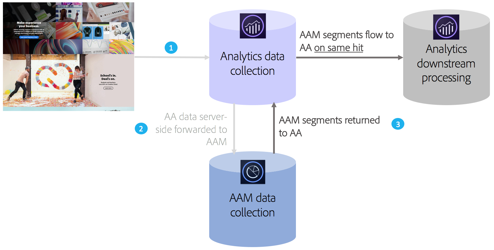

# Overzicht van Audience Analytics

Adobe Audience Manager (AAM) is een krachtig platform voor gegevensbeheer waarmee u unieke publieksprofielen kunt maken van de integratie van gegevens van de eerste partij, de tweede partij/partner en derden. Voor adverteerders helpen deze profielen de meest waardevolle segmenten te definiëren die over elk digitaal kanaal kunnen worden gebruikt.

Met de Audience Analytics-integratie kunt u AAM publieksgegevens, zoals demografische informatie (bijvoorbeeld geslacht of inkomensniveau), psychografische informatie (bijvoorbeeld interesses en hobby&#39;s), CRM-gegevens en imitatiegegevens in elke analyseworkflow opnemen.

>[!VIDEO](https://video.tv.adobe.com/v/25450/?quality=12)

## Belangrijkste voordelen {#section_94816D17283349E0BA28521BE55BB868}

De integratie van Audience Analytics biedt de volgende belangrijke voordelen:

* Het is de eerste productievere integratie tussen een Platform voor gegevensbeheer (DMP) en een analytische engine op de markt.
* De segmenten worden gedeeld van AAM aan Analytics in echt - tijd, om publieksontdekking, segmentatie, en optimalisering te informeren.
* Alle AAM segmenten worden standaard gedeeld en verrijken de klantprofielen in Analytics volledig.
* De beheerders van de oplossing kunnen de integratie door het gebruikersinterface toelaten, met minimale vereiste codeveranderingen.
* Alleen segmenten die zich houden aan besturingselementen voor het exporteren van Audience Manager-gegevens, worden gedeeld.

## Hoe het werkt {#section_CECDF5A0FEC64264B206EFEF54F19EF2}

1. Telkens wanneer een bezoeker naar uw digitale eigenschappen komt, worden de klappen verzameld en naar Analytics verzonden.
1. Met [server-kant door:sturen](/help/admin/admin/c-manage-report-suites/c-edit-report-suites/general/c-server-side-forwarding/ssf.md), wordt elke hit die Analytics ontvangt, automatisch verzonden naar AAM in real-time.
1. Door de Audience Analytics-integratie wordt voor elke hit het lidmaatschap van een bezoeker opgezocht in AAM en wordt een lijst met segment-id&#39;s geretourneerd aan Analytics voor verwerking in real-time.

Omdat AAM segmenten worden ingevoegd op basis van hetzelfde resultaat, kunt u er zeker van zijn dat alle gegevens die beschikbaar zijn in AAM over een bezoeker, niet worden overgeslagen en up-to-date zijn voor die hit. Dit is beter dan een insteekmodule AppMeasurement, omdat een insteekmodule deze segmenten alleen bij de volgende druk beschikbaar kan maken (in plaats van de huidige hit).

Bovendien classificeren wij automatisch AAM segment IDs aan hun vriendschappelijke namen voor u, zodat u niet alpha-numerieke IDs in de rapporten van de Analyse zult hoeven te bekijken.

## Vereisten {#section_A345DC31F7D44EAE9DC1AB53E824C0CC}

Zorg ervoor dat aan de volgende voorwaarden is voldaan:

* U bent een klant van zowel Audience Manager als Adobe Analytics.
* U bent beheerder van Audience Managers.
* U gebruikt identiteitsservice v1.5 of hoger.
* AAM- en Adobe Analytics-rapportreeksen worden toegewezen aan dezelfde Experience Cloud-organisatie.
* U gebruikt [server-kant door:sturen](/help/admin/admin/c-manage-report-suites/c-edit-report-suites/general/c-server-side-forwarding/ssf.md) en de [De module Audience Management](https://experienceleague.adobe.com/docs/audience-manager/user-guide/implementation-integration-guides/integration-other-solutions/audience-management-module.html) (geen DIL-code) - AppMeasurement 1.5 of hoger.

Deze voorwaarden worden beschreven in de [Audience Analytics Workflow](/help/integrate/c-audience-analytics/c-workflow/audiences-workflow.md).
