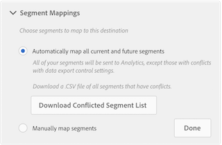

# Veelgestelde vragen

Antwoorden op vragen u zou kunnen hebben wanneer het uitvoeren van Analytics van het Publiek.

## Veelgestelde vragen over wetgeving {#section_B51CFC961C0B45A2BE5F4A4404620764}

<table id="table_22037CCB516C4231BF5820004FBB351A"> 
 <tbody> 
  <tr> 
   <td colname="col1"> <b>V: Hoe weet ik of ik persoonlijk Identificeerbare Informatie (PII) in mijn Analytische gegevens heb? Zo ja, wat doe ik eraan?</b> </td> 
   <td colname="col2"> 
    <ul id="ul_71E0ECD5981D4B65BCDA065BE07A43AA"> 
     <li id="li_F8FF61A4D7B54BA39DAA6F28DB51D749">Als u e-mails, adressen en dergelijke in een inleiding of eVar hebt, kunt u overwegen de gegevens tijdens de verzameling te hashen. </li> 
     <li id="li_57A8B4C7BB784FFCBC1DC363B35D9FF7">Als uw land IP adres als PII beschouwt, <a href="https://marketing.adobe.com/resources/help/en_US/reference/exclude_IP.html"  > schakel IP verwarring </a>. </li> 
     <li id="li_C7AA02B831AE47A59E783623126A7789">Bespreek met uw Analysebeheerder wat u verzamelt. </li> 
     <li id="li_F6AAE868141E486AB8CAB291BD8EDB71">Bespreek met uw Juridische Afgevaardigde wat zij PII achten. </li> 
    </ul> </td> 
  </tr> 
  <tr> 
   <td colname="col1"> <b>V: Hoe weet ik of mijn rapportsuites onsite personalisatie, of offsite/onsite het richten doen?</b> </td> 
   <td colname="col2"> 
    <ul id="ul_F0984CEF80DB4B589716BC55549E32B8"> 
     <li id="li_9BC3819784A9408F846D60FF0F20AAF9">Deze instellingen zijn niet van toepassing op het verzenden van Adobe Analytics-gegevens naar Adobe Audience Manager. </li> 
     <li id="li_050A1BF9978E436895B5C7E33A82527D">Vraag het uzelf: Wilt u een gedeeld segment Analytics met een MCA-dimensie delen met de Experience Cloud? </li> 
     <li id="li_C52D969681B94F4AAA18FDEB21EC5B49">Exporteert u (bijvoorbeeld via gegevensinvoer) naar een Business Intelligence-systeem (BI) dat voor deze doeleinden wordt gebruikt? </li> 
    </ul> </td> 
  </tr> 
 </tbody> 
</table>

## AAM-specifieke veelgestelde vragen {#section_6BDF746BA6464359A6A89A64EB025D12}

<table id="table_15B44592161240BDA79F3B020EA9CC9D"> 
 <tbody> 
  <tr> 
   <td colname="col1"> 
<b>V: Hoe creeer ik een bestemming van Analytics in de Manager van het Publiek?</b> 
 </td> 
   <td colname="col2"> Zie <a href="https://marketing.adobe.com/resources/help/en_US/aam/create-analytics-destination.html"  > Vorm een Bestemming van Analytics in AAM </a>. </td> 
  </tr> 
  <tr> 
   <td colname="col1"> 
<b>V: Hoe lang duurt het nadat u een analysedoel hebt gemaakt en opgeslagen, totdat er gegevens in mijn geselecteerde rapportsuite worden weergegeven?</b> 
 </td> 
   <td colname="col2"> 
Het kan enkele uren duren om nieuwe gegevens in uw rapportsuite te plaatsen. 
 </td> 
  </tr> 
  <tr> 
   <td colname="col1"> 
<b>V: Ik heb een nieuwe bestemming van Analytics gecreeerd, maar ik zie het niet in de sectie van Toewijzingen van de Bestemming van mijn beschikbare segmenten. Waar ging die bestemming heen of hoe vind ik het?</b> 
 </td> 
   <td colname="col2"> 
Een bestemming Analytics verdwijnt uit de sectie van de Toewijzingen van de Bestemming van een segment wanneer u  automatisch alle huidige en toekomstige segmenten  optie in de Toewijzingen van het  Segment selecteert . 
 
 
 
Selecteer   Handmatig segmenten toewijzen in plaats van de optie Automatisch om dit te voorkomen. 
 </td> 
  </tr> 
  <tr> 
   <td colname="col1"> 
 <b>V: Zal ik hier alle informatie van AAM, in Analytics krijgen?</b> 
 </td> 
   <td colname="col2"> 
Nr, slechts gegevens met betrekking tot mensen die aan uw plaats tijdens of na het inschakelen van het Publiek van de Manager van de Publiek en tijdens/na segmentkwalificatie komen. 
 </td> 
  </tr> 
  <tr> 
   <td colname="col1"> 
 <b>V: Zal dit me een per-segment totaal adresseerbaar publiek geven?</b> 
 </td> 
   <td colname="col2"> 
Niet echt. Het zal u het aantal bezoekers in dat segment vertellen die aan uw plaats tijdens of na segmentkwalificatie kwamen. 
 </td> 
  </tr> 
  <tr> 
   <td colname="col1"> 
 <b>V: Hoe verschilt dit van de oude cookie bestemming tot Analytics?</b> 
 </td> 
   <td colname="col2"> 
Segmenten worden gekwalificeerd voor en geretourneerd in real-time - op dezelfde hit. 
 
Vriendelijke namen worden automatisch weergegeven. 
 </td> 
  </tr> 
  <tr> 
   <td colname="col1"> 
<b>V: Wat als sommige van mijn verslagen persoonlijke gegevens hebben en sommigen niet?</b> 
 </td> 
   <td colname="col2"> 
Tip: Maak twee bestemmingen - voeg de reeksen van het persoonlijke gegevensrapport aan één bestemming en de niet-persoonlijke gegevens rapportreeksen aan andere toe. 
 </td> 
  </tr> 
 </tbody> 
</table>

## Analytische specifieke veelgestelde vragen {#section_67BFB1B1E48D4113A38B075C020931BA}

<table id="table_19AEAE0A3575423CB4F5F164DB5626D5"> 
 <tbody> 
  <tr> 
   <td colname="col1"> 
<b>V: Zal dit integratieoppervlak een dimensie of segment zijn in Analytics?</b> 
 </td> 
   <td colname="col2"> 
Als afmetingen: Soorten publiek-id en naam publiek. 
 </td> 
  </tr> 
  <tr> 
   <td colname="col1"> 
<b>V: Waar kan ik deze dimensies gebruiken in Analytics?</b> 
 </td> 
   <td colname="col2"> 
Bijna overal; ze worden net zo behandeld als elke andere dimensie die in Analytics wordt verzameld. Er is één uitzondering: Gegevens bevinden zich momenteel niet in Data Workbench. 
 </td> 
  </tr> 
  <tr> 
   <td colname="col1"> 
<b>V: Waarom zie ik geen gegevens die in Analytics komen?</b> 
 </td> 
   <td colname="col2"> 
U hebt waarschijnlijk conflicterende AAM-privacybesturingselementen tussen gegevensbron en doel. 
 </td> 
  </tr> 
  <tr> 
   <td colname="col1"> 
<b>V: Waarom ontbreken sommige van mijn segmenten in Analytics, alhoewel ik verkoos om alle segmenten te verzenden?</b> 
 </td> 
   <td colname="col2"> 
    <ul id="ul_B8938FD08C6F4F2387EDADDEF8089319"> 
     <li id="li_50A9BDF612304062913370F16BC882EF">Uw controles van de de gegevensuitvoer van AAM op de bestemming en in de de gegevensbronnen van segmenten kunnen tegenstrijdig zijn, verhinderend bepaalde segmenten worden verzonden. </li> 
     <li id="li_AF5D6F883D6F4D3192E0BF23CF12ADEA">Als u de eigenschappen van derdegegevens in uw segmenten gebruikt, kunnen die segmenten niet aan bestemmingen (een reeks rapportreeksen) worden gedeeld die persoonlijke gegevens bevatten. </li> 
    </ul> </td> 
  </tr> 
  <tr> 
   <td colname="col1"> 
<b>V: Waarom zie ik "Audience limit Rebage" in mijn Analytics-rapport? (Opmerking: dit wordt ook weergegeven als Publiek-id = -1 en "::max_audiences_over:::" in Data Warehouse)</b> 
 </td> 
   <td colname="col2"> 
Standaard verzendt de integratie Audience Analytics voor AAM alle segmenten waarvoor een bezoeker per hit in aanmerking komt naar Analytics. Als een bezoeker tot meer dan 150 segmenten AAM op één enkele klap behoort, worden de <b>150 onlangs gekwalificeerde segmenten</b> verzonden naar Analytics, terwijl de resterende lijst wordt beknot. 
 
Een extra vlag wordt verzonden naar Analytics die erop wijst dat de segmentlijst werd beknot, en vertoningen zoals "de grens van het publiek bereikte"in de dimensie van de Naam van het Publiek en "-1"in de dimensie van identiteitskaart van het Publiek. 
 
Hoewel het onwaarschijnlijk is dat een bezoeker bij een bepaald resultaat voor meer dan 150 segmenten in aanmerking komt, kan dit een klein percentage van de tijd zijn. Als de Audience Limit (Doellimiet van publiek bereikt) in uw rapportage voorkomt, hebt u twee opties: 
 
    <ul id="ul_8E290B2E32DC49738F6FD00CB0CE2BBB"> 
     <li id="li_12F498981EA949B5BCBD40ECC954C339"><b>Optie 1</b>: Blijf de integratie laten werken in zijn uit-van-de-doos staat, die de 150 onlangs gekwalificeerde segmenten voor een bepaalde bezoeker verzendt. </li> 
     <li id="li_CA4D5747AA4A4452929097807B604959"><b>Optie 2</b>: In AAM, kies de 150 segmenten die het belangrijkst aan uw zaken voor de integratie zijn. AAM controleert dan bezoekers tegen slechts die 150 segmenten. Het nadeel van deze benadering is dat u slechts die 150 segmenten over alle bezoekers ontvangt. Anderzijds kan de Optie 1-benadering onbeperkte segmenten bieden vanwege het per-raaktype van de integratie. </li> 
    </ul> </td> 
  </tr> 
  <tr> 
   <td colname="col1"> 
<b>V: Zullen extra servervraag aan Analytics voor deze integratie in rekening worden gebracht?</b> 
 </td> 
   <td colname="col2"> 
Nee. AAM-doelgroepen worden opgenomen in de server-side Analytics hit. Dit veroorzaakt geen extra servervraag aan (primaire of secundaire) Analytics. 
 </td> 
  </tr> 
 </tbody> 
</table>

## Veelgestelde vragen over doorsturen op de server (SSF) {#section_ADDE84ABCA0D4906B6235E92D185E0C6}

<table id="table_B7067B70FF85498896801F58D716202F"> 
 <tbody> 
  <tr> 
   <td colname="col1"> 
<b>V: Als ik oudere SSF heb uitgevoerd, moet ik ook naar Analytics Admin gaan en rapportsuite SSF inschakelen?</b> 
 </td> 
   <td colname="col2"> 
Ja. In de AAM bestemmingsopstelling, zult u slechts rapportsuites zien die SSF hebben aangezet. 
 </td> 
  </tr> 
  <tr> 
   <td colname="col1"> 
<b>V: Waarom kan ik niet bepaalde rapportsuites voor SSF in Analytics Admin aanzetten?</b> 
 </td> 
   <td colname="col2"> 
Alleen versies die zijn toegewezen aan uw Experience Cloud Org kunnen worden ingeschakeld. 
 </td> 
  </tr> 
 </tbody> 
</table>

Voor meer FAQs op dit onderwerp, zie [Server-kant Door:sturen Veelgestelde vragen](/help/admin/admin/c-server-side-forwarding/ssf-faq.md).

## Algemene veelgestelde vragen {#section_E55410BBFB624AAFB87ADCF7F036DDA3}

<table id="table_1F7C0C785F9C472286A96F8C25E8440B"> 
 <tbody> 
  <tr> 
   <td colname="col1"> 
 <b>V: Waarom tellen de segmentbezoeker verschillend tussen de Manager van het Publiek en Analytics?</b> 
 </td> 
   <td colname="col2"> 
Zie Verschillen in aantal bezoekers . 
 </td> 
  </tr> 
  <tr> 
   <td colname="col1"> 
<b>V: Wat is het verschil tussen "publiek" in AAM en "segmenten" in Analytics?</b> 
 </td> 
   <td colname="col2"> 
Zie Segmenten <a href="/help/integrate/c-audience-analytics/aam-analytics-segments.md"  > begrijpen in Analytics en Audience Manager </a>. 
 
AAM-doelgroepen worden verzonden en gedeeld als 'dimensie'-componenten die in Analytics moeten worden gebruikt. Zij zullen niet verschijnen als segmenten in de Bouwer van het Segment, bijvoorbeeld, maar als afmetingen die u segmenten kunt bouwen met. 
 </td> 
  </tr> 
  <tr> 
   <td colname="col1"> 
<b>V: Wat is het verschil tussen de Attributen van de Klant en klantengegevens die van AAM worden geïntegreerd?</b> 
 </td> 
   <td colname="col2"> 
Klantkenmerken zijn niet gebaseerd op tijd; zij zijn met terugwerkende kracht van toepassing en gaan verder. De geïntegreerde gegevens van AAM zijn tijd-gebaseerd en voorwaarts slechts. Bovendien is de Kenmerken van de Klant een raadplegingstabel voor de Identiteitskaart van de Bezoeker van de Wolk van de Ervaring, terwijl de integratie AAM gegevens in elke klap voor een bezoeker vastmaakt. 
 </td> 
  </tr> 
  <tr> 
   <td colname="col1"> 
<b>V: Hoe zit het met de oude aanpak van dit probleem, bijvoorbeeld de oude bèta- of Consulting-plug-in cookie-bestemmingen?</b> 
 </td> 
   <td colname="col2"> 
Wij adviseren dat u de nieuwe integratie uitvoert en oude bestemmingen verwijdert. 
 </td> 
  </tr> 
 </tbody> 
</table>

