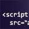

# Documentatie voor Adobe Analytics

Welkom bij de startpagina van het product Adobe Analytics en de technische documentatie. Hier kunt u zelfhulp en steuninformatie voor rapporteringshulpmiddelen zoals [!UICONTROL Analysis Workspace], [!UICONTROL Report Builder], het Melden API, [!UICONTROL Data Workbench]en [!UICONTROL Activity Map]vinden. U kunt ook documentatie openen voor product- en gebruikersbeheer, implementatie en alle functies die worden ondersteund in Adobe Analytics.

[Analytics Tools Guide](/help/analyze/home.md) - Biedt toegang tot de [Analyse Workspace](/help/analyze/analysis-workspace/home.md), de belangrijkste tool voor analyse en visualisatie voor Analytics. Bevat ook alle analysegereedschappen ([!UICONTROL Report Buidler], API voor rapportage [!UICONTROL Data Workbench]en [!UICONTROL Activity Map]) die u kunt gebruiken in Adobe Analytics.

[Admin Guide](/help/admin/home.md) - Meer informatie over het beheer van gebruikers en producten in de beheerconsole van de Experience Cloud, het configureren van rapportsuites, bedrijfsinstellingen, gegevensbeheer, gebruik van serveroproepen, verkeersbeheer en meer.

-[implementatiehandleiding](/help/implement/home.md) : pas aan welke gegevens worden verzameld om meer uit Adobe Analytics te halen. Bevat inhoud voor [!UICONTROL Adobe Experience Platform Launch] en JavaScript-implementaties.

[Componenten](/help/components/home.md) - Begrijp de functies die u helpen bij het ordenen van uw gegevens. De componenten omvatten segmenten, berekende metriek, virtuele rapportreeksen, alarm, en meer. Deze handleiding bevat ook een variabeleverwijzing, waarin alle beschikbare afmetingen en meetgegevens worden uitgelegd.

[export](/help/export/home.md) - Gegevens ophalen uit Adobe Analytics: Wordt gebruikt [!UICONTROL Data Feeds] om een uur- of dagelijkse export van onbewerkte gegevens te ontvangen. Haal een spreadsheetoutput van gegevens terug gebruikend [!UICONTROL Data Warehouse].

van de[Invoer](/help/import/home.md) - breng gegevens in Analytics van buitenbronnen, of in bulk of in real time. Omvat [!UICONTROL Data Sources], [!UICONTROL Data Insertion API]en [!UICONTROL Data Connectors].

-[integratiehandleiding](/help/integrate/home.md) - Integraties met andere Adobe Experience Cloud-oplossingen configureren, zoals Audience Manager, Advertising Cloud en Target.

[Media Analytics Guide](https://docs.adobe.com/content/help/en/media-analytics/using/media-overview.html) - Implementeer Analytics op audio- of videobronnen. Bevat de SDK van Media en de API voor mediagamatie.

[Data Workbench-hulplijnen](https://docs.adobe.com/content/help/en/data-workbench/using/home.html) - Leer meer over de uiterst flexibele, krachtige en meerkanaalsmogelijkheden van [!UICONTROL Data Workbench]. Inclusief [!UICONTROL Data Workbench Client], Installatie, [!UICONTROL Dataset Configuration] hulplijnen en meer.

 Analytics - Een kennisbasis die nuttige artikelen bevat die niet tot een specifiek analysehulpmiddel of een specifieke component behoren.

| Nieuwe en aanbevolen objecten | Belangrijke bronnen voor analyse |
| --- | --- |
| <ul><li>[Regionale gegevensverzameling](/help/technotes/rdc/regional-data-collection.md)</li><li>[Prestaties van werkruimten optimaliseren](/help/analyze/analysis-workspace/workspace-faqs/optimizing-performance.md)</li><li>[Analyse van productvergelijking](/help/admin/c-analytics-product-comparison/analytics-product-comparison.md)</li><li>[Welk hulpprogramma van Adobe Analytics moet ik gebruiken?](/help/admin/c-analytics-product-comparison/which-analytics-tool.md)</li></ul>  Zie ook: Documentatieupdates [2019](doc-updates.md) | <ul><li> [Opmerkingen bij de release](https://marketing.adobe.com/resources/help/en_US/whatsnew/)</li><li> [Adobe Analytics Youtube-kanaal](https://www.youtube.com/channel/UC8I6bqCk7gO6YdoMz6W5fvw)</li><li>[Zelfstudies en video&#39;s voor analyse](https://helpx.adobe.com/analytics/kt/index/analytics-videos.html)</li><li>[Forum Analytics Community](https://forums.adobe.com/community/experience-cloud/analytics-cloud/analytics)</li><li>[Persoonlijke training en virtuele klassen](https://training.adobe.com/training/courses.html#solution=adobeAnalytics)</li><li>[Experience League](https://landing.adobe.com/experience-league/)</li><li>[Contact opnemen met de klantenservice](https://helpx.adobe.com/support/analytics.html)</li></ul> |

<!-- Keep around for now

## Analytics reporting capabilities

Here is a comprehensive list of and links to all the reporting capabilities in Adobe Analytics.

* [Analysis Workspace](/help/analyze/analysis-workspace/analysis-workspace-features.md)
* [Report Builder](/help/analyze/report-builder/home.md)
* [Data Warehouse](/help/export/data-warehouse/data-warehouse.md)
* [Mobile Services UI](https://docs.adobe.com/content/help/en/mobile-services/using/home.html)
* [Data Workbench](https://docs.adobe.com/content/help/en/data-workbench/using/home.html)
* [Reports & Analytics](/help/analyze/reports-analytics/getting-started.md)
* [Ad Hoc Analysis](/help/analyze/ad-hoc-analysis/adhoc-home.md)

### Analytics feature list

*   [Activity Map](/help/analyze/activity-map/activity-map.md)
*   [Anomaly Detection](/help/analyze/analysis-workspace/virtual-analyst/c-anomaly-detection/statistics-anomaly-detection.md)
*   [Bot filtering](/help/admin/admin/bot-removal/bot-rules.md)
*   [Calculated Metrics](/help/components/c-calcmetrics/cm-overview.md)
*   [Classifications](/help/components/c-classifications2/c-classifications.md)
*   [Cohort Analysis](/help/analyze/analysis-workspace/visualizations/cohort-table/cohort-analysis.md)
*   [Contribution Analysis](/help/analyze/analysis-workspace/virtual-analyst/c-anomaly-detection/anomaly-detection.md)
*   [Data Connectors](https://www.adobeexchange.com/experiencecloud.html)
*   [Data Feeds](/help/export/analytics-data-feed/data-feed-overview.md)   
*   [Data Sources](/help/import/c-data-sources/datasrc-home.md)  
*   [Fallout](/help/analyze/analysis-workspace/visualizations/fallout/fallout-flow.md)
*   [Flow](/help/analyze/analysis-workspace/visualizations/c-flow/flow.md)
*   [Intelligent Alerts](/help/components/c-alerts/intellligent-alerts.md)
*   [Mobile App SDK](https://docs.adobe.com/content/help/en/mobile-services/using/home.html)  
*   [Real-time reporting](/help/components/c-real-time-reporting/realtime.md)
*   [Segmentation](/help/components/c-segmentation/seg-home.md)
*   [Segment Comparison](/help/analyze/analysis-workspace/c-panels/c-segment-comparison/segment-comparison.md)
*   [Video Tracking](https://docs.adobe.com/content/help/en/media-analytics/using/media-overview.html)
*   [Virtual Report Suites](/help/components/vrs/vrs-about.md)

## Contact options

Support delegates can get assisted support via:

**In-Product:**

1.  [Sign in to Adobe Analytics.](https://sc.omniture.com/login/)
2.  Navigate to **Help** > **Customer Care**.

**Phone:** 1-800-497-0335 (US & Canada).

Get [phone numbers for other regions](https://helpx.adobe.com/contact/dma-external/DMACustomeCareRegionalPhoneNumbers.html).

**Email:**

1.  Include [case details](https://helpx.adobe.com/experience-cloud/enterprise-email-support-guidelines.html) to open a ticket via email. 
1.  Send your case to [customercare@adobe.com](mailto:customercare@adobe.com).

Not sure if you're a **support delegate**? Find out if this [user type applies to you](https://helpx.adobe.com/experience-cloud/supported-users.html) and learn about our [enterprise support terms](https://helpx.adobe.com/support/programs/enterprise-support-terms.html).
 -->
