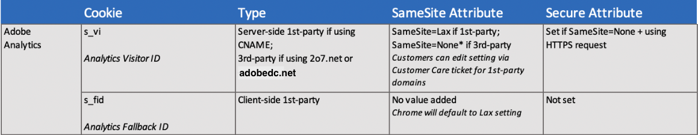

# Adobe Analytics en browsercookies

Adobe Analytics reageert op wijzigingen in de manier waarop browsers cookies verwerken om permanente gebruikersidentificatie tussen eigenschappen en oplossingen te ondersteunen. In de volgende veelgestelde vragen wordt informatie gegeven over hoe permanente bezoekersidentificatie behouden blijft met wijzigingen in browsercookies.

## Hoe veranderen browsers de manier waarop ze cookies verwerken?

In het algemeen worden de meeste browsers steeds restrictiever in de manier waarop ze cookies van derden bewaren. Dit kan het volgen beïnvloeden als het koekje wordt geschrapt of door browser wordt verworpen. De Safari-browser stelt bovendien enkele beperkingen in voor bepaalde cookies van andere bedrijven.

In de volgende lijst worden enkele recente wijzigingen weergegeven, afhankelijk van browsers:

* Chroom: Beginnend met Chrome 80, wordt het `SameSite` attribuut verschillend behandeld om derdekoekjes of intersite verzoeken te beheren. Uiteindelijk zoeken Chrome-ontwikkelaars manieren om cookies [van andere bedrijven volledig te](https://blog.chromium.org/2020/01/building-more-private-web-path-towards.html?m=1) vervangen.

* Firefox en Edge: In productaankondigingen wordt aangegeven dat opeenvolgende versies van hun browsers dezelfde wijzigingen moeten doorvoeren als in Chrome 80.

* Safari: Met [Safari 12.1](https://webkit.org/blog/category/privacy/)is de vervaldatum van eerste permanente cookies die zijn ingesteld via de document.cookie-API, vaak ook wel &#39;client-side&#39; cookies genoemd, beperkt tot zeven dagen.

## Wat is het verschil tussen cookies van derden en cookies van andere leveranciers?

### Cookies van eerste bedrijven

Cookies van eerste partijen worden gemaakt door websites van klanten (domeinspecifiek) en opgeslagen in clientbrowsers als gebruikers websites van klanten bezoeken. Alle browsers accepteren cookies van de eerste partij. In een first-party cookie Analytics implementatie, wordt het bezoeker identiteitskaart koekje gecreeerd bij een knoop van Adobe wanneer hostname met het domein door gebruik van een [CNAME](https://docs.adobe.com/content/help/en/id-service/using/reference/analytics-reference/cname.html)in overeenstemming wordt gebracht. Het cookie wordt vervolgens door de browser geaccepteerd in een context van een eerste partij. Zie [Informatie over cookies](https://docs.adobe.com/content/help/en/core-services/interface/ec-cookies/cookies-first-party.html)van andere bedrijven voor meer informatie.

### Cookies van andere bedrijven

Cookies van derden worden niet gemaakt door websites die gebruikers bezoeken. Hoewel browsers momenteel alle cookies van derden op dezelfde manier behandelen en deze op dezelfde manier opslaan, kunnen cookies van derden zich op verschillende, belangrijke manieren gedragen. Met de Analytics-implementatie van derden voor cookies van een klant doet de client alleen aanroepen naar Adobe en niet naar onbekende of verdachte domeinen van derden. Dit is de huidige methode voor het uitvoeren van Analytics voor veilige (HTTPS) en het betrouwbare volgen met blijvende herkenningstekens. Deze methode wordt uitgevoerd door het dossier te vormen AppMeetings.js. Voor meer informatie, zie [Cookies en de Dienst](https://docs.adobe.com/content/help/en/id-service/using/intro/cookies.html)van de Identiteit van het Platform van de Ervaring.

## Hoe slaan en beheren browsers momenteel de cookies van Analytics?

Afhankelijk van de implementatie worden de cookies van Analytics als volgt opgeslagen:

### Implementaties van cookies van andere bedrijven

In browsers wordt de Adobe [demdex.net](https://docs.adobe.com/content/help/en/audience-manager/user-guide/reference/demdex-calls.html) -id momenteel opgeslagen als een cookie van derden. Deze cookie biedt permanente id&#39;s in verschillende domeinen en maakt beveiligde inhoud (https) mogelijk.

### First-party koekjesimplementaties

Door een CNAME te configureren, kan uw gebruiker Adobe-cookies ontvangen in een cookie-context van de eerste fabrikant voor de browser. Dit kan handig zijn als een cookie-implementatie van een andere fabrikant niet optimaal is voor uw gebruikers.

## Wat is het koekjesattribuut SameSite en hoe beïnvloedt het Analytics?

Met de versie van Chrome 80 browser-en opeenvolgende versies van Firefox, en browsers-de koekjesattribuut SameSite dwingt het koekjesattribuut de specificatie voor drie verschillende waarden voor het controleren van het gedrag van dwars-plaats het vragen af, als volgt:

* `None`: Met deze instelling hebt u toegang tot andere sites en kunnen cookies worden doorgegeven in een context van derden. Als u dit kenmerk wilt opgeven, moet u ook opgeven `Secure` en moeten alle browseraanvragen HTTPS volgen. Wanneer u bijvoorbeeld de cookie instelt, combineert u de waarden van het kenmerk als volgt: `Set-Cookie: example_session=test12; SameSite=None; Secure`. Als de cookies niet correct zijn gelabeld, kunnen ze niet meer worden gebruikt door de nieuwere browsers en worden ze afgewezen.

* `Lax`: Hiermee staat u toe dat aanvragen voor andere sites alleen worden verzonden met cookies op dezelfde site voor navigaties op het hoogste niveau met *veilige* (alleen-lezen, zoals `GET`) HTTP-methoden.

* `Strict`: Dezelfde-site cookie wordt niet verzonden voor externe websiteaanvragen. Het cookie wordt alleen verzonden als de site voor het cookie overeenkomt met de site in de URL-balk.

Het standaardgedrag in deze browserversies is dat cookies zonder opgegeven `SameSite` kenmerk op dezelfde manier worden behandeld als cookies `SameSite=Lax`.

## Hoe reageert Adobe Analytics op deze wijzigingen?

Alle Adobe-cookie-updates worden verwerkt via Adobe-servers en Adobe heeft de Edge-servers bijgewerkt om de juiste cookie-kenmerken in te stellen. Adobe heeft updates op de server uitgebracht om cookies van derden met de juiste kenmerken in te stellen. Er zijn geen JavaScript-updates vereist voor uw sites.

Deze upgrade door Adobe Edge-servers wordt automatisch uitgevoerd wanneer gebruikers een website bezoeken waar de cookie wordt gebruikt. Voor de meeste Adobe-producten hebben cookies de juiste markeringen omdat Chrome 80 wordt uitgebracht. De uitzondering hierop vormen implementaties van Adobe Analytics waarbij gebruik wordt gemaakt van gegevensverzameling van derden en die geen gebruik maken van de Experience Cloud Identity Service (ECID). Deze klanten kunnen een kleine, tijdelijke toename van nieuwe bezoekers ervaren die anders als terugkerende bezoekers zouden worden geëtiketteerd.

Voor browsers die door Google zijn geïdentificeerd als foutafhandelingscookies wanneer deze `SameSite` zijn ingesteld op `None`, `SameSite` wordt deze functie uitgeschakeld.

In de volgende tabel vindt u een overzicht van de Analytics-cookies:

## Wat is de beste manier om mijn site voor te bereiden op wijzigingen in Chrome, Firefox en Edge?

Klanten van Analytics moeten bevestigen dat hun JavaScript-configuratie HTTPS gebruikt voor hun aanroepen naar Adobe-services. ECID leidt HTTP-aanroepen van derden om naar het HTTPS-eindpunt, waardoor de latentie kan toenemen, maar u hoeft de configuratie niet te wijzigen.

Adobe raadt u aan ervoor te zorgen dat al uw sitepagina&#39;s worden voorzien van HTTPS.

### Eén CNAME voor meerdere domeinen

Als u een CNAME-implementatie hebt die is ingesteld in hetzelfde domein als uw website, is dit een eersteklas cookiecontext en hoeft u geen wijzigingen aan te brengen.

Nochtans, als u veelvoudige domeinen bezit en zelfde CNAME voor gegevensinzameling over al uw domeinen gebruikt, dan wordt het behandeld als derdekoekje op die andere domeinen. Met Chrome 80 is deze niet meer zichtbaar op deze andere domeinen. Analytics stelt expliciet de `SameSite` waarde van dit cookie in op `Lax`. Als u deze cookie in een vriendelijke externe context gebruikt, moet u de cookie instellen met de `SameSite=None` waarde. Dit betekent ook dat u altijd HTTPS moet gebruiken. Neem contact op met de klantenservice van Adobe om de SameSite-waarde voor uw veilige CNAME&#39;s te wijzigen. Deze handeling is NIET vereist voor klanten van Analytics die ECID gebruiken.

## Wat is het effect van de veranderingen van Safari (ITP 2.1) voor Analytics?

Ondanks wijzigingen in Safari 12.1 worden nog steeds gegevenssets verzameld van cookies uit de Adobe Experience Cloud. Hoewel de cookies maximaal zeven dagen duren, vernieuwen bezoekers die binnen die tijd naar uw eigenschap terugkeren de cookie en houden deze niet langer 7 dagen aan. Het aantal terugzoekvensters en retourbezoekers kan voor Safari-verkeer worden verminderd totdat een Adobe-update beschikbaar is.

Vanwege de verkorte vervalperiode van zeven dagen kunnen klanten een toename van unieke bezoekers zien. Dit heeft geen invloed op het aantal bezoeken en paginaweergaven. Als u een bezit hebt dat seizoensgebonden verkeer, zoals belastingdiensten of vakantiewinkels heeft, kunt u hogere gevolgen zien aangezien deze bezoeker niet tussen seizoenen zal worden verbonden.

Als u een CNAME gebruikt, slaat de bezoeker-id-service de ECID op in een eersteklas cookie aan de serverzijde. Hierdoor kan het cookie blijven bestaan gedurende de volledige periode.

**Opmerking: ITP 2.1 is niet van toepassing op ingesloten browsers in mobiele apps.**

### Betrokken cookies van eerste partij

Dit heeft invloed op cookies van de eerste partij die via `document.cookie` deze functie zijn gemaakt. Als u om het even welk van deze koekjes via de reactie van HTTP (server-kant) of het gebruiken van certificatie van CNAME plaatst, wordt u niet beïnvloed door de veranderingen in ITP 2.1. Dit heeft invloed op de volgende cookies van de eerste partij en verwante Adobe JavaScript-bibliotheken:

* AMCV-cookies ingesteld door de servicebibliotheek van ECID (Experience Cloud ID)
* Analyse van fallback-cookie `s_fid`

Analytics legacy `s_vi` cookie as a third party cookie, including collection target of 2o7.net or omtr dc.net, blijft geblokkeerd op basis van eerdere versies van ITP.

Samenvattend:

* Als u een CNAME hebt en de dienst van bezoekersidentiteitskaart gebruikt — zal uw implementatie niet worden beïnvloed.

* Als u een CNAME van de eerste partij in de context van de eerste partij gebruikt en de service van de bezoekersidentiteitskaart niet gebruikt, wordt uw implementatie niet beïnvloed.

* Als u een domein van de eerste partij koekje in de derdecontext, of met de standaard derdedomeinnamen (b.v. 2o7.net, omtr dc.net, enz.) gebruikt, zal Safari het blijven blokkeren zoals het heeft.

* Als u een aangepaste bezoekersidentiteitskaart gebruikt — Dit zal afhangen van hoe uw opslag uw bezoekersidentiteitskaart Als u uw id opslaat in een &#39;client-side&#39; cookie van de eerste partij, is de vervaldatum van zeven dagen van toepassing. Als u op een andere manier uw aangepaste id opslaat, moet u beoordelen of dit gevolgen heeft voor u.

### Minst betrokken gegevenssets

Gegevenssets met actieve bezoekers die vaak terugkeren, worden het minst beïnvloed door de wijzigingen. Als de inhoud van uw site zodanig is dat klanten dagelijks of ten minste een paar keer per week terugkeren, worden de cookies voor deze actieve gebruikers vernieuwd voordat ze verlopen. Sociale netwerken, nieuws en andere mediasites zullen waarschijnlijk grote gemeenschappen van gebruikers hebben die vaak terugkeren.

De klanten die `s_vi` als hun primaire bezoekersidentiteitskaart gebruiken, en met de inzameling van eerste partijgegevens gebruikend CNAME gevormd zijn zullen niet door ITP 2.1 worden beïnvloed. Let op: in gevallen waarin `s_vi` geen fallback-cookie kan worden ingesteld, `s_fid` kan deze worden gebruikt en heeft deze een vervaldatum van zeven dagen.

Gegevenssets die gebruikmaken van de service bezoekersidentiteitskaart en een domein van de eerste partij hebben, worden het minst beïnvloed.

## Zullen de veranderingen Safari mijn zaken beïnvloeden?

Adobe raadt klanten aan eerst de impact binnen hun eigen bedrijf te meten voordat ze wijzigingen aanbrengen in de gegevensverzameling. Dit kan worden gedaan met de methoden die hieronder worden beschreven.

Om de impact op rapporten en tests te meten, is het belangrijk om te weten welk type bezoeker en cookie het volgen u hebt uitgevoerd en hoeveel verkeer u van gebruikers met Safari hebt. Overweeg het volgende voor het meten van het effect op uw individuele zaken:

* Controleer welke typen cookies door uw Adobe-bibliotheken worden ingesteld.

* Open uw ontwikkelaarsconsole in uw recentste browser Safari. Als u een van de bovenstaande cookies ziet die zijn ingesteld in uw domein van de eerste leverancier, kunnen deze wijzigingen van invloed zijn op u.

* Als u een `s_vi` cookie ziet, maar geen `AMCV` cookie-set in de context van een CNAME, gebruikt u een CNAME voor bezoekersidentificatie en worden deze wijzigingen niet van invloed op het gebruik van Analytics. Als u zowel een `s_vi` koekje als een `AMCV` koekjesreeks in de context van een NAAM ziet, hebt u onlangs of momenteel gebruiks de Periode van Restitutie en wat van uw verkeer van Analytics kan worden beïnvloed.

* Gebruik Analytics om het percentage te meten van bezoekers die niet binnen zeven dagen terugkeren. Als uw bezoekers binnen zeven dagen herhaaldelijk terugkeren, is het mogelijk dat dit niet van invloed is op uw verkeer. Zie [Safari ITP 2.1 Impact on Adobe Experience Cloud and Experience Platform Customers](https://medium.com/adobetech/safari-itp-2-1-impact-on-adobe-experience-cloud-customers-9439cecb55ac)voor instructies over het gebruik van Analtyics om dit te achterhalen.

* Meet het verkeerspercentage van Safari-browsers om te bepalen of wijzigingen voldoende gerechtvaardigd zijn. Zie [Safari ITP 2.1 Impact on Adobe Experience Cloud and Experience Platform Customers](https://medium.com/adobetech/safari-itp-2-1-impact-on-adobe-experience-cloud-customers-9439cecb55ac)voor instructies over het gebruik van Analtyics voor het bepalen van het percentage Safari-verkeer naar uw sites.

## Welke browsers gebruiken mijn bezoekers het meest?

Als u meer wilt weten over de browsers die door uw bezoekers worden gebruikt, kunt u met de [Browserdimensie](https://docs.adobe.com/content/help/en/analytics/components/variables/dimensions-reports/reports-browsers.html) van Analytics bepalen welke browsers het meest worden gebruikt voor uw sites. U kunt Analyseafmetingen ook gebruiken om te zien welke browsers het meest volgens geografische gebieden worden gebruikt. Zie [GeoSegmentation](https://docs.adobe.com/content/help/en/analytics/components/variables/dimensions-reports/reports-geosegmentation.html)voor meer informatie.

Volgens [statcounter](https://gs.statcounter.com/browser-market-share/all)was het wereldwijde marktaandeel voor elke browser eind 2019 als volgt:

* Chroom: ~64%
* Safari: ~17%
* Firefox: ~4%
* Rand: ~2%

Als het marktaandeel verandert, kunt u naar dergelijke [statistieken](https://gs.statcounter.com/browser-market-share/all) verwijzen om uw implementatiestrategie te herzien.

## Hoe kan ik het best met ITP 2.1 veranderingen in Safari voor de korte termijn werken?

De CNAME van Adobe en het beheerde certificaatprogramma wordt gebruikt om ITP veranderingen te behandelen. Met het Adobe Managed Certificate-programma kunt u zonder extra kosten een nieuw certificaat van de eerste partij voor cookies van de eerste partij implementeren. Adobe heeft vandaag verschillende CNAME-services per oplossing en wil het certificeringsprogramma Analytics op korte termijn benutten.

Om het even welke huidige klant van Analytics met een opstelling van de NAAM die de Diensten van identiteitskaart van de Ervaring voor bezoekersidentificatie ook gebruikt zal uit een toekomstige update van de ECID bibliotheek kunnen voordeel halen. Door deze wijziging kunnen door CNAME gecertificeerde trackingservers ECID onderhouden en worden gebruikt als referentie voor bezoekersidentificatie. Meer informatie is beschikbaar in opeenvolgende versies van de ECID-bibliotheek.

Adobe is zich ervan bewust dat niet alle klanten van de ECID-bibliotheek CNAMES of Analytics gebruiken. Alle ECID-klanten krijgen een CNAME-instelling aangeboden in hun poging om hetzelfde vermogen te gebruiken.

Als u momenteel geen CNAME voor uw implementatie gebruikt, kunt u het proces beginnen door met de Zorg van de Klant te spreken.

## Wat zijn de toekomstige plannen van Adobe voor permanente identificatie van bezoekers?

De nieuwe mogelijkheden en de implementaties omvatten:

* De certificatiezelfserveropties van CNAME over alle oplossingen van Adobe

* Flexibele methoden voor het verzamelen van bezoekers-id&#39;s, BYOI (Kies uw eigen identiteit) en API-eerste gegevensverzameling

* Identiteitsgrafieken van Adobe Experience Platform

* Verenigde benadering van de gegevensinzameling van Adobe

Adobe streeft naar een nauwkeuriger personalisatie voor consumenten die een persoonlijke ervaring willen. Adobe streeft ernaar onze klanten online identiteitsfunctionaliteit aan te bieden die hen helpt zich aan de privacykeuzen van hun consument te richten.

## Meer informatie

Zie voor meer informatie:

* [Adobe Experience Cloud: Cookie-updates voor Google Chrome](https://medium.com/adobetech/adobe-experience-cloud-cookie-updates-for-google-chrome-19ad67cf1598)

* [Safari ITP 2.1 Impact op klanten van het Adobe Experience Cloud en Experience Platform](https://medium.com/adobetech/safari-itp-2-1-impact-on-adobe-experience-cloud-customers-9439cecb55ac)
